# Low-Level Design (LLD): BOS Genesis ESDA Chatbot UX Application

**Code-Verified Baseline:** 2026-07-22 (`v0.2.18-1`, commit `744e1c6`)

## 1. Document Purpose

This document defines the low-level design for the BOS Genesis ESDA UX application.

The application provides an authenticated web experience where users interact with a chatbot backed by Azure-hosted GPT-5. The chatbot acts as a bounded operational assistant for the BOS Genesis ecosystem and can coordinate release-note creation, MoP creation, MoP execution, Helm management, and Kubernetes management through approved tools, MCP servers, and existing BOS Genesis service agents.

This LLD is derived from `baseline_idea.md` and narrows the design around the requested UX application, login flow, Azure GPT-5 integration, workflow orchestration, policy enforcement, auditability, and future extensibility.

This version is also aligned with `hld.md`. Where the HLD describes the LLM provider generically as GPT-5 through the OpenAI API, this LLD maps that provider boundary to Azure-hosted GPT-5 because the ESDA implementation will receive Azure deployment details later.

This LLD is aligned with `project_architecture_specification.md` and the code-verified v0.2.9 implementation: a FastAPI application with colocated JavaScript/HTML/CSS, LangChain model profiles, workflow-specific LangGraph use, PostgreSQL workflow/chat/memory/audit records, and local/Git artifact storage. LangMem, Qdrant, Redis, a durable LangGraph saver, and a dedicated worker remain optional roadmap capabilities. If this LLD conflicts with the controlling specification, that specification takes precedence.

## 1.1 Current Low-Level Implementation Status (2026-07-22)

The implemented application is a single FastAPI/Jinja2/plain-JavaScript project with PostgreSQL persistence and local artifact storage. Release Notes, Bundle Generation, Bundle Execution, Activity, Environment Chat, Approvals, L4 Audit, model chat, authentication, policy evaluation, artifact publishing, and run-event APIs are present in the current source.

Code-verified module map:

| Module | Current responsibility |
|---|---|
| `backend/app/main.py` | FastAPI composition, HTML/API routes, background workflows, Environment Chat approval execution, and Bundle Execution orchestration. |
| `backend/app/config.py` | Environment-backed settings, model/agent endpoints, storage, logging, timeout, namespace, and redacted configuration summary. |
| `backend/app/db/models.py` | Users, chat sessions/messages, runs, artifacts, events, memories, transaction views, plan steps, tool calls, review logs, approvals, procedures, and L4 audit records. |
| `backend/app/db/database.py` | Database initialization and repository operations for all persisted entities. |
| `backend/app/llm/azure_gpt5.py` | Azure OpenAI and OpenAI-compatible Ollama model profiles, structured/fallback calls, and cosmetic label mapping. |
| `backend/app/chains/release_notes.py` / `graphs/release_notes.py` | Release-note classification, planning, agent evidence, repository scan, final drafting, validation, artifacts, and publishing. |
| `backend/app/chains/mop_generation.py` / `graphs/mop_generation.py` | Bundle Generation planning, evidence, MoP agent call, validation, bundle construction, and publishing. |
| `backend/app/mop_bundle.py` | Deterministic root/deployment artifact assembly, Helm/chart handling, ConfigMap promotion, machine plan, metadata, and zip creation. |
| `backend/app/mop_execution.py` / `tools/mop_execution_agent.py` | Bundle source/preflight/run-state services and typed execution-agent client. |
| `backend/app/activity.py` | Multi-workflow timeline, stage projection, artifact actions, bundle inspection, and artifact-grounded chat context. |
| `backend/app/chains/env_agent.py` | Environment Chat classifier, planner, diagnosis, remediation planner, verifier, recovery, evidence normalization, direct log follow-ups, pod inventory, and chart normalization. |
| `backend/app/graphs/env_agent.py` | 13-node read-only Environment Chat graph. |
| `backend/app/tools/env_agents.py` | Typed Kubernetes, Helm, ingestion, and observability adapters. |
| `backend/app/memory.py` | Environment Chat session-window and PostgreSQL memory facade. |
| `backend/app/policy/evaluator.py` / `tools/registry.py` | ODD, role/workflow/tool/risk checks and registered tool definitions. |
| `backend/app/artifacts.py` / `artifact_publisher.py` | Local artifact storage/PDF generation and narrow Git publishing. |
| `backend/app/templates` / `static` | Server-rendered pages, shared visual theme, page state machines, sphere animation, history drawers, SSE, approvals, and artifact UX. |

Implemented workflow identifiers and labels:

| Workflow id | UI label | Route |
|---|---|---|
| `release_note_creation` | Release Notes | `/release-notes` |
| `mop_generation` | Bundle Generation | `/mop-generation` |
| `mop_execution` | Bundle Execution | `/mop-execution` |
| `env_agent` | Environment Chat | `/env-agent` |
| Activity projection | Activity | `/activity` |

Current persistence truth:

- PostgreSQL is authoritative for users, sessions, messages, runs, events, tool calls, reviews, approvals, procedures, transaction visibility, memories, and artifact metadata.
- Artifact bytes are stored under `ARTIFACT_STORAGE_DIR` before optional Git publishing.
- Qdrant and Redis have configuration/dependency surfaces but no implemented runtime repository/client.
- Environment Chat uses recent PostgreSQL messages plus bounded in-process turns. It upserts short/long-term `agent_memories`.
- LangMem availability is detected and exposed in memory metadata, but extraction/search APIs are not called.
- LangGraph uses in-process `MemorySaver` only when configured. PostgreSQL graph checkpointing is not yet implemented.
- Live working notes are ephemeral; safe summaries and structured outcomes are persisted.
- The repository currently contains 170 automated tests.

## 1.2 Current Low-Level Slice: Bundle Generation

Bundle Generation is implemented and reuses the final Release Notes and Activity layout/runtime contracts. The internal workflow id remains `mop_generation`.

Current MoP sequence:

1. User opens `/mop-generation` through the `Bundle Generation` navigation label, selects a source namespace, target namespace placeholder, environment, model profile, analysis depth, and bounded change intent.
2. ESDA creates a durable PostgreSQL run before any LLM/tool work.
3. UI enters `00 / CREATING PLAN`, shows ephemeral working notes, and delays activity-feed reveal briefly.
4. ESDA classifies the request as `mop_generation` and creates a bounded read-only bundle-generation plan.
5. ESDA validates source namespace allowlist, target namespace placeholder allowlist, user permission, workflow policy, and tool permissions.
6. ESDA calls k8s inspector MCP tools for workload/service/ingress/event/config metadata when reachable, excluding secret values.
7. ESDA calls helm manager MCP tools for release status, revisions, chart metadata, values summary, and rollback-relevant metadata when reachable.
8. ESDA calls `bosgenesis-mop-creation-agent` over MCP/HTTP-compatible tools to generate the professional initial MoP bundle.
9. ESDA preserves MoP Creation Agent Markdown/PDF artifacts and renderer metadata when available. It only generates fallback text/PDF when the agent does not return professional artifacts.
10. ESDA assembles `artifact.json` or `esda-artifact.json`, `machine_execution_plan.yaml`, human MoP Markdown, installation notes, PDF, `deployment-artifacts/`, `deployment-artifacts.zip`, and `mop-bundle.zip`.
11. Raw generated ConfigMap YAMLs returned by the agent are copied into `deployment-artifacts/kubernetes-manifests/raw/` before `deployment-artifacts.zip` is created.
12. ESDA validates required bundle files, namespace manifest, artifact index, zip files, optional Helm artifacts, optional rendered manifests, and warnings.
13. ESDA saves all bundle files as local artifacts and exposes `Download MoP Bundle` for `mop-bundle.zip`.
14. If Git publishing is enabled, ESDA publishes the unextracted `mop-bundle.zip` to the configured artifact repo under `YYMMDD_HHMMSS_mop_<job-name>`.
15. Activity shows the MoP run alongside Release Notes with workflow badges, stage chain, bundle artifact actions, and artifact chat grounding.

---
## 2. Target System Name

Recommended name:

**BOS Genesis ESDA Console**

Alternative names:

- BOS Genesis ChatOps Console
- BOS Genesis Workflow Assistant
- BOS Genesis Agent UX
- BOS Genesis Operational Copilot

---

## 3. Objective

The system must allow an authorized user to log in to a web UX application and use a chatbot to perform BOS Genesis operational workflows.

The chatbot must use GPT-5 from Azure as the LLM provider. Azure endpoint, deployment, authentication, and API version details will be supplied later and must remain configurable.

The chatbot must support these workflow families:

1. Release-note creation.
2. MoP creation.
3. MoP execution.
4. Helm management.
5. Kubernetes management.

The assistant must be bounded. GPT-5 reasons, plans, and chooses actions, but the backend validates policy, invokes tools, manages approval, executes workflow steps, records evidence, and produces final artifacts.

LLM provider standardization:

- LLM provider boundary: GPT-5-compatible model endpoint.
- V1 implementation: Azure OpenAI GPT-5 deployment.
- Integration: LangChain wrapper.
- Browser never calls the model endpoint directly.
- Azure endpoint, deployment name, authentication mode, and API version remain configurable.

---

## 4. Design Principles

| Principle | Design Decision |
|---|---|
| Backend owns secrets | Browser never receives Azure OpenAI keys, Kubernetes tokens, Helm credentials, or service tokens. |
| Chatbot is bounded | GPT-5 can only use registered tools and approved workflow adapters. |
| Human approval for risk | Destructive or state-changing operations require explicit approval. |
| Evidence first | Operational workflows must collect evidence before and after actions. |
| Trace everything | User prompts, plans, tool calls, approvals, and outputs must be auditable. |
| Refresh-safe by default | Browser pages render PostgreSQL state. Release Notes and Bundle Generation use background tasks; Bundle Execution follows external agent jobs; Environment Chat runs synchronously per turn. |
| Least privilege | Tools are scoped by user role, environment, namespace, and workflow type. |
| Artifact-oriented | Release notes, MoPs, execution logs, and reports are durable artifacts. |
| Provider configurable | Azure GPT-5 configuration is injected through environment variables or secret manager. |

---

## 5. Scope

### 5.1 In Scope

- Authenticated web login.
- Role-based user access.
- Chatbot UI with streaming response updates.
- Azure GPT-5 LLM integration through backend service only.
- Bounded task instructions and system prompt.
- Workflow orchestration for Release Notes, Bundle Generation, Bundle Execution, Environment Chat, Helm, and Kubernetes.
- Tool registry with allowlisted tools.
- MCP client layer for configured MCP servers.
- REST API caller for allowlisted internal/service endpoints.
- Safe PowerShell runner for approved templates.
- Validation engine for API, Kubernetes, Helm, artifact, and execution results.
- Error diagnosis, bounded retry, and safe recovery proposal logic.
- Policy guard and approval workflow.
- Artifact generation and storage.
- Audit log and run history.
- Persistent transaction history, replayable progress events, and page rehydration for all workflow pages.
- Memory/context retrieval for known fixes, project facts, prior MoPs, previous release notes, traces, and analytics.
- Basic admin settings for model configuration, tool configuration, policies, and environments.

### 5.2 Out of Scope for Initial Version

- Browser-side LLM calls.
- Arbitrary shell execution.
- Arbitrary file deletion or modification.
- Direct unbounded Kubernetes cluster administration.
- Unrestricted Kubernetes patch/delete/scale operations.
- Unapproved production changes.
- Secret discovery or credential extraction.
- General-purpose internet browsing or uncontrolled downloads.
- General-purpose ChatGPT clone behavior.
- Fully autonomous cluster administration.
- Automated execution of destructive actions without human approval.
- User self-registration unless explicitly enabled later.

---

## 6. Assumptions

1. GPT-5 is exposed through Azure with deployment details to be provided later.
2. Existing BOS Genesis agents/MCP services will be integrated through HTTP APIs or MCP adapters.
3. The first version may run locally or in a controlled internal environment.
4. Production rollout will use stronger identity integration such as enterprise SSO or Azure Entra ID.
5. The backend is Python, with FastAPI as the recommended web framework.
6. The frontend is JavaScript, HTML, and CSS, using Bootstrap 5.3 and optional jQuery, Chart.js, and Plotly.js.
7. Azure GPT-5 is integrated through LangChain-compatible wrappers.
8. LangGraph is the workflow runtime for planning, conditional routing, tool execution, approval interrupts, validation, recovery, and resumability.
9. The current memory facade uses PostgreSQL and bounded in-process context; LangMem extraction/search/consolidation is not yet wired.
10. Environment Chat short-term context uses recent PostgreSQL messages plus in-process ephemeral turns and LangGraph `MemorySaver`.
11. PostgreSQL is the primary transactional store and the selected store for episodic and procedural memory.
12. Qdrant is an optional future semantic-memory store; no current workflow calls it.
13. PostgreSQL stores detailed application logs, tool logs, LLM explanations, model-provided reasoning summaries, and human-review analytics.
14. Redis is a future optional cache/coordination component; no current runtime client exists.
15. MongoDB is not recommended for the initial build unless a future document-native trace store is required.
16. Object storage can be local filesystem in development and S3-compatible/Azure Blob storage in deployed environments.
17. Kubernetes and Helm tools will default to read-only mode unless the user role, policy, and autonomy/approval rules all allow mutation.
18. The browser may be refreshed or navigated away at any time; workflow execution and progress state must remain durable in PostgreSQL.
19. Clearing a transaction from the UI means hiding it for that user, not deleting audit records, artifacts, or run evidence.

---

## 7. User Roles

| Role | Description |
|---|---|
| `viewer` | Can view prior runs, reports, release notes, MoPs, and read-only cluster information. |
| `operator` | Can start chatbot workflows and execute low-risk read-only tools. |
| `approver` | Can approve guarded state-changing actions such as Helm upgrade or Kubernetes restart. |
| `admin` | Can manage users, environments, workflow settings, LLM settings, and tool policies. |

### 7.1 Target User Mapping

The HLD identifies the system as useful for several operational personas. The UX and authorization model should support these persona-specific needs.

| Target User | Primary Need | Typical Role |
|---|---|---|
| Developer | Diagnose service/API failures and validate fixes. | `operator` |
| Test Engineer | Run bounded validation workflows and compare results. | `operator` |
| Platform Engineer | Inspect Kubernetes resources, logs, ingress, services, and Helm releases. | `operator` or `approver` |
| Solution Architect | Demonstrate safe autonomous workflow orchestration. | `viewer` or `operator` |
| Citizen Developer | Execute approved templates without needing low-level tool knowledge. | `operator` |

### 7.2 Role Capability Matrix

| Capability | Viewer | Operator | Approver | Admin |
|---|---:|---:|---:|---:|
| Log in | Yes | Yes | Yes | Yes |
| Start chat session | No | Yes | Yes | Yes |
| Create release note draft | View only | Yes | Yes | Yes |
| Create MoP draft | View only | Yes | Yes | Yes |
| Execute approved MoP | No | Yes | Yes | Yes |
| Read Kubernetes resources | Yes | Yes | Yes | Yes |
| Change Kubernetes resources | No | Needs approval | Approve/execute | Configure policy |
| Read Helm status | Yes | Yes | Yes | Yes |
| Helm upgrade/rollback | No | Needs approval | Approve/execute | Configure policy |
| Manage policies | No | No | No | Yes |
| Manage users | No | No | No | Yes |

---

## 8. High-Level Architecture

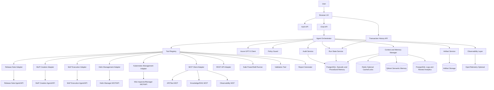

### 8.1 Logical Layering

This LLD follows the HLD layering model and maps each layer to implementation modules.

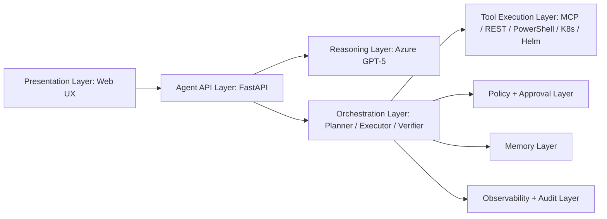

| Logical Layer | LLD Implementation |
|---|---|
| Presentation | Login, chat console, run detail, artifacts, approval queue, admin screens. |
| Agent API | FastAPI routes for auth, chat, runs, approvals, tools, memory, artifacts, reports. |
| Reasoning | Azure GPT-5 client with bounded prompts, tool schemas, redaction, retries, and trace metadata. |
| Orchestration | Intent classifier, planner, executor, verifier, recovery loop, run state machine. |
| Tool Execution | MCP, REST, PowerShell, Kubernetes, Helm, validation, artifact, and report tools. |
| Policy + Approval | RBAC, scope control, risk classifier, approval workflow, blocked action handling. |
| Memory | LangMem, LangGraph checkpointing, PostgreSQL, Qdrant, optional Redis. |
| Observability + Audit | PostgreSQL structured logs/review analytics, PostgreSQL audit records, optional OpenTelemetry. |

---

## 9. Runtime Flow

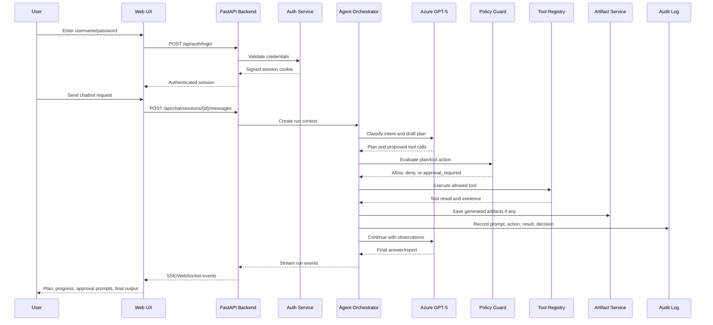

Refresh/navigation recovery flow:

1. Page loads and requests the user's visible transactions.
2. If the page has a selected or active run, the page requests `/api/runs/{run_id}/snapshot`.
3. The page renders the persisted snapshot immediately.
4. The page requests missed events after the last stored sequence.
5. If the run is still active, the page opens SSE with `after_event_id` or `after_sequence` and continues live rendering.
6. Release Notes and Bundle Generation background tasks continue after navigation; Environment Chat completes within its request, and Bundle Execution progress follows persisted external-agent jobs.

---

## 10. Recommended Technology Stack

| Layer | Recommended Technology | Notes |
|---|---|---|
| Frontend | HTML + CSS + JavaScript | Plain browser UI; no React requirement for initial build. |
| UI toolkit | Bootstrap 5.3 | Use one design system consistently. |
| JavaScript helpers | jQuery optional | Use only where it simplifies DOM, modal, and AJAX code. |
| Charts | Chart.js and Plotly.js | Chart.js for dashboard metrics; Plotly.js for interactive diagnostic analysis. |
| Backend API | Python FastAPI | Pure Python backend, REST APIs, SSE streaming, auth, OpenAPI docs. |
| Auth | HMAC-signed HttpOnly session cookie | Eight-hour local session; SSO/Entra ID remains future work. |
| LLM | Azure GPT-5 deployment | Deployment name, endpoint, auth mode, and API version configurable. |
| LLM integration | LangChain | Azure GPT-5 wrapper, tool binding, structured output, streaming. |
| Agent runtime | LangGraph | Workflow state machines, conditional edges, interrupts, checkpointing, recovery. |
| Memory framework | `MemoryService` facade; optional LangMem detection | Current extraction/search/consolidation APIs are not wired. |
| Tool schema | Pydantic models | Strong validation for tool inputs, outputs, and policy decisions. |
| Streaming | Server-Sent Events first, WebSocket optional | SSE is sufficient for run progress and must support event replay/resume. |
| Background execution | FastAPI background tasks for artifact workflows; synchronous Environment Chat; external-agent polling for Bundle Execution | No dedicated worker process exists. |
| Primary DB | PostgreSQL | Users, chats, runs, run events, user transaction views, artifacts, approvals, episodic memory, procedural memory. |
| Short-term memory | PostgreSQL message window + ephemeral turns + in-process LangGraph `MemorySaver` | Environment Chat process-local graph state complements durable chat records. |
| Semantic memory | Qdrant optional/future | Configured but no collection/upsert/search code exists. |
| Procedural memory | PostgreSQL source of truth; Qdrant index optional/future | Procedure, version, step, and policy tables are implemented. |
| Logs and analytics | PostgreSQL | Detailed logs, tool events, LLM explanations, review analytics. |
| Cache/locks | Redis optional/future | No runtime Redis client exists. |
| Artifact storage | Local filesystem initially, Azure Blob later | Stores release notes, MoPs, reports, evidence bundles. |
| Tool integration | REST + MCP client adapters + safe PowerShell runner | Existing agents remain separate services. |
| Deployment | Docker Compose initially, Kubernetes later | Supports local and cluster deployment. |

---

## 11. Application Pages

Code-verified pages:

| Route | Page | Current purpose |
|---|---|---|
| `/login` | Login | Local username/password form. |
| `/` | LLM Chat / Health Check | General model chat and bounded diagnostic controls. |
| `/release-notes` | Release Notes | Release-note agent, source scan, Markdown/PDF artifacts, Git publish, and run history. |
| `/mop-generation` | Bundle Generation | Source namespace evidence, professional MoP artifacts, complete bundle construction/download/publish. |
| `/mop-execution` | Bundle Execution | Bundle preflight, execution-agent dry-run, approval, mutation, validation, reports, and cleanup/revert. |
| `/env-agent` | Environment Chat | Prompt-first environment diagnosis and approval-gated namespace remediation. |
| `/activity` | Activity | Multi-workflow timeline, artifact downloads/uploads, bundle inspection, and artifact chat. |
| `/approvals` | Approval Queue | Approval review and decision actions. |
| `/l4-audit` | L4 Audit | Eligibility and stop-condition audit records. |

There are no current routes for `/sessions`, `/runs/{run_id}` as an HTML page, `/mops`, `/helm`, `/kubernetes`, `/admin/*`, `/memory`, or `/logs`. Their underlying concerns are represented by APIs/services or remain roadmap items.

Environment Chat UI contract:

- Exactly two primary content panes: Live Progress (40%) and Environment Chat (60%) on desktop.
- No namespace/mode/scope form. Prompt and session context drive inference.
- Shared large idle sphere and reduced working sphere.
- Autonomy Notes with live non-persisted notes, persisted safe summaries, copy logs, and maximize modal.
- Markdown transcript and inline approval card.
- Hidden session history drawer with restoration and clear-all.
- No bottom Agent Activity Feed; progress is represented by the timeline/log stream inside Live Progress.

## 12. UX Component Design

### 12.1 Login Page Components

| Component | Responsibility |
|---|---|
| `LoginForm` | Captures username/password. |
| `AuthErrorBanner` | Shows failed login or expired session. |
| `EnvironmentBadge` | Displays target environment such as local, dev, stage. |

### 12.2 Chat Console Components

| Component | Responsibility |
|---|---|
| `ChatShell` | Overall authenticated chat layout. |
| `ConversationPane` | Shows user and assistant messages. |
| `PromptComposer` | User input, attachments, workflow selector, submit button. |
| `WorkflowSelector` | Release Notes, Bundle Generation, Bundle Execution, Environment Chat, Helm, Kubernetes, and general BOS Genesis tasks. |
| `EnvironmentSelector` | Selects allowed environment/cluster/namespace. |
| `RunStatusBar` | Shows run status, current step, elapsed time. |
| `TransactionSidebar` | Floating ChatGPT-style left drawer for historical and in-progress transactions. |
| `RunStateMachineController` | Hydrates snapshots, replays events, reconnects SSE, and prevents refresh data loss. |
| `PlanPanel` | Shows generated plan and risk labels. |
| `ToolTimeline` | Shows tool calls, inputs, outputs, status, evidence. |
| `ApprovalModal` | Handles approve/reject/modify for guarded actions. |
| `ArtifactPanel` | Shows generated release notes, MoPs, reports, and download links. |
| `MemoryPanel` | Shows relevant facts or prior issues used by the agent. |
| `EnvAgentGlobe` | Shared large idle sphere/globe that shrinks into a working indicator after prompt submission. |
| `EnvAgentToolChainPanel` | Shows planned MCP calls, current tool execution, observations, remediation proposal, and verification evidence. |

### 12.3 Persistent Transaction Sidebar

The transaction sidebar is a shared UX component used by authenticated workflow pages. `/activity` is excluded because it uses its own timeline graph as the historical navigation surface and must not render the left sidebar launcher.

Behavior:

- Collapsed/hidden by default, with a compact launcher on the left edge.
- Opens as a floating drawer above the page content.
- Lists visible transactions for the logged-in user, newest first.
- Shows workflow icon/type, generated title, status, started/updated time, model label, agent/tool family, and artifact badges.
- Supports filtering by workflow type and status in a later iteration.
- Selecting a transaction loads the appropriate page state and run snapshot.
- Active transactions reconnect to live SSE automatically.
- Clear hides the item from the user's sidebar but keeps audit data, artifacts, and logs.
- Closing the drawer returns it to the hidden launcher state.

### 12.4 Admin Components

| Component | Responsibility |
|---|---|
| `UserTable` | Manage local users and roles. |
| `ToolRegistryTable` | Enable/disable tools and show risk levels. |
| `PolicyRuleEditor` | View and edit guardrail policy rules. |
| `EnvironmentConfigEditor` | Configure namespaces, clusters, Helm repositories, and endpoints. |
| `ModelConfigView` | Shows Azure GPT-5 deployment configuration status without exposing secrets. |

---

## 13. Frontend State Model

```typescript
type WorkflowType =
  | "release_note_creation"
  | "mop_creation"
  | "mop_execution"
  | "env_agent"
  | "helm_management"
  | "k8s_management"
  | "general_bosgenesis";

type ChatSession = {
  sessionId: string;
  title: string;
  userId: string;
  activeRunId?: string;
  createdAt: string;
  updatedAt: string;
};

type ChatMessage = {
  messageId: string;
  sessionId: string;
  role: "user" | "assistant" | "system" | "tool";
  content: string;
  runId?: string;
  createdAt: string;
};

type RunEvent = {
  eventId: string;
  runId: string;
  eventType:
    | "run_created"
    | "plan_created"
    | "step_started"
    | "tool_call_started"
    | "tool_call_completed"
    | "approval_required"
    | "artifact_created"
    | "run_completed"
    | "run_failed";
  payload: Record<string, unknown>;
  timestamp: string;
  sequence?: number;
};

type TransactionSummary = {
  runId: string;
  sessionId: string;
  workflowType: WorkflowType;
  title: string;
  status: "created" | "planning" | "running" | "waiting_for_approval" | "completed" | "failed" | "cancelled";
  modelLabel?: string;
  agentLabel?: string;
  artifactCount: number;
  lastEventSequence: number;
  startedAt: string;
  updatedAt: string;
};

type WorkflowPageState = {
  selectedRunId?: string;
  status: TransactionSummary["status"] | "idle";
  snapshotLoaded: boolean;
  lastEventSequence: number;
  events: RunEvent[];
  artifacts: Artifact[];
};
```

---

## 14. Backend Project Structure

```text
bosgenesis-esda/
  backend/
    app/
      main.py
      config.py
      dependencies.py
      activity.py
      approvals.py
      artifacts.py
      artifact_publisher.py
      env_agent.py
      l4.py
      memory.py
      mop_bundle.py
      mop_execution.py
      repo_analysis.py
      auth/
        security.py
      chains/
        schemas.py
        release_notes.py
        mop_generation.py
        env_agent.py
      db/
        database.py
        models.py
      graphs/
        diagnostic.py
        event_bus.py
        foundation.py
        router.py
        release_notes.py
        mop_generation.py
        env_agent.py
      llm/
        azure_gpt5.py
      logging/
        setup.py
        postgres_logger.py
        redaction.py
      policy/
        evaluator.py
      tools/
        contracts.py
        registry.py
        mcp_client.py
        rest_get.py
        powershell_get.py
        release_note_agent.py
        mop_agents.py
        mop_execution_agent.py
        env_agents.py
      templates/
      static/
        css/
        js/
    tests/
  knowledge-base/
  data/
  logs/
  skills/
  var/
  pyproject.toml
  docker-compose.yml
  README.md
  start-esda.bat
  kill-esda.bat
```

The current project deliberately colocates frontend templates/assets with the FastAPI package. It does not have a separate API route package, frontend build, migration folder, Qdrant repository, Redis client, or dedicated worker process.

## 15. Configuration

### 15.1 Implemented Settings Groups

Settings are loaded by `pydantic-settings` from `.env` and are logged only through `Settings.redacted_summary()`.

| Group | Key settings |
|---|---|
| Application/auth | `APP_ENV`, `APP_NAME`, `APP_BASE_URL`, `SECRET_KEY`, `ADMIN_USERNAME`, `ADMIN_PASSWORD` |
| PostgreSQL | `DATABASE_URL`, `DATABASE_CONNECT_TIMEOUT_SECONDS`, `POSTGRES_LOG_SCHEMA` |
| Artifact storage/Git | `ARTIFACT_STORAGE_DIR` and `ARTIFACT_GIT_*` |
| Logging | `LOG_LEVEL`, `LOG_DIR`, rotating file settings, Bundle Execution debug log settings |
| Azure/model defaults | `AZURE_OPENAI_*`, `OPENAI_DEPLOYMENT`, `OPENAI_API_VERSION`, `LLM_DEFAULT_MODEL_PROFILE` |
| Model profiles | GPT-5 Pro, GPT-4.1 mini, Ollama Llama70B, Ollama Gemma, and custom Azure settings |
| Release Note | `RELEASE_NOTE_AGENT_*`, allowed GitHub hosts |
| Bundle Generation | MoP Creation, Helm Manager, K8s Inspector endpoints/keys/timeouts, namespace and target defaults |
| Bundle Execution | Execution-agent endpoint/transport/key, polling, target allowlist, report prefix |
| Environment Chat | Allowed/default namespace, timeouts, log-tail/evidence limits, short/long memory limits, optional ingestion/observability URLs |
| Policy/runtime | `POLICY_RULES_PATH`, approval expiration, REST host allowlist, PowerShell runner URL |
| Optional memory | `LANGGRAPH_CHECKPOINTER`, `LANGMEM_ENABLED`, `QDRANT_URL`, `REDIS_URL` |

### 15.2 Model Profile Mapping

| Profile id | UI label | Provider/runtime |
|---|---|---|
| `azure_gpt5_pro` | `SIGMA 5 PRO` | Azure OpenAI GPT-5 deployment; default credentials are used when API-key mode has no key. |
| `azure_gpt41_mini` | `SIGMA 4.1` | Azure OpenAI GPT-4.1 mini deployment. |
| `ollama_llama70b` | `TRAINIUM BEHEMOTH` | OpenAI-compatible Ollama ingress. |
| `ollama_gemma4` | `TRAINIUM GEMMA` | OpenAI-compatible Ollama ingress. |
| `azure_configured` | `CUSTOM` | Generic configured Azure profile. |

The browser submits only the profile id. Endpoint credentials and deployment configuration remain backend-only.

### 15.3 Runtime Limitations

- `LANGGRAPH_CHECKPOINTER=memory` creates an in-process `MemorySaver`. The accepted `postgres` value is not currently wired to a PostgreSQL saver.
- `LANGMEM_ENABLED` changes memory-provider metadata when LangMem is installed, but no LangMem extraction/search API is currently called.
- `QDRANT_URL` and `REDIS_URL` are extension settings; current workflows do not create clients for either service.
- The active V1 database is PostgreSQL; ClickHouse and SQLite are excluded.

## 16. Core API Endpoints

### 16.1 Authentication and System

| Method | Endpoint | Purpose |
|---|---|---|
| `GET` | `/health` | Service health and configured component summary. |
| `GET` | `/api/llm/model-profiles` | Public model profile metadata for authenticated UI. |
| `POST` | `/api/llm/chat` | General model chat. |
| `POST` | `/api/llm/smoke-test` | Model connectivity smoke test. |
| `POST` | `/api/auth/login` | Authenticate and set signed HttpOnly cookie. |
| `POST` | `/api/auth/logout` | Clear session. |
| `GET` | `/api/auth/me` | Current principal. |

### 16.2 Workflow Entry Points

| Method | Endpoint | Purpose |
|---|---|---|
| `POST` | `/api/chat` | Bounded diagnostic graph entry point. |
| `POST` | `/api/workflows/classify` | Structured workflow classification. |
| `POST` | `/api/release-notes` | Start Release Notes background run. |
| `GET` | `/api/mop-generation/namespaces` | Bundle Generation namespace/options contract. |
| `POST` | `/api/mop-generation` | Start Bundle Generation background run. |
| `GET` | `/api/env-agent/contract` | Environment Chat policy/tool/namespace contract. |
| `GET` | `/api/env-agent/sessions` | List Environment Chat sessions. |
| `GET` | `/api/env-agent/sessions/{session_id}` | Restore session messages, latest snapshot, and memory metadata. |
| `POST` | `/api/env-agent/chat` | Execute one prompt-first diagnostic/proposal turn. |
| `POST` | `/api/env-agent/remediation/execute` | Execute an already-approved typed remediation and verify it. |

### 16.3 Runs, Transactions, and Artifacts

| Method | Endpoint | Purpose |
|---|---|---|
| `GET` | `/api/transactions` | List visible user transactions with workflow filter. |
| `POST` | `/api/transactions/{run_id}/clear` | Hide one transaction for the user. |
| `POST` | `/api/transactions/clear` | Hide all visible transactions, optionally by workflow. |
| `GET` | `/api/runs/{run_id}` | Run metadata/final report. |
| `GET` | `/api/runs/{run_id}/snapshot` | Run, events, tool calls, artifacts, approvals, and page state. |
| `POST` | `/api/runs/{run_id}/stop` | Mark an active run stopped. |
| `GET` | `/api/runs/{run_id}/artifacts` | Run artifacts. |
| `GET` | `/api/runs/{run_id}/bundle` | Preferred bundle artifact download. |
| `GET` | `/api/runs/{run_id}/events` | SSE stream with resume cursor. |
| `GET` | `/api/artifacts/{artifact_id}` | Authenticated artifact download. |

### 16.4 Policy, Approval, and L4

| Area | Endpoints |
|---|---|
| Policy | `POST /api/policy/evaluate` |
| Approvals | `GET /api/approvals` and approve/reject/modify-and-recheck actions |
| L4 | eligibility, stop-check, audit list, and audit export |
| Procedures | `GET/POST /api/procedures` |

### 16.5 Bundle Execution

Implemented endpoints under `/api/mop-execution`:

- `GET /bundles`
- `POST /preflight` and `POST /preflight/upload`
- `POST /validate` and `POST /validate/upload`
- `POST /dry-run`
- `GET /decision-context`
- `POST /instruction`
- `GET /dry-run-report`
- `GET /report-download`
- `POST /approval`
- `POST /mutation`
- `POST /cleanup`
- `POST /validation-report`

### 16.6 Activity

The generic multi-workflow API uses `/api/activity/runs` for list/detail/artifacts/download/upload. Compatibility Release Note routes remain under `/api/activity/release-notes`. Artifact Chat is `POST /api/activity/chat` with session retrieval at `GET /api/activity/chat/{session_id}`.

### 16.7 Authentication Behavior

Most routes require the signed ESDA session. Environment Chat calls `env_agent_admin_principal`, which normalizes missing/stale principals to the configured local admin for this local-demo workflow. This is an intentional current behavior and must be replaced by strict authenticated RBAC before shared or production deployment.

## 17. Backend Domain Models

All durable models are SQLAlchemy ORM classes in `backend/app/db/models.py`. String UUID-like ids are generated by services rather than database sequences.

| Model/table | Principal fields |
|---|---|
| `User / users` | `user_id`, `username`, `password_hash`, JSON `roles`, `is_active`, `created_at` |
| `ChatSession / chat_sessions` | `session_id`, `user_id`, `title`, timestamps |
| `ChatMessage / chat_messages` | `message_id`, `session_id`, optional `run_id`, `role`, `content`, JSON `payload` |
| `AgentRun / agent_runs` | `run_id`, `user_id`, `workflow_type`, `goal`, optional `target_url`/`namespace`, `status`, `final_report`, timestamps |
| `Artifact / artifacts` | `artifact_id`, `run_id`, `user_id`, type/title/MIME/storage path, JSON metadata |
| `RunEvent / run_events` | `event_id`, `run_id`, `event_type`, `message`, JSON `payload`, `created_at` |
| `AgentMemory / agent_memories` | owner/workflow/type/scope/scope id/key/content/value JSON/importance/timestamps |
| `UserRunView / user_run_views` | composite user/run key, `hidden_at`, `pinned`, `last_opened_at` |
| `PlanStep / plan_steps` | run, position, title, tool, risk, status, JSON payload |
| `ToolCall / tool_calls` | run, tool, status, request/response JSON |
| `AgentEventLog / agent_event_logs` | run/user/workflow/node/type/severity/message/payload/duration |
| `LlmReviewLog / llm_reasoning_review_logs` | model/prompt/hash/intent/plan/safe reasoning/tool choice/validation/final answer/review state |
| `ToolExecutionLog / tool_execution_logs` | tool/category/risk/policy/status/request/response/error/duration |
| `ApprovalRequest / approval_requests` | run/requester/reviewer/workflow/tool/scope/risk/status/request/policy/impact/rollback/review/expiry |
| Procedure models | `procedures`, `procedure_versions`, `procedure_steps`, `procedure_policies` |
| `L4AuditRecord / l4_audit_records` | run/user/scope/eligibility/decision/reasons/ODD/tool sequence/procedure/stop state/review |

## 18. Database Design

### 18.1 Initialization

`Database.init()` creates the SQLAlchemy metadata and ensures the configured admin user exists. There is no Alembic migration directory in the current repository despite Alembic being declared as a dependency. Schema evolution currently relies on SQLAlchemy create/check behavior and must be formalized before production rollout.

### 18.2 Repository Responsibilities

`RunRepository` provides:

- Chat session/message creation, listing, snapshots, and session summaries.
- Memory list/upsert.
- Run creation/status/final report.
- Ordered events, plan steps, tool calls, artifacts, and run snapshots.
- Transaction listing and per-user clear/hide.
- Activity projections.
- Approval and procedure lifecycle.
- L4 audit records.
- Structured PostgreSQL event/review/tool logs.

### 18.3 Durable Rehydration

Run snapshots aggregate the run plus ordered events, plan steps, tool calls, artifacts, and approvals. Workflow JavaScript uses snapshots and, where applicable, SSE to rebuild page state. Environment Chat session snapshots additionally combine session messages, latest run snapshot, and memory metadata.

### 18.4 Storage Boundaries

- PostgreSQL stores metadata, structured state, chat content, safe summaries, and bounded evidence.
- Local files store artifact bytes and application/debug logs.
- Git stores explicitly published artifacts.
- Qdrant and Redis do not have active repositories in the current code.
- No `audit_events`, `memory_facts`, `episodic_memory_episodes`, `procedure_embeddings`, or `procedure_execution_stats` table exists in the current ORM.

## 19. Azure and OpenAI-Compatible LLM Client Design

### 19.1 Implemented Service

`AzureGpt5Service` exposes:

- `model_profiles()` and `describe_model_profile()`.
- `chat()` and `smoke_test()`.
- `diagnostic_plan()`.
- `release_note_plan()` and `release_note_draft()`.
- `env_agent_present_answer()`, which prefers the GPT-5 Pro profile for operator-friendly Markdown formatting and falls back to the raw report.
- `structured_response()` / private JSON response helper used by prompt-versioned chains.
- A disabled `tool_binding_placeholder()`; direct model tool binding is not implemented.

The service uses LangChain `AzureChatOpenAI` for traditional Azure API versions, LangChain `ChatOpenAI` for Azure v1-compatible or Ollama-compatible endpoints, and Azure CLI/default credential token providers where configured.

### 19.2 Failure and Fallback Contract

- All model input payloads pass through redaction.
- Unconfigured profiles return a structured fallback.
- Provider exceptions are converted into fallback metadata; chains keep deterministic plans/reports when possible.
- JSON parse failures preserve deterministic fields and use bounded model text as a safe summary.
- Environment Chat presentation must not invent tool results; it receives the raw report and redacted structured state.
- The service does not implement token streaming or expose hidden chain-of-thought.

### 19.3 Prompt Governance

Prompt-owning chains provide a prompt version and SHA-256 hash. PostgreSQL review logs store review-safe intent, plan, reasoning summary, tool choice, validation explanation, and final answer where the workflow logger writes them. Hidden raw reasoning is excluded.

## 20. LangGraph and Workflow Orchestration

### 20.1 Current Runtime Pattern

ESDA does not use one universal graph. It composes workflow-specific graphs/services:

| Workflow | Runtime |
|---|---|
| Health diagnostic | `DiagnosticGraph` |
| Release Notes | `ReleaseNoteGraph` |
| Bundle Generation | `MopGenerationGraph` |
| Environment Chat | `EnvAgentWorkflowGraph` |
| Bundle Execution | Route/service state machine around `MopExecutionRunStore` and the execution-agent client |
| Activity | Query/projection service, not a LangGraph |

Release Notes and Bundle Generation run in FastAPI background tasks and emit PostgreSQL/SSE events. Environment Chat awaits one 13-node graph turn synchronously. Bundle Execution uses explicit API calls and polling states because the external execution agent owns the job state machine.

### 20.2 Environment Chat Graph

The exact node sequence is intake, scope, classify, plan, inspect, correlate, diagnose, propose, approve, execute, verify, report, complete. Its graph `execute` node is deliberately non-mutating. Approved mutations use the separate policy/approval/adapter endpoint.

### 20.3 Checkpointing and Durability

- `LANGGRAPH_CHECKPOINTER=memory` uses LangGraph `MemorySaver` in the current process.
- `disabled` runs the sequential fallback.
- `postgres` is accepted by settings but does not instantiate a saver.
- PostgreSQL runs/events/messages/memories provide application-level durability and UI restoration independently of LangGraph checkpoints.
- The project must not claim process-resumable graph checkpoints until a PostgreSQL checkpointer and worker recovery loop are implemented.

### 20.4 Autonomy Modes

The common policy vocabulary includes observe-only, dry-run, assisted, semi-autonomous, and conditional L4. Environment Chat internally infers `diagnostic_only`, `propose_only`, or `approval_gated_remediation` from the prompt. Bundle Execution exposes dry-run and approval-gated mutation modes. Production mutation remains disabled by the current ODD.

## 21. Tool Registry

### 21.1 Definition

`ToolDefinition` stores name, category, risk, enabled flag, allowed roles, allowed environments, allowed workflows, timeout, and description. `PolicyGuard` combines this registry metadata with YAML ODD/mutation policy.

### 21.2 Registered Tool Families

| Family | Registered tools |
|---|---|
| Foundation read-only | `rest.get`, `powershell.ps_http_get`, `mcp.k8s_inspector` |
| Bundle Generation | `mop.k8s_inspector`, `mop.helm_manager`, `mop.creation_agent` |
| Environment Chat read-only | `env.k8s_inspector`, `env.helm_manager`, `env.data_ingestion`, `env.observability` |
| Environment Chat mutation | `env.k8s_rollout_restart`, `env.k8s_scale`, `env.k8s_patch`, `env.k8s_apply`, `env.k8s_delete`, `env.helm_install`, `env.helm_upgrade`, `env.helm_uninstall`, `env.helm_rollback` |
| Release Notes | `release_notes.agent_scan` |
| L4/legacy placeholders | `k8s.restart`, `k8s.patch`, `helm.upgrade`, `helm.rollback`, `helm.status` |

### 21.3 Execution Contract

`ToolExecutionRequest` contains run/step/tool/workflow/environment/namespace/user/arguments/autonomy mode. `ToolExecutionResult` returns status, optional output, evidence references, validation result, and structured error.

Execution order:

1. Resolve registered tool.
2. Check enabled/workflow/environment/role.
3. Apply ODD namespace and production rules.
4. Deny forbidden category/action or require approval for high risk.
5. Execute only a typed adapter route.
6. Redact and normalize evidence.
7. Persist tool call and relevant review/audit events.
8. Verify mutating actions with a read-only follow-up.

### 21.4 Environment Chat Adapter Routes

The Kubernetes adapter maps GET routes for namespace/pods/events/logs/deployments/services/ingress/PVCs/ConfigMaps and mutation routes for restart/scale/patch/apply/delete. The Helm adapter maps release/repository GET routes and install/upgrade/uninstall/rollback/repository mutations. API keys are backend-only and the Helm key is sent in both header and mutating request body to match the deployed service contract.

### 21.5 Known Policy Alignment Issue

The tool registry contains high-risk Environment Chat delete/uninstall tools, while `knowledge-base/policy_rules.yaml` still lists `helm_uninstall` in the global denied set and has a narrower mutation allowlist. The effective policy decision therefore remains authoritative and may block a registered adapter. This mismatch should be resolved deliberately before production, not hidden in documentation.

## 22. Workflow Designs

## 22.1 Release-Note Creation Workflow

### Purpose

Generate release notes from an approved GitHub source using the final V1 ESDA release-note agent flow. The workflow uses `bosgenesis-release-note-agent` as the first evidence producer, then ESDA enriches the result with local source-code security and quality scans, GPT-generated review-safe summaries, final Markdown/PDF artifacts, and optional publishing to the artifact repository.

### Inputs

| Input | Required | Notes |
|---|---:|---|
| `github_url` | Required | Repository, compare, release, pull request, or tag URL accepted by policy. |
| `release_name` | Optional | Can be inferred from tag/version; also used in the artifact folder name. |
| `branch` | Optional | Used when tag and commit are absent. |
| `tag` | Optional | Overrides branch when present. |
| `commit_sha` | Optional | Overrides tag and branch when present. |
| `analysis_depth` | Optional | Fast/deep analysis depth for agent and scan behavior. |
| `model_profile_id` | Optional | Selected model profile, such as GPT-5, GPT-4.1 mini, Llama, or Gemma where configured. |

Source precedence is strict: `commit_sha` overrides `tag`; `tag` overrides `branch`.

### Final Flow

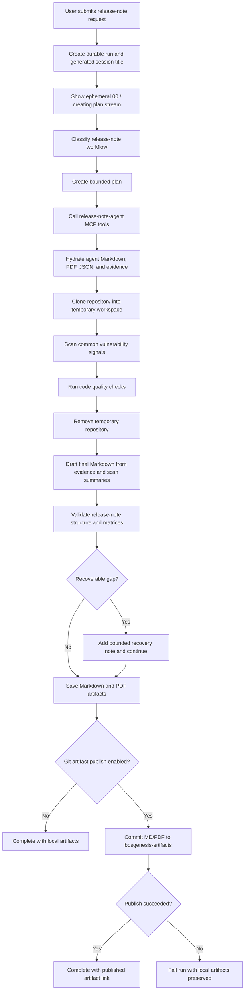

### Agent Activity Feed Nodes

| Order | Node | Meaning |
|---:|---|---|
| 1 | Intake | Durable run created and input accepted. |
| 2 | Classify | GPT classifies workflow and confidence. |
| 3 | Plan | GPT creates the bounded plan. |
| 4 | Evidence | `release-note-agent` collects source evidence and initial artifacts. |
| 5 | Clone | ESDA clones the repository into a temporary workspace. |
| 6 | Security | ESDA scans common vulnerability signals and asks the selected LLM for a safe summary. |
| 7 | Quality | ESDA runs `pylint` or safe static fallback quality checks. |
| 8 | Cleanup | ESDA removes the temporary checkout. |
| 9 | Draft | GPT creates the final Markdown draft from collected evidence. |
| 10 | Validate | ESDA validates required sections and scan matrices. |
| 11 | Recover | ESDA adds bounded recovery notes when evidence is limited but safe to continue. |
| 12 | Artifacts | ESDA saves Markdown and PDF artifacts. |
| 13 | Publish | ESDA commits `release-notes.md` and `release-notes.pdf` to `bosgenesis-artifacts` when enabled. |
| 14 | Complete | ESDA finalizes run status and safe summaries. |

The rail is hidden before `Generate Draft` is clicked, reveals during active work, auto-hides after 30 seconds of activity, and remains visible when pinned.

### Artifact Output

The final Markdown and PDF must include, at minimum:

```markdown
# <Release Title>

## Document Control

## Executive Summary

## Release Overview

## Functional / Operational Changes

## Code Quality Matrix

## Vulnerability Matrix

## Source Evidence

## Safe Reasoning Summaries

## Limitations and Human Review Notes
```

The PDF should maintain the established release-note look and feel. When the upstream release-note-agent PDF is available, ESDA should preserve it where possible; when ESDA renders the final Markdown, the PDF must include the same content sections, including code quality and vulnerability scan details.

### Git Artifact Publishing

On successful validation, ESDA publishes the artifact pair when enabled:

| Field | Value |
|---|---|
| Repository | `https://github.com/aveeshek/bosgenesis-artifacts.git` |
| Branch | `main` by default |
| Folder | `YYMMDD_HHMMSS_<job-name>` |
| Files | `release-notes.md`, `release-notes.pdf` |
| Required config | `ARTIFACT_GIT_PUBLISH_ENABLED=true` and non-interactive Git credentials |

A publish failure fails the run at the publish step, but the locally saved artifacts remain available for download and review.

### Live UX and Logging Requirements

- The `/release-notes` page must accept GitHub URL, release name, branch, tag, commit, analysis depth, and selected model profile.
- The run timeline must stream classification, planning, release-note-agent MCP invocation, artifact hydration, clone, vulnerability scan, quality scan, cleanup, draft generation, validation, recovery, artifact save, publish, and completion events through SSE.
- The Live Working Stream may show ESDA-authored working notes and model-supported summaries while the page is connected, but those notes are ephemeral and must not be persisted.
- After completion, ephemeral notes are wiped and replaced with persisted Safe Reasoning Summaries.
- The UI must not expose hidden chain-of-thought.
- PostgreSQL must log the run, generated title, plan summary, tool summaries, validation result, recovery decision, safe reasoning summaries, artifact metadata, and publish outcome.
- Refreshing during an active run restores the live state; refreshing after completion returns to the initial empty state unless the run is explicitly selected from the history sidebar.
- Draft generation is read-only. Publishing to the configured artifact archive repo is an automated finalization step controlled by configuration and Git credentials. Activity page uploads are a separate, narrow review operation that can overwrite `release-notes.md` or `release-notes.pdf` for a selected run, or create the missing run folder for local-only artifacts.

## 22.1.1 Activity Page Artifact Review and Upload Flow

The Activity page is the release-note observability and artifact review surface. It does not start new release-note generation; it inspects completed/running release-note runs and lets the user ask artifact-grounded questions.

### Activity Layout Rules

- Route: `/activity`.
- Left pane: scrollable animated release-note time-series graph, run detail, stage chain, and artifact actions.
- Right pane: artifact chatbot with the shared coral/plum sphere visual language.
- The chat pane must remain inside the viewport and scroll internally.
- The shared transaction sidebar launcher is not rendered on Activity.

### Activity API Endpoints

| Method | Endpoint | Responsibility |
|---|---|---|
| `GET` | `/api/activity/runs` | List Release Note, Bundle Generation, and Bundle Execution timeline nodes with filters and publish/artifact state. |
| `GET` | `/api/activity/runs/{run_id}` | Return run detail, workflow-specific stage chain, events, artifacts, and artifact actions. |
| `GET` | `/api/activity/runs/{run_id}/artifacts` | Return authoritative artifact actions. |
| `GET` | `/api/activity/runs/{run_id}/artifact/{kind}/download` | Download workflow artifact, preferring published repo and falling back to local storage. |
| `POST` | `/api/activity/runs/{run_id}/artifact/{kind}/upload` | Upload reviewed Release Note Markdown/PDF replacement to the configured artifact Git repo. |
| `POST` | `/api/activity/chat` | Ask selected-node artifact questions. |
| `GET` | `/api/activity/chat/{session_id}` | Restore Activity chatbot conversation. |

### GitHub Upload Semantics

`kind` must be `markdown` or `pdf` and maps to fixed filenames only:

| Kind | GitHub filename | Accepted local file |
|---|---|---|
| `markdown` | `release-notes.md` | `.md`, `.markdown`, `.txt` |
| `pdf` | `release-notes.pdf` | `.pdf` with `%PDF` header |

Upload behavior:

1. Verify authenticated access to the selected release-note run.
2. Resolve existing publish metadata from run events.
3. If publish metadata exists, clone the artifact repo branch and overwrite the exact file in the existing folder.
4. If publish metadata is missing, create a stable folder name from run creation time and generated session title, upload the reviewed file, and persist `artifact_publish_completed` metadata for that folder.
5. Record `artifact_overwrite_started`, `artifact_overwrite_completed`, or `artifact_overwrite_failed` events.
6. Return the overwrite/create status, branch, folder, filename, source filename, and commit hash.

The upload route is not a general GitHub editor. It only writes to the configured artifact repository, configured branch, selected run folder, and fixed release-note filenames.

## 22.2 Bundle Generation Workflow

### Purpose

Generate a read-only Method of Procedure and deployment artifact bundle for a selected source namespace by coordinating ESDA GPT-5 planning with Kubernetes, Helm, and MoP Creation Agent MCP evidence.

This workflow is bundle generation only. It does not execute the generated MoP. Execution remains a separate Bundle Execution workflow with stronger approvals and target binding.

### Inputs

| Input | Required | Notes |
|---|---:|---|
| `namespace` | Yes | Source namespace selected from backend allowlist/dropdown. Current options include `bosgenesis`, `signoz`, and `agent-testing`. |
| `target_namespace` | Yes | Placeholder selected from allowlist. Current options are `Generic` and `agent-testing`; no mutation happens during generation. |
| `target_environment` | Yes | `Kubernetes with Helm`, OpenShift, Kustomize, Flux. Current implementation is optimized for Kubernetes with Helm. |
| `change_intent` | Yes | Defaults to `Generate MoP in both markdown and PDF format so we can fully clone the source namespace`. |
| `helm_release` | Optional | Selected or inferred from Helm manager evidence. |
| `implementation_window` | Optional | Planned date/time or maintenance window. |
| `analysis_depth` | Optional | Fast, standard, deep. |
| `model_profile` | Yes | Selected from the global model dropdown. |

### MCP Agent Calls

| Agent / MCP server | Example tool responsibilities |
|---|---|
| `bosgenesis-k8s-inspector-mcp` | List namespace resources, workload health, pods, services, ingress, events, config references, owner refs, and non-secret evidence. |
| `bosgenesis-helm-manager-mcp` | List Helm releases, chart metadata, revisions, status, values summary, and rollback candidates. |
| `bosgenesis-mop-creation-agent` | Build professional MoP bundle artifacts: Markdown, PDF, installation notes, `artifact.json`, `machine_execution_plan.yaml`, values, and generated manifests when available. |

### Flow

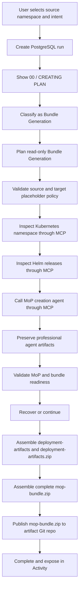

### Agent Activity Feed Nodes

| Node | Meaning |
|---|---|
| Intake | User selected source namespace, target placeholder, environment, and change intent. |
| Classify | Request classified as `mop_generation`. |
| Plan | GPT-5 created a read-only evidence and bundle plan. |
| Scope | Namespace allowlist, target placeholder, and policy validated. |
| K8s | k8s-inspector MCP collected non-secret evidence or recorded a bounded gap. |
| Helm | helm-manager MCP collected Helm release evidence or recorded a bounded gap. |
| MoP Agent | mop-creation-agent produced professional MoP artifacts/evidence or recorded a bounded gap. |
| Draft | Final MoP component artifacts are selected/preserved. |
| Validate | ESDA checked required bundle files, sections, evidence, and warnings. |
| Recover | ESDA selected continue, retry, or human-review recovery. |
| Bundle | `deployment-artifacts.zip` and `mop-bundle.zip` saved locally. |
| Export Github | Unextracted `mop-bundle.zip` published to Git artifact repository. |
| Complete | Run finalized and Activity timeline updated. |

### MoP Bundle Artifact Structure

```text
bundle-root/
  artifact.json or esda-artifact.json
  machine_execution_plan.yaml
  *.human-mop.md
  *.installation.md
  *.pdf
  deployment-artifacts/
    artifact-index.json
    helm-commands.md
    helm-chart/
    helm-values/
    kubernetes-manifests/
      namespace-<placeholder>.yaml
      ingress-*.yaml when source ingress exists
      raw/configmap-*.yaml when agent-generated ConfigMaps are available
      crds/
    rendered-manifests/
  deployment-artifacts.zip
  mop-bundle.zip
```

### Artifact Publishing

Successful Bundle Generation runs publish to the same configured artifact repository as Release Notes, but with MoP-specific folders:

| Field | Value |
|---|---|
| Repository | `https://github.com/aveeshek/bosgenesis-artifacts.git` by default |
| Branch | `main` by default |
| Folder | `YYMMDD_HHMMSS_mop_<job-name>` |
| Files | `mop-bundle.zip` in Git; local storage also keeps MoP Markdown, PDF, installation notes, metadata, machine plan, and deployment zip. |

The Activity page must show these runs and artifacts with workflow type `mop_generation` and the UI label `Bundle Generation` so users can distinguish them from Release Note and Bundle Execution runs.

## 22.3 Bundle Execution Workflow

### Purpose

Execute a previously generated ESDA MoP bundle in a controlled, evidence-first manner. The UI label is `Bundle Execution` and the internal workflow id remains `mop_execution`. ESDA is the operator UX and orchestration layer; `bosgenesis-mop-execution-agent` is the deterministic execution control plane for bundle validation, dry-run, approval-gated mutation, validation, rollback, cleanup, and reports.

ESDA must not directly mutate Kubernetes or Helm resources during this workflow.

### Inputs

| Input | Required | Notes |
|---|---:|---|
| `bundle_source_type` | Yes | `activity_run`, `artifact_repo_folder`, or `upload`. |
| `activity_run_id` | Conditional | Required when selecting a generated MoP bundle from Activity. |
| `artifact_repo_folder` | Conditional | Required when selecting a published folder directly. |
| `uploaded_bundle` | Conditional | Required when uploading a local `mop-bundle.zip`. |
| `target_namespace` | Yes | Real execution namespace, selected at Bundle Execution time. |
| `execution_mode` | Yes | One of `dry_run_only`, `dry_run_then_approval`, or `approved_mutation`. Cleanup/revert is a dedicated result-panel action, not an execution mode. |
| `generated_name_prefix` | Optional | Prefix for generated resources where the bundle supports substitution. |
| `correlation_id` | Yes | Generated by ESDA for audit continuity. |
| `approval_rationale` | Conditional | Required only after dry-run success and before mutation. |
| `model_profile` | Yes | Selected from the global model dropdown for summaries and safe option explanations. |

### Frontend State Machine

The Bundle Execution page uses the shared ESDA UI shell:

- Route: `/mop-execution`.
- Hidden workflow sidebar by default.
- Shared sphere animation and matte-glass panels.
- Input panel for bundle source, Bundle Generation run, target namespace, execution mode, generated name prefix, correlation ID, and approval rationale.
- Live Progress panel with ephemeral working stream plus persisted safe summaries in one Autonomy Notes pane.
- Result panel for validation failures, dry-run reports, decision-required cards, approval response, mutation state, validation matrix, report links, rollback/cleanup status, dedicated cleanup/revert action, and distinct cleanup completion status.
- Bottom Agent Activity Feed with pin/auto-hide behavior.

Activity Feed nodes:

| Order | Node | Meaning |
|---:|---|---|
| 1 | Intake | Capture bundle source, target namespace, mode, operator identity, and correlation ID. |
| 2 | Preflight | Verify local bundle metadata, required files, secret exposure, destructive actions, and namespace mismatch. |
| 3 | Agent Health | Check execution-agent health, readiness, capabilities, and effective config. |
| 4 | Bundle Validate | Register and validate bundle through the execution agent. |
| 5 | Dry-run Job | Create a dry-run-only job with idempotency key. |
| 6 | Dry-run | Start and poll the dry-run job. |
| 7 | Observations | Render redacted observations, audit events, and policy decisions. |
| 8 | Decision | Handle decision-required state and scoped external instructions. |
| 9 | Dry-run Report | Retrieve dry-run report metadata and download links. |
| 10 | Approval | Submit human approval with rationale, scope, expiry, and command fingerprints. |
| 11 | Mutation Job | Create or continue approved mutation job. |
| 12 | Mutation | Start and poll approved mutation. |
| 13 | Validation | Retrieve post-mutation validation observations and matrix. |
| 14 | Reports | Retrieve execution, validation, rollback, cleanup, and change evidence reports. |
| 15 | Rollback/Cleanup | Execute rollback, cleanup, or namespace revert only through the execution agent. |
| 16 | Complete | Persist final state and expose report artifacts. |

### Bundle Source and Validation Contract

ESDA performs local preflight first, then delegates authoritative validation to `bosgenesis-mop-execution-agent`.

Required bundle files:

```text
artifact.json
machine_execution_plan.yaml
mop.md or equivalent human MoP Markdown
mop.pdf or equivalent professional MoP PDF
deployment-artifacts.zip
artifact-index.json
```

Published Activity bundles are passed to the execution agent as object-store sources, not as ESDA-local file paths:

```json
{
  "source": {
    "type": "object_store",
    "value": "https://raw.githubusercontent.com/aveeshek/bosgenesis-artifacts/main/<folder>/mop-bundle.zip"
  },
  "source_metadata": {
    "workflow_type": "mop_generation",
    "publish_folder": "<folder>",
    "branch": "main",
    "original_source_type": "activity_run"
  }
}
```

The execution agent must support the `object_store` resolver. The resolver downloads HTTPS zip bundles, enforces size limits, safely extracts the archive, and validates required files. If the deployed execution agent returns `bundle_source_not_locally_resolvable:object_store`, the running agent image is behind the ESDA contract and must be redeployed.

### Execution-Agent REST Contract

| LLD Operation | REST Endpoint |
|---|---|
| Health | `GET /healthz` |
| Readiness | `GET /readyz` |
| Capabilities | `GET /v1/capabilities` |
| Effective config | `GET /v1/config/effective` |
| Register bundle | `POST /v1/artifact-bundles` |
| Validate bundle | `POST /v1/artifact-bundles/{bundle_id}/validate` |
| Create job | `POST /v1/jobs` |
| Start job | `POST /v1/jobs/{job_id}/start` |
| Get job | `GET /v1/jobs/{job_id}` |
| List jobs | `GET /v1/jobs` |
| Observations | `GET /v1/jobs/{job_id}/observations` |
| Events | `GET /v1/jobs/{job_id}/events` |
| Audit events | `GET /v1/jobs/{job_id}/audit-events` |
| Memory context | `GET /v1/jobs/{job_id}/memory-context` |
| Decision context | `GET /v1/jobs/{job_id}/decision-required` |
| Submit instruction | `POST /v1/jobs/{job_id}/instructions` |
| Submit approval | `POST /v1/jobs/{job_id}/approval` |
| List reports | `GET /v1/jobs/{job_id}/reports` |
| Report metadata | `GET /v1/reports/{report_id}` |
| Report download | `GET /v1/reports/{report_id}/download` |
| Generate execution summary | `POST /v1/jobs/{job_id}/reports/execution-summary` |
| Generate validation report | `POST /v1/jobs/{job_id}/reports/validation` |
| Generate rollback report | `POST /v1/jobs/{job_id}/reports/rollback` |
| Generate change summary | `POST /v1/jobs/{job_id}/reports/change-summary` |
| Generate release notes | `POST /v1/jobs/{job_id}/reports/release-notes` |
| Namespace revert | `POST /v1/namespaces/{namespace}/revert` |

### Flow

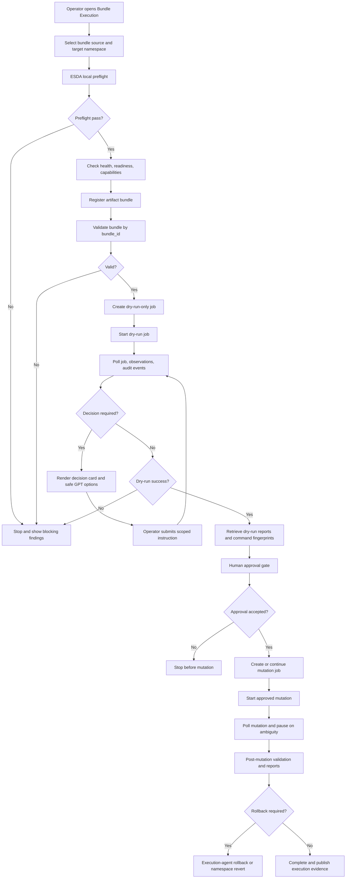

### Persistence

The Bundle Execution run stores:

| Field | Purpose |
|---|---|
| `bundle_id` | Execution-agent registered bundle id. |
| `dry_run_job_id` | Dry-run job id. |
| `mutation_job_id` | Approved mutation job id. |
| `target_namespace` | Real namespace being tested or mutated. |
| `correlation_id` | Cross-system audit key. |
| `idempotency_key` | Duplicate-safe create/start calls. |
| `execution_state` | Current workflow phase/status. |
| `safe_summaries` | Persisted model/tool summaries safe for review. |
| `redacted_observations` | Agent observations with secrets removed. |
| `audit_events` | Execution-agent audit trail. |
| `report_metadata` | Report ids, filenames, MIME types, and download links. |

Live working notes are not persisted and must not reload after refresh. During an active page session, live working notes and safe summaries remain visible together until the user refreshes. Safe summaries, agent events, observations, reports, cleanup results, and approvals are persisted in PostgreSQL.

### Approval and Mutation Rules

- Dry-run must complete successfully before mutation controls become available.
- Human approval must include operator identity, target namespace, dry-run job id, command fingerprints, rationale, scope, and expiry.
- ESDA must not auto-submit approval or scoped repair instructions generated by GPT-5.
- Mutation must pause on ambiguity, unknown state, rollback-required state, or validation failure.
- Mutation must not be retried blindly. `mutation_succeeded` is a terminal completed state; `validation_status = needs_review` with healthy Helm/Kubernetes evidence is displayed as `completed_with_review` rather than failure, and terminal activity-feed nodes must stop blinking.
- Rollback, cleanup, and namespace revert must go through `bosgenesis-mop-execution-agent` only. Cleanup/revert is launched from the result panel against an existing execution context or namespace revert context, with explicit operator rationale and approval metadata.

### Execution Report Sections

```markdown
# Bundle Execution Report

## Goal
## Bundle Source and Checksum
## Target Namespace
## Operator and Approval
## Correlation ID
## Agent Health and Capabilities
## Bundle Validation
## Dry-Run Summary
## Decision-Required Handling
## Approval Gate
## Mutation Summary
## Validation Matrix
## Rollback or Cleanup Actions
## Audit Events
## Report Artifacts
## Final Status
```
## 22.4 Environment Chat Workflow

### Purpose

Environment Chat is a prompt-first operational chat surface backed by the selected LLM and typed Kubernetes/Helm adapters. It supports evidence-based diagnosis and approval-gated namespace remediation without exposing a terminal.

### Request and Session Contract

`POST /api/env-agent/chat` accepts:

| Field | Required | Behavior |
|---|---:|---|
| `message` | Yes | Natural-language question or command. |
| `session_id` | No | Continues an existing PostgreSQL chat session; otherwise creates one. |
| `model_profile` | No | Defaults to the configured global profile. |
| `namespace` | No | Normally omitted by the UI. Backend infers from prompt, then session memory. |
| `mode` | No | Normally omitted. Backend infers diagnostic, propose-only, or approval-gated remediation. |
| `scope` | No | Defaults to prompt-derived scope. |

A chat turn creates:

1. A `chat_sessions` row when needed.
2. A new `agent_runs` row with workflow type `env_agent`.
3. A user `chat_messages` row.
4. Ordered run events and tool calls.
5. An assistant `chat_messages` row with the final Markdown report and safe payload.
6. Short- and long-term `agent_memories` upserts for the session.

### Diagnostic Graph

The graph state contains run/user/prompt, inferred namespace/mode, selected model, role context, classification, plan, evidence, diagnosis, remediation, verification, recovery, safe summaries, final report, and status.

Node order is fixed:

1. `intake`
2. `scope`
3. `classify`
4. `plan`
5. `inspect`
6. `correlate`
7. `diagnose`
8. `propose`
9. `approve`
10. `execute`
11. `verify`
12. `report`
13. `complete`

Important execution split:

- `inspect` invokes only read-only adapters.
- `approve` records whether a proposal requires approval.
- Graph `execute` always records that mutation is deferred.
- `POST /api/env-agent/chat` converts the first actionable remediation proposal into a typed tool request, evaluates policy, and creates a persisted approval request.
- After the user approves through the generic approval API, `POST /api/env-agent/remediation/execute` rechecks policy, executes the typed adapter request, performs read-only verification, and persists the terminal result.

### Read-Only Tool Plans

Kubernetes inspector routes:

| Tool name | HTTP mapping |
|---|---|
| `namespace_summary` | `GET /namespace/summary` |
| `pod_health` / `restart_analysis` | `GET /pods` |
| `events` | `GET /events` |
| `logs` | `GET /pods/{pod_name}/logs` with bounded tail |
| `deployment_status` | `GET /deployments` |
| `service_status` | `GET /services` |
| `ingress_status` | `GET /ingresses` |
| `pvc_checks` | `GET /pvcs` |
| `configmap_summary` | `GET /configmaps` with `include_data=false` |

Helm manager routes:

| Tool name | HTTP mapping |
|---|---|
| `helm_release_list` | `GET /releases` |
| `helm_release_status` | `GET /releases/{release_name}/status` |
| `helm_release_history` | `GET /releases/{release_name}/history` |
| `helm_values_summary` | `GET /releases/{release_name}/values` |
| `helm_repo_list` | `GET /repos` |

Optional adapters can query namespace snapshots/inventory and traces/error spans/metrics when their URLs are configured.

### Approval-Gated Remediation

Registered logical tools:

- `env.k8s_rollout_restart`
- `env.k8s_scale`
- `env.k8s_patch`
- `env.k8s_apply`
- `env.k8s_delete`
- `env.helm_install`
- `env.helm_upgrade`
- `env.helm_uninstall`
- `env.helm_rollback`

The adapter also supports `helm_repo_add` and `helm_repo_update` as bounded operator steps during Helm install/upgrade.

Helm install/upgrade operator sequence:

1. Submit a dry-run typed request.
2. If the named repository is missing, add/update the known public repository and retry dry-run.
3. For Bitnami charts, normalize common `bitmani`/`bitami`/`bitnmi` typos to `bitnami`.
4. If repository resolution still fails, try `oci://registry-1.docker.io/bitnamicharts/<chart>` in dry-run.
5. Execute the successful bounded variant with `dry_run=false`.
6. Verify with Helm release status/list.

The sequence does not bypass downstream MCP authentication or service availability. HTTP 4xx/5xx results remain failures and are persisted in `operator_attempts`.

### Policy and Safety

- Tool definitions restrict workflow, role, environment, category, timeout, and risk.
- High-risk actions require an approval record and recheck.
- Namespace must be concrete and cannot be `*`, all namespaces, or cluster scope.
- Namespace deletion, Secret reads, raw shell, arbitrary PowerShell, ClusterRoles, ClusterRoleBindings, and CRDs are blocked.
- Scale requires replicas; patch requires an explicit patch; apply requires a manifest; delete requires concrete kind/name.
- Helm install/upgrade requires release name and chart reference.
- Rollback/uninstall requires a concrete release name.
- Requests and observations are redacted and bounded before model/persistence use.
- No blind retry occurs after an execution failure.

### Frontend State

The page has no bottom Agent Activity Feed. `renderActivity()` is intentionally empty. Node progress is rendered in Live Progress from persisted run events. The chat pane renders Markdown, pending approvals, execution summaries, and restored session messages. The history drawer lists PostgreSQL chat sessions and restores the latest snapshot plus memory metadata.

## 22.5 Helm Management Workflow

### Purpose

Allow users to inspect Helm releases and perform approved Helm operations through a bounded tool adapter.

### Supported Actions

| Action | Risk | Approval |
|---|---:|---:|
| List releases | Low | No |
| Get release status | Low | No |
| Get values | Medium | No, but secret values redacted |
| Render template | Low | No |
| Diff upgrade | Medium | No |
| Upgrade release | High | Yes |
| Rollback release | High | Yes |
| Uninstall release | Critical | Block by default |

### Flow

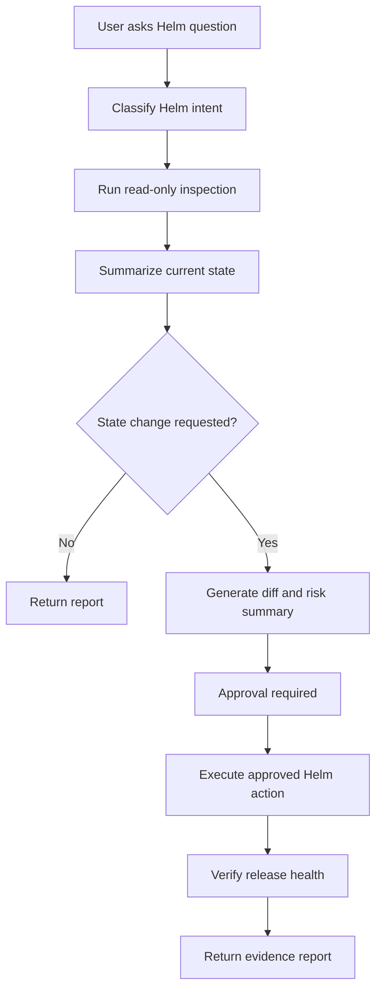

## 22.6 Kubernetes Management Workflow

### Purpose

Allow users to inspect Kubernetes resources, diagnose issues, and perform approved remediation in scoped namespaces.

### Supported Actions

| Action | Risk | Approval |
|---|---:|---:|
| List pods/services/deployments | Low | No |
| Describe resource | Low | No |
| Read events | Low | No |
| Read logs | Medium | No |
| Rollout restart | High | Yes |
| Scale workload | High | Yes |
| Patch deployment/configmap | High | Yes |
| Read secrets | Critical | Block |
| Delete namespace/resource | Critical | Block by default |

### Flow

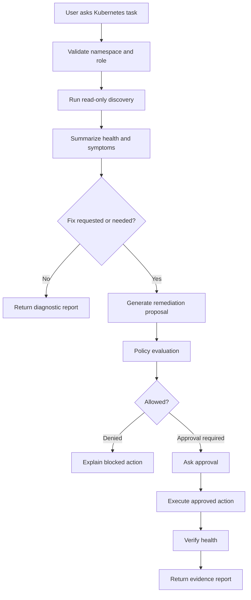

---

## 23. Policy Guard Design

### 23.1 Scope Control

Each run must carry an explicit execution scope. The policy guard evaluates every plan step and tool call against this scope before execution.

| Scope Field | Purpose |
|---|---|
| `user_id` | User identity used for RBAC and audit. |
| `roles` | Role set used for workflow, tool, and approval checks. |
| `environment` | Target environment such as local, dev, stage, or prod. |
| `namespace` | Kubernetes namespace/project boundary. |
| `allowed_mcp_servers` | MCP servers available to the run. |
| `allowed_tools` | Tool names available to the run. |
| `autonomy_mode` | Determines automatic execution vs approval. |
| `approval_mode` | Determines which actions require explicit approval. |
| `max_retries` | Prevents infinite recovery loops. |

### 23.2 Formal ODD Policy Contract

Conditional L4 autonomy must load an explicit Operational Design Domain policy. V1 starts with `knowledge-base/policy_rules.yaml` and can later move the same schema into an admin-managed policy store.

The ODD policy must define:

- Allowed workflows.
- Allowed environments.
- Allowed namespaces.
- Allowed MCP servers.
- Allowed tool categories.
- Allowed autonomy modes.
- Allowed mutation types.
- Rollback requirements.
- Stop conditions.
- Validation requirements.
- Production rules.

Required stop conditions include critical risk, out-of-scope action, high-risk action needing approval, validation failure twice, contradictory tool output, secret-like output, PostgreSQL logging failure, missing rollback state, high model uncertainty, retry budget exceeded, and duration budget exceeded.
### 23.3 Risk Levels

| Risk | Examples | Default Decision |
|---|---|---|
| Low | List releases, get health, list pods | Allow if role and scope match. |
| Medium | Read logs, diff Helm upgrade, POST to non-mutating API | Allow for operator; audit required. |
| High | Restart deployment, Helm upgrade, patch config | Approval required. |
| Critical | Delete namespace, read secrets, arbitrary shell | Deny by default. |

### 23.4 Policy Decision Model

```python
class PolicyDecision(BaseModel):
    decision: Literal["allow", "deny", "approval_required"]
    reason: str
    risk_level: Literal["low", "medium", "high", "critical"]
    matched_rules: list[str]
    redactions: list[str] = []
```

### 23.5 Example Policy Rules

```yaml
rules:
  - id: allow_readonly_bosgenesis_namespace
    effect: allow
    when:
      namespace: bosgenesis
      action_type: read
      role_in:
        - viewer
        - operator
        - approver
        - admin

  - id: require_approval_for_helm_upgrade
    effect: approval_required
    when:
      tool: helm.upgrade

  - id: require_approval_for_k8s_restart
    effect: approval_required
    when:
      tool: k8s.rollout_restart

  - id: deny_k8s_secret_read
    effect: deny
    when:
      resource_kind: Secret
      action_type: read

  - id: deny_arbitrary_shell
    effect: deny
    when:
      tool: powershell.run_raw_command

  - id: deny_prod_mutation_without_admin_policy
    effect: deny
    when:
      environment: prod
      action_type: write
      prod_mutation_enabled: false
```

---

## 24. Approval Flow

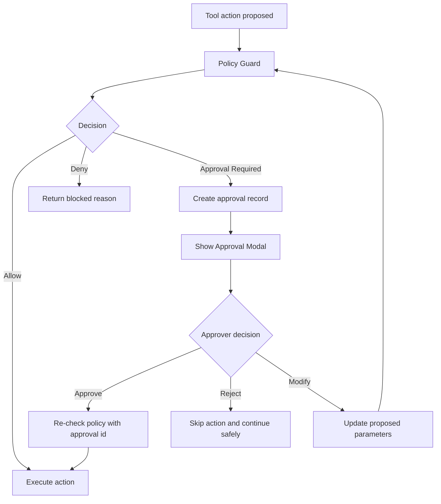

Approval modal must show:

- User request.
- Proposed action.
- Target environment.
- Target namespace/resource.
- Risk level.
- Exact tool and parameters.
- Expected impact.
- Rollback plan if applicable.
- Expiration time.

Approval is required for these HLD-aligned actions:

- Restart deployment.
- Patch configmap.
- Patch deployment environment.
- Run Helm upgrade.
- Run Helm rollback.
- Delete pod.
- Write to production systems.
- Modify test data.
- Trigger long-running jobs.
- Any operation outside default namespace or approved scope.

---

## 25. Artifact Design

### 25.1 Artifact Types

| Artifact Type | Created By | Format |
|---|---|---|
| `release_note` | Release-note workflow | Markdown initially, PDF/HTML optional. |
| `mop` | MoP creation workflow | Markdown initially, DOCX/PDF optional. |
| `mop_execution_report` | MoP execution workflow | Markdown/JSON evidence bundle. |
| `helm_report` | Helm workflow | Markdown/JSON. |
| `k8s_report` | Kubernetes workflow | Markdown/JSON. |
| `chat_transcript` | Chat service | JSON/Markdown. |

### 25.2 Artifact Storage Layout

```text
data/artifacts/
  release_notes/
    <artifact_id>.md
  mops/
    <artifact_id>.md
  execution_reports/
    <artifact_id>.md
  evidence/
    <run_id>/
      tool_calls.json
      logs/
      screenshots/
```

### 25.3 Artifact Metadata

```json
{
  "artifact_id": "art_20260622_001",
  "run_id": "run_20260622_001",
  "artifact_type": "mop",
  "title": "MoP - Upgrade BOS Genesis Helm Release",
  "storage_uri": "local://data/artifacts/mops/art_20260622_001.md",
  "status": "draft",
  "created_by": "usr_001"
}
```

---

## 26. Memory and Context Design

### 26.1 Implemented Stores

| Concern | Store/runtime | Implementation |
|---|---|---|
| Chat sessions | PostgreSQL `chat_sessions` | Session id, owner, title, timestamps. |
| Chat turns | PostgreSQL `chat_messages` | User/assistant content, run link, namespace/mode/model payload. |
| Workflow episodes | PostgreSQL `agent_runs`, `run_events`, `tool_calls` | Durable state, ordered evidence, and result history. |
| User history visibility | PostgreSQL `user_run_views` | Clear/hide and last-opened behavior without audit deletion. |
| Environment Chat memory | PostgreSQL `agent_memories` | Session-scoped `recent_turns` and `latest_environment_context`. |
| Ephemeral turn window | In-process dictionary | Last N Environment Chat turn previews; lost on restart. |
| Graph checkpoint | LangGraph in-process `MemorySaver` | Available only when `LANGGRAPH_CHECKPOINTER=memory`. |
| Procedures | PostgreSQL procedure/version/step/policy tables | Approved procedural records and L4 evaluation. |
| Qdrant | Configuration only | No collection creation, embedding, search, or upsert in current code. |
| Redis | Configuration/docker profile only | No runtime client in current code. |

### 26.2 Environment Chat Context Retrieval

`MemoryService.env_agent_context`:

1. Returns empty context for a new session.
2. Loads all authorized chat messages for an existing session.
3. Selects the last `ENV_AGENT_SHORT_TERM_MEMORY_MESSAGES` messages.
4. Loads session-scoped long-term memories up to `ENV_AGENT_LONG_TERM_MEMORY_LIMIT`.
5. Resolves the latest namespace from message payloads, then memory values.
6. Includes bounded in-process ephemeral turns.
7. Reports provider `langmem` only when the feature flag is true and the package is importable; otherwise reports `session_window`.

The current code does not pass a LangMem store or invoke LangMem extraction/search functions. The provider label is capability metadata, not proof of LangMem-managed persistence.

### 26.3 Environment Chat Memory Write

After a chat turn:

- Add a bounded ephemeral turn preview.
- Upsert long-term key `latest_environment_context` with run id, namespace, status, evidence count, recent safe summaries, prompt, and answer preview.
- Upsert short-term key `recent_turns` with the bounded turn list.
- Persist the complete user and assistant messages separately in `chat_messages`.
- Persist safe reasoning summaries as run events.
- Never persist the page's live working stream.

### 26.4 Graph and UI Rehydration

- Release Notes, Bundle Generation, and Bundle Execution use PostgreSQL snapshots/events and SSE for active progress.
- Environment Chat runs the graph synchronously per prompt and restores sessions/messages/latest snapshot through dedicated session endpoints.
- A process restart loses in-process LangGraph `MemorySaver` checkpoints and ephemeral turn previews, but PostgreSQL sessions, runs, events, messages, tool calls, approvals, memories, and artifacts remain.
- `LANGGRAPH_CHECKPOINTER=postgres` is accepted by settings but must not be described as implemented until a PostgreSQL checkpointer is instantiated.

### 26.5 Future Semantic and Coordination Extensions

- Qdrant may index PostgreSQL memory, artifacts, and procedures for similarity search.
- Redis may provide distributed locks, event fanout, rate limiting, or cache.
- LangMem may later extract, consolidate, and retrieve memories against PostgreSQL/Qdrant.
- These extensions must preserve PostgreSQL as the authoritative record and must log retrieval reason/source.

### 26.6 Redaction and Governance

- Reject or redact credentials, tokens, connection strings, Secret data, kubeconfig, and private keys.
- Store only review-safe summaries, structured plans, policy rationales, evidence, and validation outcomes.
- Hidden chain-of-thought is never requested or persisted.
- User clear actions hide history; they do not erase audit evidence.

## 27. Security Design

### 27.1 Authentication

Code-verified implementation:

- Local username/password login backed by PostgreSQL users.
- Passwords use PBKDF2-HMAC-SHA256 with a random 16-byte salt and 200,000 iterations.
- Authentication creates an HMAC-SHA256 signed session payload containing user id, username, roles, and an eight-hour expiry.
- The session is transported in an HttpOnly, SameSite=Lax cookie.
- There is no JWT access-token flow, CSRF middleware, self-registration, Entra ID integration, or refresh-token service in the current code.

Future enterprise implementation:

- Azure Entra ID SSO and group-to-role mapping.
- Managed identity for Azure and in-cluster service access.
- Explicit CSRF controls if browser cookie mutation surfaces expand.

### 27.2 Authorization

Code-verified behavior:

1. HTML workflow pages and most APIs resolve the signed session principal.
2. Route dependencies reject unauthenticated access where applied.
3. Policy evaluation further constrains workflow, tool, namespace, environment, and risk.
4. Approval-gated Environment Chat and Bundle Execution paths validate typed action scope before mutation.
5. Environment Chat deliberately normalizes a missing principal to the configured local admin principal for the local-demo path. This compatibility behavior is a deployment risk and must be removed or disabled before shared/production use.
6. Role enforcement is route-specific rather than a single universal authorization middleware.
### 27.3 Secret Handling

- Secrets are loaded from environment variables or secret manager only.
- Secrets are never returned to the browser.
- Secrets are redacted from tool outputs before LLM use.
- Audit records must store masked values only.
- The model must never be asked to summarize or inspect raw secret values.

### 27.4 Execution Boundaries

| Boundary | Rule |
|---|---|
| LLM | Can request registered tools only. |
| PowerShell | Template-based only; raw commands denied. |
| Kubernetes | Namespace allowlist; secrets blocked. |
| Helm | Upgrade/rollback require approval. |
| REST | Allowlisted base URLs only. |
| Artifacts | Per-user/role access control. |
| Production | Read-only by default until explicit policy is added. |

---

## 28. Observability and Audit

### 28.1 Structured Records

The current implementation persists structured workflow evidence rather than guaranteeing a universal structured application-log schema. PostgreSQL records include, where applicable:

- request/correlation identifiers
- session, run, and user identifiers
- workflow and event type
- ordered event sequence
- tool name, status, request/result summaries, risk, and duration
- model profile, prompt version/hash, review-safe reasoning summary, and latency
- approval, policy, artifact, and L4 audit records

Application console/file logs supplement these database records. Sensitive values are redacted before persistence where the relevant adapter applies redaction.

### 28.2 Tracing Status

OpenTelemetry is an optional architecture target only. The current repository does not configure an OpenTelemetry SDK, exporter, or span pipeline. Trace-like correlation is provided through PostgreSQL event/tool/LLM records and correlation ids.

Candidate future spans include:

```text
http.request
auth.login
chat.message.create
agent.intent.classify
llm.call
policy.evaluate
tool.execute
artifact.create
approval.create
audit.write
```

### 28.3 Evidence Store Mapping

| Evidence | Current store/status |
|---|---|
| LLM prompt metadata, plans, review-safe summaries, and explanations | PostgreSQL `llm_reasoning_review_logs` and run events |
| Tool calls and redacted result summaries | PostgreSQL `tool_calls` / `tool_execution_logs` and run events |
| API/service traces | Correlation fields in PostgreSQL and application logs; OpenTelemetry not wired |
| Run history, sessions/messages, approvals, procedures, and memories | PostgreSQL |
| Metrics and latency | PostgreSQL event/log fields where emitted; no dedicated metrics backend |
| Similar-issue retrieval | Not implemented; Qdrant is optional/future |
| Generated release notes, bundles, and reports | Local artifact storage plus optional Git publication |
### 28.4 LLM Review Logging

The system must log all available LLM reasoning artifacts for later human review and analysis.

Log these fields to PostgreSQL:

- User intent.
- Prompt template version and hash.
- LangGraph node name.
- Generated plan.
- Model-provided reasoning summary where supported.
- Tool choice and tool choice explanation.
- Risk explanation.
- Policy explanation.
- Validation explanation.
- Recovery explanation.
- Final answer.
- Redaction counts.
- Human review status.

Do not log hidden raw chain-of-thought. The backend should request model-supported reasoning summaries or ask for structured explanations, then store those review-safe fields.

### 28.5 Audit Events

Audit must record:

- Login success/failure.
- Chat message submitted.
- Run created/completed/failed.
- LLM plan generated.
- Tool call requested.
- Policy decision.
- Approval requested/approved/rejected.
- Artifact created/approved/published.
- Admin setting changed.

Audit event example:

```json
{
  "audit_id": "aud_20260622_001",
  "run_id": "run_20260622_001",
  "user_id": "usr_001",
  "event_type": "policy_decision",
  "resource_type": "tool_call",
  "resource_id": "tc_001",
  "payload": {
    "tool_name": "helm.upgrade",
    "decision": "approval_required",
    "risk_level": "high"
  }
}
```

---

## 29. Error Handling

| Error | Behavior |
|---|---|
| Invalid login | Return generic authentication failure. |
| Expired session | Return `401`; frontend redirects to login. |
| Missing permission | Return `403` with safe explanation. |
| Azure GPT timeout | Retry once if idempotent, then fail run gracefully. |
| Tool unavailable | Record tool failure and ask GPT-5 for safe fallback. |
| Policy denied | Return blocked reason and alternative read-only recommendation. |
| Approval timeout | Mark action skipped and generate partial report. |
| Artifact save failure | Fail run only if artifact is required; otherwise warn. |
| Kubernetes/Helm failure | Capture stderr/status, redact secrets, propose diagnosis. |

### 29.1 Error Diagnosis and Self-Fix Loop

The agent may attempt self-recovery only inside approved boundaries. Low-risk retries can execute automatically in `semi_autonomous` mode; medium/high-risk remediation must pass policy and approval.

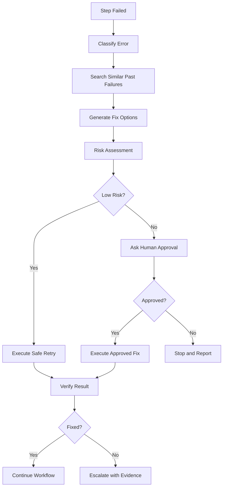

Example safe-fix pattern:

1. Health endpoint returns 503.
2. Agent inspects pod, service, ingress, and logs through approved tools.
3. Agent runs an approved PowerShell HTTP validation template.
4. Agent searches known fixes for similar symptoms.
5. Agent proposes a scoped remediation.
6. Policy marks remediation as approval-required.
7. User approves or rejects the action.
8. Agent executes only the approved action.
9. Agent verifies health and writes evidence to memory.

---

## 30. Validation Design

### 30.1 Validation Types

| Type | Example |
|---|---|
| HTTP status | Health API returned 200. |
| JSON field | `status == "healthy"`. |
| Kubernetes condition | Deployment `Available=True`. |
| Helm status | Release status is `deployed`. |
| Artifact schema | MoP contains rollback and validation sections. |
| Policy validation | Tool call matches environment and namespace limits. |
| Cross-check | Helm release version matches Kubernetes deployment image. |

### 30.2 Validation Result

```python
class ValidationResult(BaseModel):
    valid: bool
    validator_name: str
    message: str
    evidence: dict
```

---

## 31. Safe PowerShell Design

PowerShell execution is optional and must remain restricted.

Implementation rules:

- PowerShell runner must be a separate service.
- It accepts only `template_id` plus typed parameters.
- No raw command string parameter should exist.
- Every template has a risk level.
- Every template has allowed roles, workflows, and environments.
- Stdout and stderr must be size-limited.
- Secrets must be redacted before persistence.
- Commands must run with timeout.
- Commands must run as a low-privilege Windows identity.
- `Invoke-Expression`, `iex`, and script download execution are blocked.

Allowed pattern:

```text
GPT-5 selects template and parameters.
Backend validates policy.
Runner executes approved template.
Backend captures output and redacts secrets.
```

Blocked pattern:

```text
GPT-5 generates raw shell command.
Backend executes raw shell command.
```

Initial templates:

| Template | Purpose | Risk | Approval |
|---|---|---:|---:|
| `ps_http_get` | Invoke-RestMethod GET against approved endpoint. | Low | No |
| `ps_http_post` | Invoke-RestMethod POST against approved endpoint. | Medium | Optional by endpoint |
| `ps_test_connection` | Connectivity check. | Low | No |
| `ps_curl_health_check` | Curl/Invoke-WebRequest health check against known endpoint. | Low | No |
| `ps_kubectl_get_pods` | Read-only pod listing in approved namespace. | Low | No |
| `ps_kubectl_logs` | Read approved pod logs. | Medium | No |
| `ps_helm_status` | Read Helm release status. | Low | No |

Blocked:

- `Invoke-Expression`
- `iex`
- `Remove-Item -Recurse`
- `Format-Volume`
- `Stop-Service`
- `Set-ExecutionPolicy`
- `Start-Process` with unknown executable
- Raw `kubectl delete`
- Cluster-wide delete/patch operations
- Raw `helm upgrade`
- Secret reads
- Credential store access
- Recursive filesystem deletion
- Download-and-execute commands

---

## 32. Deployment Design

### 32.1 Current Local/Ingress Profile

The verified operating model is a local Python process with remote internal dependencies:

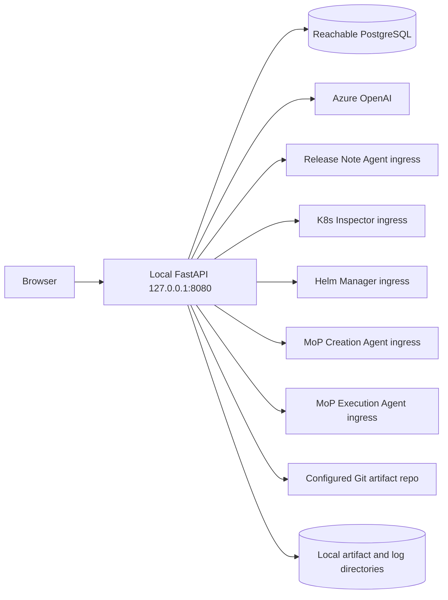

- `start-esda.bat` and `kill-esda.bat` manage the local process.
- `.env.ingress.example` is the local-to-cluster configuration template.
- The active V1 path requires PostgreSQL. Qdrant is optional and unused by current workflows.
- Downstream BOS Genesis agents are addressed through ingress URLs in local mode.
- Git publishing uses the local Git credential environment and a temporary publisher workspace.

### 32.2 Docker Dependency Profile

`docker-compose.yml` defines PostgreSQL and Qdrant, with Redis behind an optional profile. Only PostgreSQL is required by the current runtime. Docker Compose does not package the ESDA application itself.

### 32.3 Kubernetes Target Profile

`.env.helm.example` documents the intended in-cluster service-DNS configuration and Kubernetes Secret use. The repository currently contains no Helm chart or Kubernetes manifests for ESDA, so Kubernetes deployment remains a target architecture rather than a code-delivered deployment package.

### 32.4 Runtime Storage

| Storage | Current role |
|---|---|
| PostgreSQL | Required users, sessions, runs, events, memories, reviews, approvals, procedures, and metadata. |
| Local filesystem | Artifact bytes, rotating application logs, Bundle Execution debug logs, temporary Git publisher workspace. |
| Git repository | Published release-note pairs, MoP bundles, and execution report bundles when enabled. |
| Qdrant | Optional future semantic index; no current calls. |
| Redis | Optional future coordination/cache; no current calls. |

## 33. Testing Strategy

The repository currently contains 170 pytest tests.

### 33.1 Covered Areas

| Area | Current coverage |
|---|---|
| Auth/security | Password hashing, signed cookies, stale principal normalization, redacted settings. |
| Model profiles | Azure credential paths, GPT-5/GPT-4.1/Ollama profiles, fallback behavior. |
| Tool and policy contracts | Registry allowlists, role/workflow/environment checks, approval requirements, raw PowerShell and namespace denials. |
| PostgreSQL logging | Event, LLM review, and tool execution records. |
| Release Notes | Chains, MCP mapping, artifact hydration, graph flow, repository scans, PDF/Markdown, Git publish, ephemeral notes. |
| Activity | Timeline/detail, Release Note and bundle artifacts, direct bundle questions, upload/overwrite/create-folder paths. |
| Bundle Generation | Namespace API, graph wiring, MCP adapters, redaction, structured fallbacks, bundle UI. |
| Bundle Execution | Preflight, secret/destructive checks, agent health/capabilities, registration, dry-run, decisions, instructions, reports, approvals, mutation, validation, cleanup/revert. |
| Environment Chat | Page/contract, adapters, redaction, classifier/planner/diagnosis, pod inventory, log follow-up, sessions, memory, approvals, remediation, Helm dry-run/repo/OCI fallback, UI controls. |
| Conditional L4 | Eligibility, approved procedures, risk denial, stop conditions, audit. |

### 33.2 Required Verification Commands

```powershell
python -m ruff check backend
python -m pytest
```

For documentation-only changes, Markdown structure, links, code blocks, and diff review must also be checked. Live integrations require separate environment tests because unit tests use mocked transports for Azure, MCP agents, Git, and Kubernetes/Helm services.

### 33.3 Residual Integration Risk

- A passing ESDA adapter test does not prove that a deployed MCP ingress supports its mutating route or API-key contract.
- PostgreSQL availability is required at application startup.
- Azure credential and downstream agent readiness are environmental.
- Bundle Execution success depends on bundle correctness and a compatible deployed execution-agent image.
- Environment Chat Helm mutation can be correctly planned/approved yet fail when Helm Manager repository/install endpoints return 502/503.

## 34. Versioned Delivery Plan

### 34.0 Measurable Phase Acceptance Tests

V1 must prove:

- User logs in.
- User submits a bounded task.
- Agent creates a plan.
- Agent calls one MCP tool.
- Agent calls one REST GET.
- Agent calls one safe PowerShell GET.
- Agent validates response.
- Agent writes run record.
- Agent writes PostgreSQL event.
- Agent returns final evidence-backed report.

V2 must prove:

- Agent classifies an error.
- Agent retrieves a prior similar issue from Qdrant.
- Agent recommends a safe next step.
- No mutation occurs.

V3 must prove:

- Agent proposes restart or patch.
- Approval is created.
- Unauthorized user cannot approve.
- Approved action executes.
- Post-fix validation runs.
- Memory write-back occurs.

V4 must prove:

- L4 eligibility is evaluated.
- Workflow runs only inside approved ODD.
- Stop condition causes escalation.
- No production mutation occurs without policy.

### Version 1: Foundation and Authenticated Read-Only Agent

Capabilities:

- Python FastAPI backend.
- Bootstrap 5.3 + JavaScript/HTML/CSS frontend.
- Login page and authenticated session.
- Local user store and roles.
- Chat session API and SSE streaming event panel.
- LangChain Azure GPT-5 integration with externalized configuration.
- LangGraph router graph and basic workflow graph.
- Basic plan generation.
- MCP call.
- REST API GET.
- Safe PowerShell GET.
- PostgreSQL run storage.
- PostgreSQL event and LLM review logging.
- Final evidence-backed report.

Success criteria:

- User can log in and submit a bounded goal.
- Agent creates a plan before execution.
- Agent calls at least one MCP server.
- Agent calls one API endpoint.
- Agent returns an evidence-backed result.

### Version 2: Diagnostic Agent

Capabilities:

- Intent classification.
- Error classification.
- Log retrieval.
- Validation rules.
- LangMem-assisted short-term summaries and memory extraction.
- Memory lookup.
- Similar issue detection through Qdrant.
- Episodic memory through PostgreSQL.
- Run history.
- Release-note draft workflow.
- MoP draft workflow.
- Read-only Helm and Kubernetes tools.
- Artifact storage and run detail page.

Success criteria:

- Agent can diagnose a failing endpoint.
- Agent can search previous issues/fixes.
- Agent can recommend safe next steps.
- Draft release-note and MoP artifacts can be generated and stored.

### Version 3: Semi-Autonomous Repair Agent

Capabilities:

- Safe retry.
- Human approval gate.
- Policy guard enforcement.
- Approved restart/patch templates.
- MoP execution workflow.
- Helm upgrade/rollback behind approval.
- Kubernetes restart/scale/patch behind approval.
- Post-fix verification.
- Memory write-back to PostgreSQL and Qdrant.
- Human LLM-review dashboard backed by PostgreSQL.
- Execution evidence reports.

Success criteria:

- Agent can propose a fix.
- User can approve or reject the fix.
- Agent executes only approved fixes.
- Agent verifies outcome and saves evidence.

### Version 4: Conditional L4 Bounded Agent

Capabilities:

- Conditional L4 autonomy inside approved operational design domain.
- Multi-step autonomous orchestration through LangGraph.
- Multiple MCP servers.
- LangMem-assisted memory-driven troubleshooting.
- Policy-governed remediation.
- MoP-style execution report.
- PostgreSQL review analytics and operational dashboards.
- OpenTelemetry trace integration.
- Enterprise SSO.
- Managed identity or secret-manager integration.
- Fine-grained environment policies.
- High-availability deployment.

Success criteria:

- Agent can execute a full bounded workflow from task to validated result.
- Risky actions are gated.
- All steps are auditable.
- Similar future issues are resolved faster using memory.

---

## 35. Open Questions

These details must be finalized before implementation:

1. Azure GPT-5 endpoint, deployment name, API version, and authentication mode.
2. Initial authentication mode: local login, LDAP, Azure Entra ID, or another identity provider.
3. Exact URLs/contracts for release-note, MoP creation, MoP execution, Helm, and Kubernetes services.
4. Required artifact formats: Markdown only, PDF, DOCX, HTML, or all.
5. Which environments are available initially: local, dev, stage, prod.
6. Namespace and cluster allowlists.
7. Whether production mutation is allowed in any phase.
8. Whether release-note publishing integrates with GitHub, Confluence, Jira, SharePoint, or another system.
9. Whether MoP approval must integrate with an external change-management system.

---

## 36. Summary

The BOS Genesis ESDA Console is an authenticated chatbot UX application backed by Azure GPT-5. It provides a bounded operational assistant for release-note creation, MoP creation, MoP execution, Helm management, and Kubernetes management.

The core safety model is:

```text
GPT-5 reasons and proposes.
The backend validates and executes.
Users approve risky actions.
The system records evidence and audit history.
```

This design preserves the Codex-like task loop from the baseline document while adapting it into a login-based UX application with workflow-specific guardrails, Azure GPT-5 configuration, durable artifacts, approval controls, and operational auditability.
## Appendix A: Namespace Twin Resource Projection and Known Debt

Namespace Twin construction in `bosgenesis-mop-execution-agent` follows this low-level contract:

1. Collect the target namespace snapshot and installed Helm inventory before constructing the planned projection.
2. Detect explicit new Helm installations only from typed `helm_install` steps or commands matching `helm install` / `helm upgrade --install`.
3. Keep target-installed Helm releases; exclude absent releases unless they are in the explicit planned-install set.
4. For each explicit installation, parse only indexed rendered-manifest files, admit the supported namespaced resource kinds, and require their Helm release metadata to match the planned release.
5. Build dependency edges from the final selected projection, including rendered Helm resources, rather than only from the original manifest references. This ensures an Ingress backend can resolve to the rendered Service for the same planned release.
6. Mark `reference.esda/v1` nodes as synthetic and exclude them from CRD inference, preventing recursive false CRDs such as `customresourcedefinitions.reference.esda` and `services.reference.esda`.
7. Exclude Twin-planning ConfigMaps using `NAMESPACE_TWIN_CONFIGMAP_EXCLUDE_NAMES` and `NAMESPACE_TWIN_CONFIGMAP_EXCLUDE_PREFIXES`. Defaults are `kube-root-ca.crt` and `istio-` respectively.

The ConfigMap exclusion is deliberately downstream and read-only. The bundle and execution payload remain unchanged.

### Technical Debt / TODO

Bundle Generation currently cannot reliably distinguish application-owned ConfigMaps from API-server, service-mesh, or controller-generated ConfigMaps. The exact-name/prefix filter is therefore a temporary planning adapter. Add typed object-origin metadata to `artifact-index.json` and generated manifests using source collector identity, `managedFields`, owner references, and generator provenance; then make Twin projection depend on that typed origin and remove the heuristic properties.


## Appendix B: Demo Configuration and Digital Twin LLD (2026-07-22)

### B.1 Compatible deployed components

The demo-tested compatibility set is ESDA `v0.2.18-1` at commit `744e1c6` plus MoP Execution Agent image `ghcr.io/aveeshek/bosgenesis-mop-execution-agent:0.1.4` at commit `2571ee8`. ESDA must reject or visibly degrade authoritative Twin claims when the execution-agent capability/version contract cannot be verified.

Version `0.1.4` is the minimum supported execution-agent version for this demo because it prevents read-only Helm inventory and validation evidence from being classified as inferred chart/value mutation risk. Previously persisted twins are immutable and are not repaired in place; operators must generate a new twin after any planner, parser, policy, or risk-rule correction.

### B.2 Runtime component sequence

```text
Browser
  -> authenticated ESDA Digital Twins or Bundle Execution route
  -> ESDA Digital Twin gateway
  -> MoP Execution Agent REST/worker lifecycle
  -> PostgreSQL twin and audit persistence
  -> Kubernetes Inspector and Helm Manager MCP evidence
  -> deterministic release delta, graph, policy, risk, dry-run, rollback,
     drift, runtime, release-note validation, replay, and audit facts
  -> optional SIGMA 5 PRO bounded explanation
  -> immutable decision version and report
```

ESDA owns authentication, launch orchestration, presentation, browser caching, optional Bundle Execution matching, and safe model explanation. The MoP Execution Agent owns authoritative facts, deterministic scoring, final decisions, dry-run identity, reports, locks, and execution eligibility. The browser must never calculate policy, risk, evidence completeness, dependencies, or a final decision.

### B.3 ESDA properties contract

| Property | Default | Demo value / rule |
|---|---|---|
| `APP_ENV` | `local` | `local` for the single-user demo; use a governed environment value outside the lab. |
| `APP_BASE_URL` | `http://localhost:8080` | Must match the URL used by the browser. |
| `DATABASE_URL` | Local PostgreSQL DSN | Required. PostgreSQL is the durable run, chat, audit, artifact metadata, and user-view store. |
| `LOG_LEVEL` | `INFO` | Use `DEBUG` only during bounded troubleshooting; redact before write. |
| `DIGITAL_TWIN_BACKEND_MODE` | `real_core` | Must be `real_core` for authoritative demo runs. |
| `DIGITAL_TWIN_MOCK_ENABLED` | `true` | Set `false` for the demo to prevent fixture ambiguity. Mock behavior is development-only. |
| `DIGITAL_TWIN_MOCK_DELAY_MS` | `120` | Development fixture latency only; it must not affect `real_core`. |
| `DIGITAL_TWIN_EXECUTION_AGENT_URL` | empty | `http://mop-execution-agent.bosgenesis.local` for local ingress; use service DNS in-cluster. |
| `DIGITAL_TWIN_EXECUTION_GATE_REQUIRED` | `false` | Keep `false` for the optional-gate demo. Set `true` only for the explicit mandatory-gate journey. |
| `DEFAULT_MODEL_PROFILE` | `azure_gpt5_pro` | Primary demo profile, displayed as `SIGMA 5 PRO`. |
| `LANGGRAPH_CHECKPOINTER` | `memory` | Process-local checkpointing only; durable PostgreSQL graph saver is TODO. |
| `LANGMEM_ENABLED` | `false` | Optional memory-management layer; it is not a decision authority. |
| `ARTIFACT_GIT_PUBLISH_ENABLED` | `true` | Single-user demo publishing; concurrent publisher hardening remains TODO. |
| `MOP_EXECUTION_ALLOWED_NAMESPACES` | `agent-testing` | Keep mutation restricted to the demo namespace. |
| `MOP_EXECUTION_DEMO_PASS_THROUGH_ENABLED` | `false` | Must remain `false`; do not bypass policy or approval for the demo. |

The existing model, release-note, MoP creation, execution, Kubernetes, Helm, artifact, and logging properties in `backend/app/config.py` remain authoritative. `.env.example` is a non-secret template and must be kept synchronized with that class. Real passwords, tokens, API keys, database passwords, and managed-identity material must never be committed.

### B.4 MoP Execution Agent Namespace Twin properties

| Property | Demo value | Behavior |
|---|---|---|
| `NAMESPACE_TWIN_LIVE_COLLECTION_ENABLED` | `true` | Collect current namespace and Helm evidence. |
| `NAMESPACE_TWIN_HELM_INSTALLED_RELEASES_ONLY` | `true` | Treat target-installed releases as baseline evidence; still include an explicit planned new install. |
| `NAMESPACE_TWIN_HELM_IGNORE_PREFIXES` | `bosgenesis-` | Ignore demo/platform-owned Helm releases by configurable prefix. |
| `NAMESPACE_TWIN_CONFIGMAP_EXCLUDE_NAMES` | `kube-root-ca.crt` | Exclude platform ConfigMaps from Twin planning only. |
| `NAMESPACE_TWIN_CONFIGMAP_EXCLUDE_PREFIXES` | `istio-` | Exclude service-mesh generated ConfigMaps from Twin planning only. |
| `NAMESPACE_TWIN_PVC_RISK_ENABLED` | `false` | PVC risk is intentionally outside MVP scope. It must be enabled only after storage safety evidence exists. |
| `NAMESPACE_TWIN_DRY_RUN_MAX_AGE_SECONDS` | `86400` | Maximum authoritative dry-run age unless a stricter environment policy overrides it. |
| `NAMESPACE_TWIN_DATABASE_URL` | service-owned PostgreSQL DSN | Preferred execution-agent Twin database setting; `DATABASE_URL` is the fallback. |

Equivalent Helm values must be used when deployed in Kubernetes. The current demo values include `namespaceTwinLiveCollectionEnabled`, `namespaceTwinHelmInstalledReleasesOnly`, `namespaceTwinHelmIgnorePrefixes`, `namespaceTwinConfigMapExcludeNames`, `namespaceTwinConfigMapExcludePrefixes`, and `namespaceTwinPvcRiskEnabled`.

### B.5 Deterministic decision contract

The current risk rules are versioned as `namespace-twin-risk-1.1.0`. Default contributions are PVC create/delete +30 when enabled, StatefulSet +25, Helm release upgrade +20, image +15, ConfigMap +15, Ingress +15, Service selector +20, large replica change +10, missing rollback +30, inferred chart/value +20, partial/stale evidence +20, previous similar failure +20, and drift +25.

Decision precedence is policy denial or hard block, authoritative dry-run failure, critical unmitigated risk, approval required, partial/stale/unavailable evidence, risk above the Green band, then otherwise Green. Green still requires authoritative dry-run evidence and never means guaranteed runtime success.

The post-fix reference run `twin_3c9667d6848f4daabebdc270166c7c05` finalized Amber at risk 55 with complete evidence. The non-zero contributions were StatefulSet +25, ConfigMap +15, and Ingress +15. Read-only Helm evidence contributed zero inferred chart/value risk.

### B.6 Persistence, caching, and rehydration

- Run, event, artifact metadata, safe summaries, decisions, and audit events are persisted in PostgreSQL.
- Live reasoning/working notes remain page-session ephemeral and are not restored after navigation or refresh.
- Twin detail responses may be cached in the browser by twin ID, decision version, model profile, module, and filter. Cache entries never become decision authority.
- Bundle Execution matches a Twin by immutable bundle identity plus target. A missing match is non-blocking unless `DIGITAL_TWIN_EXECUTION_GATE_REQUIRED=true`.
- A selected historical run must rehydrate its persisted state; a fresh page without an active or explicitly selected run starts idle.

### B.7 Low-level TODOs

1. Replace FastAPI process background work with a durable worker and PostgreSQL-backed LangGraph saver.
2. Add typed ownership provenance to bundle artifacts and remove ConfigMap/Helm name heuristics.
3. Enable PVC scoring only after storage class, retention, restore, resize, and data-loss controls are authoritative.
4. Add versioned Twin re-evaluation that creates a successor decision without rewriting history.
5. Finish worker restart, reconnect, timeout, cancellation, idempotency, namespace-lock, and report-write failure tests.
6. Add server materialized summaries and ETags to reduce first-tab latency.
7. Complete end-to-end metrics and correlation across ESDA, execution agent, MCP, model calls, and PostgreSQL.
8. Resolve execution-agent generic CI type-stub and duplicate-module debt; retain the passing container workflow as the current image gate.
9. Remove unused ClickHouse sample settings after confirming no downstream report dependency.
10. Keep `.env.example`, Helm values, and runtime configuration documentation synchronized through an automated drift test.
