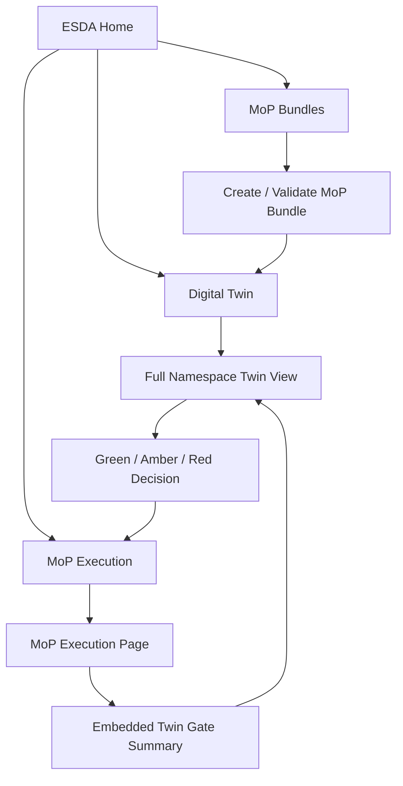
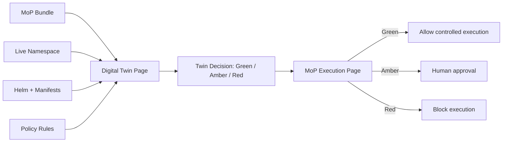
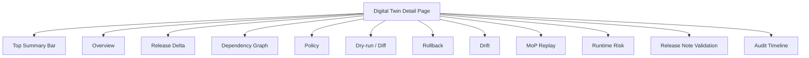
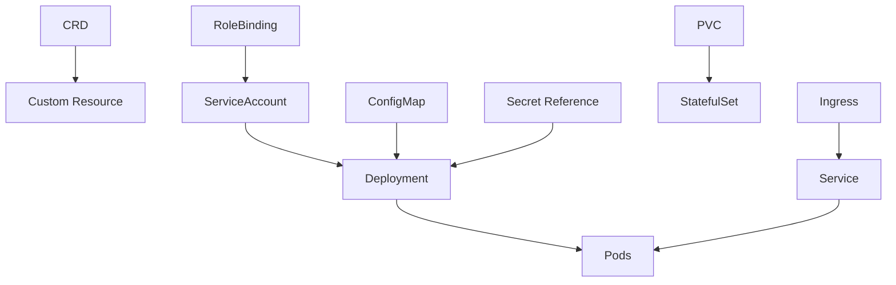
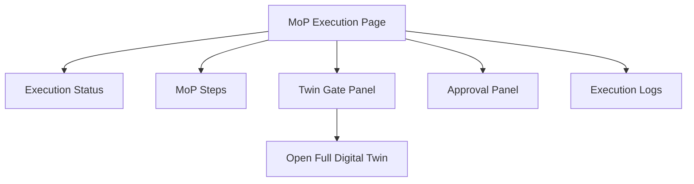
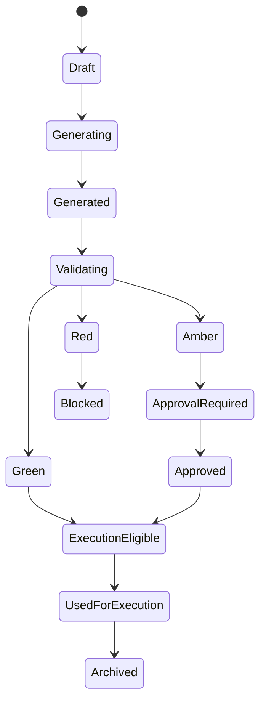
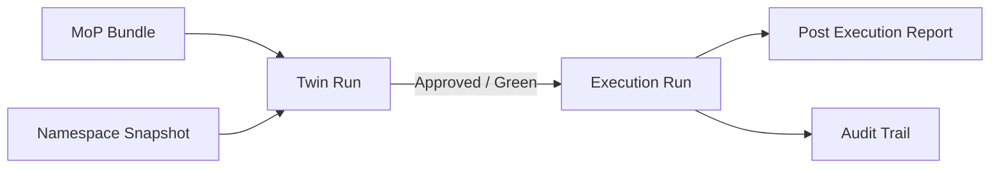
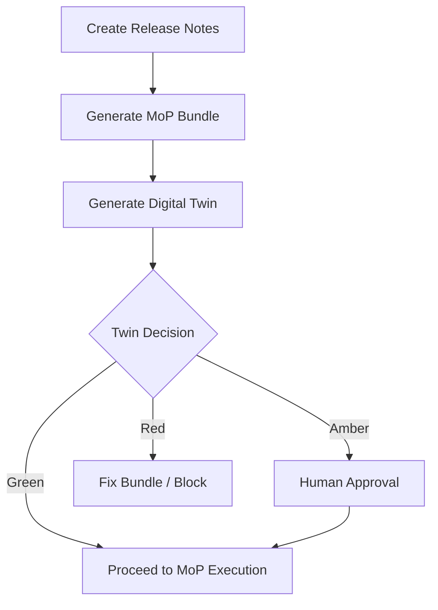
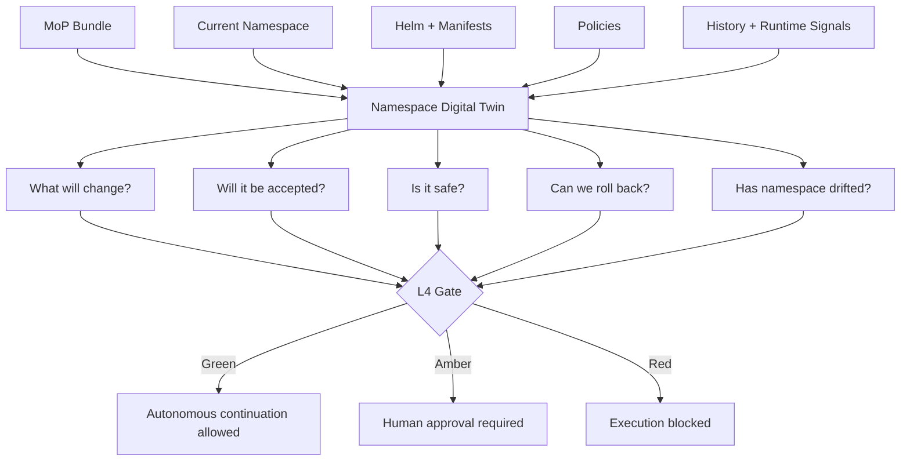

# ESDA Digital Twin Webpage Implementation Plan

**Project:** ESDA — Ericsson SRE and DevOps Agent  
**Feature:** Dedicated Digital Twin webpage + embedded Digital Twin Gate in MoP Execution page  
**Goal:** Implement a Digital Twin user experience that becomes the mandatory safety gate for Conditional L4 autonomy.

---

## 0. Executive decision

Implement **both**:

1. A new dedicated **Digital Twin webpage** for deep inspection, validation evidence, graphs, risk, drift, rollback, and audit.
2. A compact embedded **Digital Twin Gate panel** inside the existing **MoP Execution page**.

Recommended product boundary:

```text
Dedicated Digital Twin Page = full analysis, evidence, graph, risk, replay, rollback, audit

MoP Execution Page = compact Digital Twin status + execute/approve/block decision
```

In one line:

> Digital Twin gets its own cockpit. MoP Execution consumes the twin decision.

---

## 1. Recommended UX structure

### What to implement

Create a top-level Digital Twin workspace in ESDA.

Recommended routes:

```text
/esda/digital-twins
/esda/digital-twins/:twinRunId
```

Optional deep links:

```text
/esda/mop-bundles/:bundleId/twin
/esda/mop-executions/:executionId/twin
```

Preferred canonical detail route:

```text
/esda/digital-twins/:twinRunId
```

The reason is simple: a twin can exist before execution, after execution, or independently from execution.

### How it should work



### Implementation tasks

- Add a new **Digital Twins** item in ESDA navigation.
- Add a Digital Twin list page.
- Add a Digital Twin detail page.
- Add deep links from:
  - MoP Bundle detail page
  - MoP Execution page
  - Approval page
  - Execution report page
- Add an embedded **Twin Gate Summary** widget inside the MoP Execution page.

### Acceptance criteria

- Operator can open a full Digital Twin page before execution.
- Operator can open the full twin from the MoP Execution page.
- MoP Execution page shows only summary, not the full twin workspace.
- Each execution run references exactly one approved or valid twin run.

---

## 2. Why dedicated page is better

### What to implement

Do **not** hide the Digital Twin inside the MoP Execution page only.

The Digital Twin has too much evidence and too many views:

```text
release delta
dependency graph
policy result
dry-run result
drift result
rollback readiness
runtime risk
MoP replay result
release note validation
audit history
```

The MoP Execution page should remain focused on execution.

### Page responsibility split

| Area | Purpose |
|---|---|
| **Digital Twin page** | Think, inspect, compare, validate, explain |
| **MoP Execution page** | Execute, approve, monitor, rollback |

### Implementation rule

```text
Digital Twin Page = source of truth for safety evidence
MoP Execution Page = execution control surface
```

### Acceptance criteria

- Digital Twin page contains all tabs and validation evidence.
- MoP Execution page contains only the compact gate result.
- Operator can review twin before starting execution.
- Operator can regenerate twin before execution if stale or drifted.

---

## 3. Best design pattern

### What to implement

Use this product pattern:

```text
Digital Twin Page = source of truth for safety decision

MoP Execution Page = consumer of that decision
```

### System relationship



### Implementation rule

The MoP Execution page must not recompute or reinterpret the twin decision.

It should consume:

```text
twinRunId
decision
riskScore
topReasons
policyStatus
dryRunStatus
rollbackStatus
driftStatus
approvalRequirement
freshnessStatus
```

### Example MoP Execution page messages

Green:

```text
Twin Gate: Green
Reason: dry-run passed, policy passed, rollback confidence high.
Action: Conditional autonomous execution allowed within approved boundary.
```

Amber:

```text
Twin Gate: Amber
Reason: PVC change detected and rollback confidence medium.
Action: Human approval required before execution.
```

Red:

```text
Twin Gate: Red
Reason: cluster-scoped RBAC change detected.
Action: Execution blocked.
```

### Acceptance criteria

- Execution can start only if the backend validates the linked `twinRunId`.
- Red twin always blocks execution.
- Amber twin requires valid approval.
- Green twin allows controlled execution only within ESDA’s approved operating boundary.

---

## 4. What the Digital Twin page should contain

### What to implement

Build a **Digital Twin Workspace**.

Recommended pages:

```text
/esda/digital-twins
/esda/digital-twins/:twinRunId
```

The detail page must contain:

1. Top summary bar
2. Overview tab
3. Release Delta Twin tab
4. Dependency Graph Twin tab
5. Policy Twin tab
6. Dry-run / Diff Twin tab
7. Rollback Twin tab
8. Drift Twin tab
9. MoP Replay Twin tab
10. Runtime Behavior Twin tab
11. Release Note Validation Twin tab
12. Audit Timeline tab

### Top summary bar

This bar should always be visible on the Digital Twin detail page.

Show:

```text
Twin Status
Twin Decision: Green / Amber / Red
Risk Score
Autonomy Eligibility
Target Cluster
Target Namespace
MoP Bundle
Release Version
Created By
Created At
Updated At
Freshness Status
Execution Link
Approval Link if Amber
```

Example:

```text
Twin Decision: AMBER
Risk Score: 68 / 100
Reason: PVC change detected + rollback confidence medium
Autonomy: Human approval required
```

### Page structure



### Acceptance criteria

- Every twin detail page has the same tab structure.
- Missing optional add-on evidence should display as `Not run`, not as blank UI.
- Every tab can be individually refreshed or regenerated if backend supports it.
- Every tab contributes evidence to the overall Twin Decision where applicable.

---

## 5. Digital Twin detail page layout

### What to implement

The Digital Twin detail page should be organized like a safety cockpit.

### Layout

```text
Header:
  Digital Twin: <release/version/namespace>
  Twin Decision badge
  Risk score
  Autonomy eligibility
  Primary actions

Sticky Top Summary:
  Target cluster
  Target namespace
  Bundle ID
  Twin run ID
  Created at
  Freshness
  Linked execution

Tabs:
  Overview
  Release Delta Twin
  Dependency Graph Twin
  Policy Twin
  Dry-run / Diff Twin
  Rollback Twin
  Drift Twin
  MoP Replay Twin
  Runtime Behavior Twin
  Release Note Validation Twin
  Audit Timeline
```

### Primary actions

Show these actions depending on state:

```text
Generate Twin
Regenerate Twin
Open MoP Bundle
Open Execution
Start Execution
Request Approval
Approve
Reject
Download Report
Export Evidence JSON
```

### UX badges

Use simple badges:

```text
Green
Amber
Red
Passed
Warning
Denied
Not Run
Stale
Fresh
Blocked
Approval Required
Execution Eligible
```

### Acceptance criteria

- Operator can understand the twin result in 30 seconds.
- Operator can inspect detailed evidence through tabs.
- Operator can download the report.
- Operator can move to execution only when backend gate allows it.

---

## 6. Page tabs to implement

The Digital Twin detail page must include the following tabs exactly.

---

### Tab 1 — Overview

#### Purpose

```text
Give operator the 30-second summary.
```

#### What to show

Cards:

```text
Twin Decision
Risk Score
Autonomy Eligibility
Policy Status
Dry-run Status
Rollback Confidence
Drift Status
Replay Status
Runtime Risk
Release Note Validation Status
Recommended Action
```

Top risks:

```text
Top 3 to 5 risk reasons
Blocking findings
Warnings
Missing evidence
Recommended next step
```

Example cards:

```text
Policy: Passed
Dry-run: Passed
Rollback: Medium confidence
Drift: No major drift
Replay: Not run
Decision: Amber
```

#### How to implement

Backend response should include a summary object:

```json
{
  "twinRunId": "twin-123",
  "decision": "AMBER",
  "riskScore": 68,
  "autonomyEligibility": "HUMAN_APPROVAL_REQUIRED",
  "recommendedAction": "Request human approval before execution",
  "topReasons": [
    "PVC change detected",
    "Rollback confidence medium",
    "RBAC modified"
  ],
  "statusSummary": {
    "policy": "PASSED",
    "dryRun": "PASSED",
    "rollback": "MEDIUM_CONFIDENCE",
    "drift": "NO_MAJOR_DRIFT",
    "replay": "NOT_RUN",
    "runtimeRisk": "MEDIUM",
    "releaseNoteValidation": "WARNING"
  }
}
```

#### Acceptance criteria

- Overview loads quickly.
- Overview does not require loading every full evidence artifact.
- Operator can see Green / Amber / Red immediately.
- Operator can navigate from a summary card to its tab.

---

### Tab 2 — Release Delta Twin

#### Purpose

```text
Show exactly what will change.
```

#### What to show

A table of current vs planned changes.

Table columns:

| Column | Description |
|---|---|
| Resource | Kubernetes resource name |
| Kind | Deployment, Service, ConfigMap, PVC, RoleBinding, etc. |
| Namespace | Target namespace |
| Action | Create, Update, Delete, No Change |
| Current Version | Existing state summary |
| Planned Version | Planned state summary |
| Risk | Low, Medium, High, Critical |
| Reason | Why the change matters |

Example table:

| Resource | Kind | Action | Risk |
|---|---|---|---|
| `release-note-agent` | Deployment | Update image | Low |
| `app-config` | ConfigMap | Modify | Medium |
| `data-volume` | PVC | Resize | High |
| `reader-role` | RoleBinding | Modify | Medium |

Actions:

```text
Created
Updated
Deleted
Unchanged
Risky
Unknown
```

#### How to implement

Delta engine should compare:

```text
current live namespace snapshot
rendered Helm manifests
raw Kubernetes manifests
previous Helm release manifest if available
new release bundle manifest
```

Detect changes in:

```text
container image
replicas
resources requests/limits
ConfigMaps
Secrets references only, never values
Service selectors
Ingress routes
PVCs
RBAC
ServiceAccounts
CRDs/custom resources
annotations
labels
probes
environment variables, redacted where needed
```

#### UI behavior

- Allow filter by action.
- Allow filter by risk.
- Allow filter by kind.
- Allow side-by-side YAML diff for selected resource.
- Redact Secret values.
- Highlight risky fields such as PVC, RBAC, cluster-scoped resources, privileged pod settings.

#### Acceptance criteria

- Operator can answer: “What exactly is changing?”
- Every changed resource has an action and risk level.
- Secret values are never displayed.
- Deletions are clearly visible.
- PVC, RBAC, and cluster-scoped changes are highlighted.

---

### Tab 3 — Dependency Graph Twin

#### Purpose

```text
Show whether the bundle is structurally safe.
```

#### What to show

A dependency graph of Kubernetes resources.

Example graph:



Show warnings such as:

```text
Deployment references ConfigMap app-config, but ConfigMap is missing.
Ingress points to Service gateway-svc, but Service is not in bundle.
PVC exists but storage class differs from target cluster policy.
Secret reference exists but value is not available in mimic namespace.
Custom Resource is present but required CRD is missing.
```

#### How to implement

Dependency graph builder should parse:

```text
ownerReferences
label selectors
Service selectors
Ingress backend references
ConfigMap refs
Secret refs
PVC refs
ServiceAccount refs
RoleBinding refs
CRD -> Custom Resource relationships
Helm hooks
init container dependencies
job dependencies from MoP instructions where available
```

Graph node model:

```json
{
  "id": "deployment/release-note-agent",
  "kind": "Deployment",
  "name": "release-note-agent",
  "namespace": "demo",
  "source": "rendered-manifest",
  "risk": "LOW",
  "status": "PRESENT"
}
```

Graph edge model:

```json
{
  "from": "configmap/app-config",
  "to": "deployment/release-note-agent",
  "type": "CONFIGMAP_REF",
  "status": "VALID"
}
```

#### UI behavior

- Show resource graph.
- Show missing dependencies in red.
- Show warning dependencies in amber.
- Show valid dependencies in green or neutral.
- Allow click on node to see resource details.
- Allow graph filters by namespace, kind, risk, and missing dependencies.

#### Acceptance criteria

- Missing ConfigMaps, Secrets, PVCs, Services, CRDs, ServiceAccounts, and RoleBindings are detected.
- Dependency graph can be rendered from backend JSON.
- Cycles or suspicious ordering are flagged.
- Dependency findings contribute to twin risk score.

---

### Tab 4 — Policy Twin

#### Purpose

```text
Show whether ESDA is allowed to perform this action.
```

#### What to show

Policy categories:

```text
namespace boundary
cluster-scoped resources
RBAC changes
Secret handling
privileged pods
hostPath volumes
PVC/data safety
resource quota
image registry policy
approval policy
```

Example result:

```text
Passed:
  namespace boundary
  image registry
  resource quota

Warning:
  RBAC modified

Denied:
  cluster-scoped ClusterRole detected
```

#### How to implement

Policy engine should check planned changes against ESDA’s operating boundary.

Minimum baseline policy checks:

```text
Only approved target namespace can be mutated.
No cluster-scoped mutation unless explicitly approved.
No raw shell command generated by LLM can mutate the cluster.
No Secret values can be shown or copied.
No production data copy into mimic namespace.
No privileged pods unless explicitly approved.
No hostPath volumes unless explicitly approved.
No unsafe PVC deletion.
No destructive storage changes without approval.
No mutation without dry-run evidence.
No execution if MoP bundle hash changed after twin generation.
No execution if namespace snapshot became stale.
```

Policy result model:

```json
{
  "policyId": "namespace-boundary",
  "category": "Namespace Boundary",
  "severity": "BLOCKER",
  "status": "PASSED",
  "message": "All planned resources are scoped to namespace demo"
}
```

#### UI behavior

- Group policies by category.
- Show status: Passed, Warning, Denied, Not Applicable.
- Show severity: Info, Low, Medium, High, Blocker.
- Show policy explanation in plain English.
- Allow download of full policy result JSON.

#### Acceptance criteria

- Denied policy forces Red decision.
- Warning policy can force Amber if severity is medium/high.
- Policy evidence is immutable after twin finalization.
- Policy tab clearly proves ESDA did not exceed its operational boundary.

---

### Tab 5 — Dry-run / Diff Twin

#### Purpose

```text
Show what Kubernetes says would happen.
```

#### What to show

Evidence sections:

```text
helm lint result
helm template result
helm install/upgrade dry-run result
kubectl server-side dry-run result
kubectl diff result
schema validation result
admission result
objects accepted / rejected
```

Example summary:

```text
Server-side dry-run: Passed
Admission policy: Passed
Diff generated: Yes
Objects accepted: 42 / 42
Objects rejected: 0
```

#### How to implement

Use existing Helm and Kubernetes MCP capabilities where available.

Validation sequence:

```text
1. Load MoP bundle.
2. Render Helm charts.
3. Validate YAML.
4. Validate Kubernetes schema.
5. Run Helm lint.
6. Run Helm dry-run/template.
7. Run Kubernetes server-side dry-run.
8. Run Kubernetes diff against target namespace.
9. Store all outputs as twin evidence.
```

Backend output should include:

```json
{
  "helmLint": "PASSED",
  "helmTemplate": "PASSED",
  "helmDryRun": "PASSED",
  "serverSideDryRun": "PASSED",
  "kubectlDiff": "GENERATED",
  "acceptedObjects": 42,
  "rejectedObjects": 0,
  "rejections": []
}
```

#### UI behavior

- Show summary status cards.
- Show accepted vs rejected resources.
- Show diff viewer for selected resource.
- Show validation logs with search.
- Hide or redact sensitive values.
- Provide download buttons for rendered manifest and diff evidence.

#### Acceptance criteria

- Dry-run failures always block or force Red.
- Diff is linked to exact bundle hash and namespace snapshot hash.
- Operator can inspect why any object was rejected.
- Dry-run evidence is stored and tied to the twin run.

---

### Tab 6 — Rollback Twin

#### Purpose

```text
Show whether ESDA can recover safely.
```

#### What to show

Evidence sections:

```text
previous Helm revision exists
rollback command available
previous manifests available
PVC impact
data-destructive risk
rollback dry-run result
rollback confidence score
rollback instructions from MoP
manual rollback requirements
```

Example result:

```text
Rollback Confidence: Medium

Reason:
- Helm previous revision exists
- Deployment rollback safe
- PVC resize cannot be fully reversed automatically
- Human approval required before execution
```

#### How to implement

Rollback analyzer should inspect:

```text
Helm history
previous release revision
previous values
previous manifests
changed resource kinds
PVC changes
statefulset changes
database migration steps
delete operations
rollback instructions in MoP
availability of previous image versions
post-rollback health checks
```

Rollback confidence levels:

```text
High
Medium
Low
Unavailable
```

Recommended decision mapping:

```text
High rollback confidence + low risk = eligible for Green
Medium rollback confidence = usually Amber
Low rollback confidence = Amber or Red depending on risk
Unavailable rollback = Red for autonomous execution
```

#### UI behavior

- Show rollback confidence card.
- Show rollback plan steps.
- Show rollback blockers.
- Show rollback dry-run if available.
- Show PVC/data warnings prominently.
- Show “requires human approval” banner where applicable.

#### Acceptance criteria

- Missing rollback evidence is visible.
- PVC and data-destructive risks cannot be hidden.
- Rollback confidence contributes to risk score.
- Execution is not Green if rollback is missing for non-trivial changes.

---

### Tab 7 — Drift Twin

#### Purpose

```text
Detect whether the namespace changed after the MoP was generated.
```

#### What to show

Evidence sections:

```text
MoP generation snapshot
current live namespace snapshot
snapshot hash
current hash
drift result
drift severity
changed resources
resources manually patched
Helm revision changes
health changes
```

Example result:

```text
Drift detected:
- Deployment payment-api manually patched
- ConfigMap app-config changed after MoP generation

Decision:
Amber — regenerate twin or ask approval
```

#### How to implement

Capture a namespace snapshot when the twin is generated.

Snapshot should include:

```text
resource metadata
resource spec hash
Helm release revision
selected status fields
pod readiness summary
event summary
ConfigMap hash
Secret reference metadata only
PVC metadata and capacity
```

Do not store Secret values.

Before execution:

```text
1. Re-fetch current namespace state.
2. Compute current snapshot hash.
3. Compare with twin snapshot hash.
4. Classify drift as none, minor, major, critical.
5. Reject or require regeneration if drift is above threshold.
```

Drift severity guidance:

```text
None:
  No relevant drift

Minor:
  Status-only change or expected pod churn

Major:
  Spec changed, ConfigMap changed, Helm revision changed, manual patch detected

Critical:
  Target resource missing, namespace changed, safety boundary changed, conflicting deployment already applied
```

#### UI behavior

- Show snapshot timestamp.
- Show freshness status: Fresh, Stale, Drifted.
- Show resource-level drift table.
- Provide “Regenerate Twin” action.
- Block execution if critical drift exists.

#### Acceptance criteria

- Execution fails backend validation if twin is stale or critically drifted.
- Drift is checked immediately before execution.
- Operator can see what changed after twin generation.
- Regeneration creates a new twin run, not overwriting old evidence.

---

### Tab 8 — MoP Replay Twin

#### Purpose

```text
Run a rehearsal in a mimic namespace or ephemeral cluster.
```

This is an add-on tab, not mandatory for day one, but the page should have the tab from the beginning.

#### What to show

Evidence sections:

```text
mimic namespace name
ephemeral cluster name if used
synthetic Secret strategy
apply status
Helm hook status
pod readiness
init container status
PVC binding
service availability
smoke test result
cleanup result
replay logs
```

Example result:

```text
Replay Result: Failed

Reason:
- Pod did not become Ready within timeout
- Missing Secret reference: db-credential
```

#### How to implement

Replay should use one of two modes:

```text
Mode 1: Mimic namespace inside same non-production cluster
Mode 2: Ephemeral test cluster
```

Replay sequence:

```text
1. Create mimic namespace.
2. Apply safe labels and quotas.
3. Create synthetic or redacted Secret placeholders.
4. Apply rendered manifests or Helm release.
5. Wait for workload readiness.
6. Run smoke checks.
7. Collect events and pod logs.
8. Generate replay result.
9. Cleanup mimic namespace unless retention is requested.
```

Safety rules:

```text
Never copy production Secret values.
Never copy production data.
Never connect mimic workload to real production endpoints unless approved.
Always apply timeout.
Always clean up or mark retained for review.
```

#### UI behavior

- Show `Not run` by default.
- Show `Run Replay` action only if user has permission.
- Show replay timeline.
- Show replay logs.
- Show readiness and smoke check status.
- Show cleanup result.

#### Acceptance criteria

- Replay failure can force Amber or Red.
- Replay is safely isolated.
- Replay does not expose secrets.
- Replay evidence is attached to the twin run.

---

### Tab 9 — Runtime Behavior Twin

#### Purpose

```text
Use historical and runtime evidence to estimate failure risk.
```

#### What to show

Evidence sections:

```text
similar past releases
past failure patterns
current namespace health
pod restart history
image pull failure history
resource pressure
Kubernetes event anomalies
runtime anomaly score
model/rule explanation
```

#### How to implement

For MVP, implement rule-based runtime risk.

Initial signals:

```text
namespace currently unhealthy
pods not ready
high restart count
recent CrashLoopBackOff
recent ImagePullBackOff
high failed event count
resource pressure
similar MoP failed previously
rollback failed previously
same image failed previously
same chart version failed previously
```

Initial rule examples:

```text
If similar MoP failed before, increase risk.
If namespace is currently unhealthy, require approval.
If previous image pull failures exist, increase risk.
If pods are already unstable, do not auto-execute.
```

Later model options:

```text
decision tree
gradient boosting trees
random forest
isolation forest
autoencoder
neuro-fuzzy model
neuro-expert system model
neuro-symbolic model
```

Important rule:

```text
Runtime ML should influence the risk score, not directly approve execution.
```

#### UI behavior

- Show current health summary.
- Show historical similarity evidence.
- Show risk factors.
- Show model or rule explanation.
- Show confidence score if model-based.
- Show `Rules only` or `Model assisted` label.

#### Acceptance criteria

- MVP can run with no ML model.
- Runtime risk factors are explainable.
- High runtime risk can force Amber or Red.
- Runtime behavior result is never the sole approval authority.

---

### Tab 10 — Release Note Validation Twin

#### Purpose

```text
Check whether release notes match actual changes.
```

#### What to show

Evidence sections:

```text
release note claims
actual manifest changes
missing upgrade notes
missing rollback notes
undocumented config changes
undocumented breaking changes
unsupported claims
risk mismatches
```

Example:

```text
Release note says:
  No configuration changes.

Actual bundle:
  ConfigMap app-config changed.

Decision:
Warning — release notes incomplete.
```

#### How to implement

Release note validator compares:

```text
release notes
MoP instructions
rendered manifests
release delta
chart values changes
rollback instructions
known risky resource changes
```

Validation categories:

```text
Config changes documented?
Image changes documented?
DB or migration steps documented?
PVC/storage changes documented?
RBAC changes documented?
Ingress/API route changes documented?
Rollback steps documented?
Breaking changes documented?
Known risks documented?
```

Use LLM carefully:

```text
LLM can summarize and classify release note claims.
Deterministic diff remains source of truth.
LLM cannot override manifest evidence.
```

#### UI behavior

- Show claims extracted from release notes.
- Show whether each claim is supported by manifest evidence.
- Show missing notes.
- Show suggested release note corrections.
- Mark validation status as Passed, Warning, or Failed.

#### Acceptance criteria

- Release notes are not blindly trusted.
- Manifest delta is treated as evidence.
- Undocumented risky changes create warnings.
- Missing rollback notes affect rollback confidence and risk score.

---

### Tab 11 — Audit Timeline

#### Purpose

```text
Show the complete evidence and decision history for the twin run.
```

#### What to show

Timeline events:

```text
Twin created
Bundle loaded
Namespace snapshot collected
Helm rendered
Delta computed
Dependency graph built
Policy checked
Dry-run completed
Rollback analyzed
Drift checked
Replay started/completed if applicable
Runtime risk computed
Release notes validated
Decision computed
Approval requested
Approval granted/rejected
Twin linked to execution
Execution started
Execution completed
Twin archived
```

#### How to implement

Every backend step writes an immutable audit event.

Audit event model:

```json
{
  "eventId": "evt-123",
  "twinRunId": "twin-123",
  "eventType": "POLICY_CHECK_COMPLETED",
  "actor": "system",
  "timestamp": "2026-07-14T10:30:00Z",
  "status": "PASSED",
  "summary": "All mandatory policy checks passed",
  "evidenceRef": "artifact://twin-123/policy-result.json"
}
```

#### UI behavior

- Show chronological timeline.
- Show actor: system, user, approver, ESDA, MCP tool.
- Link events to evidence.
- Allow audit export.
- Clearly show approval and execution linkage.

#### Acceptance criteria

- Every decision has traceable evidence.
- Operator can audit why ESDA returned Green, Amber, or Red.
- Audit events are append-only.
- Execution run references the twin audit trail.

---

## 7. What to embed inside the MoP execution page

### What to implement

Do not embed all twin tabs in the MoP Execution page.

Embed only a compact **Twin Gate Panel**.



### Twin Gate Panel fields

Show:

```text
Twin Decision: Green / Amber / Red
Risk Score
Top 3 reasons
Dry-run status
Policy status
Rollback status
Drift status
Freshness status
Approval requirement
View full twin button
Regenerate twin button
```

Example:

```text
Digital Twin Gate

Decision: Amber
Risk: 68 / 100

Reasons:
1. PVC change detected
2. Rollback confidence medium
3. RBAC modified

Action:
Human approval required before execution

[View Full Twin] [Regenerate Twin]
```

### Execution controls

Behavior:

```text
Green:
  Show Execute button if user has permission.

Amber:
  Hide or disable Execute until approval exists.
  Show Request Approval button.

Red:
  Disable execution.
  Show Blocked reason.
  Show View Full Twin button.

Stale:
  Disable execution.
  Show Regenerate Twin button.
```

### Acceptance criteria

- Execution page never starts mutation without a valid twin.
- Twin Gate Panel shows enough information for quick decision.
- Full evidence is one click away.
- Regenerate action creates a new twin run.

---

## 8. Digital Twin lifecycle

### What to implement

A twin must have its own lifecycle separate from execution.



### Recommended status enum

```text
DRAFT
GENERATING
GENERATED
VALIDATING
GREEN
AMBER
RED
EXECUTION_ELIGIBLE
APPROVAL_REQUIRED
APPROVED
BLOCKED
USED_FOR_EXECUTION
ARCHIVED
FAILED
STALE
```

### Lifecycle rules

```text
A twin can be generated before execution.
A twin can be regenerated if namespace drift occurs.
A twin can be reviewed by humans.
A twin can be linked to audit evidence.
A twin can be archived after execution.
```

Execution should only consume a twin that is:

```text
Generated
Validated
Not stale
Linked to the current MoP bundle
Linked to the current namespace snapshot
Linked to the current target namespace and cluster
```

### Acceptance criteria

- Twin lifecycle is stored in backend.
- UI displays lifecycle status clearly.
- Regeneration does not overwrite old twin.
- Execution references a specific immutable twin version.

---

## 9. Key product concept: Twin Run vs Execution Run

### What to implement

Separate **Twin Run** from **Execution Run**.

This is critical for auditability and safety.

### Twin Run

A **Twin Run** is an analysis.

It answers:

```text
Is this MoP safe for this namespace?
```

It contains:

```text
bundle hash
namespace snapshot hash
rendered manifests
diff
policy result
dry-run result
risk score
decision
```

### Execution Run

An **Execution Run** is a mutation process.

It answers:

```text
Did ESDA execute the approved MoP safely?
```

It contains:

```text
approved twin id
execution steps
approval events
actual mutations
health checks
rollback events
final status
```

### Relationship



### Important backend rule

```text
Execution should not happen without a valid Twin Run.
```

### Acceptance criteria

- `mop_execution_run` has a required `twinRunId` for autonomous or semi-autonomous execution.
- Execution run cannot use a twin from a different namespace, cluster, or bundle hash.
- Twin run remains immutable after final decision.
- Audit can trace execution back to twin evidence.

---

## 10. Backend impact

### What to implement

Creating a dedicated Digital Twin webpage does **not** require a new microservice for the baseline.

Recommended baseline:

```text
New UI page: Yes
New microservice: No
New MCP server: No
MoP Execution Agent enhancement: Yes
```

### Recommended implementation location

Implement the baseline twin core inside:

```text
bosgenesis-mop-execution-agent/namespace_twin/
```

### Why inside MoP Execution Agent

The Namespace Twin Core is tightly connected to:

```text
MoP bundle validation
dry-run
approval
mutation
rollback
audit
namespace lock
execution state machine
```

These already belong to the MoP Execution Agent.

### Backend module structure

```text
bosgenesis-mop-execution-agent/
  namespace_twin/
    __init__.py
    twin_service.py
    twin_models.py
    bundle_loader.py
    namespace_snapshotter.py
    helm_renderer.py
    delta_engine.py
    dependency_graph_builder.py
    policy_engine.py
    dry_run_diff_engine.py
    rollback_analyzer.py
    drift_detector.py
    replay_orchestrator.py
    runtime_behavior_analyzer.py
    release_note_validator.py
    decision_engine.py
    risk_scorer.py
    report_generator.py
    audit_writer.py
```

### MCP usage

Reuse existing MCP servers:

```text
K8s Inspector MCP
Helm Manager MCP
```

Add small capabilities only if missing.

Possible K8s Inspector MCP tools:

```text
k8s_get_namespace_inventory
k8s_get_resource
k8s_server_side_dry_run_manifest
k8s_diff_manifest
k8s_get_events
k8s_get_pod_summary
k8s_wait_for_condition
```

Possible Helm Manager MCP tools:

```text
helm_lint_chart
helm_template_chart
helm_dry_run_upgrade
helm_get_release
helm_get_history
helm_get_values
helm_get_manifest
helm_diff_release
```

MoP Execution Agent MCP/API tools:

```text
mop_execution_create_namespace_twin
mop_execution_get_namespace_twin
mop_execution_get_twin_decision
mop_execution_get_twin_report
mop_execution_get_twin_graph
mop_execution_get_twin_diff
mop_execution_list_twin_events
```

### Storage

Use existing backend storage where possible.

Recommended tables:

```text
digital_twin_runs
digital_twin_artifacts
digital_twin_resources
digital_twin_deltas
digital_twin_findings
digital_twin_policy_results
digital_twin_risk_factors
digital_twin_audit_events
mop_execution_runs
```

Artifact storage:

```text
rendered manifests
diff output
policy report JSON
dependency graph JSON
rollback report JSON
drift report JSON
replay logs
runtime behavior report
release note validation report
final twin report Markdown/PDF if needed
```

### Acceptance criteria

- No new service is required for Phase 1.
- Digital Twin backend is implemented as MoP Execution Agent capability.
- Existing K8s and Helm MCP servers provide cluster facts and dry-run evidence.
- New service extraction remains possible later.

---

## 11. Suggested API shape

### What to implement

Expose Digital Twin APIs from the MoP Execution Agent backend or ESDA backend gateway.

### Core APIs

```text
POST   /api/digital-twins
GET    /api/digital-twins
GET    /api/digital-twins/{twinRunId}
POST   /api/digital-twins/{twinRunId}/regenerate
GET    /api/digital-twins/{twinRunId}/summary
GET    /api/digital-twins/{twinRunId}/delta
GET    /api/digital-twins/{twinRunId}/graph
GET    /api/digital-twins/{twinRunId}/policy
GET    /api/digital-twins/{twinRunId}/dry-run
GET    /api/digital-twins/{twinRunId}/rollback
GET    /api/digital-twins/{twinRunId}/drift
GET    /api/digital-twins/{twinRunId}/replay
GET    /api/digital-twins/{twinRunId}/runtime-risk
GET    /api/digital-twins/{twinRunId}/release-note-validation
GET    /api/digital-twins/{twinRunId}/audit
GET    /api/digital-twins/{twinRunId}/report
```

### Execution APIs

```text
POST   /api/mop-executions
GET    /api/mop-executions/{executionId}
POST   /api/mop-executions/{executionId}/approve
POST   /api/mop-executions/{executionId}/start
POST   /api/mop-executions/{executionId}/pause
POST   /api/mop-executions/{executionId}/rollback
```

### Create Twin request

```json
{
  "mopBundleId": "mop-123",
  "targetCluster": "cluster-a",
  "targetNamespace": "demo",
  "releaseVersion": "1.3.0",
  "options": {
    "runReplay": false,
    "includeRuntimeBehavior": true,
    "includeReleaseNoteValidation": true
  }
}
```

### Create Twin response

```json
{
  "twinRunId": "twin-123",
  "status": "GENERATING",
  "links": {
    "self": "/api/digital-twins/twin-123",
    "ui": "/esda/digital-twins/twin-123"
  }
}
```

### Twin summary response

```json
{
  "twinRunId": "twin-123",
  "status": "AMBER",
  "decision": "AMBER",
  "riskScore": 68,
  "autonomyEligibility": "HUMAN_APPROVAL_REQUIRED",
  "targetCluster": "cluster-a",
  "targetNamespace": "demo",
  "mopBundleId": "mop-123",
  "bundleHash": "sha256:...",
  "namespaceSnapshotHash": "sha256:...",
  "freshnessStatus": "FRESH",
  "topReasons": [
    "PVC change detected",
    "Rollback confidence medium",
    "RBAC modified"
  ]
}
```

### Start execution request

Execution API should require:

```json
{
  "mopBundleId": "mop-123",
  "twinRunId": "twin-123",
  "targetCluster": "cluster-a",
  "targetNamespace": "demo",
  "approvalId": "approval-456"
}
```

### Backend execution validation

Reject execution if:

```text
twin is stale
namespace drift changed after twin generation
MoP bundle hash changed
target namespace changed
target cluster changed
approval expired
policy denied
dry-run failed
twin decision is Red
Amber twin has no approval
```

### Acceptance criteria

- APIs support every UI tab.
- Execution API validates twin freshness.
- API output is stable and schema-driven.
- UI never has to parse raw logs to determine decision.

---

## 12. Suggested frontend navigation

### What to implement

Add a top-level ESDA menu item:

```text
Digital Twins
```

Recommended navigation:

```text
ESDA
 ├── Dashboard
 ├── Release Notes
 ├── MoP Bundles
 ├── MoP Executions
 ├── Digital Twins
 │    ├── Twin Runs
 │    ├── Namespace Twin
 │    ├── Delta View
 │    ├── Replay Results
 │    └── Twin Audit
 └── Settings / Policies
```

### Digital Twin list page

Columns:

```text
Twin Run ID
Decision
Risk Score
Target Cluster
Target Namespace
MoP Bundle
Release Version
Freshness
Created By
Created At
Linked Execution
Actions
```

Filters:

```text
Decision: Green / Amber / Red
Target namespace
Target cluster
MoP bundle
Release version
Freshness
Created by
Created date
Linked execution
```

Actions:

```text
Open
Regenerate
Download Report
Open Execution
Request Approval
```

### Digital Twin detail page

Tabs:

```text
Overview
Release Delta Twin
Dependency Graph Twin
Policy Twin
Dry-run / Diff Twin
Rollback Twin
Drift Twin
MoP Replay Twin
Runtime Behavior Twin
Release Note Validation Twin
Audit Timeline
```

### MoP Execution page addition

Add:

```text
Digital Twin Gate Panel
```

### Acceptance criteria

- Digital Twins are discoverable from main navigation.
- Operator can search and reopen old twin runs.
- Operator can move from twin to execution.
- Operator can move from execution back to full twin evidence.

---

## 13. Should the Digital Twin page be before or after MoP execution?

### What to implement

The Digital Twin page should appear **before execution**.

Recommended flow:



### Why before execution

The twin is meant to avoid unsafe execution.

It should allow operators to:

```text
review planned change
inspect dry-run result
detect drift
check rollback
fix MoP bundle
request approval
block risky changes
```

before the execution run starts.

### Implementation rule

MoP Execution should not generate the only copy of the twin hidden inside the execution flow.

Instead:

```text
MoP Bundle -> Digital Twin -> Approval if needed -> MoP Execution
```

### Acceptance criteria

- A twin can be generated before any execution run exists.
- Execution requires an existing valid twin.
- The same twin can be linked to an execution run.
- If the twin becomes stale, execution requires regeneration.

---

## 14. Final implementation recommendation by phase

### Phase 1 — Baseline

Implement:

```text
Create new dedicated Digital Twin page.
Add compact Twin Gate widget to MoP execution page.
Build Namespace Twin Core inside MoP Execution Agent.
Reuse existing K8s and Helm MCP servers.
```

Mandatory Phase 1 tabs:

```text
Overview
Release Delta Twin
Policy Twin
Dry-run / Diff Twin
Rollback Twin
Drift Twin
Audit Timeline
```

Recommended to include as visible but possibly `Not run` or basic:

```text
Dependency Graph Twin
MoP Replay Twin
Runtime Behavior Twin
Release Note Validation Twin
```

### Phase 2 — Structural intelligence

Implement:

```text
Dependency graph visualization.
Drift comparison improvements.
Rollback confidence improvements.
Release note validation.
```

### Phase 3 — Rehearsal and runtime intelligence

Implement:

```text
MoP replay twin using mimic namespace.
Runtime behavior twin.
Historical similarity.
Rule-based runtime risk scoring.
```

### Phase 4 — Model-assisted risk

Implement:

```text
decision tree / gradient boosting risk model
neuro-fuzzy risk explanation
neuro-expert system rules
neuro-symbolic validation
anomaly detection model
```

### Phase 5 — Optional service extraction

Extract into separate service only if needed:

```text
bosgenesis-namespace-twin-service
```

Create a new service only when you need:

```text
multi-cluster twin execution
heavy mimic namespace replay
many concurrent twin runs
historical runtime prediction
ClickHouse / metrics-heavy analysis
cross-product reuse outside ESDA
standalone twin APIs
```

### Acceptance criteria

- Phase 1 can ship without new microservice.
- Every phase adds incremental value.
- Model-assisted risk is not required for MVP.
- Service extraction is deferred until scale demands it.

---

## 15. Final product view

### What to implement

The final product story should be:

> Before ESDA executes a MoP, it creates a Namespace Digital Twin, validates the planned change, explains the operational risk, and uses the twin decision as the mandatory L4 autonomy gate.

### Final system behavior



### Conditional L4 autonomy rule

```text
Green  = ESDA may continue within approved L4 boundary.
Amber  = ESDA needs human approval.
Red    = ESDA must stop.
```

### Final implementation stance

```text
Dedicated Digital Twin page: Yes
Embedded Twin Gate in MoP Execution page: Yes
New microservice for baseline: No
New MCP server for baseline: No
MoP Execution Agent enhancement: Yes
Reuse K8s Inspector MCP: Yes
Reuse Helm Manager MCP: Yes
Extract to separate service later: Only if scale demands it
```

---

# Backend implementation checklist

## A. Namespace Twin Core

Implement in MoP Execution Agent:

```text
namespace_twin/twin_service.py
namespace_twin/bundle_loader.py
namespace_twin/namespace_snapshotter.py
namespace_twin/helm_renderer.py
namespace_twin/delta_engine.py
namespace_twin/dependency_graph_builder.py
namespace_twin/policy_engine.py
namespace_twin/dry_run_diff_engine.py
namespace_twin/rollback_analyzer.py
namespace_twin/drift_detector.py
namespace_twin/replay_orchestrator.py
namespace_twin/runtime_behavior_analyzer.py
namespace_twin/release_note_validator.py
namespace_twin/decision_engine.py
namespace_twin/risk_scorer.py
namespace_twin/report_generator.py
namespace_twin/audit_writer.py
```

## B. Decision engine

Implement deterministic decision logic.

Example:

```text
If policy denied:
  Red

Else if server-side dry-run failed:
  Red

Else if critical drift:
  Red

Else if destructive storage change and rollback unavailable:
  Red

Else if PVC change or RBAC change or rollback medium:
  Amber

Else if all mandatory gates passed and risk score below threshold:
  Green
```

## C. Risk scoring

Initial rule-based scoring:

```text
+30 if PVC/storage change exists
+25 if CRD change exists
+20 if RBAC change exists
+20 if cluster-scoped object exists
+20 if rollback plan missing
+15 if deployment count changed > 3
+15 if drift detected
+10 if previous similar MoP failed
+10 if namespace currently unhealthy
+10 if image pull failures found
```

Example thresholds:

```text
0-39   = Green candidate
40-69  = Amber candidate
70-100 = Red candidate
```

Decision engine must still allow hard blockers to override score.

## D. Evidence storage

Store artifacts:

```text
rendered-manifest.yaml
namespace-snapshot.json
release-delta.json
dependency-graph.json
policy-result.json
dry-run-result.json
kubectl-diff.txt
rollback-report.json
drift-report.json
replay-report.json
runtime-risk-report.json
release-note-validation.json
audit-events.jsonl
final-twin-report.md
```

## E. Execution gate validation

Before MoP execution starts, backend must validate:

```text
twinRunId exists
twinRunId belongs to same mopBundleId
bundle hash matches
target cluster matches
target namespace matches
twin is not stale
drift is acceptable
decision is Green or Amber with approval
approval is valid if required
policy did not deny
dry-run did not fail
```

---

# Frontend implementation checklist

## A. New Digital Twins list page

Route:

```text
/esda/digital-twins
```

Implement:

```text
search
filters
decision badges
risk score
freshness
linked execution
actions
```

## B. New Digital Twin detail page

Route:

```text
/esda/digital-twins/:twinRunId
```

Implement:

```text
sticky top summary
all tabs
download report
open MoP bundle
open execution
regenerate twin
request approval
```

## C. Required tabs

Implement exactly:

```text
Overview
Release Delta Twin
Dependency Graph Twin
Policy Twin
Dry-run / Diff Twin
Rollback Twin
Drift Twin
MoP Replay Twin
Runtime Behavior Twin
Release Note Validation Twin
Audit Timeline
```

## D. MoP Execution page embedded panel

Implement:

```text
Digital Twin Gate Panel
Decision
Risk Score
Top 3 reasons
Policy status
Dry-run status
Rollback status
Drift status
Freshness
View Full Twin
Regenerate Twin
Request Approval
```

---

# Data model draft

## digital_twin_runs

```text
id
mop_bundle_id
execution_id nullable
target_cluster
target_namespace
release_version
status
decision
risk_score
autonomy_eligibility
bundle_hash
namespace_snapshot_hash
freshness_status
created_by
created_at
updated_at
finalized_at
```

## digital_twin_artifacts

```text
id
twin_run_id
artifact_type
artifact_uri
content_type
hash
created_at
```

## digital_twin_findings

```text
id
twin_run_id
category
severity
status
title
message
resource_kind nullable
resource_name nullable
namespace nullable
evidence_ref nullable
created_at
```

## digital_twin_policy_results

```text
id
twin_run_id
policy_id
category
severity
status
message
evidence_ref
created_at
```

## digital_twin_audit_events

```text
id
twin_run_id
event_type
actor
status
summary
evidence_ref
created_at
```

## mop_execution_runs update

Add:

```text
twin_run_id
approval_id nullable
twin_decision_at_execution
twin_validation_status
```

---

# Security and safety guardrails

Implement these rules from the beginning:

```text
No Secret values displayed.
No Secret values copied to mimic namespace.
No production data copied to mimic namespace.
No raw shell mutation from LLM.
No cluster-scoped mutation without explicit approval.
No execution without valid twin.
No execution if dry-run failed.
No execution if policy denied.
No execution if twin is stale.
No execution if target namespace changed.
No destructive storage action without approval.
```

---

# Definition of Done

The feature is done when:

```text
A user can generate a Digital Twin from a MoP bundle.
A user can open /esda/digital-twins/:twinRunId.
The detail page contains all required tabs.
The overview shows Green / Amber / Red.
The release delta shows resource-level changes.
The policy tab shows allowed / warning / denied checks.
The dry-run tab shows Kubernetes and Helm validation results.
The rollback tab shows rollback confidence.
The drift tab shows freshness and drift status.
The MoP Execution page shows a compact Twin Gate Panel.
Execution cannot start without a valid twin.
Red blocks execution.
Amber requires approval.
Green allows controlled execution only within the approved boundary.
All decisions are audit-backed.
Old twin runs remain accessible.
```

---

# Final note

This implementation turns Digital Twin from a buzzword into a concrete ESDA safety capability.

The user experience becomes:

```text
Generate MoP Bundle
      ↓
Generate Namespace Digital Twin
      ↓
Inspect evidence
      ↓
Green / Amber / Red decision
      ↓
Execute only if allowed
```

That is the correct foundation for Conditional L4 autonomy.


---

# Demo Baseline Correction (2026-07-22)

The implemented Bundle Execution integration is configurable rather than universally mandatory:

- `DIGITAL_TWIN_EXECUTION_GATE_REQUIRED=false` keeps Twin matching visible and useful but does not block an otherwise valid Bundle Execution when no matching final Twin exists.
- `DIGITAL_TWIN_EXECUTION_GATE_REQUIRED=true` enables the original mandatory-gate contract. In this mode, execution requires an exact fresh final Twin match and applies Green/Amber/Red eligibility rules.
- Red, stale, mismatched, superseded, or incomplete evidence cannot authorize execution in mandatory-gate mode.
- The browser never infers the gate. ESDA and the MoP Execution Agent validate immutable IDs, hashes, target, versions, dry-run identity, drift, approval, lock, and idempotency.
- Historical twins remain immutable; a corrected parser, planner, policy, or risk rule requires a new Twin.

The demo properties and technical-debt backlog are controlled by HLD Appendices B/C, LLD Appendix B, Architecture Specification Appendix B, and Digital Twin plan Section 15.
