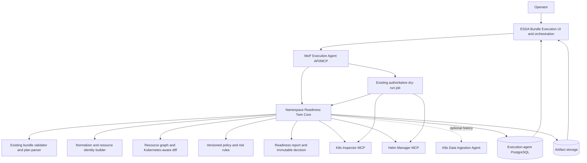
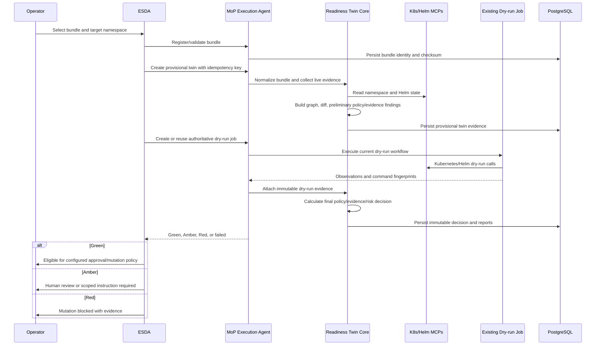
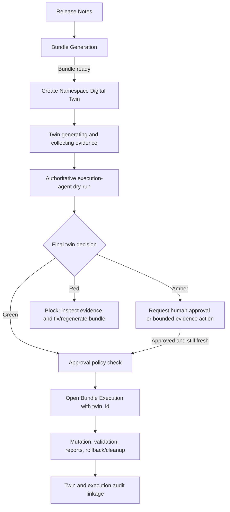
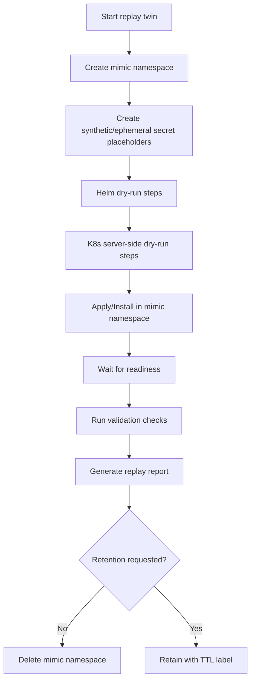
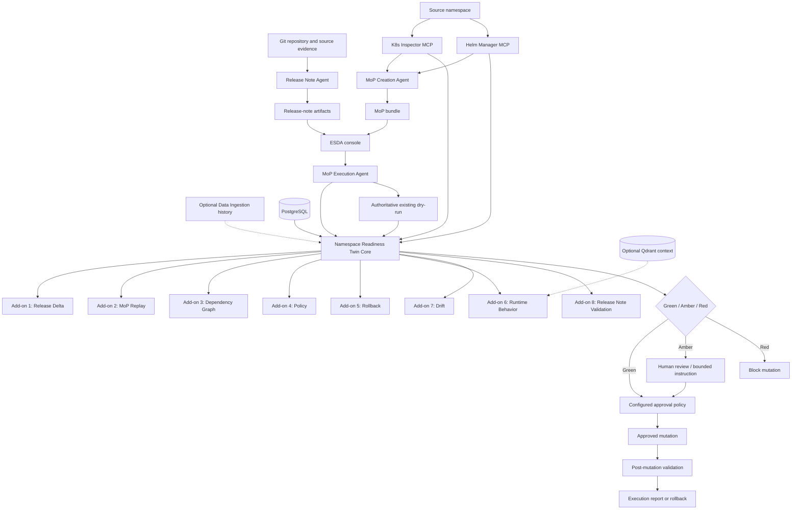
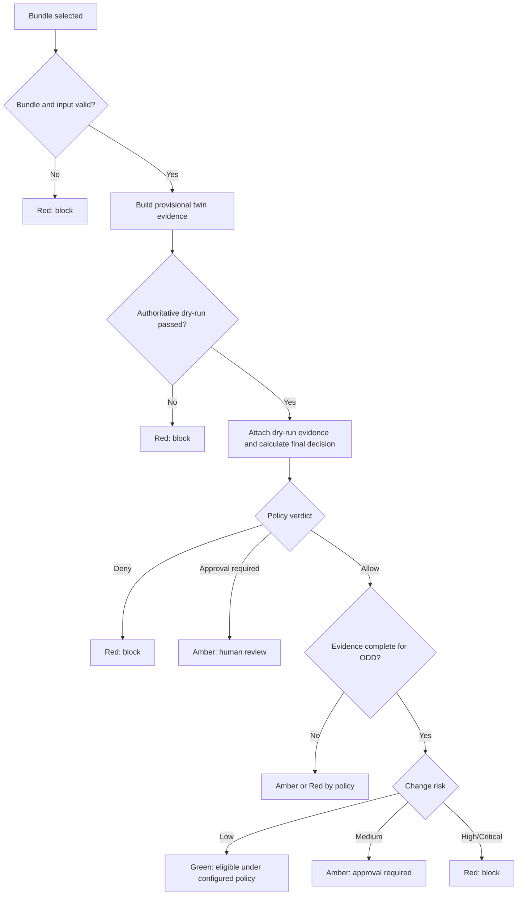

# ESDA Namespace Readiness Twin Design for Conditional L4 Autonomy

**System:** ESDA - Ericsson SRE and DevOps Agent  
**Design target:** Release note -> MoP bundle -> namespace readiness model -> governed recreation/mutation -> Conditional L4 autonomy  
**Baseline recommendation:** Add a mandatory **ESDA Namespace Readiness Twin Core** as the pre-mutation autonomy gate.  
**Add-on model:** Implement the eight broader digital-twin use cases as composable capabilities on top of the baseline.  
**Original date:** 2026-07-01  
**Architecture review:** 2026-07-13, aligned with ESDA v0.2.10 and the current execution-agent/MCP repositories.  
**UX source:** `esda_digital_twin_webpage_implementation_plan.md`, reviewed 2026-07-13.  
**Prepared for:** Avishek Dutta  

---

## 1. Executive decision

### 1.1 Recommendation

Do **not** create a new microservice or a new MCP server for the baseline.

Implement the baseline as:

~~~text
ESDA Bundle Execution UX and orchestration enhancement
        +
MoP Execution Agent namespace_readiness_twin module
        +
small additions to existing K8s Inspector and Helm Manager MCP contracts only when required
~~~

The deterministic twin engine belongs inside **bosgenesis-mop-execution-agent** because that service already owns bundle validation, machine-plan parsing, dependency ordering, namespace locks, idempotency, dry-run, approval, mutation, validation, rollback, cleanup, observations, reports, and audit.

ESDA remains the operator console, reasoning layer, and workflow coordinator. It displays and explains twin evidence, but it must not independently mutate Kubernetes or Helm or override an execution-agent policy decision.

### 1.2 Service-boundary decision

| Question | Decision |
|---|---|
| New microservice for the baseline? | **No.** Add a namespace-readiness-twin domain inside the MoP Execution Agent. |
| New MCP server for the baseline? | **No.** Mirror the twin lifecycle through the existing MoP Execution Agent MCP surface. |
| ESDA-only implementation? | **No.** ESDA owns UX/orchestration; the execution agent owns deterministic evidence and gating. |
| When should a service be extracted? | Only when multi-cluster scale, heavy replay, runtime modeling, or cross-product reuse requires independent deployment and scaling. |
| When should a standalone MCP server be added? | Only when the twin becomes a shared platform capability consumed independently of the execution agent. |

### 1.3 Mandatory baseline

The mandatory baseline is:

> **ESDA Namespace Readiness Twin Core - a deterministic decision model that converts a registered MoP bundle, live namespace evidence, authoritative dry-run evidence, and policy results into a structured readiness report and execution eligibility verdict before real mutation.**

The baseline is not a workload simulator and does not claim to predict controller convergence, traffic behavior, storage binding, image availability, or application health. Those require replay/runtime add-ons and operational evidence.

Baseline lifecycle:

1. Register and checksum the MoP bundle.
2. Validate the bundle and machine_execution_plan.yaml.
3. Normalize planned Kubernetes manifests and Helm inputs.
4. Render a canonical planned-state inventory.
5. Collect a fresh live target-namespace snapshot through existing MCP tools.
6. Build resource identities, dependencies, and the planned-versus-live delta.
7. Run deterministic policy and guardrail checks.
8. Create or reuse the **authoritative existing execution-agent dry-run**.
9. Attach dry-run results and command fingerprints to the twin.
10. Evaluate policy verdict, evidence completeness, and change risk independently.
11. Calculate Green, Amber, or Red eligibility.
12. Emit versioned JSON and Markdown readiness reports.
13. Allow approval/mutation only when the final twin gate and existing execution gates permit it.

### 1.4 Feasibility decision

The design is feasible and reuses substantial existing code. It is nevertheless a major increment rather than a small UI enhancement.

| Area | Current readiness |
|---|---|
| Bundle validation, plan parsing, phase dependency checks | High |
| PostgreSQL jobs/events, idempotency, locks, audit | High |
| Kubernetes server-side dry-run and namespace-scoped tools | High |
| Helm template, dry-run, install/upgrade, rollback evidence | High |
| Approval, mutation, validation, rollback, cleanup, reports | High |
| Manifest canonicalization | Partial |
| Resource-level dependency graph | Partial/new |
| Planned-versus-live diff | New |
| Three-axis readiness decision | New |
| Twin persistence/API/report/UI | New |
| Historical behavior prediction | Future/research-oriented |

### 1.5 Product UX decision

Implement both user surfaces:

1. A dedicated **Digital Twins workspace** for list/search, evidence inspection, graphs, policy, dry-run evidence, rollback, drift, optional replay/runtime intelligence, release-note validation, and audit.
2. A compact **Twin Gate** embedded in the existing Bundle Execution page.

Product boundary:

```text
Digital Twins workspace = inspect, compare, validate, explain, regenerate, approve

Bundle Execution page = consume the immutable twin decision, execute, monitor, validate, rollback
```

The dedicated workspace is the human-facing source of truth for twin evidence. The MoP Execution Agent PostgreSQL records and immutable artifacts remain the technical source of truth. Bundle Execution must never recompute or reinterpret the decision in the browser or ESDA backend.

Primary user flow:

```text
Release Notes
  -> Bundle Generation
  -> Digital Twin generation and inspection
  -> Green / Amber / Red decision
  -> approval when required
  -> Bundle Execution
  -> validation, report, rollback/cleanup
```

---

## 2. Current architecture alignment

### 2.1 Code-verified component roles

| Component | Current capability | Twin responsibility |
|---|---|---|
| bosgenesis-esda | FastAPI console with Bundle Execution APIs/UI, persisted ESDA runs, approvals, audit, model summaries, and external-agent polling. Bundle Execution is not currently one universal LangGraph workflow. | Add the dedicated Digital Twins list/detail workspace and compact Bundle Execution Twin Gate, call/poll twin APIs, persist safe UI events, explain results, and pass immutable twin references into approval/mutation. |
| bosgenesis-mop-execution-agent | Worker/reconciler/API/MCP service with bundle validation, machine-plan parsing, phase graph validation, PostgreSQL persistence, locks, idempotency, dry-run, mutation, validation, rollback, cleanup, reports, and audit. | Own the twin lifecycle, canonical evidence, deterministic decision, report artifacts, and execution-gate enforcement. |
| bosgenesis-k8s-inspector-mcp | Namespace-scoped reads and governed apply/patch/delete/scale operations, including Kubernetes server-side dry-run. Secret access is tightly constrained. | Supply fresh live facts and authoritative Kubernetes dry-run observations. Add a normalized inventory convenience tool only if it materially reduces calls. |
| bosgenesis-helm-manager-mcp | Helm inventory, values/history/status, rendering, dry-run, install/upgrade, rollback, uninstall, and repository operations. | Supply Helm provenance, rendered manifests, dry-run evidence, status/history, and rollback facts. |
| bosgenesis-k8s-data-ingestion-agent | Scheduled/manual scans, normalization, hashing, PostgreSQL and optional sink writes. Its current public latest-scan behavior is limited and historical query APIs are not yet complete. | Optional historical context only. It is not baseline authority and must not block the twin when unavailable. |
| bosgenesis-mop-creation-agent | Produces MoP documents, machine plan, deployment artifacts, generated manifests, values, and bundle metadata. | Supply the canonical input bundle and explicit namespace-rewrite/rollback metadata. |
| PostgreSQL | Authoritative persistence for execution-agent jobs and ESDA workflow records. | Execution-agent PostgreSQL owns detailed twin state; ESDA stores references and safe UI events rather than duplicating all twin facts. |
| Qdrant and Redis | Optional/future for ESDA; not active dependencies in the current ESDA runtime. | May later support retrieval/cache/coordination, but never decision authority or durable truth. |
| OpenTelemetry, SigNoz, Langfuse | Available in parts of the wider platform, not a uniform current ESDA tracing pipeline. | Optional observability integrations after the twin event/audit contract is stable. |

### 2.2 Architectural gap

The existing execution pipeline already validates, dry-runs, approves, mutates, validates, and rolls back. The missing product-level decision object is a canonical record containing:

~~~text
bundle identity and provenance
+ canonical planned namespace state
+ fresh live namespace state
+ resource-level dependency graph
+ explicit planned-versus-live delta
+ policy verdict
+ evidence completeness
+ change risk
+ rollback readiness
+ authoritative dry-run evidence
+ immutable eligibility decision
~~~

The readiness twin consolidates those facts. It must not become a parallel execution engine.

### 2.3 Ownership rule

The MoP Execution Agent owns:

- twin lifecycle and source evidence;
- namespace lock and idempotency;
- policy and risk rule versions;
- authoritative dry-run references and command fingerprints;
- final eligibility decision;
- detailed report artifacts and audit.

ESDA owns:

- operator interaction and current model selection;
- safe summaries and explanations;
- progress rendering and report downloads;
- human approval capture;
- passing immutable twin/dry-run references into execution requests.

---

## 3. Target capability definition

### 3.1 Product terminology

| Area | Name |
|---|---|
| Product feature | **ESDA Namespace Twin** |
| Mandatory baseline module | **Namespace Readiness Twin Core** |
| Baseline report | **ESDA Twin Readiness Report** |
| Runtime/replay extensions | **Namespace Digital Twin Add-ons** |

### 3.2 Definition

The Namespace Readiness Twin is an evidence-backed, point-in-time representation of:

- bundle identity and provenance;
- canonical planned Kubernetes and Helm resources;
- current live namespace resources;
- planned-versus-live changes;
- resource dependencies;
- deterministic policy findings;
- authoritative dry-run results;
- evidence freshness/completeness;
- change and rollback risk.

It is a **decision object**, not a clone and not a predictive simulator. Green means eligible to proceed under the configured ODD; it never means guaranteed safe.

### 3.3 Baseline questions

| Question | Authoritative source |
|---|---|
| What bundle is being executed? | Registered bundle id, checksum, artifact index, schema version. |
| What namespace is targeted? | Job request, namespace policy, rewrite policy, and machine plan. |
| What resources are planned? | Canonicalized manifests, rendered Helm output, and explicit plan steps. |
| What exists now? | Fresh K8s Inspector and Helm Manager observations. |
| What is expected to change? | Kubernetes-aware planned-versus-live diff. |
| What may be deleted? | Explicit machine-plan delete operations only; absence from planned state never implies deletion. |
| Is the bundle and ordering valid? | Existing bundle validator, plan parser, and phase graph checks. |
| Are policies violated? | Versioned execution-agent policy rules and hard-block checks. |
| Will APIs accept the request? | Existing authoritative Kubernetes/Helm dry-run engine. |
| Is evidence complete and fresh? | Evidence contract and freshness thresholds. |
| Is continuation eligible? | Deterministic policy/evidence/risk decision. |
| What supports the decision? | Versioned report, findings, events, tool observations, and hashes. |

### 3.4 Baseline fidelity limits

Dry-run and static comparison cannot prove:

- pods will become Ready;
- images will remain pullable;
- PVCs will bind or contain valid data;
- operators and controllers will converge;
- admission or external services will remain available;
- runtime configuration is semantically correct;
- traffic migration or application-level transactions will succeed.

These unknowns must be represented as evidence gaps. They may result in Amber or Red according to versioned policy; the LLM must not infer success.

---

## 4. Mandatory baseline: ESDA Namespace Readiness Twin Core

### 4.1 Baseline scope

The baseline is the minimum mandatory **readiness evidence and decision gate** for future Bundle Execution workflows. It reuses current execution-agent validation and dry-run capabilities rather than creating a parallel preflight engine.

#### In scope

- Consumes an existing `mop-bundle.zip` or registered artifact reference.
- Reuses the current bundle validator and canonical `machine_execution_plan.yaml` parser.
- Normalizes Kubernetes manifests, Helm inputs, and resource identities.
- Renders Helm charts when chart references and redacted values are available.
- Collects fresh target-namespace state through K8s Inspector and Helm Manager MCP tools.
- Uses the Data Ingestion Agent only as optional historical context.
- Builds a resource graph and a Kubernetes-aware planned-versus-live delta.
- Treats explicit machine-plan delete actions as deletions; absence from planned state never implies deletion.
- Runs deterministic, versioned policy checks and hard-block rules.
- Creates or reuses the existing execution-agent dry-run and attaches its observations and command fingerprints as authoritative evidence.
- Evaluates policy verdict, evidence completeness, and change risk independently.
- Produces a Green, Amber, or Red execution-eligibility decision.
- Produces Markdown and JSON Twin Readiness Reports with hashes and rule versions.
- Persists facts, events, findings, decisions, and artifact references in PostgreSQL and artifact storage.
- Exposes the immutable final twin decision to ESDA and the existing approval/mutation gates.

#### Out of scope for the baseline

- Predictive workload or traffic simulation.
- Full mimic-namespace replay and runtime readiness validation. This is Add-on 2.
- Historical failure prediction. This is Add-on 6.
- Automatic manifest repair by the LLM.
- Direct Kubernetes or Helm mutation from ESDA.
- Secret value reading or copying.
- Production data or PVC content copying.
- Cluster-scoped mutation by default.
- Claiming that dry-run proves controller convergence, pod readiness, storage binding, or application health.

### 4.2 Baseline architecture



### 4.3 Baseline component responsibilities

| Component | Responsibility |
|---|---|
| ESDA Bundle Execution UI | Shows a compact Twin Gate with status, evidence completeness, policy verdict, risk, delta, findings, dry-run evidence, and report downloads. |
| ESDA Bundle Execution routes/service | Creates and polls twin records, starts or observes the existing dry-run, attaches immutable references, persists safe UI events, and enforces UI control state. This does not require converting the current workflow into LangGraph. |
| MoP Execution Agent API/MCP | Owns twin lifecycle endpoints, PostgreSQL state, namespace lock, idempotency, dry-run linkage, report artifacts, and final execution-gate enforcement. |
| Namespace Readiness Twin Core | Normalizes planned/live resources, builds graph/diff, evaluates policy/evidence/risk, consumes authoritative dry-run evidence, and emits a versioned decision. |
| Existing dry-run engine | Remains the only authoritative Kubernetes/Helm dry-run path. The twin consumes its observations and fingerprints instead of reimplementing it. |
| K8s Inspector MCP | Supplies fresh namespace facts and governed Kubernetes server-side dry-run observations. |
| Helm Manager MCP | Supplies release inventory, provenance, rendering, dry-run, status/history, and rollback evidence. |
| Data Ingestion Agent | Supplies optional historical snapshots when available; it is not baseline authority and its absence must be represented explicitly. |
| PostgreSQL | Stores detailed twin state in the execution-agent database. ESDA stores references and safe presentation events. |
| Artifact store | Stores normalized inputs, graph, diff, evidence index, and readiness reports. |
| LLM | Produces safe summaries and operator explanations only; it does not calculate or override eligibility. |

### 4.4 Baseline sequence



### 4.5 Baseline lifecycle and execution integration

The twin has its own lifecycle. Do not add twin phases to the existing execution-job state enumeration; link the two durable state machines with immutable identifiers.

```yaml
namespace_twin_states:
  - requested
  - bundle_validating
  - normalizing
  - snapshot_collecting
  - rendering
  - graph_building
  - diffing
  - policy_checking
  - awaiting_dry_run
  - dry_run_evidence_attached
  - decision_calculating
  - green
  - amber
  - red
  - failed
  - cancelled
```

Durable references:

```yaml
execution_twin_links:
  bundle_id: "string identifier from existing bundle registration"
  twin_id: "twin-* or another stable text identifier"
  dry_run_job_id: "job-* existing dry-run identifier"
  mutation_job_id: "job-* optional later mutation identifier"
  twin_report_hash: "sha256"
  policy_version: "versioned policy bundle"
  risk_rules_version: "versioned deterministic rules"
```

Integration rules:

1. A provisional twin may be created before dry-run to normalize inputs and collect live evidence.
2. Dry-run remains non-mutating and may execute before the final twin decision.
3. The final twin decision must include the exact successful dry-run job, input hash, command-fingerprint hash, and evidence freshness.
4. Mutation must reference the final twin decision and the same unexpired dry-run evidence.
5. Any material input, target namespace, policy version, or command-fingerprint change invalidates the final decision.
6. A stale or superseded twin cannot authorize mutation.

### 4.6 Baseline autonomy decision model

The deterministic decision separates three axes that must not be collapsed into one score.

| Axis | Values | Meaning |
|---|---|---|
| Policy verdict | `allow`, `approval_required`, `deny` | Hard guardrails and policy outcome. |
| Evidence completeness | `complete`, `partial`, `stale`, `unavailable` | Whether required live, provenance, rollback, and dry-run evidence is present and fresh. |
| Change risk | `low`, `medium`, `high`, `critical` | Versioned heuristic risk assessment for the proposed delta. |

Final eligibility:

| Decision | Required conditions | ESDA behavior |
|---|---|---|
| **Green** | Policy allows; evidence satisfies the configured ODD; dry-run passed; risk is within the calibrated Green band. | Mark eligible for the configured approval/mutation policy. Baseline policy may still require human approval. Green is not a guarantee of runtime success. |
| **Amber** | No hard deny, but approval is required, evidence is partial/stale, rollback confidence is insufficient, or risk exceeds the Green band. | Require human review or a bounded external instruction; keep mutation disabled until all required gates pass. |
| **Red** | Policy deny, bundle/input integrity failure, failed authoritative dry-run, Secret exposure, forbidden cluster scope, or critical unmitigated risk. | Block mutation and present evidence-backed remediation guidance. |

The LLM may explain the decision. It may not choose the axes, adjust the score, or override policy.

### 4.7 Versioned baseline risk rules

Start with deterministic rules. Hard blocks are independent of the numeric risk score. The initial weights are hypotheses that require calibration against replayed and real execution outcomes.

```yaml
risk_rules:
  version: "1.2.0"
  feature_toggles:
    pvc_risk_enabled: false
    statefulset_risk_enabled: false
  hard_blocks:
    - secret_values_detected
    - production_data_detected
    - target_namespace_mismatch_without_rewrite_policy
    - forbidden_cluster_scoped_mutation_detected
    - unsupported_resource_kind_in_executable_set
    - authoritative_kubernetes_dry_run_failed
    - authoritative_helm_dry_run_failed
    - policy_engine_denied
    - bundle_checksum_mismatch
    - machine_plan_schema_invalid

  score_rules:
    pvc_create_or_explicit_delete: 30
    statefulset_change: 25
    helm_release_upgrade: 20
    image_change: 15
    configmap_change: 15
    ingress_change: 15
    service_selector_change: 20
    large_replica_change: 10
    missing_rollback_step: 30
    inferred_chart_or_value: 20
    partial_or_stale_live_evidence: 20
    previous_similar_failure: 20
    drift_detected: 25

  thresholds:
    green_max: 30
    amber_min: 31
    amber_max: 70
    red_min: 71
    red_max: 90
    critical_min: 91
```

Decision precedence:

```yaml
decision_precedence:
  policy_deny_or_hard_block: red
  authoritative_dry_run_failed: red
  required_evidence_unavailable: red_or_amber_by_versioned_policy
  policy_requires_approval: amber
  evidence_partial_or_stale: amber
  risk_above_green: amber_or_red_by_threshold
  otherwise: green
```

Every decision records the policy version, risk-rule version, input hash, dry-run job id, command-fingerprint hash, and full rule breakdown. Threshold changes create a new decision version; they never rewrite prior decisions.
### 4.8 Baseline artifact layout

Create an immutable artifact directory for every decision version.

```text
/data/twins/<twin_id>/<decision_version>/
  twin-run.json
  twin-readiness-report.md
  twin-readiness-report.json
  evidence-index.json
  normalized-bundle/
    machine_execution_plan.normalized.yaml
    manifests.normalized/
    helm-values.redacted/
  rendered/
    helm-rendered-manifests.yaml
    kubernetes-rendered-manifests.yaml
  graph/
    resource-graph.json
    dependency-graph.json
    graph-summary.md
  live-state/
    namespace-snapshot.json
    helm-snapshot.json
    data-ingestion-snapshot-ref.json
  validation/
    bundle-validation.json
    schema-validation.json
    dry-run-evidence-ref.json
    policy-findings.json
  diff/
    planned-vs-live-summary.json
    planned-vs-live-detail.json
  decision/
    policy-verdict.json
    evidence-completeness.json
    change-risk.json
    autonomy-decision.json
  audit/
    audit-index.json
```

Artifact rules:

- Store references to the authoritative dry-run artifacts instead of copying or recalculating their facts.
- Hash every decision input and generated report.
- Keep redacted evidence only; never persist Secret values.
- Write new decision versions append-only.

### 4.9 Baseline report structure

The Twin Readiness Report is Markdown and JSON first. PDF is optional and must be rendered from the same immutable structured data.

```text
1. Executive Eligibility Decision
2. Bundle Identity, Input Hash, and Provenance
3. Target Namespace and Operational Design Domain
4. Planned Change Summary
5. Live Evidence Freshness and Completeness
6. Planned Resource Inventory
7. Kubernetes-Aware Planned-vs-Live Delta
8. Explicit Delete Operations
9. Dependency Graph Summary
10. Policy Verdict and Guardrail Findings
11. Authoritative Dry-run Evidence and Command Fingerprints
12. Change Risk and Rule Breakdown
13. Rollback Readiness
14. Human Inputs and Approval Requirements
15. Fidelity Limits and Unproven Runtime Conditions
16. Evidence Matrix
17. Audit, Trace, Policy, and Rule Versions
18. Appendices - Resources, Findings, and Observations
```

### 4.10 Baseline JSON output contract

Existing execution-agent identifiers are strings, not guaranteed UUIDs. The contract therefore treats every cross-service identifier as opaque text.

```json
{
  "schema_version": "1.1",
  "twin_id": "twin-opaque-string",
  "decision_version": 1,
  "run_id": "mopx_opaque_string_or_null",
  "bundle_id": "opaque-string",
  "dry_run_job_id": "job-opaque-string",
  "mutation_job_id": null,
  "correlation_id": "opaque-string",
  "source_namespace": "bosgenesis",
  "target_namespace": "agent-testing",
  "input_hash": "sha256",
  "policy_version": "2026.07.1",
  "risk_rules_version": "1.0.0",
  "created_at": "RFC3339",
  "status": "green|amber|red|failed",
  "decision": {
    "level": "green|amber|red",
    "policy_verdict": "allow|approval_required|deny",
    "evidence_completeness": "complete|partial|stale|unavailable",
    "change_risk": "low|medium|high|critical",
    "risk_score": 25,
    "summary": "Eligible under the configured ODD; runtime success is not guaranteed.",
    "hard_blocks": [],
    "approval_required": true,
    "allowed_next_actions": ["request_approval", "create_mutation_job"],
    "blocked_next_actions": []
  },
  "bundle": {
    "checksum": "sha256",
    "machine_plan_schema_version": "1.0",
    "required_files_present": true,
    "secret_leakage_detected": false
  },
  "evidence": {
    "live_snapshot_source": "k8s_inspector_mcp_and_helm_manager_mcp",
    "captured_at": "RFC3339",
    "freshness_seconds": 18,
    "historical_context": "available|missing|stale",
    "gaps": []
  },
  "delta": {
    "create": 10,
    "update": 7,
    "explicit_delete": 0,
    "no_op": 24,
    "unknown": 0
  },
  "dry_run": {
    "status": "passed|failed|partial|not_supported",
    "job_id": "job-opaque-string",
    "input_hash": "sha256",
    "command_fingerprint_hash": "sha256",
    "failed_steps": 0,
    "evidence_ref": "execution-agent://jobs/<job_id>/observations"
  },
  "reports": {
    "markdown_path": "/data/twins/<twin_id>/1/twin-readiness-report.md",
    "json_path": "/data/twins/<twin_id>/1/twin-readiness-report.json",
    "report_hash": "sha256"
  }
}
```

---

## 5. Required API and MCP additions

### 5.1 Add to `bosgenesis-mop-execution-agent` REST API

| Method | Path | Purpose |
|---|---|---|
| `POST` | `/v1/namespace-twins` | Create or return an idempotent provisional twin for a registered bundle and target namespace. |
| `GET` | `/v1/namespace-twins/{twin_id}` | Return lifecycle state, evidence status, current decision, and artifact references. |
| `GET` | `/v1/namespace-twins/{twin_id}/events` | Return ordered, redacted events with cursor pagination. |
| `POST` | `/v1/namespace-twins/{twin_id}/dry-run-evidence` | Attach a completed existing dry-run job after verifying bundle, target, input hash, and command fingerprints. |
| `GET` | `/v1/namespace-twins/{twin_id}/decision` | Return the immutable current decision version. |
| `GET` | `/v1/namespace-twins/{twin_id}/report` | Download the Markdown or JSON report for a decision version. |
| `GET` | `/v1/namespace-twins/{twin_id}/graph` | Return the resource/dependency graph or summary. |
| `GET` | `/v1/namespace-twins/{twin_id}/diff` | Return Kubernetes-aware planned-versus-live diff. |
| `POST` | `/v1/namespace-twins/{twin_id}/cancel` | Cancel a non-terminal twin run. |

Optional after the polling contract is stable:

| Method | Path | Purpose |
|---|---|---|
| `GET` | `/v1/namespace-twins/{twin_id}/stream` | SSE stream of the same ordered redacted events; polling remains supported. |

Example create request:

```json
{
  "bundle_id": "opaque-string",
  "target_namespace": "agent-testing",
  "requested_by": "operator-id",
  "correlation_id": "opaque-string",
  "idempotency_key": "opaque-string",
  "options": {
    "collect_live_snapshot": true,
    "use_optional_historical_context": true,
    "build_resource_graph": true,
    "generate_markdown_report": true
  }
}
```

API invariants:

- Creation is asynchronous and restart-safe.
- Idempotency uniqueness is scoped to operation, target, and caller/tenant as appropriate.
- The API never launches a second dry-run implementation.
- Dry-run attachment rejects mismatched, stale, failed, or superseded evidence.
- Decision responses include input, report, policy, and risk-rule hashes/versions.
- Terminal decisions are append-only; a material input change creates a new decision version or twin.

### 5.2 ESDA page and gateway API

ESDA exposes page routes and a thin authenticated gateway for the Digital Twins workspace. The gateway may join safe display metadata and translate deployment base paths, but it must proxy execution-agent facts without recalculating decisions, risk, policy, freshness, or eligibility.

Page routes:

| Method | Path | Purpose |
|---|---|---|
| `GET` | `/digital-twins` | Render the searchable Digital Twins list workspace. |
| `GET` | `/digital-twins/{twin_id}` | Render the canonical Digital Twin detail cockpit. |

Gateway routes:

| Method | Path | Purpose |
|---|---|---|
| `GET` | `/api/digital-twins` | List twins with server-side filtering, sorting, and cursor pagination. |
| `POST` | `/api/digital-twins` | Request an idempotent twin through the execution agent. |
| `GET` | `/api/digital-twins/{twin_id}` | Return detail-header state, relationships, actions, and compact overview. |
| `POST` | `/api/digital-twins/{twin_id}/regenerate` | Request a new decision version after a material input or freshness change. |
| `GET` | `/api/digital-twins/{twin_id}/summary` | Return the fast-loading 30-second summary model. |
| `GET` | `/api/digital-twins/{twin_id}/delta` | Return paginated planned-versus-live changes. |
| `GET` | `/api/digital-twins/{twin_id}/graph` | Return graph summary, nodes, edges, and table-alternative data. |
| `GET` | `/api/digital-twins/{twin_id}/policy` | Return policy verdict, findings, codes, and evidence references. |
| `GET` | `/api/digital-twins/{twin_id}/dry-run` | Return references to authoritative existing dry-run evidence and diffs. |
| `GET` | `/api/digital-twins/{twin_id}/rollback` | Return rollback readiness, gaps, and supported actions. |
| `GET` | `/api/digital-twins/{twin_id}/drift` | Return mandatory freshness/baseline drift plus optional richer historical-drift availability. |
| `GET` | `/api/digital-twins/{twin_id}/replay` | Return replay evidence or an explicit `not_run` availability state. |
| `GET` | `/api/digital-twins/{twin_id}/runtime-risk` | Return the rules-first current-health baseline plus optional historical/model-assisted availability. |
| `GET` | `/api/digital-twins/{twin_id}/release-note-validation` | Return release-note coverage evidence or `not_run`. |
| `GET` | `/api/digital-twins/{twin_id}/audit` | Return cursor-paginated, ordered, redacted timeline events. |
| `GET` | `/api/digital-twins/{twin_id}/report` | Download the immutable JSON or Markdown report. |
| `GET` | `/api/digital-twins/{twin_id}/events` | Poll lifecycle and safe progress events. |

Gateway invariants:

- List filters and pagination execute server-side; the browser does not fetch every twin and filter locally.
- Detail tabs load lazily and cache by `twin_id`, `decision_version`, and report/input hash.
- Optional add-ons return a typed availability state such as `not_run`, `running`, `available`, `failed`, or `unsupported` rather than an empty payload.
- Every response carries `twin_id`, `decision_version`, lifecycle status, freshness metadata, and safe action eligibility where relevant.
- Start-execution requests carry the opaque `twin_id`, immutable `decision_version`, and report/input hashes; the execution agent validates them transactionally.
- The browser never constructs a Green, Amber, or Red decision from tab data.
- Authentication, authorization, redaction, and namespace/tenant boundaries match the existing ESDA and execution-agent contracts.

### 5.3 Add to the existing MoP Execution Agent MCP contract

MCP tools mirror the REST domain and do not become a separate source of truth.

| MCP tool | Purpose |
|---|---|
| `mop_execution_create_namespace_twin` | Create or retrieve an idempotent provisional twin. |
| `mop_execution_get_namespace_twin` | Get lifecycle state and safe summary. |
| `mop_execution_attach_twin_dry_run_evidence` | Attach an authoritative existing dry-run job after server-side verification. |
| `mop_execution_get_twin_decision` | Get the immutable eligibility decision. |
| `mop_execution_get_twin_report` | Get report content or artifact references. |
| `mop_execution_get_twin_graph` | Get graph summary or artifact reference. |
| `mop_execution_get_twin_diff` | Get diff summary or artifact reference. |
| `mop_execution_list_twin_events` | Get ordered redacted events for UI replay. |

### 5.4 Potential additions to K8s Inspector MCP

Use current tools first. Add convenience contracts only when measurements show that call volume or normalization inconsistency warrants them.

| Tool | Need | Priority |
|---|---|---|
| `k8s_namespace_inventory` | Return a normalized, namespace-scoped inventory with resourceVersion and capture time. | SHOULD |
| `k8s_resource_diff` | Optional structured one-object comparison after canonicalization. | COULD |
| `k8s_wait_for_condition` | Needed for Add-on 2 runtime replay, not for the baseline readiness model. | ADD-ON |

Kubernetes server-side dry-run already exists in the current governed operation path; do not add a competing authority.

### 5.5 Potential additions to Helm Manager MCP

Use existing release inventory, render, dry-run, install/upgrade, rollback, and uninstall capabilities first.

| Tool | Need | Priority |
|---|---|---|
| `helm_diff_release` | Summarize live release manifest versus canonical rendered plan. | SHOULD |
| `helm_validate_values` | Validate redacted values shape and provenance before rendering. | SHOULD |
| `helm_render_with_provenance` | Return chart digest/version, values hash, and rendered manifest hash. | COULD |

---

## 6. PostgreSQL schema additions

The MoP Execution Agent PostgreSQL database is the detailed source of truth. Existing identifiers such as `job-*`, `mopx_*`, and bundle identifiers are opaque strings, so all cross-domain identifiers use `TEXT`, not `UUID`. ESDA stores twin references and safe UI events rather than copying detailed evidence.

The SQL below is an implementation sketch. It must be converted into the repository's migration conventions, constraints, and timestamp helpers.

### 6.1 `namespace_twin_runs`

```sql
CREATE TABLE namespace_twin_runs (
    twin_id TEXT PRIMARY KEY,
    run_id TEXT,
    bundle_id TEXT NOT NULL,
    dry_run_job_id TEXT,
    mutation_job_id TEXT,
    correlation_id TEXT NOT NULL,
    source_namespace TEXT,
    target_namespace TEXT NOT NULL,
    status TEXT NOT NULL,
    policy_verdict TEXT,
    evidence_completeness TEXT,
    change_risk TEXT,
    decision_level TEXT,
    risk_score NUMERIC,
    input_hash TEXT NOT NULL,
    policy_version TEXT NOT NULL,
    risk_rules_version TEXT NOT NULL,
    created_by TEXT,
    idempotency_scope TEXT NOT NULL,
    idempotency_key TEXT NOT NULL,
    artifact_root TEXT,
    created_at TIMESTAMPTZ NOT NULL DEFAULT now(),
    started_at TIMESTAMPTZ,
    completed_at TIMESTAMPTZ,
    updated_at TIMESTAMPTZ NOT NULL DEFAULT now(),
    UNIQUE (idempotency_scope, idempotency_key)
);

CREATE INDEX idx_namespace_twin_runs_bundle ON namespace_twin_runs(bundle_id);
CREATE INDEX idx_namespace_twin_runs_target_status ON namespace_twin_runs(target_namespace, status);
CREATE INDEX idx_namespace_twin_runs_dry_run ON namespace_twin_runs(dry_run_job_id);
```

### 6.2 `namespace_twin_events`

```sql
CREATE TABLE namespace_twin_events (
    event_id TEXT PRIMARY KEY,
    twin_id TEXT NOT NULL REFERENCES namespace_twin_runs(twin_id) ON DELETE CASCADE,
    sequence_no BIGINT NOT NULL,
    event_type TEXT NOT NULL,
    phase TEXT NOT NULL,
    status TEXT NOT NULL,
    summary TEXT,
    payload_json JSONB,
    redaction_status TEXT NOT NULL DEFAULT 'redacted',
    created_at TIMESTAMPTZ NOT NULL DEFAULT now(),
    UNIQUE (twin_id, sequence_no)
);
```

### 6.3 `namespace_twin_resources`

```sql
CREATE TABLE namespace_twin_resources (
    resource_id TEXT PRIMARY KEY,
    twin_id TEXT NOT NULL REFERENCES namespace_twin_runs(twin_id) ON DELETE CASCADE,
    source TEXT NOT NULL,
    api_version TEXT,
    kind TEXT NOT NULL,
    namespace TEXT,
    name TEXT NOT NULL,
    identity_hash TEXT NOT NULL,
    canonical_spec_hash TEXT,
    owner_identity TEXT,
    helm_release TEXT,
    file_ref TEXT,
    captured_at TIMESTAMPTZ,
    summary_json JSONB,
    created_at TIMESTAMPTZ NOT NULL DEFAULT now(),
    UNIQUE (twin_id, source, identity_hash)
);

CREATE INDEX idx_namespace_twin_resources_identity
    ON namespace_twin_resources(twin_id, kind, namespace, name);
```

Allowed `source` values include `planned`, `live`, `rendered`, and `dry_run_observation`. Raw Secret values are forbidden in `summary_json`.

### 6.4 `namespace_twin_edges`

```sql
CREATE TABLE namespace_twin_edges (
    edge_id TEXT PRIMARY KEY,
    twin_id TEXT NOT NULL REFERENCES namespace_twin_runs(twin_id) ON DELETE CASCADE,
    from_resource_id TEXT REFERENCES namespace_twin_resources(resource_id) ON DELETE CASCADE,
    to_resource_id TEXT REFERENCES namespace_twin_resources(resource_id) ON DELETE CASCADE,
    edge_type TEXT NOT NULL,
    confidence TEXT NOT NULL DEFAULT 'observed',
    evidence_ref TEXT,
    created_at TIMESTAMPTZ NOT NULL DEFAULT now()
);
```

Common edge types:

```yaml
edge_types:
  - owns
  - helm_manages
  - selects_pods
  - mounts_configmap
  - references_secret_name_only
  - mounts_pvc
  - routes_to_service
  - depends_on_phase
  - validates
  - rollback_of
```

### 6.5 `namespace_twin_findings`

```sql
CREATE TABLE namespace_twin_findings (
    finding_id TEXT PRIMARY KEY,
    twin_id TEXT NOT NULL REFERENCES namespace_twin_runs(twin_id) ON DELETE CASCADE,
    category TEXT NOT NULL,
    severity TEXT NOT NULL,
    code TEXT NOT NULL,
    title TEXT NOT NULL,
    detail TEXT,
    resource_identity TEXT,
    phase_id TEXT,
    step_id TEXT,
    evidence_ref TEXT,
    created_at TIMESTAMPTZ NOT NULL DEFAULT now()
);

CREATE INDEX idx_namespace_twin_findings_severity
    ON namespace_twin_findings(twin_id, severity, code);
```

### 6.6 `namespace_twin_decisions`

```sql
CREATE TABLE namespace_twin_decisions (
    decision_id TEXT PRIMARY KEY,
    twin_id TEXT NOT NULL REFERENCES namespace_twin_runs(twin_id) ON DELETE CASCADE,
    decision_version INTEGER NOT NULL,
    level TEXT NOT NULL,
    policy_verdict TEXT NOT NULL,
    evidence_completeness TEXT NOT NULL,
    change_risk TEXT NOT NULL,
    risk_score NUMERIC NOT NULL,
    summary TEXT NOT NULL,
    approval_required BOOLEAN NOT NULL DEFAULT true,
    allowed_next_actions JSONB NOT NULL DEFAULT '[]'::jsonb,
    blocked_next_actions JSONB NOT NULL DEFAULT '[]'::jsonb,
    hard_blocks JSONB NOT NULL DEFAULT '[]'::jsonb,
    score_breakdown JSONB NOT NULL DEFAULT '{}'::jsonb,
    input_hash TEXT NOT NULL,
    dry_run_job_id TEXT NOT NULL,
    command_fingerprint_hash TEXT NOT NULL,
    policy_version TEXT NOT NULL,
    risk_rules_version TEXT NOT NULL,
    report_hash TEXT NOT NULL,
    expires_at TIMESTAMPTZ,
    superseded_at TIMESTAMPTZ,
    created_at TIMESTAMPTZ NOT NULL DEFAULT now(),
    UNIQUE (twin_id, decision_version)
);
```

### 6.7 Persistence invariants

- Event sequence numbers are monotonic per twin.
- Terminal decisions and their reports are append-only.
- Only one non-superseded decision may authorize mutation for a twin.
- Evidence payloads pass the same redaction policy as execution observations.
- A mutation request validates target namespace, bundle/input hash, dry-run job, fingerprints, decision expiry, and policy/rule versions transactionally.
- Cleanup and retention policies remove dependent rows and artifacts consistently while preserving required audit references.

---

## 7. ESDA Digital Twins workspace and workflow

### 7.1 Navigation and route strategy

Add **Digital Twins** as a top-level navigation item between **Bundle Generation** and **Bundle Execution**, matching the intended workflow.

Recommended navigation order:

```text
LLM Chat
Health Check
Release Notes
Bundle Generation
Digital Twins
Bundle Execution
Environment Chat
Activity
Approvals
L4 Audit
```

Use the current ESDA root-route convention:

```text
/digital-twins
/digital-twins/{twin_id}
```

When ESDA is deployed under an `/esda` ingress or application base path, the externally visible URLs become:

```text
/esda/digital-twins
/esda/digital-twins/{twin_id}
```

Do not hard-code `/esda` into backend route definitions. Generate links from the configured application base URL.

Supported deep links:

```text
/digital-twins/{twin_id}?tab=overview
/digital-twins/{twin_id}?tab=release-delta
/digital-twins/{twin_id}?tab=dependency-graph&resource=<identity>
/digital-twins/{twin_id}?tab=policy&finding=<finding_id>
/digital-twins/{twin_id}?tab=dry-run
/digital-twins/{twin_id}?tab=audit&event=<event_id>
/mop-execution?twin_id=<twin_id>
/approvals?twin_id=<twin_id>
/activity?workflow=namespace_twin&twin_id=<twin_id>
```

### 7.2 Page responsibility split

| Surface | Operator purpose | Technical behavior |
|---|---|---|
| Digital Twins list | Discover, filter, compare, reopen, regenerate, and continue prior twin runs. | Reads summary projections and never loads full evidence for every row. |
| Digital Twin detail | Inspect all evidence, understand the decision, download reports, request approval, and move to execution. | Reads immutable twin artifacts and invokes explicit lifecycle actions. |
| Bundle Execution Twin Gate | Make a quick execute/approve/block decision and open the full cockpit when needed. | Consumes the exact backend decision; it never recomputes risk or policy. |
| Approvals | Review an Amber or policy-required Green decision. | Links to the exact twin decision version and evidence. |
| Activity/L4 Audit | Review cross-workflow history and governance. | Links back to the immutable twin and execution records. |

Product rule:

```text
Digital Twin detail = full evidence cockpit
Bundle Execution = compact control surface
```

### 7.3 End-to-end user journey



User behavior:

1. After Bundle Generation succeeds, the artifact panel exposes **Generate Digital Twin**.
2. ESDA creates an idempotent provisional twin and redirects to its detail page.
3. The detail page immediately renders the shell, summary state, and live generation progress.
4. Evidence tabs become available as their artifacts are produced.
5. The existing execution-agent dry-run is created or reused and linked to the twin.
6. The final decision appears without replacing or losing completed evidence.
7. Green offers the next action permitted by policy; baseline Green usually offers approval or controlled execution.
8. Amber offers **Request Approval** or the exact bounded evidence/remediation action.
9. Red offers **Open Findings**, **Open Bundle**, and **Regenerate Twin**; execution remains disabled.
10. **Start Bundle Execution** navigates with the immutable `twin_id`; the backend revalidates all hashes and freshness before mutation.
11. Execution and final reports link back to the twin detail and audit timeline.

### 7.4 Digital Twins list page

Route: `/digital-twins`

#### Layout

```text
Page header
  Digital Twins
  Generate Twin action
  active/Green/Amber/Red/stale summary counters

Filter bar
  search
  decision
  lifecycle status
  freshness
  target cluster
  target namespace
  bundle/release
  created by
  created date
  linked execution

Dense results table
  Twin Run / display name
  Decision
  Risk
  Lifecycle
  Freshness
  Target cluster / namespace
  Bundle / release
  Created by / time
  Linked execution
  Actions

Cursor pagination / result count
```

#### Row behavior

- Clicking the identity or row opens the detail page.
- Green, Amber, Red, Stale, Failed, and Running use distinct accessible badges and text labels.
- Risk shows level plus score; color alone is never the only signal.
- Active rows refresh on a bounded interval without reloading the whole table.
- Terminal rows remain static until an explicit refresh.
- Filter and sort state is encoded in the URL so browser Back restores the same view.
- Search covers twin ID, generated display name, bundle ID, release, namespace, and linked execution ID.
- Server-side filtering and cursor pagination are required; the page must not fetch every twin artifact.

#### Row actions

```text
Open
Regenerate
Download Report
Open Bundle
Open Execution
Request Approval, when applicable
```

Regeneration always creates a new `twin_id`. The prior run remains visible and immutable, with a `superseded_by` link when appropriate.

#### Empty and error states

- No results: show a concise empty state with **Generate Digital Twin**.
- Filtered empty state: show **Clear Filters**.
- API failure: retain the current rows, show a retryable status, and do not replace the table with a blank page.
- Unauthorized result: display a scoped access message without leaking twin metadata.

### 7.5 Digital Twin detail shell

Route: `/digital-twins/{twin_id}`

The page is a safety cockpit using the established ESDA matte-glass theme. It is operational and information-dense, not a marketing page.

```text
Header
  Digital Twin: <release or bundle> -> <target namespace>
  lifecycle badge
  final decision badge
  risk level and score
  autonomy eligibility
  primary actions

Sticky summary bar
  target cluster
  target namespace
  bundle ID and hash
  twin ID and decision version
  release version
  created by / created at / updated at
  evidence freshness
  linked dry-run job
  linked approval
  linked execution

Horizontally scrollable tab bar
  Overview
  Release Delta Twin
  Dependency Graph Twin
  Policy Twin
  Dry-run / Diff Twin
  Rollback Twin
  Drift Twin
  MoP Replay Twin
  Runtime Behavior Twin
  Release Note Validation Twin
  Audit Timeline

Tab content
  summary band
  filters/actions
  evidence visualization/table/logs
  finding detail drawer or modal
```

The sticky summary remains below the application header and never obscures tab content. On narrow screens it becomes a two-row summary with a **More details** disclosure.

### 7.6 Header actions and state-dependent controls

Possible actions:

```text
Generate Twin
Regenerate Twin
Open MoP Bundle
Open Execution
Start Bundle Execution
Request Approval
Open Approval
Approve / Reject, only on authorized approval surface
Download Report
Export Evidence JSON
Cancel Generation
```

| State | Primary action | Secondary actions | Disabled behavior |
|---|---|---|---|
| Not created | Generate Twin | Open Bundle | Execution unavailable. |
| Running | View Live Progress | Cancel if supported, Open Bundle | Start Execution and Regenerate disabled. |
| Green/Fresh | Start Bundle Execution or Request Approval according to policy | Download, Export, Open Bundle | None beyond policy. |
| Amber/Fresh | Request Approval | Download, Open Findings, Regenerate | Start Execution disabled until valid approval. |
| Red | Open Blocking Findings | Open Bundle, Regenerate, Download | Approval and execution disabled. |
| Stale/Drifted | Regenerate Twin | Compare Drift, Download old report | Approval and execution disabled. |
| Failed | Retry or Regenerate | Open Audit, Download completed evidence | Execution disabled. |
| Used/Archived | Open Execution | Download, Export Audit | Mutation actions disabled. |
| Superseded/Expired | Open Current Twin | Download historical report | All continuation actions disabled. |

### 7.7 Lifecycle projection and visible state

The browser must not invent a second state machine. It projects the execution-agent twin lifecycle into operator-friendly labels.

| Backend state | Visible lifecycle | Visible decision |
|---|---|---|
| `requested`, `bundle_validating` | Preparing | Pending |
| `normalizing`, `snapshot_collecting`, `rendering` | Generating | Pending |
| `graph_building`, `diffing`, `policy_checking` | Analyzing | Preliminary only |
| `awaiting_dry_run` | Waiting for Dry-run | Pending |
| `dry_run_evidence_attached`, `decision_calculating` | Finalizing | Pending |
| `green` | Ready | Green |
| `amber` | Review Required | Amber |
| `red` | Blocked | Red |
| `failed` | Failed | No decision or last valid historical decision |
| `cancelled` | Cancelled | No decision |

Freshness is a separate dimension:

```text
Fresh
Approaching expiry
Stale
Drifted
Superseded
```

Approval and execution linkage are also separate dimensions. UI labels such as `APPROVED`, `USED FOR EXECUTION`, and `ARCHIVED` are relationship/status projections and must not overwrite the immutable Green/Amber/Red decision.

### 7.8 Tab contract

All detail pages expose the same 11 tabs in the same order. Baseline tabs load real evidence. Add-on tabs remain visible as `Not Run` or `Not Available` until enabled; blank panels are not allowed.

| Tab | Baseline availability | Decision contribution |
|---|---|---|
| Overview | Mandatory | Projection of all current evidence. |
| Release Delta Twin | Mandatory | Policy and change-risk input. |
| Dependency Graph Twin | Basic baseline, richer post-baseline | Evidence/risk input when available. |
| Policy Twin | Mandatory | Policy verdict authority. |
| Dry-run / Diff Twin | Mandatory | Authoritative dry-run evidence. |
| Rollback Twin | Mandatory baseline analysis | Evidence/risk input. |
| Drift Twin | Mandatory freshness check | Invalidates or changes eligibility. |
| MoP Replay Twin | Optional add-on | Additional evidence only when run. |
| Runtime Behavior Twin | Optional/rules-first | Risk input, never sole authority. |
| Release Note Validation Twin | Optional add-on | Documentation/evidence warning input. |
| Audit Timeline | Mandatory | Traceability, not decision calculation. |

Tab selection is represented in `?tab=<slug>`. Reload and browser Back preserve the selected tab.

### 7.9 Overview tab

Purpose: let the operator understand the twin in 30 seconds without downloading all evidence.

Show:

```text
Decision
Policy verdict
Evidence completeness and freshness
Change risk and score
Autonomy eligibility
Dry-run status
Rollback confidence
Drift status
Replay status
Runtime risk
Release-note validation status
Top 3-5 reasons
Blocking findings
Warnings
Missing evidence
Recommended next action
```

Behavior:

- Load the summary eagerly with the page shell.
- Do not fetch full graph, logs, or manifests.
- Each summary card links to its corresponding tab.
- Preliminary values while running are labeled `Preliminary` and never shown as final Green/Amber/Red.
- A final decision update animates once without continuous flashing.

### 7.10 Release Delta Twin tab

Purpose: answer **What exactly will change?**

Table columns:

```text
Resource
Kind
Namespace
Action
Current summary
Planned summary
Risk
Reason
Evidence source
```

Behavior:

- Filter by action, risk, kind, namespace, Helm release, and finding status.
- Support create, update, explicit delete, no-op, unknown, immutable conflict, and namespace rewrite.
- Open a side-by-side canonical YAML diff for a selected resource.
- Highlight PVC/storage, RBAC, cluster scope, privileged settings, selectors, routes, probes, images, and resource-limit changes.
- Redact Secret values and sensitive environment values.
- Display `missing_planned_resource` as unmanaged/unknown unless the machine plan explicitly deletes it.
- Provide download of the structured delta and canonical redacted manifests.

### 7.11 Dependency Graph Twin tab

Purpose: show structural relationships and missing dependencies.

Behavior:

- Render nodes and edges from backend JSON; the browser does not infer dependencies.
- Use pan, zoom, fit-to-view, and reset controls.
- Filter by kind, namespace, risk, edge type, Helm release, and missing dependencies.
- Click a node to open an unframed detail drawer with provenance, findings, incoming/outgoing edges, and canonical resource links.
- Show missing dependencies as Red, warning/uncertain relationships as Amber, and valid relationships as neutral/Green with text labels.
- Surface ConfigMap, Secret-name, PVC, Service, Ingress, CRD/custom resource, ServiceAccount, RoleBinding, owner, Helm, and plan-phase relationships.
- Provide an accessible tabular graph alternative.

### 7.12 Policy Twin tab

Purpose: prove whether ESDA is allowed to continue inside its ODD.

Group results by:

```text
namespace boundary
cluster scope
RBAC
Secret handling
privileged and host access
PVC/data safety
resource quotas
image policy
approval policy
bundle/dry-run/freshness integrity
```

Behavior:

- Show Passed, Warning, Approval Required, Denied, and Not Applicable.
- Show severity, stable policy code, plain-language explanation, policy version, affected resources, and evidence links.
- Denied findings visibly explain why the final decision is Red.
- Policy results become immutable with the final decision version.
- Provide JSON export; the UI never attempts to reevaluate policy.

### 7.13 Dry-run / Diff Twin tab

Purpose: show what the Kubernetes API server and Helm tooling accepted or rejected.

Show:

```text
bundle/schema validation
Helm render/lint evidence when available
Helm dry-run evidence
Kubernetes server-side dry-run evidence
accepted and rejected resources
command fingerprint hash
linked dry-run job
structured diff
redacted observations and logs
fidelity limitations
```

Behavior:

- Consume the existing authoritative execution-agent dry-run; do not launch tab-specific duplicate dry-runs.
- Search and filter observations by phase, step, resource, tool, and outcome.
- Open selected rejection details with the safe request identity and redacted response.
- Link every result to bundle hash, input hash, target namespace, snapshot capture, and command fingerprints.
- Download rendered manifests, structured diff, and dry-run evidence when authorized.
- Always display that dry-run does not prove scheduling, image pulls, storage binding, controller convergence, probes, traffic, or application health.

### 7.14 Rollback Twin tab

Purpose: show whether recovery is understood and sufficiently bounded.

Show:

```text
rollback confidence
previous Helm revision and provenance
previous manifests/values availability
rollback machine-plan steps
PVC and data reversibility
non-reversible changes
rollback dry-run/replay status when available
manual steps
post-rollback validation checks
```

Behavior:

- Highlight PVC/data risks prominently.
- Distinguish High, Medium, Low, and Unavailable confidence.
- Link each confidence factor to evidence.
- Mark unproven runtime rollback as an evidence gap.
- Offer **Open Bundle Rollback Plan**, never an unapproved direct mutation button.

### 7.15 Drift Twin tab

Purpose: show whether the target changed after twin evidence was captured.

Show:

```text
snapshot capture time and hash
current capture time and hash
freshness threshold
none/minor/major/critical drift
resource-level changes
Helm revision drift
manual patch indicators
health/readiness changes
```

Behavior:

- Refreshing Drift performs a read-only current-state comparison.
- Critical or policy-defined major drift disables approval/execution.
- **Regenerate Twin** creates a new twin and preserves the old one.
- Status-only pod churn may be classified as minor according to versioned rules.
- Spec, policy-boundary, release, target, or safety-control changes are never hidden as ordinary churn.

### 7.16 MoP Replay Twin tab

Purpose: rehearse the MoP in a mimic namespace or ephemeral cluster.

Initial state: `Not Run`.

Behavior when enabled:

- Show Run Replay only to authorized users.
- Explain target isolation, synthetic Secret strategy, timeouts, retention, and cleanup before starting.
- Show replay timeline, Helm hooks, readiness, init containers, PVC binding, Service checks, smoke tests, logs, and cleanup result.
- Never copy production Secret values or production data.
- A replay result adds a new evidence/decision version; it never rewrites an older final decision.

### 7.17 Runtime Behavior Twin tab

Purpose: show current and historical risk signals.

Initial baseline: rule-based and explainable; no ML requirement.

Show:

```text
current namespace health
not-ready/restarting pods
recent event anomalies
resource pressure
similar prior bundle/change outcomes
image/chart failure history
rules-only or model-assisted label
risk factors and confidence
```

Behavior:

- Every factor links to a safe observation or historical record.
- Model-assisted output may influence change risk only.
- Runtime behavior can never independently approve execution.
- Missing historical APIs display `Not Available`, not healthy/no-risk.

### 7.18 Release Note Validation Twin tab

Purpose: compare release-note claims with deterministic bundle and delta evidence.

Behavior:

- Show extracted claims, supported evidence, unsupported claims, and missing operational notes.
- Check images, configuration, migration, PVC/storage, RBAC, routes, rollback, breaking changes, and known risks.
- Permit the LLM to summarize or classify claims, while manifest/delta evidence remains authoritative.
- Show Passed, Warning, Failed, or Not Run.
- Suggested corrections are copyable but do not overwrite release-note artifacts automatically.

### 7.19 Audit Timeline tab

Purpose: provide the complete append-only evidence and decision history.

Behavior:

- Show chronological events with actor, timestamp, phase, status, safe summary, and evidence link.
- Distinguish system, operator, approver, ESDA, execution agent, and MCP tool actors.
- Include creation, bundle validation, snapshots, graph/diff/policy, dry-run link, decisions, regeneration/supersession, approval, execution, validation, rollback/cleanup, reports, and archive events.
- Support event-type/actor/status filters and audit export.
- Deep-link to a specific event using `?tab=audit&event=<event_id>`.
- Never render hidden chain-of-thought or unredacted payloads.

### 7.20 Compact Twin Gate in Bundle Execution

Do not duplicate the cockpit tabs in `/mop-execution`.

The embedded panel shows:

```text
Twin identity and decision version
Green / Amber / Red
Policy verdict
Evidence completeness/freshness
Change risk and score
Top three reasons
Dry-run status
Rollback confidence
Drift status
Approval requirement
Open Full Digital Twin
Regenerate Twin
```

Decision behavior:

| Gate state | Bundle Execution behavior |
|---|---|
| No twin | Disable mutation; show **Generate Digital Twin**. |
| Running | Disable mutation; show progress and **Open Twin**. |
| Green/Fresh | Enable the next action permitted by approval policy. |
| Amber/Fresh without approval | Disable mutation; show **Request Approval**. |
| Amber/Fresh with valid approval | Enable bounded mutation after backend revalidation. |
| Red | Disable approval and mutation; show blockers and **Open Twin**. |
| Stale/Drifted/Superseded | Disable continuation; show **Regenerate Twin**. |
| Failed | Disable continuation; preserve technical error and completed evidence links. |

The backend, not JavaScript, validates the twin before execution. The panel consumes:

```text
twin_id
decision_version
decision
policy_verdict
evidence_completeness
change_risk
risk_score
top_reasons
dry_run_job_id
rollback_confidence
freshness_status
approval_requirement
report_hash
```

### 7.21 Orchestration and relationship rules

A twin run is an analysis. An execution run is a mutation workflow. They remain independently addressable.

```text
bundle_id -> twin_id -> dry_run_job_id -> optional approval_id -> mutation_job_id
```

Rules:

- A twin may exist before a mutation execution run.
- The authoritative dry-run job may be linked to the twin without creating a mutation job.
- A mutation execution references one exact final twin decision version.
- A twin may be used for at most the scope permitted by policy; reuse across changed target, input, or evidence is rejected.
- Regeneration creates a new twin and supersession link.
- Execution, Approval, Activity, and L4 Audit pages deep-link to the same twin.
- Bundle Execution does not calculate its own risk or policy result.

### 7.22 Data loading, live updates, and restoration

- Load page shell and summary first.
- Lazy-load each tab on first activation.
- Cache tab responses using artifact/report hashes or ETags.
- Poll only while the twin or selected add-on is non-terminal.
- Stop polling after terminal state, cancellation, or navigation away.
- Use ordered event cursors so refresh does not duplicate events.
- Restore selected tab, scroll position where practical, filters, and expanded finding from the URL/session state.
- Keep final summaries and artifacts durable in PostgreSQL/artifact storage.
- Keep ephemeral working notes in memory/page connection only.
- On reconnect, render persisted safe events and resume from the last event cursor.
- Never require the UI to parse raw logs to determine status or decision.

### 7.23 Theme, responsiveness, and accessibility

- Reuse the current ESDA page background, matte glass panels, typography, button treatment, model selector, and profile menu.
- Use the existing animated sphere only for active twin generation/finalization status, then reduce it to a compact status visual; evidence tabs remain work-focused.
- Keep cards at 8px radius or less and avoid nested decorative cards.
- Use icons for refresh, download, export, fit graph, copy, and expand actions with tooltips.
- Keep the sticky summary below the global navigation with correct z-index.
- Make tabs horizontally scrollable on narrow screens.
- Make tables horizontally scrollable without moving the whole page.
- Provide a table alternative for dependency graph content.
- Support keyboard tab navigation, visible focus, accessible names, and non-color status labels.
- Respect reduced-motion settings and stop nonessential animation in terminal states.
- Ensure modals are scrollable, dismissible, above the navigation, and never trap an unreachable close action.

### 7.24 Safe reasoning and explanation behavior

The selected model may explain structured evidence in operator language:

```text
Eligibility is Amber. The authoritative dry-run passed, but the release changes a PVC and rollback confidence is medium. Human approval is required before Bundle Execution can continue.
```

The UI distinguishes:

- ephemeral live working summaries, not persisted;
- persisted safe summaries;
- deterministic findings and decision facts;
- formatted redacted agent/tool JSON in an expanded evidence view.

The model must not expose hidden chain-of-thought, invent evidence, approve changes, adjust risk/policy fields, or emit out-of-plan mutation instructions.

### 7.25 UX acceptance criteria

- The operator can find and reopen old twin runs from the primary navigation.
- The operator understands the final decision and next action within 30 seconds.
- Every detail page exposes the same 11 tabs in the same order.
- Optional tabs show `Not Run` or `Not Available`, never blank content.
- List filters, detail tab, and deep links survive refresh and browser navigation.
- Final decision and execution controls always match backend state.
- Full evidence is one click from Bundle Execution.
- Regeneration creates a new twin and preserves old evidence.
- Red, stale, drifted, expired, and superseded twins cannot enable mutation.
- Amber requires valid approval or the exact policy-defined bounded action.
- Green follows the configured approval policy and does not imply guaranteed success.
- No Secret values or hidden reasoning appear in any tab, export, or audit event.
- Desktop and mobile layouts meet accessibility and no-overlap checks.

---
## 8. Add-on capability catalog

The eight digital-twin use-cases should be implemented as add-ons on top of Namespace Readiness Twin Core.

| Add-on | Digital twin use-case | Baseline dependency | Recommended delivery wave | Service owner |
|---:|---|---|---|---|
| 1 | Release delta twin | Namespace Readiness Twin Core planned/live model | Post-baseline Wave 1 | MoP Execution Agent + ESDA UI |
| 2 | MoP replay twin | Namespace Readiness Twin Core + namespace creation/wait tools | Post-baseline Wave 2 | MoP Execution Agent, K8s Inspector MCP, Helm Manager MCP |
| 3 | Dependency graph twin | Namespace Readiness Twin Core resource graph | Post-baseline Wave 1 | MoP Execution Agent |
| 4 | Policy twin | Namespace Readiness Twin Core policy engine | Post-baseline Wave 1 | MoP Execution Agent, optional Gatekeeper/OPA integration |
| 5 | Rollback twin | Namespace Readiness Twin Core + Helm history + plan rollback metadata | Post-baseline Wave 2 | MoP Execution Agent + Helm Manager MCP |
| 6 | Runtime behavior twin | Namespace Readiness Twin Core + historical observations | Post-baseline Wave 3 | Data Ingestion Agent + optional future Twin service |
| 7 | Drift twin | Namespace Readiness Twin Core live/planned comparison | Post-baseline Wave 1 | Data Ingestion Agent + MoP Execution Agent |
| 8 | Release note validation twin | Release Note Agent + MoP Creation + Namespace Readiness Twin Core | Post-baseline Wave 3 | ESDA + Release Note Agent + MoP Creation Agent |

---

## 9. Add-on 1: Release Delta Twin

### 9.1 Purpose

Compare the current namespace with the new release bundle before execution.

This add-on upgrades the baseline diff from a summary into a detailed change-intelligence module.

### 9.2 What ESDA would do

- Compare current namespace vs new release bundle.
- Detect image changes, chart changes, CRD/RBAC references, Service/Ingress changes, PVC changes, ConfigMap changes, env var changes, replica changes, resource-limit changes, and probe changes.
- Produce a release delta report that is readable by both humans and agents.

### 9.3 Why it helps L4 autonomy

Conditional L4 requires ESDA to know what will change before touching the real namespace. A release delta twin turns the opaque MoP bundle into a deterministic change set.

### 9.4 Inputs

```yaml
inputs:
  - twin_id
  - bundle_id
  - target_namespace
  - live_namespace_snapshot
  - rendered_planned_manifests
  - helm_release_history
  - machine_execution_plan
```

### 9.5 Processing

```text
1. Build identity map: apiVersion/kind/namespace/name.
2. Compare planned resources vs live resources.
3. Normalize volatile fields away.
4. Calculate diff category per resource.
5. Extract high-risk field changes.
6. Attach evidence refs.
7. Score diff risk.
8. Generate release-delta report section.
```

### 9.6 Diff categories

```yaml
diff_categories:
  - create
  - update
  - delete
  - no_op
  - recreate_required
  - immutable_field_conflict
  - namespace_rewrite
  - missing_live_resource
  - missing_planned_resource
  - policy_blocked
  - unknown
```

`missing_planned_resource` means unmanaged or unknown unless the machine plan contains an explicit delete operation. It must never be silently promoted to `delete`.

### 9.7 High-risk field detectors

| Field/change | Risk behavior |
|---|---|
| Container image tag/digest changed | Record image delta. |
| ConfigMap data changed | Record config delta; redact values. |
| Secret reference changed | Record name/key reference only, never value. |
| PVC storage class/size/access mode changed | Amber or Red depending on policy. |
| Service selector changed | Amber because traffic routing may break. |
| Ingress host/path changed | Amber because external route changes. |
| Probe changed | Warning or Amber depending on workload. |
| Resources requests/limits changed | Warning. |
| StatefulSet volumeClaimTemplates changed | Usually Red/approval-required. |
| Helm chart version changed | Record chart delta and require helm dry-run. |

### 9.8 Outputs

```text
/data/twins/<twin_id>/diff/release-delta-report.md
/data/twins/<twin_id>/diff/release-delta-detail.json
/data/twins/<twin_id>/diff/high-risk-field-changes.json
```

### 9.9 API addition

```text
GET /v1/namespace-twins/{twin_id}/release-delta
```

### 9.10 Autonomy gate rules

```yaml
release_delta_gate:
  image_only_low_risk_changes: green_candidate
  configmap_changes_without_secret_leak: green_or_amber_by_count
  service_selector_or_ingress_change: amber
  pvc_or_statefulset_storage_change: amber_or_red
  cluster_scoped_delta: red
  delete_delta_without_rollback: red
```

---

## 10. Add-on 2: MoP Replay Twin

### 10.1 Purpose

Execute the MoP bundle in a mimic namespace or ephemeral cluster to prove it is executable, ordered, idempotent, and validateable before target execution.

### 10.2 What ESDA would do

- Create a temporary namespace such as `esda-twin-<release-id>`.
- Apply the MoP bundle there with redacted/synthetic Secrets.
- Execute Helm and manifest steps according to the machine plan.
- Wait for resources to become ready.
- Run smoke validations.
- Destroy the mimic namespace after report generation unless retention is requested.

### 10.3 Why it helps L4 autonomy

Dry-run proves API acceptance. Mimic replay proves operational executability: ordering, readiness, hooks, init containers, PVC binding, Service wiring, and basic smoke checks.

### 10.4 Implementation owner

This is still best implemented in **MoP Execution Agent**, not ESDA, because it is an execution workflow with namespace locks, approvals, tool calls, retries, cleanup, and audit.

### 10.5 Required MCP capabilities

| MCP | Required capability |
|---|---|
| K8s Inspector MCP | Create/delete temporary namespace if allowed, apply manifest, dry-run manifest, wait for condition, get pod status, get events, get logs with redaction, delete resources. |
| Helm Manager MCP | Helm install/upgrade dry-run, install/upgrade, status, history, rollback/uninstall, template. |
| Data Ingestion Agent | Optional scan of mimic namespace after replay. |

If K8s Inspector MCP is currently hard-bound to one namespace, MoP replay will require either:

1. a configurable target namespace per request with strict allowlist, or
2. a separate deployed K8s Inspector MCP instance scoped to mimic namespaces.

### 10.6 Flow



### 10.7 Replay modes

```yaml
replay_modes:
  dry_run_replay:
    mutation: false
    purpose: API acceptance and sequencing
  mimic_namespace_replay:
    mutation: true
    namespace: temporary
    purpose: readiness and idempotency proof
  ephemeral_cluster_replay:
    mutation: true
    environment: separate cluster/kind/k3d
    purpose: high-isolation validation
```

### 10.8 Outputs

```text
/data/twins/<twin_id>/replay/replay-report.md
/data/twins/<twin_id>/replay/replay-events.json
/data/twins/<twin_id>/replay/readiness-matrix.json
/data/twins/<twin_id>/replay/replay-cleanup-report.json
```

### 10.9 Autonomy gate rules

```yaml
mop_replay_gate:
  replay_passed_and_cleanup_passed: lower_risk
  replay_failed: red_or_amber_by_failure_type
  replay_skipped_due_to_unsupported_namespace: amber
  replay_namespace_not_cleaned: red_until_cleanup_or_approval
  synthetic_secret_missing: amber
```

---

## 11. Add-on 3: Dependency Graph Twin

### 11.1 Purpose

Build a dependency graph from planned and live objects, not just a linear execution plan.

### 11.2 What ESDA would do

Build graph relationships such as:

```text
CRD → Custom Resource
RBAC → ServiceAccount → Deployment
Secret reference → Deployment / StatefulSet
ConfigMap → Deployment / StatefulSet
PVC → StatefulSet / Pod
Deployment → ReplicaSet → Pod
Service → Pod selector
Ingress → Service
Helm release → managed resources
MoP phase → resources
Validation step → resources
Rollback step → resources
```

### 11.3 Why it helps L4 autonomy

It detects missing dependencies, wrong sequence, circular dependencies, and resources that cannot be validated or rolled back.

### 11.4 Graph node model

```json
{
  "node_id": "sha256(identity)",
  "kind": "Deployment",
  "api_version": "apps/v1",
  "namespace": "agent-testing",
  "name": "release-note-agent",
  "source": "planned|live|rendered|dry_run",
  "helm_release": "optional",
  "phase_id": "install-workloads",
  "risk_tags": ["image_change", "configmap_ref"]
}
```

### 11.5 Graph edge model

```json
{
  "edge_id": "uuid",
  "from": "deployment-node-id",
  "to": "configmap-node-id",
  "type": "mounts_configmap",
  "confidence": "observed|inferred|unknown",
  "evidence_ref": "manifest:generated/deployment.yaml#/spec/template/spec/volumes/0"
}
```

### 11.6 Dependency risks

| Risk | Decision effect |
|---|---|
| Missing ConfigMap referenced by workload | Red unless created earlier in same plan. |
| Missing Secret reference | Amber if expected human input exists; Red if no source. |
| Service selector matches zero planned pods | Amber/Red. |
| Ingress routes to missing Service | Red. |
| PVC referenced but not created or already exists with incompatible spec | Amber/Red. |
| Circular plan dependency | Red. |
| Workload depends on blocked resource kind | Red. |

### 11.7 Outputs

```text
/data/twins/<twin_id>/graph/resource-graph.json
/data/twins/<twin_id>/graph/dependency-graph.json
/data/twins/<twin_id>/graph/dependency-findings.json
/data/twins/<twin_id>/graph/dependency-graph.md
```

---

## 12. Add-on 4: Policy Twin

### 12.1 Purpose

Evaluate the planned namespace against deterministic safety, security, compliance, and operational policies.

### 12.2 What ESDA would do

- Check namespace boundary.
- Check cluster-scoped objects.
- Check privileged containers.
- Check host networking/PID/IPC.
- Check hostPath volumes.
- Check Secret handling.
- Check ServiceAccount and RBAC usage.
- Check storage class/PVC risk.
- Check resource quotas and limits.
- Check allowed registries, image tags, and pull policies.
- Check deployment windows and environment policy.

### 12.3 Why it helps L4 autonomy

It prevents the LLM/agent from exceeding its operational domain. Policy becomes the hard boundary around Conditional L4.

### 12.4 Policy layers

Use multiple policy layers:

```text
Layer 1: Hard-coded execution-agent guardrails
Layer 2: ESDA configured policy_rules.yaml
Layer 3: Optional OPA/Rego policy evaluation
Layer 4: Optional cluster admission policy feedback through server-side dry-run
Layer 5: Human approval policy
```

### 12.5 Example policy categories

```yaml
policy_categories:
  namespace_scope:
    - target namespace must match job target namespace
    - no cluster-scoped mutation in baseline
  secrets:
    - no Secret values
    - Secret references allowed as names/key names only
    - ephemeral Secrets must be MCP-owned and TTL-labeled
  pod_security:
    - privileged containers blocked
    - hostNetwork blocked unless explicit policy exception
    - hostPath blocked
  storage:
    - PVC delete requires destructive approval
    - storageClass change requires approval
  helm:
    - repo mutation requires approval
    - rollback/uninstall requires approval
  llm:
    - LLM cannot approve
    - LLM cannot alter executable YAML directly
    - LLM suggestions require human review
```

### 12.6 Outputs

```text
/data/twins/<twin_id>/validation/policy-findings.json
/data/twins/<twin_id>/validation/policy-report.md
```

### 12.7 Autonomy gate rules

```yaml
policy_gate:
  denied: red
  unknown: amber
  warnings_only: continue_with_score
  approval_required: amber
  passed: no_policy_risk_added
```

---

## 13. Add-on 5: Rollback Twin

### 13.1 Purpose

Measure rollback confidence before L4 execution.

### 13.2 What ESDA would do

- Extract rollback steps from `machine_execution_plan.yaml`.
- Validate rollback commands exist for each mutating phase.
- Read Helm history and current revision.
- Simulate or plan Helm rollback/uninstall where supported.
- Check raw manifest deletion safety.
- Check PVC retention behavior.
- Check whether data-destructive rollback actions are present.
- Produce a rollback confidence score.

### 13.3 Why it helps L4 autonomy

Conditional L4 autonomy is unsafe without a measurable rollback path. Rollback Twin makes rollback readiness visible before execution.

### 13.4 Rollback classes

| Class | Meaning | L4 behavior |
|---|---|---|
| Class A | Helm rollback available, prior revision known, no PVC/data risk. | Green candidate. |
| Class B | Reapply previous manifests available, no destructive actions. | Green/Amber depending on diff. |
| Class C | Manual rollback instructions only. | Amber. |
| Class D | Rollback missing or unproven. | Amber/Red. |
| Class E | Rollback destructive or data-loss risk. | Red unless explicit approval policy allows. |

### 13.5 Outputs

```text
/data/twins/<twin_id>/rollback/rollback-plan.json
/data/twins/<twin_id>/rollback/rollback-confidence.json
/data/twins/<twin_id>/rollback/rollback-report.md
```

### 13.6 Risk scoring

```yaml
rollback_risk:
  helm_history_missing: 20
  rollback_step_missing: 30
  raw_manifest_delete_without_selector: 25
  pvc_delete_or_recreate: 50
  data_destructive_action: hard_block
  rollback_not_dry_run_capable: 10
```

---

## 14. Add-on 6: Runtime Behavior Twin

### 14.1 Purpose

Use metrics, events, logs, and historical runs to predict failure risk.

### 14.2 What ESDA would do

- Query previous executions and data-ingestion records.
- Compare current release pattern to past failures.
- Detect runtime anomalies before execution.
- Predict readiness delay, CrashLoop risk, image pull risk, PVC binding risk, or rollout failure probability.
- Feed risk into Green/Amber/Red decision as evidence, not sole authority.

### 14.3 Why it helps L4 autonomy

It helps ESDA choose between:

```text
Auto-execute
Need approval
Block
Delay until cluster healthy
```

### 14.4 Data sources

| Source | Example signals |
|---|---|
| Data Ingestion Agent | snapshot hashes, change history, namespace health, Helm release history. |
| K8s events | image pull backoff, scheduling failures, readiness probe failures. |
| Pod logs | redacted error summaries, bounded recent logs. |
| Execution Agent | prior dry-run failures, rollback events, validation timings. |
| PostgreSQL | run outcomes, approvals, warnings, audit facts. |
| Qdrant | similar prior failures and remediation summaries. |
| Observability backend | service health, latency, error rate if integrated. |

### 14.5 Initial model strategy

Start rule-based, then add ML later.

```text
MVP: weighted rules + historical lookup
Later: XGBoost/LightGBM risk classifier
Optional: neuro-fuzzy risk explanation layer
Optional: PyOD/IsolationForest for metric anomaly signals
```

Do not let ML directly approve execution. ML output should be one risk input into the deterministic gate.

### 14.6 Outputs

```text
/data/twins/<twin_id>/runtime/runtime-risk.json
/data/twins/<twin_id>/runtime/similar-failures.json
/data/twins/<twin_id>/runtime/runtime-behavior-report.md
```

### 14.7 When this justifies a new microservice

This add-on is the first point where a dedicated service may become valuable.

Create a future **`bosgenesis-namespace-twin-service`** only if:

- historical runtime scoring becomes shared by multiple workflows;
- ClickHouse/observability queries become heavy;
- multiple clusters/tenants need independent scaling;
- mimic replay jobs need a separate queue and worker pool;
- the twin report becomes a standalone product API.

---

## 15. Add-on 7: Drift Twin

### 15.1 Purpose

Prevent ESDA from applying a MoP bundle to a namespace whose live state no longer matches the assumptions used to generate the bundle.

### 15.2 What ESDA would do

- Compare the MoP generation snapshot against the current live namespace snapshot.
- Detect manual changes after MoP generation.
- Detect Helm release revisions changed after MoP generation.
- Detect resource hash changes from Data Ingestion Agent.
- Block or require approval when drift exceeds threshold.

### 15.3 Why it helps L4 autonomy

A MoP can be safe when generated and unsafe later. Drift Twin keeps the autonomy decision fresh.

### 15.4 Drift checks

| Drift type | Example | Decision effect |
|---|---|---|
| Helm revision drift | Release was upgraded after MoP generation. | Amber/Red. |
| Resource spec drift | Deployment spec changed manually. | Amber. |
| Missing resource drift | Source resource deleted since bundle generation. | Amber/Red. |
| Config drift | ConfigMap changed since bundle generation. | Amber. |
| Runtime drift | Pod health changed, events spiking. | Amber. |
| Policy drift | New cluster policy would reject bundle. | Red if denied. |

### 15.5 Outputs

```text
/data/twins/<twin_id>/drift/drift-report.md
/data/twins/<twin_id>/drift/drift-findings.json
/data/twins/<twin_id>/drift/snapshot-comparison.json
```

### 15.6 Autonomy gate rules

```yaml
drift_gate:
  no_drift: no_risk_added
  low_drift: warning
  medium_drift: amber
  high_drift: red
  unknown_snapshot_age: amber
```

---

## 16. Add-on 8: Release Note Validation Twin

### 16.1 Purpose

Validate that release notes match actual manifest, Helm, code, and runtime changes.

### 16.2 What ESDA would do

- Compare Release Note Agent output with MoP bundle contents.
- Compare release-note claims with actual manifests and Helm chart changes.
- Flag missing upgrade notes, config changes, breaking changes, rollback gaps, security notes, and operational impacts.
- Produce a release-note validation appendix.

### 16.3 Why it helps L4 autonomy

It prevents ESDA from making an execution decision based on incomplete or misleading release documentation.

### 16.4 Validation categories

| Category | Example finding |
|---|---|
| Missing deployment change | Release note does not mention image/chart change present in manifests. |
| Missing config change | ConfigMap/environment change not documented. |
| Missing rollback note | Rollback steps absent while release modifies stateful workloads. |
| Missing risk note | PVC/Ingress/Service selector change not described. |
| Unsupported claim | Release note claims no breaking changes, but API/Ingress changes exist. |
| Evidence gap | Release note section has no matching code/MoP/manifest evidence. |

### 16.5 Outputs

```text
/data/twins/<twin_id>/release-note-validation/release-note-validation.md
/data/twins/<twin_id>/release-note-validation/claim-map.json
/data/twins/<twin_id>/release-note-validation/gaps.json
```

### 16.6 Autonomy gate rules

```yaml
release_note_validation_gate:
  critical_operational_gap: amber
  unsupported_safety_claim: amber
  release_note_conflicts_with_manifest: amber_or_red
  release_note_missing_noncritical_detail: warning
```

---

## 17. End-to-end architecture with add-ons



---

## 18. Conditional L4 autonomy model

### 18.1 Operational Design Domain

Conditional L4 is a claim about a narrowly bounded and measured operational domain, not about the application as a whole. The initial baseline remains approval-gated while evidence is collected and thresholds are calibrated.

```yaml
conditional_l4_odd:
  allowed_environments:
    - lab
    - dev
    - staging
    - explicitly_approved_nonprod
  allowed_namespaces:
    - policy_allowlisted_target_namespaces
  required_inputs:
    - registered_mop_bundle
    - machine_execution_plan_yaml
    - target_namespace
    - bundle_and_input_hashes
    - operator_or_service_identity
  mandatory_gates:
    - bundle_validation_passed
    - provisional_twin_evidence_collected
    - authoritative_dry_run_passed
    - final_twin_decision_green
    - policy_verdict_allow
    - evidence_complete_for_odd
    - no_secret_values
    - no_production_data
    - rollback_evidence_satisfies_policy
    - audit_enabled
  mutation_requires:
    - unexpired_twin_decision_reference
    - matching_dry_run_job_id
    - matching_command_fingerprint_hash
    - matching_policy_and_risk_rule_versions
    - namespace_lock
    - idempotency_key
    - human_approval_unless_a_separately_approved_odd_policy_allows_auto_execute
  blocked_by_default:
    - forbidden_cluster_scoped_mutation
    - secret_reading
    - production_data_copying
    - pvc_delete_without_destructive_approval
    - unbounded_shell
    - raw_llm_generated_kubectl_or_helm
    - stale_or_partial_evidence_outside_odd
```

### 18.2 Autonomy modes

| Mode | Meaning | Twin requirement |
|---|---|---|
| L2 Assisted | ESDA summarizes and recommends; a human executes. | Twin optional but useful. |
| L3 Supervised automation | ESDA performs deterministic preflight/dry-run; a human approves mutation. | Final readiness twin mandatory. |
| Conditional L4 candidate | ESDA may continue through a preapproved bounded workflow after every immutable gate matches. | Green twin, authoritative dry-run, proven rollback, policy allow, complete/fresh evidence, and validated ODD required. |
| L4 with replay | Adds mimic/replay and rollback validation before bounded continuation. | Twin Core + Replay + Rollback add-ons and calibrated runtime acceptance criteria. |

### 18.3 Eligibility decision flow



### 18.4 Human approval and progression toward L4

A Green decision initially means **eligible for human-approved mutation**, not autonomous execution. Approval may be relaxed only after the exact ODD has:

- a stable policy and risk-rule version;
- replayed historical cases and measured false-positive/false-negative rates;
- successful failure-injection and recovery tests;
- demonstrated rollback/cleanup success;
- SLOs for twin freshness, decision latency, execution success, and unresolved ambiguity;
- explicit operational and security sign-off.

Example of a future narrow auto-execution policy:

```yaml
green_auto_execute_allowed_when:
  environment: lab
  change_class: preapproved_stateless_namespace_change
  resource_changes:
    no_pvc_delete: true
    no_cluster_scoped: true
    no_rbac: true
    no_secret_value: true
  twin:
    decision: green
    policy_verdict: allow
    evidence_completeness: complete
    change_risk: low
    authoritative_dry_run_status: passed
    rollback_confidence: high
  approval_policy:
    preapproved_change_window: true
    maximum_decision_age_minutes: 15
```

The readiness twin is necessary for Conditional L4, but it is not sufficient by itself. Runtime replay, rollback proof, production-like fault tests, and operating metrics are required before broader autonomy claims are credible.

---

## 19. Implementation by repository

### 19.1 `bosgenesis-esda`

Add the dedicated Digital Twins workspace and extend Bundle Execution with the compact gate. Reuse the existing ESDA route, template, static-JavaScript, authentication, model-selector, profile-menu, history/restoration, and matte-glass UI patterns.

```text
backend/app/
  digital_twin.py                  # presentation/gateway orchestration and safe view models
  main.py                          # page routes and authenticated gateway routes
  mop_execution.py                 # consume immutable twin gate before mutation
  tools/
    mop_execution_agent.py         # extend execution-agent REST/MCP client
  templates/
    digital_twins.html             # list/search workspace
    digital_twin_detail.html       # sticky summary and 11-tab cockpit
    mop_execution.html             # compact Twin Gate only
  static/js/
    digital_twins.js               # filters, pagination, list actions, restoration
    digital_twin_detail.js         # lazy tabs, lifecycle polling, actions, deep links
    mop_execution.js               # compact gate rendering and linked execution controls
  static/css/
    app.css                        # extend current theme; do not create a competing theme
  db/
    models.py                      # ESDA references/safe events only when needed
  namespace_twin_client.py         # optional split if the existing agent client becomes too large
```

ESDA responsibilities:

- register page routes `/digital-twins` and `/digital-twins/{twin_id}`;
- add **Digital Twins** between **Bundle Generation** and **Bundle Execution** in top navigation;
- expose a thin authenticated gateway with list, detail, tab, report, event, and regenerate endpoints;
- render a searchable, cursor-paginated list of old and current twin runs;
- render a stable detail shell with sticky summary, lifecycle state, action eligibility, and all eleven tabs;
- create or restore a provisional twin through the execution agent;
- continue using the current background/polling pattern;
- create or observe the existing authoritative dry-run;
- request dry-run evidence attachment and poll the final decision;
- lazy-load tab evidence and show explicit `Not Run`, `Running`, `Available`, `Failed`, or `Unsupported` states;
- persist safe UI events and references, not duplicate detailed evidence;
- collect human approval where policy requires it;
- pass immutable twin, decision-version, report/input-hash, and dry-run references into mutation;
- show only the compact immutable summary in Bundle Execution with a **View Full Twin** action;
- preserve URL filter state, selected tab, deep links, and active/terminal restoration;
- never call Kubernetes or Helm mutation tools directly from the twin workspace or gate;
- never recompute the decision, auto-submit approval rationale, or persist hidden reasoning.

The list and detail routes may use `/esda/digital-twins...` externally when the deployment base path is `/esda`; internal route definitions remain base-path agnostic.

A new LangGraph workflow is optional future refactoring, not baseline scope.
### 19.2 `bosgenesis-mop-execution-agent`

Implement the deterministic baseline inside the existing source layout.

```text
src/bosgenesis_mop_execution_agent/
  namespace_twin/
    __init__.py
    models.py
    service.py
    state_machine.py
    canonicalizer.py
    live_snapshot.py
    graph_builder.py
    diff_engine.py
    policy_evaluator.py
    risk_evaluator.py
    evidence_linker.py
    report_generator.py
    artifact_writer.py
  artifacts/
    bundle_validator.py             # reuse
    bundle_reader.py                # reuse
    manifest_loader.py              # reuse/extend canonicalization
  plans/
    machine_plan_parser.py          # reuse
    dependency_graph.py             # reuse/extend resource graph
  runtime/
    dry_run.py                      # authoritative existing dry-run; do not duplicate
    validation.py
    rollback.py
  policy/
    engine.py
    dry_run_gate.py
    command_fingerprint.py
    approval_gate.py
  persistence/
    repositories.py                 # add twin repositories
    idempotency.py
    locks.py
    audit.py
  api/
    routes.py                       # add or include twin routes following current API pattern
  mcp_server/
    tools.py                        # expose twin tools following current MCP pattern
  reports/
    generator.py                    # reuse report infrastructure
migrations/postgres/
  00xx_namespace_twin.sql
```

Execution-agent responsibilities:

- own `twin_id` lifecycle and detailed evidence;
- use existing bundle, plan, policy, lock, idempotency, dry-run, observation, and report components;
- calculate deterministic policy/evidence/risk decisions;
- verify dry-run linkage and command fingerprints;
- generate immutable reports;
- enforce the final gate transactionally during mutation creation/start;
- persist append-only audit.

### 19.3 `bosgenesis-k8s-inspector-mcp`

Use existing namespace-scoped read and server-side dry-run operations first. Potential convenience additions:

```text
optional baseline optimization:
  - k8s_namespace_inventory
  - structured canonical resource snapshot

add-on only:
  - k8s_wait_for_condition for mimic/replay validation
```

Keep Secret policy unchanged:

- no general Secret read/list/describe;
- no Secret values in responses or twin evidence;
- only separately governed ephemeral Secret workflows when explicitly approved.

### 19.4 `bosgenesis-helm-manager-mcp`

Use existing capabilities first:

- release list/status/history;
- values and manifest retrieval under current redaction policy;
- chart template/render and dry-run;
- install/upgrade, rollback, uninstall in later approved execution stages.

Potential convenience additions:

```text
optional:
  - helm_validate_values
  - helm_diff_release
  - helm_render_with_provenance
```

### 19.5 `bosgenesis-k8s-data-ingestion-agent`

Treat this component as optional historical context. Current scan/latest behavior and stored snapshots are useful, but a complete historical query contract is not yet baseline-ready.

Future query APIs may include:

```text
GET /scan/latest?namespace=<ns>
GET /scan/history?namespace=<ns>&from=<ts>&to=<ts>
GET /changes/latest?namespace=<ns>
GET /entity/{entity_key}/history
```

Until those APIs are implemented and tested, live K8s Inspector and Helm Manager evidence remains authoritative. Unavailable history is recorded as an evidence gap; whether it causes Amber depends on the ODD policy.

### 19.6 `bosgenesis-mop-creation-agent`

No baseline service-boundary change is required. Tighten the output contract:

- `machine_execution_plan.yaml` present and versioned;
- generated manifests and values redacted;
- Secret values absent;
- source/target namespace rewrite rules explicit;
- inferred chart/value decisions labeled;
- explicit delete intent distinguished from omission;
- rollback hints and generated artifact hashes included.

### 19.7 `bosgenesis-release-note-agent`

No baseline change is required. Add-on 8 may later map claims to twin evidence and change artifacts.

---

## 20. Security and safety controls

### 20.1 Non-negotiable controls

```yaml
non_negotiable_controls:
  llm_no_direct_mutation: true
  dry_run_before_mutation: true
  human_approval_before_mutation: true_by_default
  signoz_bundle_metadata_exception: false_via_configured_source_namespace
  execution_policy_and_approval_remain_separate: true
  target_namespace_only: true
  no_secret_values: true
  no_production_data: true
  no_raw_shell_from_llm: true
  audit_append_only: true
  state_restart_safe: true
  fail_closed_on_policy_uncertainty: true
```

### 20.2 Secret handling

The twin may record:

```yaml
allowed_secret_metadata:
  - secret_name_reference
  - key_name_reference_when_observed_without_value
  - missing_secret_placeholder
  - ephemeral_secret_name
  - correlation_id
  - ttl_annotation
```

The twin must never record:

```yaml
forbidden_secret_data:
  - data
  - stringData
  - decoded_base64_values
  - connection_strings
  - passwords
  - tokens
  - private_keys
  - raw environment values with secret-like names
```

### 20.3 LLM boundary

Allowed LLM roles:

- summarize twin report;
- explain Green/Amber/Red decision;
- identify human-readable remediation options;
- map release-note claims to evidence for Add-on 8;
- cluster similar prior failures as context;
- draft operator-facing messages.

Forbidden LLM roles:

- directly mutate Kubernetes/Helm;
- override policy;
- approve changes;
- alter executable YAML without human review;
- invent missing evidence;
- store hidden chain-of-thought;
- access Secret values.

---

## 21. Observability design

### 21.1 Required span model

```text
namespace_twin.create
  namespace_twin.bundle_validate
  namespace_twin.normalize
  namespace_twin.live_snapshot
  namespace_twin.helm_render
  namespace_twin.graph_build
  namespace_twin.diff
  namespace_twin.policy
  namespace_twin.dry_run_evidence_attach
  namespace_twin.risk
  namespace_twin.decision
  namespace_twin.report
```

### 21.2 Metrics

```yaml
metrics:
  - namespace_twin_runs_total
  - namespace_twin_duration_seconds
  - namespace_twin_decisions_total{level}
  - namespace_twin_policy_verdicts_total{verdict}
  - namespace_twin_evidence_completeness_total{status}
  - namespace_twin_change_risk_total{level}
  - namespace_twin_policy_findings_total{severity,code}
  - namespace_twin_dry_run_evidence_rejections_total{reason}
  - namespace_twin_risk_score
  - namespace_twin_resource_count{source,kind}
  - namespace_twin_diff_count{category,kind}
  - namespace_twin_report_generation_failures_total
```

### 21.3 Audit events

Every twin run must emit audit events for:

- bundle registration;
- bundle checksum;
- target namespace;
- source namespace;
- policy file version;
- MCP calls;
- authoritative dry-run job, input hash, and command-fingerprint hash;
- risk decision;
- user/operator identity;
- approval required state;
- report generated;
- continuation allowed or blocked.

---

## 22. Testing strategy

### 22.1 Unit and property tests

| Module | Required tests |
|---|---|
| Bundle normalizer | Path traversal, malformed zip, missing files, checksum mismatch, schema version, deterministic input hash. |
| Kubernetes canonicalizer | Remove status, UID, resourceVersion, generation, timestamps, managedFields, transient annotations, and API defaults where appropriate; normalize quantities and list semantics without hiding meaningful changes. |
| Namespace rewrite | Rewrite only supported namespaced fields; reject source-namespace residue and unsafe cluster scope. |
| Helm provenance | Chart/version/digest, redacted values hash, deterministic render hash, render failure handling. |
| Resource graph | Owner references, selectors, ConfigMap/Secret-name refs, PVC mounts, Ingress routes, Helm ownership, plan-phase dependencies. |
| Diff engine | Create/update/no-op/unknown, immutable fields, defaulted fields, list ordering, explicit deletion only, missing planned resource does not imply deletion. |
| Policy evaluator | Hard blocks, approval-required findings, policy uncertainty, versioned policy results. |
| Evidence evaluator | Complete/partial/stale/unavailable, freshness thresholds, missing optional versus required evidence. |
| Risk evaluator | Hard-block precedence, deterministic score, rule versioning, threshold boundaries, complete breakdown. |
| Dry-run linker | Bundle/target/input/fingerprint match, stale/superseded job, failed/partial results, idempotent attachment. |
| Decision engine | Stable decision for identical inputs, version increment on material changes, expiry/supersession, no LLM influence. |
| Report generator | Deterministic Markdown/JSON, matching hashes, fidelity limits present, no Secret leakage. |

### 22.2 Contract and integration tests

| Contract | Required test |
|---|---|
| MoP Creation Agent bundle | Validate representative Helm and manifest bundles, target rewrite metadata, explicit deletes, and rollback hints. |
| Existing dry-run job | Attach real dry-run observations and command fingerprints without recomputing them. |
| K8s Inspector MCP | Read success, partial inventory, timeout, authorization failure, API-version changes, server-side dry-run pass/fail. |
| Helm Manager MCP | Inventory, provenance, render, dry-run, repository error, rollback unavailable. |
| Data Ingestion Agent | Optional latest snapshot available, unavailable, stale, and conflicting with current live state. |
| PostgreSQL | Restart recovery, event ordering, idempotency races, lock contention, decision append-only behavior. |
| ESDA gateway/UI | List filtering and pagination, canonical detail route, lazy tab contracts, active/terminal restoration, expired/superseded controls, and exact Green/Amber/Red projection. |

### 22.3 Frontend and user-journey tests

Test the dedicated workspace and compact execution gate as one coherent user journey:

- list page column rendering, server-side filters, sorting, cursor pagination, empty state, retry state, and URL query restoration;
- route behavior for `/digital-twins`, `/digital-twins/{twin_id}`, deployment base paths, browser back/forward, and direct deep links;
- detail-header and sticky-summary state projection for generating, awaiting dry-run, Green, Amber, Red, failed, cancelled, expired, stale, and superseded twins;
- all eleven tabs, including lazy loading, independent error/retry state, selected-tab restoration, and typed `Not Run` placeholders;
- Overview card-to-tab navigation and the 30-second summary performance budget;
- large release-delta tables with pagination/virtualization and action/kind/risk filters;
- dependency graph pan, zoom, selection, filtering, keyboard use, and accessible table alternative;
- policy, dry-run, rollback, drift, replay, runtime, release-note, and audit evidence provenance links;
- action eligibility for Generate, Regenerate, Request Approval, Approve, Reject, Start Execution, Download Report, and Export Evidence JSON;
- compact Bundle Execution gate parity with the immutable detail-page decision and a working **View Full Twin** deep link;
- refresh/restart restoration for active and terminal twins without restoring ephemeral hidden reasoning;
- no blank optional tab and no browser-derived decision;
- responsive desktop, tablet, and mobile layouts with no overlap, clipped text, trapped modal, or unreachable action;
- focus order, keyboard navigation, visible focus, labels/tooltips, color-independent status communication, and reduced-motion behavior.

### 22.4 Dry-run fidelity tests

The test suite must demonstrate and document that dry-run does not prove runtime convergence. Include cases where dry-run succeeds but execution or readiness can still fail:

- image pull failure;
- unschedulable pod;
- PVC pending or unavailable storage class;
- readiness/liveness probe failure;
- operator/controller reconciliation failure;
- webhook or external dependency outage after dry-run;
- invalid application configuration accepted by the API server;
- CRD/controller version incompatibility;
- traffic or transaction-level regression.

These cases verify that the report expresses unknowns rather than claiming predicted success.

### 22.5 Failure-injection and security tests

```yaml
failure_scenarios:
  - bundle_missing_machine_execution_plan
  - generated_manifest_contains_secret_data
  - manifest_target_namespace_mismatch
  - forbidden_cluster_scoped_resource_present
  - privileged_pod_spec_present
  - helm_template_or_provenance_failure
  - authoritative_kubernetes_dry_run_failure
  - authoritative_helm_dry_run_failure
  - service_selector_matches_no_planned_pods
  - ingress_references_missing_service
  - pvc_delete_without_destructive_approval
  - omitted_live_resource_not_treated_as_delete
  - missing_or_unproven_rollback_plan
  - stale_or_partial_live_snapshot
  - k8s_inspector_mcp_unavailable
  - helm_manager_mcp_unavailable
  - dry_run_input_hash_mismatch
  - command_fingerprint_mismatch
  - policy_version_changes_before_mutation
  - twin_decision_expired_or_superseded
  - duplicate_idempotency_request
  - worker_restart_mid_phase
  - namespace_lock_contention
  - report_generation_failure
  - redacted_log_contains_token_pattern
```

### 22.6 End-to-end acceptance

Use `agent-testing` or another disposable allowlisted namespace for real E2E validation. The baseline is accepted when:

1. A provisional twin is restart-safe and stored in execution-agent PostgreSQL.
2. The existing authoritative dry-run is reused and linked by verified hashes/fingerprints.
3. Every mutation requires an unexpired final twin decision; non-mutating dry-run does not require the final decision first.
4. Identical inputs and rule versions produce an identical deterministic decision.
5. Secret values, forbidden cluster scope, namespace mismatch, and failed dry-run block mutation.
6. Absence from planned state never creates a delete unless the machine plan explicitly requests deletion.
7. Markdown and JSON reports contain matching decision facts and hashes.
8. ESDA restores active and terminal twin state and disables stale/superseded controls.
9. Approval and mutation reject any mismatch in target, bundle/input hash, dry-run job, command fingerprints, or rule versions.
10. Mutation, post-validation, rollback, and cleanup are exercised in a disposable namespace.
11. Failure injection verifies fail-closed behavior without losing completed evidence.
12. Audit records cover every decision, source observation, operator action, and continuation result.
13. The operator completes Bundle Generation -> Digital Twin inspection -> approval when required -> Bundle Execution through linked routes.
14. The list page can find and reopen old twin runs using server-side filters and pagination.
15. Direct detail and tab deep links restore the same immutable decision after refresh or ESDA restart.
16. Every optional tab shows a typed `Not Run` or `Unsupported` state when no artifact exists.
17. The compact Bundle Execution gate matches the detail cockpit exactly and never enables an action the backend rejects.
18. Desktop, tablet, and mobile journeys pass accessibility and no-overlap checks.

### 22.7 Conditional L4 evidence criteria

Before any Green auto-execution policy is enabled, collect and approve:

- replay results over representative successful and failed changes;
- false-positive and false-negative decision rates;
- rollback and cleanup success rates;
- stale/missing evidence behavior;
- mean twin decision latency and availability;
- mutation and validation SLOs;
- security review of redaction, authorization, tenant/namespace scope, and audit integrity;
- signed ODD and explicit exit conditions.

---

## 23. Implementation roadmap and estimate

The estimates below are engineering ranges, not delivery commitments. They assume the current services remain available, one experienced backend engineer plus part-time UI/platform support, and no major bundle-contract rewrite.

### Phase 0 - Contract hardening and test fixtures: 1-2 weeks

- Freeze names, lifecycle, ownership, ID types, and API/MCP contracts.
- Define canonicalization, explicit-delete semantics, evidence freshness, and fidelity limits.
- Define versioned policy/risk rules and immutable decision contract.
- Build positive, Amber, Red, malformed, and runtime-failure fixtures.
- Write architecture decision records for no new service and no duplicate dry-run.

### Phase 1 - Deterministic readiness core: 3-4 weeks

- Add `namespace_twin` package to the MoP Execution Agent.
- Reuse bundle validation and plan parsing.
- Implement canonicalization, live snapshot collection, resource identity, graph, and diff.
- Implement preliminary policy, evidence, and risk evaluation.
- Add deterministic report generation and unit/property tests.

### Phase 2 - Persistence, API/MCP, and dry-run linkage: 2-3 weeks

- Add PostgreSQL migrations/repositories, events, idempotency, and recovery.
- Add REST and MCP lifecycle tools.
- Attach and verify existing dry-run observations/fingerprints.
- Implement immutable final decision, expiry, supersession, and transactional mutation gate.

### Phase 3 - ESDA Digital Twins workspace and compact gate: 2-4 weeks

- Add `/digital-twins` and `/digital-twins/{twin_id}` using the current ESDA route and template conventions.
- Add a server-filtered, cursor-paginated list page with reopen, regenerate, report, execution, and approval actions.
- Add the stable detail cockpit, sticky summary, exact eleven-tab contract, lazy evidence loading, and typed optional-tab states.
- Deliver Overview, Release Delta, Dependency Graph, Policy, Dry-run / Diff, Rollback, and Audit from baseline evidence.
- Deliver the mandatory Drift freshness comparison and rules-first Runtime Behavior summary from baseline evidence; keep richer historical/model-assisted analysis optional.`r`n- Keep MoP Replay and Release Note Validation visible as `Not Run` until their add-on backends are enabled.
- Extend Bundle Execution with only the compact immutable Twin Gate and **View Full Twin** action.
- Add safe model summaries without exposing hidden reasoning or creating a second decision authority.
- Validate restoration, deep links, accessibility, responsive layout, and stale-control handling.

### Phase 4 - Hardening and operational proof: 3-5 weeks

- Run contract, restart, concurrency, failure-injection, redaction, and E2E tests.
- Validate real dry-run/mutation/rollback/cleanup in `agent-testing`.
- Calibrate initial risk weights and thresholds.
- Establish dashboards, alerts, runbooks, retention, and SLOs.
- Complete security and ODD reviews.

### Delivery view

| Milestone | Expected range |
|---|---|
| Lab MVP demonstrating deterministic evidence and report | 6-8 weeks with parallel work and controlled scope |
| Hardened approval-gated baseline | 10-14 weeks |
| Narrow Conditional L4 candidate | Only after sufficient operational evidence; expect additional iterations beyond the baseline |
| Full eight-add-on vision | Multi-quarter program, prioritized by measured value |

### Add-on sequencing after baseline

1. Release Delta, Dependency Graph, Policy, and Drift extensions.
2. MoP Replay and Rollback proof.
3. Runtime Behavior and Release Note Validation.
4. Reassess standalone service extraction only after scale/reuse evidence exists.

---

## 24. Build-vs-enhance decision matrix

| Capability | ESDA-only enhancement | MoP Execution Agent enhancement | Existing MCP changes | New microservice | New MCP server |
|---|---:|---:|---:|---:|---:|
| Mandatory Namespace Readiness Twin Core | Partial | **Yes** | Minor | No | No |
| Release Delta Twin | Partial | **Yes** | Minor | No | No |
| Dependency Graph Twin | Partial | **Yes** | No/minor | No | No |
| Policy Twin | Partial | **Yes** | Optional | No | No |
| MoP Replay Twin | Partial | **Yes** | **Yes** | Maybe later | No initially |
| Rollback Twin | Partial | **Yes** | Minor | No | No |
| Runtime Behavior Twin | Partial | Yes | Maybe | **Maybe later** | Maybe later |
| Drift Twin | Partial | **Yes** | Minor | No | No |
| Release Note Validation Twin | **Yes** | Some | No | No | No |

### Final recommendation

```text
Baseline:
  ESDA enhancement + MoP Execution Agent enhancement.
  No new microservice.
  No new MCP server.

Near-term add-ons:
  Keep inside MoP Execution Agent.
  Extend existing K8s/Helm MCP tools only when needed.

Long-term:
  Extract to a new Namespace Twin Service only if mimic replay/runtime behavior scoring becomes heavy or reusable across products.
```

---

## 25. Practical baseline backlog

### Epic A - Contract and persistence foundation

| Story | Acceptance criteria |
|---|---|
| Freeze twin contract | Lifecycle, opaque text IDs, evidence axes, decision fields, hashes, versions, and expiry are documented and tested. |
| Add PostgreSQL migrations | TEXT identifiers, FK/cascade rules, indexes, idempotency scope, append-only decisions, and recovery behavior are implemented. |
| Add twin REST/MCP lifecycle | Can create, poll, cancel, restore, list events, attach dry-run evidence, and retrieve immutable reports. |
| Add deterministic event model | Events are ordered, redacted, cursor-pageable, restart-safe, and suitable for ESDA replay. |

### Epic B - Canonical planned state

| Story | Acceptance criteria |
|---|---|
| Reuse bundle and plan validators | Missing/invalid artifacts fail through current validator semantics. |
| Canonicalize Kubernetes objects | Runtime metadata/default noise is removed without hiding material fields; output is deterministic. |
| Apply safe namespace rewrite | Namespaced resources are rewritten under explicit rules; forbidden cluster scope and source residue are rejected. |
| Normalize Helm provenance | Chart/version/digest, values hash, and rendered manifest hash are recorded; Secret-like values are redacted. |
| Model explicit deletes | Only machine-plan delete operations become deletes; omission is `unmanaged_or_unknown`, never implicit deletion. |

### Epic C - Live evidence, graph, and diff

| Story | Acceptance criteria |
|---|---|
| Collect fresh K8s snapshot | Reads safe namespace resources with capture time and freshness metadata. |
| Collect Helm snapshot | Reads release/status/history/provenance under existing redaction rules. |
| Use optional historical context | Data-ingestion history is used when available and never silently replaces fresher live evidence. |
| Build resource graph | Emits stable resource nodes and evidence-backed dependency edges. |
| Calculate Kubernetes-aware diff | Emits create/update/no-op/explicit-delete/unknown with field-level evidence. |

### Epic D - Authoritative dry-run and decision

| Story | Acceptance criteria |
|---|---|
| Reuse existing dry-run engine | No duplicate dry-run implementation exists in the twin module. |
| Attach dry-run evidence | Bundle, target, input hash, job state, fingerprints, and age are verified server-side. |
| Run versioned policy checks | Emits allow/approval-required/deny and independent hard blocks. |
| Evaluate evidence completeness | Emits complete/partial/stale/unavailable with named gaps. |
| Calculate change risk | Produces deterministic level, score, version, and full breakdown. |
| Create immutable decision | Green/Amber/Red is append-only, hashed, expiring, and invalidated by material changes. |

### Epic E - Report, Digital Twins workspace, and gate enforcement

| Story | Acceptance criteria |
|---|---|
| Generate Twin Readiness Report | Markdown/JSON agree, include fidelity limits, are downloadable, hashed, and Secret-free. |
| Add searchable twin list | Operators can filter, paginate, reopen, regenerate, download, and follow execution/approval links without client-side full-dataset loading. |
| Add stable detail cockpit | Sticky summary and all eleven tabs use lazy, typed contracts; optional evidence displays `Not Run` instead of blank content. |
| Deliver baseline evidence tabs | Overview, Release Delta, Dependency Graph, Policy, Dry-run / Diff, Rollback, and Audit show provenance-backed baseline facts. |
| Add compact Twin Gate | Bundle Execution shows the immutable decision, three axes, top reasons, freshness, approval need, and **View Full Twin** only. |
| Restore twin state and routes | Active and terminal twins, list query state, selected tab, and deep links survive refresh/restart; stale controls remain disabled. |
| Gate approval and mutation | Mutation transactionally verifies the exact final twin, dry-run, target, fingerprints, expiry, hashes, and versions. |
| Persist Activity integration | Grouped twin nodes and detailed sub-events appear in the Activity timeline and link to the canonical twin. |

### Epic F - Operational proof

| Story | Acceptance criteria |
|---|---|
| Run E2E in disposable namespace | Dry-run, approval, mutation, validation, rollback, and cleanup are demonstrated. |
| Run failure injection | Restart, timeout, partial evidence, stale decision, policy change, lock contention, and redaction failures behave safely. |
| Calibrate decisions | Initial weights/thresholds are measured against replay outcomes and versioned. |
| Define ODD and SLOs | Operational/security owners sign the ODD, exit criteria, dashboards, alerts, and runbooks. |

---

## 26. Example Green/Amber/Red outputs

### 26.1 Green example

```yaml
decision:
  level: green
  policy_verdict: allow
  evidence_completeness: complete
  change_risk: low
  risk_score: 18
  summary: >-
    Eligible under the current non-production ODD. The authoritative dry-run passed,
    evidence is fresh, and no hard block was found. Runtime success is not guaranteed.
  dry_run_job_id: job-example
  command_fingerprint_hash: sha256-example
  policy_version: "2026.07.1"
  risk_rules_version: "1.0.0"
  allowed_next_actions:
    - request_human_approval
    - create_mutation_job_after_approval
  approval_required: true
```

### 26.2 Amber example

```yaml
decision:
  level: amber
  policy_verdict: approval_required
  evidence_completeness: partial
  change_risk: medium
  risk_score: 46
  summary: >-
    The authoritative dry-run passed, but the release changes a PVC and historical
    rollback evidence is unavailable. Human review is required.
  allowed_next_actions:
    - request_human_approval
    - refresh_missing_evidence
  blocked_next_actions:
    - create_mutation_job
  approval_required: true
  hard_blocks: []
```

### 26.3 Red example

```yaml
decision:
  level: red
  policy_verdict: deny
  evidence_completeness: complete
  change_risk: critical
  risk_score: 100
  summary: >-
    Mutation is blocked because the executable set contains a forbidden
    cluster-scoped resource and a Secret data field.
  allowed_next_actions:
    - cancel
    - regenerate_bundle
  blocked_next_actions:
    - request_mutation
    - create_mutation_job
  hard_blocks:
    - forbidden_cluster_scoped_mutation_detected
    - secret_values_detected
```

---

## 27. Key design choices

### 27.1 Why the twin belongs in MoP Execution Agent

The MoP Execution Agent already owns deterministic execution semantics. The twin is a pre-execution decision object, not just a UI artifact. It must be tied to:

- job state;
- target namespace;
- idempotency;
- approval;
- command fingerprints;
- dry-run result;
- rollback readiness;
- audit.

That makes the MoP Execution Agent the right home.

### 27.2 Why ESDA still changes

ESDA must expose the twin to humans and the LLM orchestration loop:

- start twin run;
- stream/persist progress;
- summarize findings;
- display risk;
- collect approval;
- block/enable next actions.

This is not a backend-only feature.

### 27.3 Why not a standalone twin service now

A standalone service adds deployment, contracts, auth, versioning, data ownership, and failure modes. The baseline can be delivered faster and safer as an execution-agent module.

### 27.4 Why not an LLM-only twin

The twin must be deterministic. LLMs are useful for summaries and operator readability, but Kubernetes safety must come from:

- parsed manifests;
- rendered Helm output;
- server-side dry-run;
- policy checks;
- graph/diff algorithms;
- audit records.

---

## 28. Reference implementation notes

### 28.1 Kubernetes canonicalization and diff

A useful diff requires Kubernetes-aware canonicalization, not raw YAML text comparison. At minimum:

- remove `status`, UID, resourceVersion, generation, timestamps, and managedFields;
- distinguish API-server defaults from user intent;
- normalize quantities and known order-insensitive lists carefully;
- preserve meaningful ordering where the API treats order as semantic;
- retain immutable fields and owner/provenance evidence;
- identify resources by group/version/kind/namespace/name;
- represent unsupported/default-ambiguous fields as unknown rather than no-op;
- infer deletion only from explicit machine-plan delete intent.

### 28.2 Server-side dry-run fidelity

Kubernetes server-side dry-run exercises request defaulting, validation, and admission without persistence. It is authoritative for API acceptance but not for runtime convergence. It cannot prove scheduling, image pulls, volume binding, controller behavior, probes, traffic, or application transactions. The twin report must state these limits for every decision.

The existing execution-agent/K8s Inspector path remains authoritative. The twin links its observations and fingerprints instead of making a second dry-run call path.

### 28.3 Helm rendering and dry-run

Use Helm rendering and dry-run for chart validation and provenance. Capture chart name, version/digest, redacted values hash, rendered manifest hash, target namespace, and Helm operation type. Helm dry-run similarly cannot prove post-install hooks, controller convergence, storage readiness, or application health.

### 28.4 Policy engine

Use the existing execution-agent policy engine first. Optional OPA/Gatekeeper integration may be added later, but its policy bundle and admission behavior must be versioned and reconciled with the actual target cluster. Unknown or divergent policy is an evidence gap, not an automatic pass.

### 28.5 Ordering model

Use the machine execution plan as canonical operation order and enrich it with evidence-backed resource dependencies. Argo CD sync waves are a useful conceptual reference, but the twin must not claim that static ordering proves readiness between phases unless a runtime replay/validation add-on actually observes it.

### 28.6 Decision reproducibility

The same canonical inputs, live evidence snapshot, dry-run evidence, policy version, and risk-rule version must produce the same decision and report hash. A material change creates a new decision version and supersedes the former one.

---

## 29. Final design answer

### Mandatory baseline

Build the **ESDA Namespace Readiness Twin Core** as a mandatory final eligibility gate before real mutation. Implement it primarily inside `bosgenesis-mop-execution-agent`, add a dedicated ESDA **Digital Twins** list/detail workspace, embed only a compact immutable gate in Bundle Execution, and add only measured convenience changes to the existing MCP servers.

The final user-facing flow is:

```text
Release Notes -> Bundle Generation -> Digital Twins -> Green / Amber / Red
                                                -> approval when required
                                                -> Bundle Execution
```

The dedicated workspace owns inspection and explanation; Bundle Execution owns approved control. A twin remains an independently addressable run before, during, and after execution, while each execution references the exact immutable twin decision it consumed.

The baseline must:

- remain a deterministic readiness model, not claim to be a runtime simulator;
- reuse the existing execution-agent dry-run as authoritative evidence;
- keep the twin lifecycle separate from execution-job state while linking immutable IDs and hashes;
- separate policy verdict, evidence completeness, and change risk;
- treat Green as eligibility under a configured ODD, not guaranteed safety;
- preserve human approval by default;
- use PostgreSQL TEXT identifiers and append-only decision versions;
- represent dry-run and evidence limitations honestly;
- expose `/digital-twins` and `/digital-twins/{twin_id}` with a searchable list, stable sticky summary, and exact eleven-tab cockpit;
- show optional add-ons explicitly as `Not Run` until evidence exists;
- keep list filters, selected tabs, deep links, active runs, and terminal evidence restorable;
- keep the Bundle Execution gate compact and byte-for-fact aligned with the execution-agent decision.

### Add-ons

Retain the eight digital-twin ideas as modular add-ons:

1. Release Delta Twin;
2. MoP Replay Twin;
3. Dependency Graph Twin;
4. Policy Twin;
5. Rollback Twin;
6. Runtime Behavior Twin;
7. Drift Twin;
8. Release Note Validation Twin.

Prioritize them using measured operational value after the baseline is stable. Replay and rollback proof are more important to a credible Conditional L4 claim than adding more visualizations or LLM reasoning.

### Microservice and MCP decision

Do **not** create a new microservice or MCP server for the baseline. Reconsider extraction only when multi-cluster scale, heavy replay/runtime modeling, independent lifecycle, or cross-product consumption makes the additional deployment boundary worthwhile.

```text
ESDA
  operator UX, safe explanations, approval capture, orchestration references

MoP Execution Agent
  deterministic readiness twin, authoritative gate, persistence, reports, execution control

K8s Inspector MCP and Helm Manager MCP
  fresh namespace/Helm facts and governed dry-run/operation evidence

Data Ingestion Agent
  optional historical context, not baseline authority

PostgreSQL
  durable detailed truth, immutable decisions, audit

Qdrant/Redis/observability integrations
  optional context, cache, and telemetry; never decision authority
```

### Feasibility conclusion

The design is doable and strongly aligned with the current architecture. A controlled lab MVP is realistic in roughly 6-8 weeks; a hardened, approval-gated baseline is more realistically 10-14 weeks. Conditional L4 activation requires additional measured evidence, rollback proof, fault testing, SLOs, and a signed narrow ODD.

---

## 30. References

- Kubernetes server-side dry-run and `kubectl diff`: https://kubernetes.io/blog/2019/01/14/apiserver-dry-run-and-kubectl-diff/
- Helm chart template debugging and dry-run patterns: https://helm.sh/docs/chart_template_guide/debugging/
- OPA Gatekeeper documentation: https://open-policy-agent.github.io/gatekeeper/website/docs/
- OPA for Kubernetes admission control: https://openpolicyagent.org/docs/kubernetes
- Argo CD sync phases and waves: https://argo-cd.readthedocs.io/en/stable/user-guide/sync-waves/


## 31. Implemented Demo Baseline (2026-07-22)

The UI-first design is now implemented as a server-backed Digital Twins workspace and an optional compact Bundle Execution integration. The verified demo compatibility pair is ESDA `v0.2.18-1` / `744e1c6` and MoP Execution Agent `0.1.4` / `2571ee8`.

The implementation includes on-demand launch, durable lifecycle/list/detail state, all eleven detail tabs, progressive availability, authoritative release delta/dependency/policy/dry-run/rollback/drift/runtime/release-note/audit facts, optional isolated MoP replay facts, bounded SIGMA explanation, report/evidence downloads, and optional execution matching.

The current demo configuration is:

```properties
# ESDA
DIGITAL_TWIN_BACKEND_MODE=real_core
DIGITAL_TWIN_MOCK_ENABLED=false
DIGITAL_TWIN_EXECUTION_AGENT_URL=http://mop-execution-agent.bosgenesis.local
DIGITAL_TWIN_EXECUTION_GATE_REQUIRED=false

# MoP Execution Agent
NAMESPACE_TWIN_LIVE_COLLECTION_ENABLED=true
NAMESPACE_TWIN_HELM_INSTALLED_RELEASES_ONLY=true
NAMESPACE_TWIN_HELM_IGNORE_PREFIXES=bosgenesis-
NAMESPACE_TWIN_CONFIGMAP_EXCLUDE_NAMES=kube-root-ca.crt
NAMESPACE_TWIN_CONFIGMAP_EXCLUDE_PREFIXES=istio-
NAMESPACE_TWIN_PVC_RISK_ENABLED=false
NAMESPACE_TWIN_STATEFULSET_RISK_ENABLED=false
NAMESPACE_TWIN_DRY_RUN_MAX_AGE_SECONDS=86400

# MoP Creation Agent
BOSGENESIS_MOP_HUMAN_APPROVAL_EXEMPT_SOURCE_NAMESPACES=signoz
```

Twin `twin_3c9667d6848f4daabebdc270166c7c05` remains the immutable `1.1.0` reference at Amber/risk 55. Under `namespace-twin-risk-1.2.0`, default PVC and StatefulSet contributions are disabled and the bands are 0-30 low/Green, 31-70 medium/Amber, 71-90 high/Red, and 91-100 critical/Red. A newly generated Signoz-source bundle also records `human_approval_before_mutation=false`; execution policy remains independent.

The authoritative 2026-07-23 validation run is `twin_5d7c8fe499ca4dd8bdcc9cd7404536da`. The fresh Signoz bundle included a rendered Service and StatefulSet so the Ingress backend and selector relationships were represented as planned evidence. The Twin finalized Green at risk 15 with complete evidence, no approval requirement, and only the Ingress change contributing risk. Its graph contains 14 present nodes, 20 valid edges, and no missing/uncertain nodes, cycles, or findings.

### 31.1 Demo interpretation

- Green means eligible inside the configured ODD after authoritative dry-run; it does not predict runtime success.
- Amber means eligible only after bounded human review/approval.
- Red is ineligible and blocks mutation in mandatory-gate mode.
- A missing Twin does not block Bundle Execution while `DIGITAL_TWIN_EXECUTION_GATE_REQUIRED=false`.
- Historical decisions are immutable and may retain scores produced by older rules. Generate a new Twin to consume a correction.
- Installed Helm releases are used as baseline evidence. An absent release is ignored unless the machine plan explicitly requests a new install.
- PVC scoring is disabled for the MVP, not proven safe.
- StatefulSet scoring is disabled for the MVP, not proven safe.
- The Signoz bundle-level approval exception is demo configuration, not a general approval bypass.
- Platform ConfigMap exclusions are planning heuristics and are recorded technical debt.

### 31.2 Remaining design debt

Before production or shared use, complete enterprise authentication/authorization, secret management, durable worker recovery, malicious-bundle testing, typed object provenance, storage/PVC evidence, risk calibration, post-admission runtime validation, MoP replay isolation, full observability, Git concurrency hardening, and the complete real `agent-testing` mutation/rollback/cleanup rehearsal. The controlling consolidated register is HLD Appendix C and Architecture Specification Appendix B.6.
