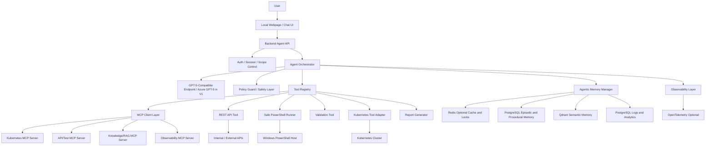
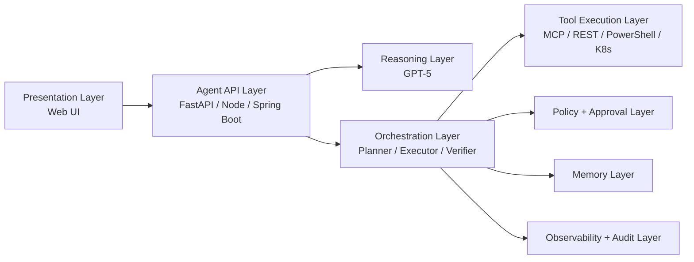
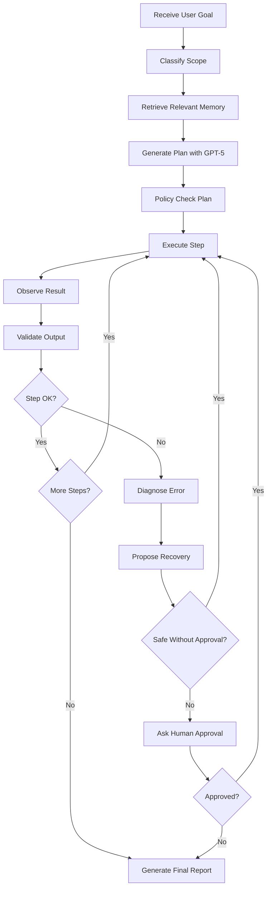
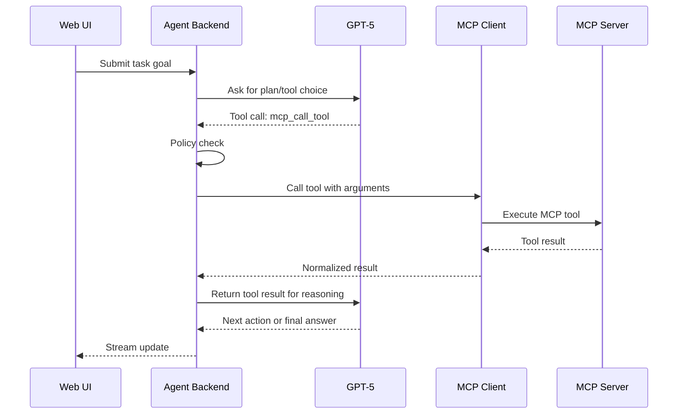
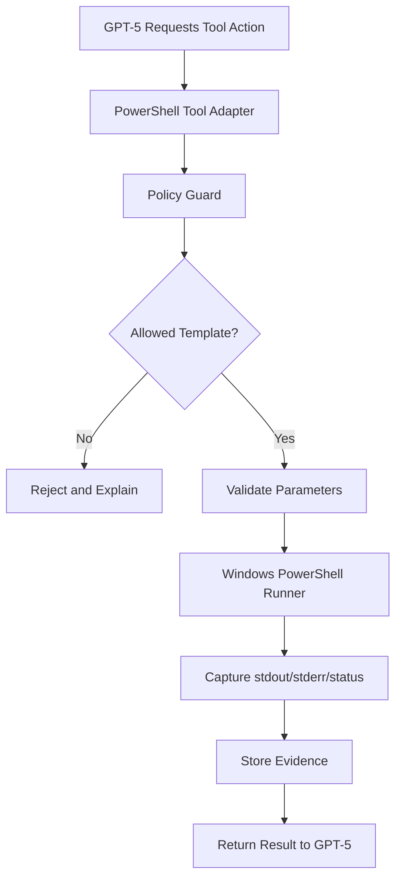
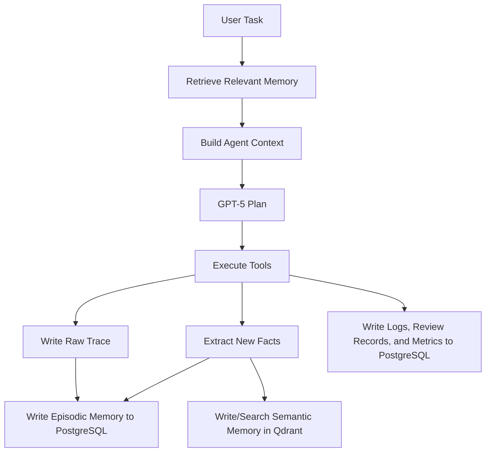
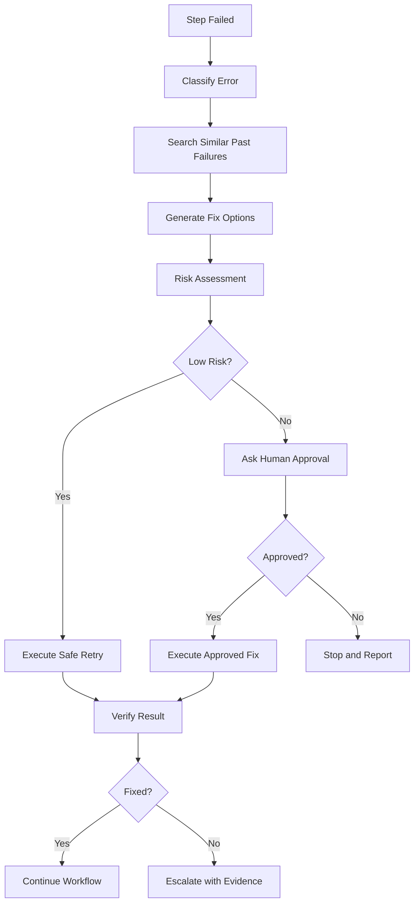
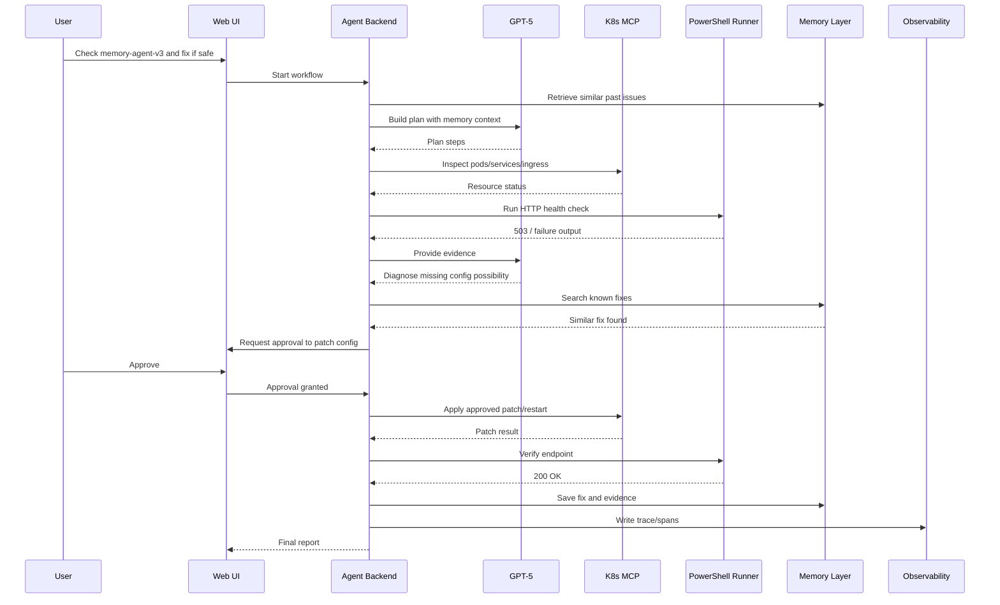

# High-Level Design (HLD): GPT-5 Powered Bounded Codex-like Workflow Agent

**Document Version:** 1.0  
**Target System:** Custom Web Application / Local Agent Console  
**Primary Goal:** Build a bounded, task-specific Codex/Kiro/Claude-like agent using GPT-5 API, MCP servers, PowerShell execution, APIs, validation, and agentic memory.  
**Intended Usage:** Operational automation, troubleshooting, validation, controlled remediation, and workflow orchestration for a limited scope such as BOS Genesis / TAAI / Kubernetes / API validation tasks.

---

## 1. Executive Summary

This HLD describes a custom web-based agent application that behaves like a **bounded Codex-like workflow agent** for a specific operational domain. The system provides a local webpage/chat interface where a user submits a task goal. The backend uses a **GPT-5-compatible model endpoint** for reasoning, planning, tool selection, and orchestration. V1 implementation uses an **Azure OpenAI GPT-5 deployment** through LangChain-compatible wrappers.

The agent can interact with:

- Multiple configured **MCP servers**
- REST APIs and internal service endpoints
- Windows PowerShell through a restricted execution layer
- Kubernetes and platform tools through approved adapters
- Validation and reporting tools
- Agentic memory and review stores: PostgreSQL, Qdrant, and optional Redis

The system is not designed as a general-purpose chatbot. It is a **bounded autonomous workflow console** where GPT-5 reasons and plans, but the backend validates and executes actions safely.

---

## 2. Design Objective

The system should provide Codex-like behavior for specific tasks only:

1. Accept a user goal through a webpage/chat UI.
2. Keep the assistant bounded to a limited domain and task scope.
3. Use a GPT-5-compatible model endpoint for reasoning, planning, diagnosis, tool selection, and recovery decisions; V1 uses Azure OpenAI GPT-5.
4. Call one or more configured MCP servers.
5. Call REST APIs and service endpoints.
6. Use Windows PowerShell to perform approved API calls, checks, and operational commands.
7. Validate responses and save evidence.
8. Detect errors, reason about failure causes, and propose or execute safe recovery steps.
9. Use memory layers for session context, previous issues, known fixes, traces, and analytics.
10. Produce a final execution report with steps, tool calls, validation status, errors, and remediation evidence.

---

## 3. Key Design Principle

The most important design rule is:

> **GPT-5 reasons and plans. The backend validates and executes.**

The LLM must not get unrestricted operating system, shell, Kubernetes, or credential access.

### Unsafe Pattern

```text
Browser / Backend
    -> GPT-5 generates arbitrary PowerShell
    -> Backend executes raw command directly
```

### Safe Pattern

```text
Browser
    -> Backend Agent API
    -> GPT-5 chooses an approved tool
    -> Policy Guard validates the action
    -> Backend executes a safe tool/template
    -> Result is returned to GPT-5 for next reasoning step
```

---

## 3.1 Architecture Alignment Decisions

The Project Architecture Specification is the controlling document for implementation decisions. This HLD remains broader context.

V1 standardization:

- LLM provider boundary: GPT-5-compatible model endpoint.
- V1 model implementation: Azure OpenAI GPT-5 deployment.
- LLM integration: LangChain wrapper.
- Browser never calls the model endpoint directly.
- V1 storage: PostgreSQL + Qdrant.
- MongoDB is optional and out of scope for V1.
- Redis is optional only for cache, locks, rate limiting, and SSE pressure.

## 3.2 Current V1 Implementation Status (2026-07-08)

The working V1 vertical slice is now release-note generation through the BOS Genesis ESDA web application.

Implemented behavior:

- ESDA runs locally as a FastAPI web application with Bootstrap/JavaScript UI, login, run progress, approvals, L4 audit, LLM chat, release-note pages, Bundle Generation, Bundle Execution, and the Activity observability/artifact-chat page.
- Local execution uses the cluster ingress endpoints for existing BOS Genesis services; ESDA itself is not deployed to the cluster yet.
- PostgreSQL is the active durable store for users, runs, events, tool calls, LLM review records, approvals, policies, procedures, and artifact metadata.
- ClickHouse and SQLite are not part of the current V1 path.
- Azure OpenAI is integrated through LangChain with Azure CLI bearer-token auth for local proofing. The default GPT-5 Pro profile is displayed in the UI as `SIGMA 5 PRO`; other display-only labels are `SIGMA 4.1`, `TRAINIUM BEHEMOTH`, `TRAINIUM GEMMA`, and `CUSTOM`. Underlying deployment/profile identifiers remain unchanged.
- The release-note flow uses `bosgenesis-release-note-agent` through its MCP-compatible HTTP tools first, with REST only for artifact download/hydration where needed.
- `release-note-agent` creates the initial release-note evidence/artifacts, then the ESDA LLM chain uses that initial Markdown as the primary source for the final human-readable draft.
- ESDA stores the final Markdown artifact and PDF artifact, preserving the release-note-agent look and feel when the upstream PDF is available and appending ESDA scan details when the final Markdown/PDF is produced.
- ESDA performs a temporary local repository clone after release-note-agent evidence collection, runs a common vulnerability scan, runs `pylint` for Python projects when available, falls back to safe static quality checks when needed, appends the resulting matrices to Markdown/PDF, and removes the temporary checkout.
- On successful completion, ESDA commits `release-notes.md` and `release-notes.pdf` to `aveeshek/bosgenesis-artifacts` under a folder named `YYMMDD_HHMMSS_<job-name>`. The Activity page can later overwrite those exact files with reviewed local Markdown/PDF uploads; if a historical run only has local artifacts, the first Activity upload creates a stable GitHub folder for that run and subsequent uploads overwrite the same file path.
- The UI streams progress and model/tool explanations, makes the progress panel scrollable/copyable, shows separate Markdown and PDF download buttons, exposes an autonomy activity map for intake, classification, planning, evidence, clone, security, quality, cleanup, draft, validation, recovery, artifact save, publish, and completion, and provides an Activity timeline/chat page for historical release-note analysis.
- Live working notes are ephemeral and are not persisted. Release Notes clears them after completion; Bundle Generation and Bundle Execution keep both live working notes and safe summaries visible until the user refreshes, while only safe summaries are persisted.
- Bundle Generation is implemented as the second workflow page. Its internal workflow id remains `mop_generation`. It generates a complete read-only MoP bundle using k8s-inspector, helm-manager, and mop-creation-agent evidence when reachable, preserves professional MoP Creation Agent Markdown/PDF templates when available, builds `deployment-artifacts.zip` and `mop-bundle.zip`, includes raw generated ConfigMaps under `deployment-artifacts/kubernetes-manifests/raw/` when returned by the agent, and publishes the unextracted `mop-bundle.zip` to the configured artifact repository.
- Bundle Execution is implemented as the governed runtime page. Its internal workflow id remains `mop_execution`. It consumes a selected `mop-bundle.zip`, performs ESDA preflight, delegates validation/dry-run/mutation/reporting/cleanup to `bosgenesis-mop-execution-agent`, and treats `mutation_succeeded` plus `validation_status = needs_review` with healthy Helm/Kubernetes evidence as `completed_with_review` rather than failure.
- Activity is multi-workflow: Release Note, Bundle Generation, and Bundle Execution runs appear in the same timeline with workflow badges, detail panels, artifact downloads, and artifact-grounded chat.

Current release-note MCP tools used:

| Tool | Purpose |
|---|---|
| `github_release_scan_start` | Start repository/source analysis and request Markdown, HTML, PDF, and JSON outputs. |
| `github_release_scan_status` | Poll long-running scan status when the MCP service returns a job id. |
| `github_release_generate_note` | Trigger release-note generation from scan results. |
| `github_release_get_artifact` | Retrieve generated artifact metadata and content references. |

---
## 3.3 Persistent Transaction UX and Background Execution

All workflow pages must behave as durable state-machine clients over server-side workflow transactions. A browser tab is only a viewer/controller; it must not own workflow truth.

Default behavior for every page:

- Starting a workflow creates a durable PostgreSQL transaction/run record before model or tool work begins.
- The LangGraph workflow continues in the backend even if the user refreshes, closes the tab, or navigates to another page.
- Every progress update is written as an ordered PostgreSQL event before it is streamed to the browser.
- The browser rehydrates from PostgreSQL on page load by reading the latest run snapshot and replayable event history.
- SSE streams resume from the last observed event sequence or event id.
- Users can clear/hide a transaction from their own history, but clear is a user-level archive action; audit records and artifacts remain durable.
- This refresh-safe behavior applies to release notes, health checks, Bundle Generation, Bundle Execution, ENV Agent, Helm, Kubernetes, approvals, L4 audit, and future workflow pages.

The UX must include a ChatGPT-style transaction sidebar:

- Hidden/collapsed by default.
- Opens as a floating left-side drawer.
- Lists past workflow transactions for the logged-in user.
- Shows workflow type, title, status, timestamps, model/agent used, and artifact availability.
- Clicking a transaction restores that run into the current page, including live progress if it is still running.
- Closing the drawer returns it to the hidden state without losing the selected run.

Backend responsibility:

- Workers execute workflow state transitions.
- API routes expose snapshots, events, artifacts, and clear/archive actions.
- PostgreSQL is the source of truth for session data, transactional data, run state, UI replay events, and user-specific history visibility.
- Redis may later optimize event buffering/locks, but it must not be the only state store.

---
## 3.4 Final Release-Note Agent Design and Implementation

The final release-note agent is the reference V1 implementation for ESDA's bounded autonomy pattern.

High-level behavior:

- The user opens `/release-notes`, enters a GitHub repository URL, release name, and source reference. Source precedence is commit, then tag, then branch.
- ESDA classifies the request as `release_note_creation`, creates a plan, and delays revealing the activity map briefly so the UX demonstrates planning before execution.
- ESDA calls `bosgenesis-release-note-agent` through MCP-compatible endpoints to collect release evidence and initial artifacts.
- ESDA clones the repository into a temporary local workspace, scans common vulnerability signals, runs code quality checks, writes security and quality matrices, then removes the checkout.
- ESDA asks the selected model to finalize the release note from collected evidence, release-note-agent Markdown, and scan summaries only.
- ESDA validates required Markdown structure, source evidence, security/quality sections, and artifact availability.
- ESDA saves local Markdown and PDF artifacts, then publishes both files to the configured GitHub artifact repository when publishing is enabled.
- PostgreSQL remains the durable source of truth for runs, ordered events, tool summaries, artifact metadata, LLM review-safe summaries, and transaction history.

The release-note page demonstrates the intended UX contract for all future workflow pages:

- Refreshing a completed run returns the page to the initial state unless the user explicitly selects that run from the history drawer.
- Refreshing or returning during an active run restores the current state and reconnects live progress.
- The floating history drawer lists user-visible transactions and hides cleared items without deleting audit data.
- The Agent Activity Feed is hidden until a run starts, appears when activity changes, auto-hides after 30 seconds, and can be pinned by the user.
- Hovering activity nodes exposes sanitized event/log details for that step.
- Hidden model chain-of-thought is never stored or displayed; only model-supported summaries and ESDA-authored working notes are shown.

Artifact publishing is intentionally narrow:

- Target repository: `https://github.com/aveeshek/bosgenesis-artifacts.git`.
- Target branch: `main`.
- Folder convention: `YYMMDD_HHMMSS_<job-name>` for workflow publish; Activity local-only upload creates a stable run folder based on the run timestamp and generated session title.
- Published filenames: `release-notes.md` and `release-notes.pdf`.
- Activity artifact upload is constrained to those two filenames, validates file type/content, requires authenticated run access, and records overwrite/create events in PostgreSQL.
- Required safety: publishing depends on configured Git credentials, repository access, and the `ARTIFACT_GIT_PUBLISH_ENABLED` setting.

## 3.5 Activity Page Baseline and Artifact Review Upload

The Activity page is now the multi-workflow analytical companion for ESDA. It uses the same matte-glass AI visual language while replacing the global transaction drawer with a purpose-built time-series graph.

Implemented Activity behavior:

- `/activity` renders a two-pane page: left timeline and run detail, right artifact chatbot.
- The left transaction sidebar launcher is not rendered on Activity; historical navigation happens through timeline nodes.
- The right chat pane is constrained to the visible viewport and scrolls internally.
- Timeline nodes show Release Note, Bundle Generation, and Bundle Execution status, generated title, duration, model, artifact availability, and publish state.
- Workflow filters and badges distinguish Release Notes, Bundle Generation, and Bundle Execution.
- Selecting a Release Note node shows stage details, Markdown/PDF downloads, published repo actions, and controlled GitHub upload actions.
- Selecting a Bundle Generation node shows source namespace, target namespace placeholder, environment, stage chain, bundle status, bundle download, and publish metadata.
- Activity Chat answers from selected/visible run context, local artifact text where available, persisted events, and published artifact metadata, with citations.
- Release Note uploads are constrained to `release-notes.md` and `release-notes.pdf` replacement/create-folder behavior.
- Bundle Generation artifacts are represented as complete bundle outputs; Activity can download and discuss selected bundle runs/artifacts. For Bundle Generation, Activity shows `Download MoP Bundle`; for Release Notes, Activity continues to show Markdown/PDF download and reviewed GitHub upload actions.

---

## 3.6 Final Bundle Generation Implementation

Bundle Generation is now implemented as the second ESDA workflow page and uses Release Notes as the baseline design pattern. The backend workflow id remains `mop_generation`.

Implemented behavior:

- Route: `/mop-generation`.
- Navigation label: `Bundle Generation`.
- Purpose: generate a read-only Method of Procedure and deployment artifact bundle for a selected source namespace.
- Source namespace is selected from an allowlisted dropdown, currently including `bosgenesis`, `signoz`, and `agent-testing`.
- Target namespace is a placeholder for later Bundle Execution, not an execution target during generation. The UI offers configured placeholder values such as `Generic` and `agent-testing`.
- The default change intent is: `Generate MoP in both markdown and PDF format so we can fully clone the source namespace`.
- Environment options include `Kubernetes with Helm`, `OpenShift`, `Kustomize`, and `Flux`; V1 implementation is read-only and primarily supports Kubernetes with Helm evidence.
- The page uses the shared sphere animation, hidden transaction drawer, Live Working Stream plus Safe Reasoning Summaries, icon-only log copy control, maximizeable Autonomy Notes modal, copyable JSON logs, and bottom Agent Activity Feed.
- Live working notes are never persisted. Safe reasoning summaries, ordered events, tool outputs, artifact metadata, and publish metadata are persisted in PostgreSQL.
- The MoP graph calls k8s-inspector, helm-manager, and mop-creation-agent adapters where reachable, redacts secrets, and records partial evidence honestly when a service is unavailable.
- The MoP Creation Agent remains the authority for professional MoP Markdown/PDF when it returns those artifacts. ESDA preserves its renderer metadata and does not invent a separate PDF style.
- ESDA builds a complete bundle containing root MoP files, `machine_execution_plan.yaml`, `artifact.json`/`esda-artifact.json`, `deployment-artifacts/`, `deployment-artifacts.zip`, and `mop-bundle.zip`.
- Raw generated ConfigMap YAMLs returned by the MoP Creation Agent are copied, when available, into `deployment-artifacts/kubernetes-manifests/raw/` before `deployment-artifacts.zip` is generated.
- Successful Bundle Generation runs publish the unextracted `mop-bundle.zip` to the configured artifact repository under `YYMMDD_HHMMSS_mop_<job-name>`.
- Activity shows Bundle Generation runs alongside Release Notes and grounds Artifact Chat on selected bundle events/artifacts. Simple bundle inventory questions, such as ConfigMap presence, are answered directly from `mop-bundle.zip`; complex questions can still invoke the selected model.

Primary MCP integrations:

| Agent / MCP Server | Responsibility |
|---|---|
| `bosgenesis-k8s-inspector-mcp` | Read namespace resources, workload status, services, ingress, config references, events, and non-secret operational evidence. |
| `bosgenesis-helm-manager-mcp` | Read Helm releases, chart names, revisions, values summaries, status, and rollback-relevant release metadata. |
| `bosgenesis-mop-creation-agent` | Produce the professional initial MoP bundle, including Markdown, PDF, metadata, execution plan, values, and generated manifests when available. |
| ESDA GPT-5 chain | Classify, plan, summarize safe evidence, validate bundle readiness, produce safe summaries, and orchestrate artifact save/publish. |

---

## 3.7 Final Bundle Execution Implementation

Bundle Execution is the governed runtime companion for Bundle Generation. The backend workflow id remains `mop_execution`. It consumes a previously generated `mop-bundle.zip`, validates it through `bosgenesis-mop-execution-agent`, runs dry-run first, pauses for human approval before mutation, and then delegates all approved mutation, validation, rollback, cleanup, and reporting to the execution agent.

High-level behavior:

- Route: `/mop-execution`.
- Navigation label: `Bundle Execution`.
- ESDA provides the page shell, bundle selection, policy preflight, live progress, safe summaries, activity map, result panel, and operator controls.
- ESDA does not directly mutate Kubernetes or Helm resources. The MoP Execution Agent is the only execution control plane for dry-run, mutation, validation, rollback, cleanup, and reports.
- Bundle sources include Activity Bundle Generation runs, artifact repository folders, and uploaded bundles.
- For published Activity bundles, ESDA registers the bundle with the execution agent using an `object_store` source that points to the raw GitHub `mop-bundle.zip` URL. This avoids sending large archives inline and avoids assuming the cluster agent can see the ESDA local filesystem.
- ESDA calls the execution agent health, readiness, capabilities, bundle registration, bundle validation, job, observation, approval, instruction, report, rollback, cleanup, and namespace revert APIs.
- Execution modes are `Dry-run only`, `Dry-run then approval`, and `Approved mutation (agent approval required)`. Cleanup/revert is not an execution mode; it is a dedicated result-panel action for an existing execution run or namespace-level revert context.
- The execution graph stores `bundle_id`, `dry_run_job_id`, `mutation_job_id`, `target_namespace`, `correlation_id`, idempotency keys, report metadata, safe summaries, redacted observations, and audit events in PostgreSQL.
- Live working notes remain ephemeral and page-local. Safe reasoning summaries and structured agent results are persisted and can reload after refresh.
- The UI blocks mutation controls until bundle validation and dry-run succeed and an in-scope human approval is accepted.
- `mutation_succeeded` is a terminal green/completed mutation state. If the execution agent returns `validation_status = needs_review` but Helm/Kubernetes verification evidence is healthy, ESDA surfaces `completed_with_review`, stops activity-feed blinking, hides or disables the approval gate, and tells the operator that the mutation completed while post-validation matrix rows require review.
- Cleanup/revert delegates to the MoP Execution Agent namespace revert path with explicit rationale and approval metadata. Successful cleanup must show a distinct cleanup completion message/status instead of leaving the prior mutation status ambiguous.
- Activity is expected to show Bundle Execution reports alongside Release Notes and Bundle Generation.

Current compatibility note:

- ESDA now uses the execution-agent contract `POST /v1/artifact-bundles` followed by `POST /v1/artifact-bundles/{bundle_id}/validate`.
- Published bundles are passed as `source.type = object_store`.
- The deployed `bosgenesis-mop-execution-agent` must include the `object_store` resolver. If the old agent image is still running, validation can fail with `bundle_source_not_locally_resolvable:object_store`; this is a deployment/version mismatch, not an ESDA UI flow failure.
- Bundle content still matters. A generated bundle with incomplete Helm chart references can pause at `decision_required` even when ESDA is healthy. For demo mutation paths, use a bundle whose Helm chart source is executable by the execution agent, or regenerate the Bundle Generation artifact so chart references point to a repo/chart or packaged local chart.

---

## 3.8 Planned ENV Agent ChatOps Page

ENV Agent is the next planned ESDA workflow page for direct environment chat operations. It will present a chatbot-first interface using the same matte-glass theme, global model selector, profile menu, shared sphere/globe animation, Autonomy Notes, copyable logs, and Agent Activity Feed patterns established by Release Notes, Bundle Generation, and Bundle Execution.

High-level behavior:

- Route: `/env-agent`.
- Navigation label: `ENV Agent`.
- Backend workflow id: `env_agent`.
- User submits natural-language environment questions or commands, such as `tell me how many pods have issues in this namespace` or `my pod is getting restarted, can you fix it`.
- The selected model, such as `SIGMA 5 PRO` or `TRAINIUM GEMMA`, classifies intent, plans a bounded tool chain, requests MCP tool calls, explains safe reasoning summaries, and validates observations.
- Read-only diagnostics can execute immediately inside approved namespace/environment scope.
- Mutating fixes are never raw shell commands. They are structured remediation proposals routed through approved MCP servers, policy checks, approval gates when required, and post-action validation.
- Tool chains may include k8s-inspector, helm-manager, data-ingestion snapshots, observability/log query tools, safe REST GET/POST tools, and later execution-agent repair tools where appropriate.
- The page must show a large idle sphere/globe. After user submission the sphere becomes smaller and behaves like a working/thinking indicator while live reasoning summaries, tool observations, and agent logs stream below it.
- Every request creates a PostgreSQL run record, ordered events, tool logs, model metadata, safe reasoning summaries, policy decisions, approval decisions, and final outcome records.
- Hidden model chain-of-thought remains unavailable and must not be stored or displayed. Only model-supported summaries, ESDA-authored working notes, tool observations, and policy explanations are shown.

Safety model:

- ENV Agent is ChatOps, not an unrestricted terminal.
- Namespace, environment, tool, resource-kind, and action allowlists are mandatory.
- Secret reads, arbitrary deletes, unbounded scaling, arbitrary patch payloads, and cluster-wide mutations are blocked by default.
- Restart/scale/patch actions require a structured plan, risk classification, rollback/verification plan, and approval when policy marks the action high risk.
- The agent must verify state after any approved remediation and report whether the symptom improved, remained unchanged, or became ambiguous.

---

## 4. Target Users

| User Type | Usage |
|---|---|
| Developer | Diagnose service/API failures and validate fixes |
| Test Engineer | Run bounded validation workflows and compare results |
| Platform Engineer | Inspect Kubernetes resources, logs, ingress, and service health |
| Solution Architect | Demonstrate autonomous workflow orchestration with safety controls |
| Citizen Developer | Execute approved templates without knowing underlying tools |

---

## 5. In Scope

The first version should support:

- Local webpage/chat interface
- Backend API using FastAPI or similar framework
- GPT-5 API integration
- Bounded task instructions and system prompt
- Tool registry
- MCP client layer
- REST API caller
- Safe PowerShell runner
- Read-only Kubernetes inspection through MCP or approved tools
- ENV Agent chatbot diagnostics and approved environment remediation through MCP tool chains
- Validation engine
- Error diagnosis and retry logic
- Memory write/read
- Run history and trace storage
- Final report generation

---

## 6. Out of Scope for Initial Version

The first version should not support:

- Unrestricted PowerShell execution
- Arbitrary file deletion or modification
- Unrestricted Kubernetes patch/delete/scale operations
- Chat-driven raw shell execution or unapproved environment mutation
- Production remediation without approval
- Secret discovery or credential extraction
- Full autonomous cluster administration
- General-purpose internet browsing or uncontrolled downloads
- Fully autonomous destructive actions

---

## 7. High-Level Architecture



---

## 8. Logical Layering



---

## 9. Recommended Technology Stack

| Layer | Recommended Technology |
|---|---|
| Web UI | HTML, Bootstrap 5.3, JavaScript, jQuery or HTMX |
| Live Updates | Server-Sent Events or WebSocket |
| Backend API | Python FastAPI |
| LLM Integration | GPT-5-compatible endpoint; Azure OpenAI GPT-5 deployment in V1 through LangChain |
| Agent Runtime | LangGraph for workflow orchestration and checkpointing |
| Tool Schema | Pydantic models |
| MCP Integration | Python MCP client or OpenAI Agents SDK MCP integration |
| Workflow State | LangGraph, custom state machine, Temporal, Prefect, or n8n |
| PowerShell Execution | Restricted Windows runner service |
| Policy Guard | Custom policy engine first; OPA later |
| Short-Term State | LangGraph checkpointing; optional Redis for cache, locks, rate limiting, and SSE pressure |
| Episodic Memory | PostgreSQL |
| Procedural Memory | PostgreSQL, with optional Qdrant semantic index |
| Semantic Memory | Qdrant |
| Detailed Logs and Analytics | PostgreSQL |
| Platform Observability | OpenTelemetry optional |

---

## 10. Main Components

### 10.1 Web UI

The web UI is the local chatbot and workflow console.

Responsibilities:

- Accept bounded user task goals
- Display generated plan
- Display step-by-step execution progress
- Show tool calls and outputs
- Show MCP responses
- Show PowerShell output
- Show validation result
- Show memory used
- Ask for approval when needed
- Display final execution report

Recommended UI panels:

```text
+-------------------------------------------------------------+
| Header: GPT-5 Bounded Workflow Agent                        |
+----------------------+----------------------+---------------+
| Task Input           | Agent Plan / Chat    | Run Evidence  |
| Scope Selector       | Current Step         | Tool Calls    |
| Environment Selector | Reasoning Summary    | Logs/Trace    |
| Autonomy Mode        | Approval Requests    | Memory Used   |
+----------------------+----------------------+---------------+
```

---

### 10.2 Backend Agent API

The backend is the control center.

Responsibilities:

- Receive task requests from UI
- Maintain run/session state
- Call GPT-5 API
- Register tools
- Execute tool calls
- Apply policy rules
- Manage memory
- Stream updates back to UI
- Persist traces and execution history

Suggested endpoints:

| Endpoint | Method | Purpose |
|---|---|---|
| `/api/chat` | POST | Submit a user message/task |
| `/api/runs` | POST | Start a new workflow run |
| `/api/runs/{run_id}` | GET | Get run status |
| `/api/runs/{run_id}/snapshot` | GET | Get latest durable run snapshot for page rehydration |
| `/api/runs/{run_id}/events` | GET | Stream live run events; supports resume by last event id/sequence |
| `/api/transactions` | GET | List current user's visible workflow transactions for the floating sidebar |
| `/api/transactions/{run_id}/clear` | POST | Hide/archive a transaction for the current user without deleting audit data |
| `/api/runs/{run_id}/approve` | POST | Approve a sensitive action |
| `/api/runs/{run_id}/cancel` | POST | Cancel run |
| `/api/tools` | GET | List available tools |
| `/api/memory/search` | POST | Search agent memory |
| `/api/reports/{run_id}` | GET | Download final report |

---

### 10.3 GPT-5 Reasoning Layer

GPT-5 is used for:

- Understanding task intent
- Building execution plan
- Selecting tools
- Interpreting API/MCP/PowerShell results
- Diagnosing errors
- Choosing safe next steps
- Summarizing evidence
- Creating final report narrative

GPT-5 should not directly execute commands.

---

### 10.4 Agent Orchestrator

The orchestrator controls the run lifecycle.

Responsibilities:

- Convert user goal into task object
- Retrieve memory and context
- Call GPT-5 for plan generation
- Execute planned steps using approved tools
- Validate each step result
- Decide whether to continue, retry, ask approval, or stop
- Persist run history and evidence
- Generate final result

Core orchestration loop:



---

### 10.5 Tool Registry

The tool registry defines what the agent can do.

Recommended initial tools:

| Tool Name | Purpose | Risk Level |
|---|---|---|
| `mcp_call_tool` | Call configured MCP server tool | Medium |
| `rest_api_get` | Execute GET API call | Low |
| `rest_api_post` | Execute POST API call | Medium |
| `powershell_http_get` | Use PowerShell Invoke-RestMethod GET | Low |
| `powershell_http_post` | Use PowerShell Invoke-RestMethod POST | Medium |
| `k8s_get_pods` | Inspect pods in approved namespace | Low |
| `k8s_get_services` | Inspect services in approved namespace | Low |
| `k8s_get_logs` | Read logs from approved namespace | Medium |
| `validator_assert_json_path` | Validate response payload | Low |
| `memory_search` | Search previous issues/fixes | Low |
| `memory_write` | Save new fact or issue resolution | Low |
| `generate_report` | Generate final execution report | Low |

Future tools with approval:

| Tool Name | Purpose | Approval Required |
|---|---|---|
| `k8s_rollout_restart` | Restart deployment | Yes |
| `k8s_patch_configmap` | Patch configmap | Yes |
| `k8s_patch_deployment_env` | Patch deployment environment variable | Yes |
| `helm_upgrade` | Run Helm upgrade | Yes |
| `delete_pod` | Delete pod for restart | Yes |

---

## 11. MCP Server Integration

MCP servers should expose governed tools to the agent.

Example MCP servers:

| MCP Server | Purpose |
|---|---|
| `bosgenesis-k8s-inspector-mcp` | Kubernetes resource inspection |
| `bosgenesis-api-test-mcp` | API testing and response validation |
| `bosgenesis-docs-rag-mcp` | Knowledge search over docs and runbooks |
| `bosgenesis-observability-mcp` | Query PostgreSQL logs, review records, OpenTelemetry traces, and operational metrics |
| `bosgenesis-mop-validator-mcp` | Validate MoP documents and execution steps |

MCP call flow:



---

## 12. Safe PowerShell Execution Design

PowerShell is useful for API calls, connectivity checks, Windows-specific operations, and operational validation. It must be restricted.

### Allowed Initial Templates

| Template | Description |
|---|---|
| `ps_http_get` | Calls `Invoke-RestMethod` with GET |
| `ps_http_post` | Calls `Invoke-RestMethod` with POST |
| `ps_test_connection` | Calls `Test-NetConnection` |
| `ps_curl_health_check` | Calls curl/Invoke-WebRequest against known endpoint |
| `ps_kubectl_get_pods` | Read-only pod listing |
| `ps_kubectl_logs` | Read logs from approved namespace |
| `ps_helm_status` | Read Helm release status |

### Blocked by Default

```text
Remove-Item -Recurse
Format-Volume
Stop-Service
Set-ExecutionPolicy
Invoke-Expression
iex
Start-Process with unknown executable
Downloading and executing scripts
Reading secrets or credential files
Cluster-wide delete/patch operations
```

### PowerShell Flow



---

## 13. Agentic Memory Architecture

The system should support multiple memory types.

| Memory Type | Store | Purpose |
|---|---|---|
| Short-term/session memory | Redis | Current conversation and run state |
| Long-term exact memory | PostgreSQL | Known facts, endpoints, configs, previous fixes |
| Episodic memory | PostgreSQL | Structured run episodes, tool evidence references, observations, and outcomes |
| Semantic memory | Qdrant | Similar issue/fix search |
| Log/review memory | PostgreSQL | Detailed logs, LLM review records, model explanations, tool events, metrics |
| Optional cache/coordination | Redis | Cache, locks, rate limiting, and SSE pressure only |

### Memory Flow



---

## 14. Safety, Policy, and Approval Model

The system should use a layered safety model.

### 14.1 Scope Control

Each run should have:

- User identity
- Environment
- Namespace/project scope
- Allowed MCP servers
- Allowed tools
- Autonomy mode
- Approval mode

### 14.2 Autonomy Modes

| Mode | Behavior |
|---|---|
| Observe Only | Agent can inspect and report only |
| Assisted | Agent proposes actions; user approves each action |
| Semi-Autonomous | Agent executes low-risk actions and asks approval for risky ones |
| Autonomous Safe Mode | Agent executes predefined safe workflows only |

### 14.3 Approval Required Actions

Actions requiring approval:

- Restart deployment
- Patch configmap
- Patch deployment environment
- Run Helm upgrade
- Delete pod
- Write to production systems
- Modify test data
- Trigger long-running jobs
- Any operation outside default namespace/scope

---

## 15. Error Diagnosis and Self-Fix Loop

The agent can attempt self-recovery only within approved boundaries.



### Example Self-Fix Pattern

Failure:

```text
GET http://memory-agent.bosgenesis.local/health returned 503
```

Agent actions:

1. Inspect pod status.
2. Inspect service and ingress.
3. Run PowerShell HTTP check.
4. Search memory for similar error.
5. Identify possible missing `LANGFLOW_URL` config.
6. Propose patch.
7. Ask approval.
8. Apply approved patch.
9. Verify health endpoint.
10. Save issue and fix to memory.

---

## 16. Example Workflow: Memory Agent Health Check and Safe Fix



---

## 17. Data Model: Run History

### `agent_run_history`

| Column | Type | Description |
|---|---|---|
| `run_id` | UUID | Unique workflow run ID |
| `user_id` | Text | User identifier |
| `session_id` | Text | Session identifier |
| `goal` | Text | Original user task |
| `scope` | JSONB | Allowed scope and environment |
| `status` | Text | running/completed/failed/cancelled |
| `started_at` | Timestamp | Start time |
| `completed_at` | Timestamp | End time |
| `final_summary` | Text | Final answer/report summary |
| `current_node` | Text | Last known graph node/state-machine step |
| `last_event_sequence` | Integer | Highest persisted event sequence for replay/resume |
| `worker_status` | Text | queued/running/idle/failed for background execution visibility |
| `cleared_by_user_at` | Timestamp | User-level hidden/archive timestamp; audit data remains intact |

### `agent_run_events`

| Column | Type | Description |
|---|---|---|
| `event_id` | UUID | Unique durable event ID |
| `run_id` | UUID | Parent workflow run ID |
| `sequence` | Integer | Monotonic event number per run |
| `event_type` | Text | run_started, node_started, tool_completed, artifact_created, etc. |
| `message` | Text | User-safe progress text |
| `payload` | JSONB | Redacted event data used to rebuild the UI |
| `created_at` | Timestamp | Event creation time |

### `agent_tool_call_history`

| Column | Type | Description |
|---|---|---|
| `tool_call_id` | UUID | Unique tool call ID |
| `run_id` | UUID | Parent run ID |
| `tool_name` | Text | Tool used |
| `tool_type` | Text | MCP/API/PowerShell/K8s/Validator |
| `input_payload` | JSONB | Tool arguments |
| `output_payload` | JSONB | Tool result |
| `status` | Text | success/failure/blocked |
| `risk_level` | Text | low/medium/high |
| `approval_required` | Boolean | Whether approval was required |
| `created_at` | Timestamp | Execution time |

### `agent_memory_registry`

| Column | Type | Description |
|---|---|---|
| `memory_id` | UUID | Unique memory ID |
| `memory_type` | Text | fact/fix/error/config/procedure |
| `scope` | Text | Environment or project scope |
| `content` | Text | Memory content |
| `tags` | Text[] | Search tags |
| `source_run_id` | UUID | Run where memory was created |
| `created_at` | Timestamp | Creation time |
| `updated_at` | Timestamp | Last update time |

---

## 18. Prompt and Instruction Strategy

The agent should use a strict system instruction.

Example high-level instruction:

```text
You are a bounded operational workflow agent.
You can only help with approved BOS Genesis operational tasks.
You must create a plan before executing tools.
You must call tools instead of inventing results.
You must not request or expose secrets.
You must not execute arbitrary shell commands.
For risky actions, request human approval.
After each tool call, validate the result.
At the end, produce a concise execution report.
```

The backend should also pass runtime constraints:

```json
{
  "allowed_namespaces": ["bosgenesis"],
  "allowed_mcp_servers": ["k8s-inspector", "api-test", "docs-rag"],
  "autonomy_mode": "semi_autonomous",
  "approval_required_for": ["patch", "delete", "restart", "helm_upgrade"],
  "max_retries": 2
}
```

---

## 19. Deployment Architecture

### Local Development

```text
Developer Laptop
  - Web UI
  - FastAPI Agent Backend
  - MCP Client
  - PowerShell Runner
  - PostgreSQL / Qdrant using Docker/Podman or reachable internal services
  - Azure OpenAI GPT-5 endpoint over approved network path
```

### Kubernetes Deployment

```mermaid
flowchart TD
    INGRESS[Ingress] --> UI[agent-console-ui]
    INGRESS --> API[agent-orchestrator-api]

    API --> REDIS[Redis]
    API --> PG[PostgreSQL]
    API --> QDRANT[Qdrant]
    API --> CH[PostgreSQL]    API --> OTEL[OpenTelemetry Optional]

    API --> MCP1[k8s-inspector-mcp]
    API --> MCP2[api-test-mcp]
    API --> MCP3[docs-rag-mcp]

    API --> PS[Windows PowerShell Runner]
    API --> LLM[GPT-5-Compatible Endpoint / Azure GPT-5 in V1]
```

---

## 20. Security Considerations

| Risk | Mitigation |
|---|---|
| API token leakage | Keep Azure OpenAI/model endpoint credentials only in backend secret store |
| Arbitrary shell execution | Use approved PowerShell templates only |
| Destructive actions | Human approval and policy guard |
| Scope creep | Enforce allowed namespace/project/environment |
| Secret exposure | Redact logs and block secret-reading tools |
| Infinite retry loops | Set max retries and timeout |
| Hallucinated tool result | Require actual tool calls and evidence |
| Unauthorized tool usage | Tool allowlist per user/session |
| Unsafe production changes | Separate production approval mode |

---

## 21. Observability and Audit

Every workflow should produce an evidence trail.

Capture:

- User goal
- Generated plan
- Tool calls
- Tool inputs and outputs
- Policy decisions
- Approval requests and decisions
- Validation results
- Error diagnosis
- Retry attempts
- Final report

Recommended observability mapping:

| Evidence | Store |
|---|---|
| LLM plans, reasoning summaries, explanations, and decisions | PostgreSQL |
| API/service traces | OpenTelemetry optional |
| Tool output summaries and evidence references | PostgreSQL + artifact references |
| Run history and episodic memory | PostgreSQL |
| Metrics and latency | PostgreSQL |
| Similar issue retrieval | Qdrant |

---

## 22. Versioned Delivery Plan

### Version 1: Read-Only Agent

Capabilities:

- Web UI
- GPT-5 backend
- Basic plan generation
- MCP call
- REST API GET
- Safe PowerShell GET
- Final report

Success criteria:


Current V1 release-note success criteria:

- User can log in and open the release-note page.
- User can submit a GitHub repository URL, release name, source details, analysis depth, and selected model.
- Agent calls `bosgenesis-release-note-agent` through MCP-compatible tools.
- Agent uses the release-note-agent Markdown as the initial document/evidence source.
- Agent clones the repo temporarily, runs vulnerability and quality scans, removes the checkout, and appends scan matrices.
- Agent saves final Markdown and PDF artifacts with release-note content plus security/quality details.
- Agent publishes `release-notes.md` and `release-notes.pdf` to the configured artifact GitHub repo under `YYMMDD_HHMMSS_<job-name>` when enabled.
- UI shows live progress, safe reasoning summaries, Agent Activity Feed, Markdown/PDF download buttons, and artifact preview.
- PostgreSQL records the run, events, tool summaries, LLM review metadata, artifact metadata, and publish outcome.
- Refreshing an active run restores progress; refreshing a completed run resets the page unless the run is selected from the history drawer.
- The floating transaction sidebar lists and restores prior release-note attempts until the user clears/hides them.

Original broader read-only success criteria:

- User can submit a bounded goal.
- Agent creates a plan.
- Agent calls at least one MCP server.
- Agent calls one API endpoint.
- Agent returns evidence-backed result.

---

### Version 2: Diagnostic Agent

Capabilities:

- Error classification
- Log retrieval
- Validation rules
- Memory lookup
- Similar issue detection
- Run history

Success criteria:

- Agent can diagnose a failing endpoint.
- Agent can search previous issues/fixes.
- Agent can recommend safe next steps.

---

### Version 3: Semi-Autonomous Repair Agent

Capabilities:

- Safe retry
- Human approval gate
- Approved restart/patch templates
- Post-fix verification
- Memory write-back

Success criteria:

- Agent can propose a fix.
- User can approve it.
- Agent can execute approved fix.
- Agent verifies outcome and saves evidence.

---

### Version 4: Bounded Codex-like Agent

Capabilities:

- Multi-step autonomous orchestration
- Multiple MCP servers
- Memory-driven troubleshooting
- Policy-governed remediation
- MoP-style execution report
- PostgreSQL review analytics and optional OpenTelemetry trace integration

Success criteria:

- Agent can execute a full bounded workflow from task to validated result.
- Risky actions are gated.
- All steps are auditable.
- Similar future issues are resolved faster using memory.

---

## 23. Recommended Repository Structure

```text
bounded-codex-agent/
  frontend/
    index.html
    app.js
    styles.css
  backend/
    app/
      main.py
      config.py
      agent/
        orchestrator.py
        planner.py
        prompts.py
        policy_guard.py
        tool_registry.py
        memory_manager.py
      tools/
        mcp_client.py
        rest_api_tool.py
        powershell_runner.py
        k8s_tool.py
        validator_tool.py
        report_tool.py
      storage/
        postgres_store.py
        mongo_store.py
        redis_store.py
        qdrant_store.py
        postgres_log_store.py
      observability/
        langfuse_client.py
        otel.py
      models/
        schemas.py
    requirements.txt
    Dockerfile
  powershell-runner/
    runner_service.py
    templates/
      ps_http_get.ps1
      ps_http_post.ps1
      ps_test_connection.ps1
      ps_kubectl_get_pods.ps1
  mcp-servers/
    k8s-inspector-mcp/
    api-test-mcp/
    docs-rag-mcp/
  helm/
    bounded-codex-agent/
  docs/
    HLD.md
    RUNBOOK.md
```

---

## 24. Example User Experience

User enters:

```text
Check whether memory-agent-v3 is healthy. If broken, diagnose the issue and fix only if it is a known safe config issue.
```

Agent responds:

```text
I will perform the following plan:
1. Call health endpoint.
2. Run PowerShell HTTP validation.
3. Inspect Kubernetes pod/service/ingress through MCP.
4. Search memory for similar failures.
5. Diagnose root cause.
6. If safe fix is available, request approval.
7. Apply approved fix.
8. Verify endpoint.
9. Save evidence and generate report.
```

During execution, the UI shows:

```text
Step 1: Health endpoint failed with 503
Step 2: PowerShell validation confirmed HTTP 503
Step 3: Pod is running, service exists, ingress exists
Step 4: Similar memory found: missing LANGFLOW_URL caused v3 failure previously
Step 5: Proposed fix: patch deployment env var
Approval required: Yes
```

Final output:

```text
Status: Fixed
Root cause: Missing LANGFLOW_URL configuration
Action: Deployment environment patched after approval
Verification: /memory-agent-v3/run returned 200 OK
Evidence: Tool call history, PowerShell output, Kubernetes inspection, trace IDs
```

---

## 25. Final Recommendation

This system is feasible and aligns strongly with a BOS Genesis-style agentic platform.

The recommended design is:

```text
Local Webpage
  -> FastAPI Backend
  -> GPT-5 API
  -> Agent Orchestrator
  -> MCP Client Layer
  -> Safe PowerShell Runner
  -> Policy Guard
  -> Memory Layer
  -> Observability Layer
```

Start with a read-only diagnostic version, then add controlled remediation with approval. This provides Codex-like behavior while keeping the system bounded, auditable, and safe.
