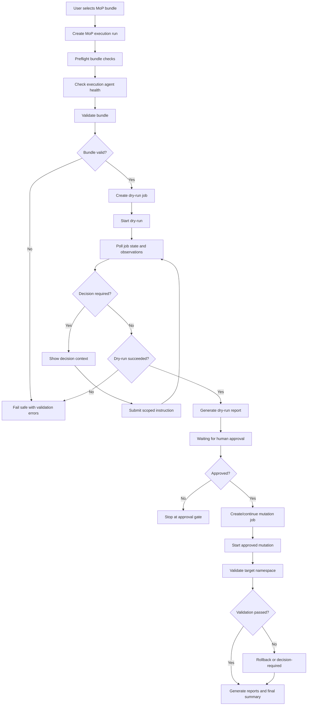

# MoP Execution Page Design and Implementation Plan

## 1. Purpose

The MoP Execution page is the governed execution surface for previously generated ESDA MoP bundles. It allows an operator to select or upload a `mop-bundle.zip`, validate it through the BOS Genesis MoP Execution Agent, run a dry-run first, inspect observations and reports, submit human approval, execute approved mutation, validate the target namespace, and collect final evidence.

This page must use the finalized Release Notes, MoP Generation, and Activity pages as the baseline visual and interaction design for the whole ESDA web app.

Primary outcome:

- User selects a MoP bundle and target namespace.
- ESDA validates the bundle and creates an execution job through `bosgenesis-mop-execution-agent`.
- ESDA runs dry-run first and pauses at approval/decision gates.
- Human approval is required before mutation.
- Mutation, validation, rollback, cleanup, and report generation are performed only by the MoP Execution Agent.
- Activity page shows MoP Execution runs and artifacts with bundle/report-aware chat grounding.

---

## 2. Non-Negotiable Execution Rules

- [x] ESDA must not directly mutate Kubernetes or Helm resources.
- [x] GPT-5 is the reasoning/orchestration layer, not the executor.
- [x] `bosgenesis-mop-execution-agent` is the only execution control plane for dry-run, mutation, validation, rollback, cleanup, and reports.
- [x] K8s Inspector and Helm Manager MCP mutation tools may be called by the execution agent, not directly by ESDA.
- [x] Direct ESDA K8s/Helm calls, if ever used, must be read-only troubleshooting only.
- [x] Dry-run must always run before mutation.
- [x] Human approval must be accepted and in-scope before mutation.
- [x] Policy gates must fail closed.
- [x] Namespace scope must never be broadened by the LLM.
- [x] Secret values must not be copied, exposed, stored, or sent to the LLM.
- [x] Every state-changing request must use an idempotency key/request ID.
- [x] Every execution event must be auditable in PostgreSQL.

---

## 3. Baseline UX Design

MoP Execution must reuse the existing ESDA visual language:

- [x] Vibrant AI background with matte glass panels.
- [x] Same top navigation, model selector, and profile menu.
- [x] Same sphere animation component and behavior.
- [x] Same hidden-by-default floating run history sidebar.
- [x] Same Live Working Stream plus Safe Reasoning Summary pattern.
- [x] Same bottom Agent Activity Feed with auto-hide and pin behavior.
- [x] Same copyable JSON logs and icon-only copy controls.
- [x] Same modal expansion pattern for reasoning/log inspection.
- [ ] Same Activity page timeline integration and artifact chat behavior.

Recommended desktop layout:

```text
+----------------------------------------------------------------------------------+
| Top Nav: AI brand | LLM Chat | Release Notes | MoP Generation | MoP Execution ... |
+----------------------------------------------------------------------------------+
| +----------------------+ +--------------------------------+ +------------------+ |
| | Execution Inputs     | | Live Progress                  | | Execution Result |
| | Bundle selector      | | Sphere animation               | | Reports          |
| | Target namespace     | | Working stream + summaries     | | Job status       |
| | Mode controls        | | JSON job observations          | | Download links   |
| | Approval controls    | | Decision required cards        | | Approval status  |
| +----------------------+ +--------------------------------+ +------------------+ |
| +--------------------------------------------------------------------------------+ |
| | Agent Activity Feed: Intake -> Bundle -> Validate -> Dry-run -> Approval ...    | |
| +--------------------------------------------------------------------------------+ |
+----------------------------------------------------------------------------------+
```

Recommended split:

| Panel | Width | Purpose |
|---|---:|---|
| Inputs and controls | 25% | Bundle, target namespace, execution mode, approval controls. |
| Live progress | 50% | Sphere, reasoning trace, safe summaries, execution job logs. |
| Result/report preview | 25% | Dry-run result, approval state, report downloads, final evidence. |

---

## 4. Page Inputs

| Input | Required | Source | Notes |
|---|---:|---|---|
| Bundle source | Yes | Activity run, Git artifact folder, or upload | Preferred: select a published MoP Generation run. |
| `mop-bundle.zip` | Yes | Artifact repo/local upload | Must contain required bundle files. |
| Target namespace | Yes | Dropdown | V1 default: `agent-testing`; no free-form namespace. |
| Execution mode | Yes | Dropdown | `Dry-run only`, `Dry-run then approval`, `Approved mutation`, `Cleanup/Revert`, `Rollback`. |
| Generated name prefix | Yes | Default config | Default `agent-ai`; can be read-only in V1. |
| Operator identity | Yes | Logged-in user | Used for audit and approvals. |
| Correlation ID | Yes | Generated | `agent-ai-<target>-execution-<timestamp>`. |
| Approval rationale | Conditional | User text | Required before mutation/cleanup/rollback. |
| External instruction | Conditional | User text/schema | Only when execution agent enters `decision_required`. |
| Model profile | Yes | Global selector | GPT-5 default for reasoning and summaries. |

Recommended V1 namespace values:

- [x] `agent-testing`
- [ ] Later: configured non-production namespaces only.

---

## 5. Required Agents and Services

| Agent / MCP server | Role |
|---|---|
| `bosgenesis-mop-execution-agent` | Primary execution control plane; validates bundles, creates jobs, runs dry-run, approval-gated mutation, validation, reports, rollback, cleanup. |
| `bosgenesis-k8s-inspector-mcp` | Used by execution agent for Kubernetes dry-run, apply, wait, get/list/describe/events/logs/validation. |
| `bosgenesis-helm-manager-mcp` | Used by execution agent for Helm template, dry-run, install/upgrade, status, history, rollback, uninstall. |
| `bosgenesis-release-note-agent` | Optional execution/change evidence notes. |
| `bosgenesis-k8s-data-ingestion-agent` | Optional historical inventory evidence only. |
| ESDA GPT-5 | Classifies, explains, summarizes, proposes safe instructions, and produces final operator summaries. |
| PostgreSQL | Execution runs, events, observations, approvals, report metadata, chat messages. |
| Git artifact repository | Stores final execution reports and evidence bundles when configured. |

---

## 6. State Machine



---

## 7. Agent Activity Feed Nodes

| Order | Node | Label | Description |
|---:|---|---|---|
| 1 | intake | Intake | Bundle source, target namespace, execution mode, operator identity. |
| 2 | preflight | Preflight | Local checks for bundle presence, required files, target namespace, policy odd. |
| 3 | agent_health | Agent Health | MoP Execution Agent health, readiness, capabilities. |
| 4 | bundle_validate | Bundle Validate | Agent-side validation and bundle ID creation. |
| 5 | dry_run_job | Dry-run Job | Dry-run job creation with idempotency key. |
| 6 | dry_run | Dry-run | Agent runs Helm/K8s dry-run operations. |
| 7 | observations | Observations | Observations, audit events, policy decisions, current state. |
| 8 | decision | Decision Gate | Decision-required context and external instruction submission. |
| 9 | dry_run_report | Dry-run Report | Dry-run report metadata and downloads. |
| 10 | approval | Approval Gate | Human approval submission and acceptance. |
| 11 | mutation_job | Mutation Job | Approved mutation job creation/continuation. |
| 12 | mutation | Mutation | Agent executes approved Helm/K8s mutation. |
| 13 | validation | Validation | Post-mutation validation of resources and rollout state. |
| 14 | reports | Reports | Execution, validation, rollback, cleanup, and evidence reports. |
| 15 | rollback_cleanup | Rollback/Cleanup | Optional rollback or namespace cleanup/revert. |
| 16 | complete | Complete | Final state, report links, Activity visibility. |

---


### Current Implementation Status

- [x] Phase A complete: documentation and scope alignment.
- [x] Phase B complete: backend configuration and typed execution-agent client skeleton.
- [x] Phase C complete: `mop_execution` persistence and redacted event model.
- [x] Phase D complete: MoP Execution page shell, navigation, sphere, sidebar, result panel, and Agent Activity Feed.
- [x] Phase E complete: bundle source selection and local preflight validation.
- [x] Phase F complete: execution-agent health, readiness, capability gate, and bundle validation.
- [x] Phase G complete: dry-run job creation/start/polling, safe summaries, observations, and fail-safe gating.
- [x] Phase H complete: decision-required UI, GPT-safe options, scoped instructions, and accepted-only resume handling.
- [x] Phase I complete: dry-run report retrieval, report evidence rendering, command fingerprints, and approval gate submission.
- [x] Phase J complete: approved mutation job creation/continue, polling, fail-safe pause, rollback-required surfacing, and no blind retry.
- [x] Phase K complete: post-mutation validation observations, validation matrix, report metadata/downloads, local report artifacts, and optional Git publish.

## 8. Implementation Checklist

### Phase A: Documentation and Scope Alignment

- [x] Create MoP Execution page plan and keep it under `knowledge-base/mop-execution/plan.md`.
- [x] Treat `ESDA_MOP_BUNDLE_EXECUTION_WITH_MOP_EXECUTION_AGENT.md` as the controlling execution flow.
- [x] Confirm V1 target namespace list and default value.
- [x] Confirm MoP Execution Agent ingress/service URL and auth requirements.
- [x] Confirm MCP/REST endpoint names exposed by the execution agent.
- [x] Confirm report download patterns and binary artifact strategy.
- [x] Confirm approval identity fields from ESDA login/session.
- [x] Confirm where execution reports should be published in Git artifacts.

### Phase B: Backend Configuration and Client Skeleton

- [x] Add settings for MoP Execution Agent REST/MCP base URL.
- [x] Add settings for MoP Execution Agent API key/auth mode if required.
- [x] Add timeout, polling interval, and max polling attempts.
- [x] Add allowed target namespace configuration.
- [x] Add a typed MoP Execution Agent client wrapper.
- [x] Implement health/readiness/capabilities calls.
- [x] Implement bundle validation call.
- [x] Implement job create/start/get/list calls.
- [x] Implement observations, plan, audit event retrieval calls.
- [x] Implement decision-required context retrieval.
- [x] Implement instruction submission.
- [x] Implement approval submission.
- [x] Implement report list/metadata/download link retrieval.
- [x] Implement rollback and cleanup request calls.
- [x] Add redaction for all downstream payloads.

### Phase C: Data Model and Persistence

- [x] Reuse existing run/event/artifact tables where possible.
- [x] Add `workflow_type = mop_execution` support.
- [x] Persist execution run metadata: `bundle_id`, `dry_run_job_id`, `mutation_job_id`, `target_namespace`, `correlation_id`.
- [x] Persist current execution state and phase.
- [x] Persist agent observations as redacted events.
- [x] Persist policy decisions.
- [x] Persist approval submissions and acceptance/rejection result.
- [x] Persist external instructions and execution-agent response.
- [x] Persist report metadata and download links.
- [x] Persist rollback/cleanup state and reports.
- [x] Ensure ephemeral live working stream is not persisted.
- [x] Ensure safe summaries are persisted.

### Phase D: Page Shell and Navigation

- [x] Add top-nav entry: `MoP Execution`.
- [x] Create `/mop-execution` page route.
- [x] Reuse matte glass layout and current ESDA theme.
- [x] Reuse global model selector.
- [x] Reuse profile menu.
- [x] Reuse transaction/sidebar drawer pattern.
- [x] Hide run sidebar by default.
- [x] Reuse sphere animation exactly from MoP Generation/Release Notes.
- [x] Add input panel, live progress panel, result/report panel.
- [x] Add bottom Agent Activity Feed with pin/auto-hide behavior.
- [x] Ensure mobile responsiveness.

### Phase E: Bundle Selection and Preflight

- [x] Add bundle source selector: Activity run, artifact repo folder, upload.
- [x] For Activity run selection, list successful `mop_generation` runs with `mop-bundle.zip`.
- [x] Show bundle metadata: source namespace, generated time, publish folder, checksum if available.
- [x] Add target namespace dropdown.
- [x] Generate correlation ID.
- [x] Validate local bundle presence before calling agent.
- [x] Check required files: `artifact.json`, `machine_execution_plan.yaml`, human MoP Markdown, PDF MoP, `deployment-artifacts.zip`, `artifact-index.json`.
- [x] Detect and block source Secret data exposure.
- [x] Detect and warn/block cluster-scoped destructive actions.
- [x] Detect source/target namespace mismatch.
- [x] Display preflight failures clearly in result panel.

### Phase F: Execution Agent Health and Bundle Validation

- [x] Call execution agent health endpoint.
- [x] Call readiness endpoint.
- [x] Call capabilities endpoint.
- [x] Verify capabilities include validation, dry-run, approval, mutation, validation reports, rollback, cleanup.
- [x] Register bundle with POST /v1/artifact-bundles before validation.
- [x] Use `object_store` raw GitHub URL when the source bundle comes from the published artifact repository.
- [x] Validate registered bundle with POST /v1/artifact-bundles/{bundle_id}/validate.
- [x] Submit bundle for validation.
- [x] Store returned `bundle_id`.
- [x] Show validation warnings/errors in Live Progress and result panel.
- [x] Stop if validation fails.
- [x] Mark Agent Activity Feed node statuses accurately.

### Phase G: Dry-Run Job Creation and Execution

- [x] Create dry-run-only execution job.
- [x] Use idempotency key.
- [x] Persist `dry_run_job_id`.
- [x] Start dry-run job.
- [x] Poll job state until dry-run success, failure, paused, or decision-required.
- [x] Stream job phase/current step in Live Working Stream.
- [x] Persist safe summaries for major dry-run phases.
- [x] Show copyable JSON observations and audit events.
- [x] Do not allow mutation controls until dry-run succeeds.

### Phase H: Decision-Required Handling

- [x] Detect `decision_required` state.
- [x] Retrieve decision-required context.
- [x] Render a decision card with reason code, phase, step, redacted error, allowed instruction schema, unsafe examples.
- [x] Ask GPT-5 to summarize safe options only.
- [x] Do not auto-submit repair instructions.
- [x] Allow operator to submit scoped external instruction.
- [x] Validate instruction scope client-side and server-side.
- [x] Submit instruction to execution agent.
- [x] Persist instruction and response.
- [x] Resume job only when instruction accepted.

### Phase I: Dry-Run Report and Approval Gate

- [x] Retrieve dry-run reports after dry-run success.
- [x] Show dry-run report summary in result panel.
- [x] Provide download buttons for Markdown/PDF/HTML report artifacts when available.
- [x] Show resources that would be created or changed.
- [x] Show policy gates and warnings.
- [x] Show command fingerprints returned by the execution agent.
- [x] Render approval form only after dry-run success.
- [x] Require human approval rationale.
- [x] Submit approval with operator identity, scope, expiry, command fingerprints, dry-run job ID.
- [x] Persist approval event and execution-agent response.
- [x] Block mutation if approval is missing, expired, rejected, or scope-mismatched.

### Phase J: Approved Mutation

- [x] Support creating a separate mutation job from validated bundle and dry-run evidence.
- [x] Support continuing existing job only if the execution agent supports that path.
- [x] Persist `mutation_job_id`.
- [x] Start mutation only after approval accepted.
- [x] Poll mutation job state.
- [x] Show mutation phase/current step in Live Progress.
- [x] Persist redacted observations and audit events.
- [x] Pause on ambiguity or unknown mutation outcome.
- [x] Never retry mutation blindly.
- [x] Surface rollback-required or decision-required states immediately.

### Phase K: Validation and Reports

- [x] Retrieve post-mutation validation observations.
- [x] Retrieve Helm status/history evidence from execution agent output.
- [x] Retrieve Kubernetes resource readiness evidence from execution agent output.
- [x] Show validation matrix: resource kind, name, namespace, expected, observed, status.
- [x] Retrieve execution report metadata.
- [x] Retrieve validation report metadata.
- [x] Retrieve change evidence/release note report metadata if generated.
- [x] Provide report download links.
- [x] Store report artifacts locally if returned by ESDA download path.
- [x] Publish final execution report bundle to Git artifact repository when configured.

### Phase L: Rollback and Cleanup

- [ ] Add rollback action only after mutation starts or succeeds.
- [ ] Add cleanup/revert action for demo reset.
- [ ] Require approval for rollback and cleanup.
- [ ] Require rollback/cleanup reason and scope.
- [ ] Submit rollback/cleanup through MoP Execution Agent only.
- [ ] Poll rollback/cleanup job state.
- [ ] Display rollback strategy and results.
- [ ] Generate rollback/cleanup reports.
- [ ] Persist all events and report links.

### Phase M: Activity Page Integration

- [ ] Extend Activity API to include `mop_execution` runs.
- [ ] Add workflow filter/badge for MoP Execution.
- [ ] Add Activity timeline nodes for dry-run, approval, mutation, validation, rollback, cleanup.
- [ ] Add run detail rendering for execution state, target namespace, job IDs, reports.
- [ ] Add report download buttons in Activity run detail.
- [ ] Add execution report artifact upload/overwrite buttons if needed.
- [ ] Ground Activity Chat on execution reports, observations, and selected MoP bundle.
- [ ] Add deterministic direct-answer paths for report inventory questions where possible.
- [ ] Use GPT-5 for complex execution analysis, comparison, and recommendation questions.

### Phase N: Approval and L4 Autonomy Controls

- [ ] Define autonomy level shown in UI: dry-run can be autonomous, mutation requires approval.
- [ ] Add explicit `approval_required` state in UI.
- [ ] Add visible policy gate status.
- [ ] Add visible namespace lock status.
- [ ] Add visible idempotency key/request ID.
- [x] Add human decision log in run detail.
- [x] Add audit-safe summaries for human review.
- [ ] Ensure no hidden chain-of-thought is persisted.
- [ ] Persist safe reasoning summaries only.
- [ ] Preserve raw agent observations only after redaction.

### Phase O: Tests and Verification

- [x] Unit-test execution client request/response parsing.
- [x] Unit-test preflight bundle validation.
- [x] Unit-test namespace policy checks.
- [ ] Unit-test direct mutation prevention.
- [x] Unit-test dry-run state transitions.
- [x] Unit-test decision-required handling.
- [x] Unit-test approval payload validation.
- [ ] Unit-test report metadata rendering.
- [ ] Unit-test Activity integration for `mop_execution`.
- [ ] Add frontend tests for page load, bundle selection, dry-run state, approval gate, and report links.
- [ ] Add browser verification for desktop/mobile layout.
- [ ] Add failure-mode tests: agent unavailable, invalid bundle, dry-run failed, approval mismatch, unknown mutation outcome.
- [x] Add no-secret-leak regression tests.

### Phase P: Local and Deployment Configuration

- [ ] Add local `.env` variables for MoP Execution Agent ingress.
- [ ] Add helm-chart values for MoP Execution Agent service URL.
- [ ] Use ingress locally and Kubernetes service DNS in cluster deployment.
- [ ] Redeploy osgenesis-mop-execution-agent with object-store bundle resolver support before validating published GitHub bundles from ESDA.
- [ ] Document required API keys/auth headers.
- [ ] Document how to start local ESDA and reach the execution agent.
- [ ] Document demo flow: select bundle -> dry-run -> approval -> mutation -> validation -> cleanup.

---

## 9. Live Progress and Reasoning Behavior

Live Progress should show two kinds of intelligence:

1. Deterministic execution trace from ESDA and MoP Execution Agent.
2. GPT-5 safe reasoning summaries for planning, decision review, report interpretation, and final operator summary.

Required behavior:

- [x] Show `00 / CREATING EXECUTION PLAN` before revealing the Agent Activity Feed.
- [x] Show live worker/job state while connected.
- [x] Keep ephemeral working stream visible until page refresh.
- [x] Persist safe summaries only.
- [x] Persist redacted job observations and audit events.
- [x] Keep execution-agent logs copyable.
- [x] Show decision-required context as a first-class UI panel.
- [x] Show approval gate as a first-class UI panel.
- [ ] If a deterministic answer is available, use it and mark it as direct/tool-grounded.
- [ ] If interpretation is needed, invoke GPT-5 with selected observations/reports as context.

---

## 10. Result and Report Panel

The result panel should be state-aware.

Dry-run states:

- [x] Bundle validation status.
- [x] Dry-run status.
- [x] Resource change preview.
- [x] Policy decisions.
- [x] Dry-run report download links.
- [x] Approval eligibility.

Mutation states:

- [x] Approval status.
- [ ] Mutation job state.
- [ ] Current phase and step.
- [ ] Created/updated resources.
- [ ] Validation status.
- [ ] Report download links.

Failure/paused states:

- [ ] Error code.
- [ ] Failed phase/step.
- [ ] Redacted error message.
- [x] Decision-required context.
- [x] Allowed next actions.
- [ ] Rollback/cleanup availability.

---

## 11. Artifact and Report Publishing

Execution reports should be published to the same Git artifact repository when configured.

Recommended folder naming:

```text
YYMMDD_HHMMSS_mop_execution_<target_namespace>_<job-name>
```

Recommended files:

```text
execution-summary.md
execution-report.pdf
validation-report.md
validation-report.pdf
change-evidence.md
audit-events.redacted.json
observations.redacted.json
rollback-report.md       # if applicable
cleanup-report.md        # if applicable
source-mop-bundle-ref.json
```

Checklist:

- [ ] Preserve execution-agent report templates when returned.
- [ ] Do not invent PDF styling if execution agent returns professional reports.
- [ ] Store report metadata in PostgreSQL.
- [ ] Store local artifacts in ESDA artifact storage.
- [ ] Publish reports to Git artifact repository.
- [ ] Show Git commit hash and folder URL in UI.
- [ ] Include published report links in Activity detail.

---

## 12. Suggested V1 Cut

Recommended first implementation slice:

- [x] Page shell and nav.
- [x] Bundle selection from existing MoP Generation Activity runs.
- [x] Target namespace dropdown with `agent-testing` only.
- [x] MoP Execution Agent health/capabilities.
- [x] Bundle validation.
- [x] Dry-run job creation/start/polling.
- [x] Observations/audit display.
- [x] Dry-run report links.
- [x] Approval gate UI without mutation first, if needed.
- [ ] Activity integration for dry-run-only runs.

Recommended second slice:

- [x] Approval submission.
- [x] Approved mutation job.
- [ ] Validation reports.
- [ ] Final execution summary.
- [ ] Rollback/cleanup controls.

Reasoning: Dry-run-only gives us a safe, demonstrable page quickly while preserving the approval-gated L4 autonomy model.

---

## 13. Acceptance Criteria

- [x] User can open MoP Execution page from top navigation.
- [x] User can select a previously generated `mop-bundle.zip`.
- [x] User can select `agent-testing` target namespace.
- [x] ESDA validates the bundle through MoP Execution Agent.
- [x] ESDA creates and starts a dry-run job.
- [x] Live Progress shows job state, observations, and safe summaries.
- [x] Agent Activity Feed mirrors actual execution phases.
- [x] Dry-run report links are visible when available.
- [x] Mutation controls are blocked until approval.
- [x] Human approval payload is persisted and audit-visible.
- [ ] Mutation, rollback, and cleanup are available only through execution agent.
- [ ] Activity page shows MoP Execution runs.
- [ ] Activity Chat can answer from execution reports and selected bundle context.
- [x] No direct ESDA K8s/Helm mutation path exists.
- [x] No Secret values are exposed or persisted.

---

## 14. Open Questions

- [ ] What exact REST/MCP endpoint names does `bosgenesis-mop-execution-agent` expose today?
- [ ] Does the execution agent accept raw zip upload from ESDA, or only a path/reference?
- [ ] Can the execution agent access GitHub artifact repo directly, or should ESDA download/upload the bundle?
- [ ] What report formats are returned by the execution agent: Markdown, PDF, HTML, JSON?
- [ ] Should dry-run-only be the first release before mutation support?
- [ ] What approval roles are required: admin, approver, operator, or all?
- [ ] Should cleanup/revert be shown in V1 or hidden behind an advanced mode?
- [ ] Should Activity Chat support deterministic report inventory answers for execution reports like it does for MoP bundles?
