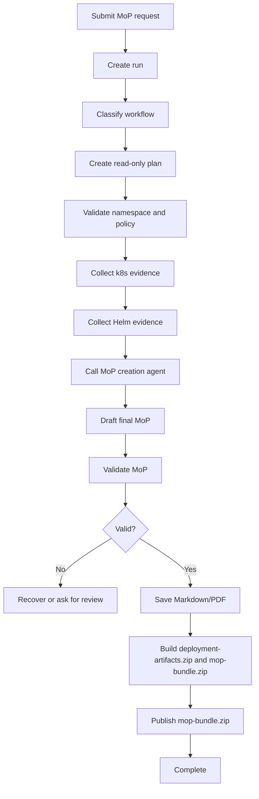

# MoP Generation Page Design and Implementation Plan

## 1. Purpose

The MoP Generation page is implemented as the next ESDA workflow page after Release Notes and Activity. It generates a read-only Method of Procedure document for a selected Kubernetes namespace by coordinating GPT-5 planning with existing BOS Genesis MCP agents.

The page must use the final Release Notes page and Activity page as the reference theme and interaction standard for the whole web application.

Primary outcome:

- User selects an allowed namespace and provides a bounded change intent.
- ESDA plans, gathers read-only evidence, calls the MoP creation agent, preserves professional MoP artifacts when available, validates and assembles a complete bundle, publishes `mop-bundle.zip` to GitHub, and exposes the run in Activity.

---

## 2. Baseline Design Rule

MoP Generation collects a source namespace and a target namespace placeholder. The placeholder is not a mutation target during generation; MoP Execution binds or confirms the real target namespace later. Current placeholder options are `generic-namespace` and `agent-testing`.


Release Notes and Activity are the baseline visual and UX patterns.

MoP Generation must reuse:

- Vibrant AI background with matte glass panels.
- Top navigation, model selector, profile menu, and spacing rhythm.
- Release Notes page composition: input panel, wider live progress panel, artifact preview panel.
- Same sphere animation behavior: large while idle, smaller and active while working.
- Same Live Working Stream behavior: ephemeral and not stored. For MoP, live stream and safe summaries remain visible together until page refresh; only safe summaries reload from PostgreSQL.
- Same persisted Safe Reasoning Summaries after completion.
- Same hidden-by-default floating transaction sidebar for previous/current runs.
- Same Agent Activity Feed behavior: hidden until a run starts, revealed on activity, auto-hide after 30 seconds, pin-able.
- Same copyable/scrollable JSON progress and tool logs.
- Bundle-centric artifact download behavior: the primary user download is `mop-bundle.zip`.

---

## 3. Recommended Scope

Recommended V1 scope is MoP document generation only.

Include:

- Namespace-driven MoP draft generation.
- Read-only Kubernetes inspection.
- Read-only Helm inspection.
- MoP creation agent invocation.
- GPT-5 final drafting and validation.
- Markdown and PDF artifacts.
- GitHub artifact publishing.
- Activity page inclusion.

Exclude for this slice:

- MoP execution.
- Kubernetes mutation.
- Helm upgrade/rollback execution.
- Secret value reads.
- Arbitrary namespace entry.
- In-browser MoP editing.
- External change-management integration.

Reasoning: MoP Generation should be the safe bridge from release-note document generation toward operational workflows. Execution can come later with stronger approval and policy controls.

---

## 4. Page Layout

### 4.1 Desktop Layout

```text
+----------------------------------------------------------------------------------+
| Top Nav: AI brand | LLM Chat | Health Check | Release Notes | MoP Generation ... |
+----------------------------------------------------------------------------------+
| +----------------------+ +--------------------------------+ +------------------+ |
| | MoP Inputs           | | Live Progress                  | | Draft Artifact   | |
| | Namespace dropdown   | | Sphere animation               | | Markdown preview |
| | Environment          | | Ephemeral working stream       | | MD/PDF buttons   | |
| | Change intent        | | Safe reasoning summaries       | | Publish status   | |
| | Helm release         | | JSON agent logs/tool outputs   | |                  | |
| | Generate Bundle      | |                                | |                  | |
| +----------------------+ +--------------------------------+ +------------------+ |
| +--------------------------------------------------------------------------------+ |
| | Agent Activity Feed: Intake -> Classify -> Plan -> Namespace -> K8s -> Helm ... | |
| +--------------------------------------------------------------------------------+ |
+----------------------------------------------------------------------------------+
```

Recommended width split should follow Release Notes:

| Panel | Recommended width | Notes |
|---|---:|---|
| Input | 25 percent | Namespace/change controls. |
| Live Progress | 50 percent | Wider because it carries autonomy evidence. |
| Artifact Preview | 25 percent | Markdown/PDF output. |

### 4.2 Mobile Layout

- Inputs first.
- Live Progress second.
- Artifact preview third.
- Agent Activity Feed collapses to bottom drawer.
- Sidebar remains hidden-by-default.

---

## 5. User Inputs

| Input | Required | Source | Notes |
|---|---:|---|---|
| Namespace | Yes | Backend dropdown | Must be allowlisted and user-authorized. |
| Target namespace placeholder | Yes | Backend dropdown | `generic-namespace` or `agent-testing`; not a mutation target during generation. |
| Environment | Yes | Backend config | `Kubernetes with Helm`, OpenShift, Kustomize, Flux. |
| Change intent | Yes | User text | Bounded natural-language intent. |
| Helm release | Optional | Helm manager evidence/dropdown | Can be inferred from namespace. |
| Implementation window | Optional | User text/date | Included in document control. |
| Analysis depth | Optional | UI dropdown | Fast, standard, deep. |
| Output format | Yes | Fixed | Complete MoP bundle zip in V1. |
| Model profile | Yes | Global selector | GPT-5 default. |

Source namespace and target namespace placeholder dropdowns must not be free-form fields in V1.

---

## 6. Agent and MCP Integration

### 6.1 Agents

| Agent / MCP server | Responsibility |
|---|---|
| `bosgenesis-k8s-inspector-mcp` | Read namespace resources, workloads, pods, services, ingress, events, config references, and health evidence. |
| `bosgenesis-helm-manager-mcp` | Read Helm releases, chart metadata, revisions, values summary, release history, and rollback candidates. |
| `bosgenesis-mop-creation-agent` | Generate initial MoP draft/evidence from selected namespace, Helm metadata, k8s evidence, and user intent. |
| ESDA GPT-5 | Classify, plan, summarize, draft, validate, recover, and write final human-readable MoP. |

### 6.2 Tool Policy

Allowed in V1:

- Namespace list/describe/read-only inspection.
- Helm release list/status/history/read-only metadata.
- MoP draft generation.
- Artifact save/publish.

Denied in V1:

- Kubernetes create/update/delete/exec/logs containing secrets unless explicitly safe and redacted.
- Helm upgrade/install/rollback/uninstall.
- Raw shell/PowerShell.
- Reading Kubernetes Secret values.
- Publishing anywhere except configured artifact repository.

---

## 7. Workflow State Machine



---

## 8. Agent Activity Feed Nodes

| Order | Node | Display label | Outcome shown on hover |
|---:|---|---|---|
| 1 | intake | Intake | Namespace, environment, change intent summary. |
| 2 | classify | Classify | Workflow type, confidence, prompt version/hash. |
| 3 | plan | Plan | Read-only evidence collection and drafting plan. |
| 4 | namespace | Namespace | Allowlist/user authorization result. |
| 5 | k8s_evidence | K8s Evidence | Workloads/services/ingress/events collected. |
| 6 | helm_evidence | Helm Evidence | Releases/revisions/status collected. |
| 7 | mop_agent | MoP Agent | Initial MoP draft/evidence returned by agent. |
| 8 | draft | Draft | GPT-5 final Markdown draft summary. |
| 9 | validate | Validate | Required sections/evidence/rollback checks. |
| 10 | recover | Recover | Recovery or continue decision. |
| 11 | bundle | Bundle | `deployment-artifacts.zip` and `mop-bundle.zip` save result. |
| 12 | publish | Export Github | Git folder, `mop-bundle.zip`, and commit result. |
| 13 | complete | Complete | Final status and Activity visibility. |

---

## 9. Live Progress Requirements

Live Progress must show:

- `00 / CREATING PLAN` before activity feed is revealed.
- Ephemeral working stream while the page is connected.
- Tool events and agent outputs as copyable JSON, with an icon-only Copy Logs control.
- Safe reasoning summaries after completion, displayed in the same pane as the live working stream until refresh.
- Clear failure/recovery states.
- Sphere animation in idle, working, failed, and completed states.

Persistence behavior:

- Active run restores automatically after refresh/navigation.
- Completed run returns to initial empty state unless selected from sidebar.
- Transaction sidebar restores historical MoP runs for the current user.
- Ephemeral working stream is not persisted.
- Safe summaries, events, tool outputs, artifacts, bundle metadata, and publish metadata are persisted in PostgreSQL.

---

## 10. Final MoP Artifact Structure

```markdown
# Method of Procedure

## 1. Document Control
## 2. Change Summary
## 3. Namespace Placeholder and Environment
## 4. Scope and Assumptions
## 5. Source Evidence
## 6. Current State Summary
## 7. Preconditions and Readiness Checks
## 8. Risk Assessment Matrix
## 9. Implementation Steps
## 10. Validation Steps
## 11. Rollback Plan
## 12. Communication Plan
## 13. Approval and Human Review Notes
## 14. Execution Readiness Decision
## 15. Agent Activity and Safe Reasoning Summaries
```

PDF must preserve the MoP Creation Agent professional template when available. ESDA should not invent a separate PDF style when the agent returns `bosgenesis_professional_mop_pdf` output.

---

## 11. Artifact Publishing

MoP Generation should use the same configured Git artifact publisher with distinct names.

| Field | Value |
|---|---|
| Repository | `https://github.com/aveeshek/bosgenesis-artifacts.git` by default |
| Branch | `main` by default |
| Folder | `YYMMDD_HHMMSS_mop_<job-name>` |
| Files | `mop-bundle.zip` |

Local ESDA artifact storage also retains the human MoP Markdown/PDF, installation notes, metadata, machine plan, `deployment-artifacts.zip`, and preserved agent payloads. Publishing must record Git folder, filename, commit hash, publish status, and error details in PostgreSQL.

---

## 12. Activity Page Integration

Activity should become multi-workflow.

Required changes:

- Add workflow filter: All, Release Notes, MoP Generation.
- Show both release-note and MoP timeline nodes.
- Use workflow-specific badges and artifact labels.
- MoP node click shows namespace, environment, change intent, stages, risk/readiness summary, and artifact links.
- Activity Chat can answer questions about selected MoP nodes/artifacts.
- Download actions support the complete MoP bundle zip.
- Reviewed MoP upload/overwrite remains deferred; Release Note reviewed upload remains constrained to exact Release Note filenames.

---

## 13. Data Model Additions

Prefer reusing existing tables:

- `runs.workflow_type = mop_generation`
- `run_events` for ordered progress and safe summaries
- `tool_calls` for MCP calls and sanitized outputs
- `artifacts.artifact_type = mop`
- `artifact_publish_completed` event metadata for Git folder/files

Potential metadata fields:

| Field | Purpose |
|---|---|
| `namespace` | Selected namespace. |
| `environment` | Target environment. |
| `helm_release` | Selected/inferred Helm release. |
| `change_intent` | Sanitized user intent summary. |
| `readiness_status` | ready, needs_review, blocked, failed. |
| `risk_level` | low, medium, high, unknown. |

---

## 14. Implementation Phases

### Phase A: Design and Contracts

- [x] Update HLD, LLD, project specification, and root plan.
- [x] Create this MoP Generation plan.
- [ ] Confirm exact live MCP URLs and deployed tool names for k8s inspector, helm manager, and mop creation agent. Default adapter contracts are implemented and tested locally.
- [x] Confirm namespace allowlist source: `MOP_ALLOWED_NAMESPACES` settings-backed allowlist for V1.
- [x] Confirm artifact folder/file naming: `YYMMDD_HHMMSS_mop_<job-name>` with Git-published `mop-bundle.zip`.

### Phase B: Backend Skeleton

- [x] Add settings for MoP/k8s/Helm MCP endpoints and timeouts.
- [x] Add namespace list endpoint.
- [x] Add MoP run creation API.
- [x] Add placeholder MoP graph and state schema.
- [x] Add MoP artifact type and renderer hooks in Phase F.

### Phase C: MCP Adapters

- [x] Implement k8s inspector MCP adapter.
- [x] Implement helm manager MCP adapter.
- [x] Implement mop-creation-agent MCP adapter.
- [x] Add mapping tests with mocked MCP responses.
- [x] Add redaction tests for secret-like fields.

## 14.1 Implementation Update - Phase A/B/C

Completed in this implementation pass:

- Added MoP Generation settings for MCP endpoints, timeouts, namespace allowlist, default environment, and artifact folder prefix.
- Added `GET /api/mop-generation/namespaces` and `POST /api/mop-generation` backend endpoints.
- Added a placeholder `MopGenerationGraph` that persists a run, emits planning/namespace/MCP-contract events, and records a skeleton final report.
- Added policy and tool-registry entries for `mop_generation` and the read-only MoP MCP adapters.
- Added MCP adapters for k8s inspector, Helm manager, and MoP creation agent with secret redaction.
- Added focused tests for namespace allowlist behavior, run creation, graph wiring, adapter mapping, blocked tools, and redaction.

## 14.2 Implementation Update - Phase D/E

Completed in this implementation pass:

- [x] Added MoP-specific intent classifier, planner, report writer, verifier, and recovery chains.
- [x] Added prompt version/hash support through the same structured chain pattern used by Release Notes.
- [x] Replaced the placeholder graph with real read-only execution stages: classify, plan, namespace validation, k8s evidence, Helm evidence, MoP agent draft, GPT draft, validation, recovery, and final status.
- [x] Persisted durable run events, tool call records, LLM review records, safe summaries, and final Markdown draft text in PostgreSQL.
- [x] Added `/mop-generation` page route and navigation entry.
- [x] Added Release Notes style matte-glass UI with namespace controls, live progress, sphere animation, safe summaries, transaction history, JSON logs, and Agent Activity Feed.
- [x] Added MoP page and chain/graph tests.

Still pending after Phase D/E:

- [ ] Confirm exact live MCP tool names and request/response payloads against deployed agents.
- [x] Render and save final Markdown/PDF artifacts through the artifact service.
- [x] Publish unextracted `mop-bundle.zip` to `aveeshek/bosgenesis-artifacts` through the configured Git artifact publisher.
- [x] Add MoP runs and artifacts to the Activity timeline/chat experience.


Still pending after Phase A/B/C:

- Validate exact live MCP tool names against the deployed agents.
- Validate exact live MCP tool names against the deployed agents.
- Implement artifact renderer, Git publishing, and Activity inclusion.

### Phase D: LLM Chains and Graph

- [x] Add MoP classifier.
- [x] Add planner/verifier/recovery chains.
- [x] Add prompt version/hash logging.
- [x] Add graph nodes and persisted events.
- [x] Add safe reasoning summaries.
- [x] Add read-only graph execution through k8s-inspector, helm-manager, and mop-creation-agent MCP adapters.
- [x] Add deterministic fallback MoP Markdown generation when MCP URLs are not configured.
- [x] Add graph tests for fallback execution, required events, and validation.

### Phase E: UI Page

- [x] Add `/mop-generation` route and nav item.
- [x] Build input/live progress/artifact panels from Release Notes baseline.
- [x] Add sphere animation state behavior.
- [x] Add transaction sidebar integration.
- [x] Add Agent Activity Feed nodes.
- [x] Add scrollable/copyable JSON logs.
- [x] Add namespace dropdown loading from backend allowlist.
- [x] Add active-run restore and completed-run manual restore behavior.
- [x] Add UI contract test for the MoP page shell.

### Phase F: Artifacts and Publishing

- [x] Render final MoP Markdown.
- [x] Render final MoP PDF.
- [x] Save local artifacts.
- [x] Publish unextracted `mop-bundle.zip` to Git artifact repo.
- [x] Add download endpoints/links.

### Phase G: Activity Integration

- [x] Extend Activity API to include MoP runs.
- [x] Add workflow filters and badges.
- [x] Add MoP detail rendering.
- [x] Add MoP artifact downloads.
- [x] Ground Activity Chat on selected MoP artifacts.


## 14.3 Implementation Update - Phase F/G

Completed in this implementation pass:

- [x] MoP graph renders final Markdown and PDF artifacts through the bundle builder and preserves MoP Creation Agent professional artifacts where available.
- [x] MoP graph saves local human MoP Markdown/PDF, installation notes, metadata, machine plan, `deployment-artifacts.zip`, and complete `mop-bundle.zip` artifacts.
- [x] MoP page exposes `Download MoP Bundle` for the complete `mop-bundle.zip`.
- [x] Successful MoP runs publish the unextracted `mop-bundle.zip` through the configured Git artifact publisher with publish events and metadata.
- [x] Activity API now exposes generic `/api/activity/runs` list/detail/artifact/download/upload routes for Release Note and MoP workflows.
- [x] Activity page now includes workflow filter options, compact workflow badges, MoP detail stages, MoP bundle downloads, and MoP-aware artifact labeling.
- [x] Activity Chat now accepts selected MoP runs and grounds answers on MoP artifacts and run events.
- [x] Added regression tests for MoP Activity timeline, detail rendering, downloads, and Activity Chat grounding.

Still pending after Phase F/G:

- [ ] Validate exact live MCP tool names and deployed response shapes against the real k8s, Helm, and MoP creation agents.
- [ ] Browser-level Activity and MoP page QA once the in-app browser sandbox issue is resolved.


## 14.4 Implementation Update - 2026-06-29 Final MoP Bundle Baseline

- [x] Added target namespace placeholder dropdown below Source Namespace with `generic-namespace` and `agent-testing` choices.
- [x] Changed Environment display from `Kubernetes Generic` to `Kubernetes with Helm`.
- [x] Renamed the submit button to `Generate MoP Bundle`.
- [x] Corrected initial autonomy note order to show `00 / CREATING PLAN` before Intake/Classify/Plan events.
- [x] Merged Live Working Stream and Safe Reasoning Summaries into a single Autonomy Notes pane while keeping live notes non-persistent.
- [x] Kept live working stream visible together with persisted safe summaries until manual page refresh.
- [x] Added Autonomy Notes maximize icon and modal with reasoning stream/summaries on the left and formatted JSON logs on the right.
- [x] Replaced Copy Logs text button with an icon-only button while preserving copy behavior.
- [x] Added `Download MoP Bundle` behavior and `/api/runs/{run_id}/bundle` fallback for complete bundle retrieval.
- [x] Updated bundle publishing so GitHub stores the unextracted `mop-bundle.zip`, not only individual Markdown/PDF files.
- [x] Added raw generated ConfigMap promotion into `deployment-artifacts/kubernetes-manifests/raw/` when agent payloads include ConfigMap YAML.
- [x] Ensured `deployment-artifacts.zip` is generated after raw ConfigMaps are copied.

### Phase H: Testing and Acceptance

- [ ] Unit test namespace allowlist policy.
- [ ] Unit test MCP adapter mapping and redaction.
- [x] Unit test MoP validator required sections.
- [x] Integration test graph fallback happy path.
- [ ] Integration test live MCP happy path after exact deployed tool names are confirmed.
- [x] Integration test failed MCP/recovery fallback path.
- [x] Integration test artifact save and Git publish.
- [x] UI contract test page shell and asset load.
- [ ] UI browser test sidebar behavior.
- [x] Activity inclusion test.

---

## 15. Acceptance Criteria

MoP Generation is ready when:

- User can open `/mop-generation` from the top nav.
- User can select an allowed namespace from a dropdown.
- GPT-5 creates a visible plan before tools execute.
- k8s inspector, helm manager, and mop-creation-agent are called through MCP adapters.
- Live Progress shows working stream, tool events, safe summaries, and JSON logs.
- Agent Activity Feed shows MoP-specific nodes.
- Complete `mop-bundle.zip` is generated and downloadable; local storage also retains Markdown/PDF components.
- Successful runs publish unextracted `mop-bundle.zip` to the configured artifact repo folder.
- Activity shows MoP runs alongside Release Notes.
- Activity Chat can answer questions about selected MoP runs/artifacts.
- No hidden chain-of-thought or secret values are stored/displayed.
- Tests cover policy, adapters, graph, artifacts, publishing, UI contracts, and Activity inclusion.

---

## 16. Open Questions

- Exact MCP tool names for `bosgenesis-k8s-inspector-mcp`, `bosgenesis-helm-manager-mcp`, and `bosgenesis-mop-creation-agent`.
- Whether namespace list comes from k8s inspector, static config, PostgreSQL policy table, or a combination.
- Whether MoP Generation should support user-uploaded templates in V1 or use only internal/default templates.
- Whether reviewed MoP upload/overwrite should be enabled in Activity after bundle baseline stabilizes.
- Whether external change-management IDs are required in the generated Document Control section.
