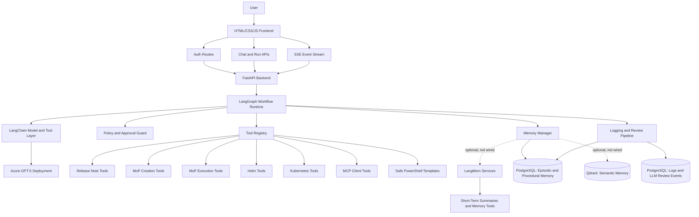
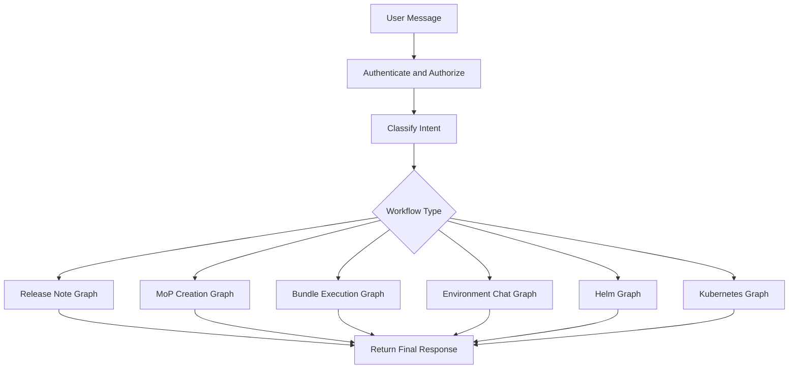
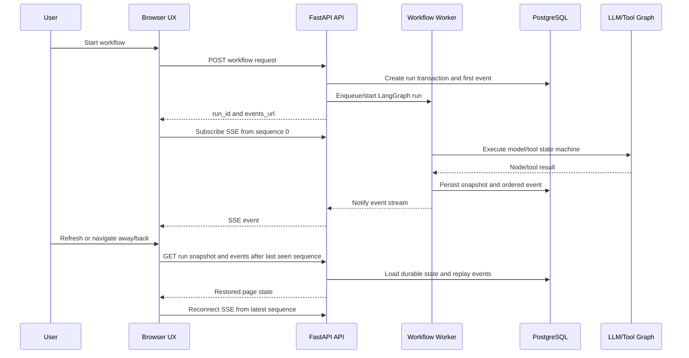
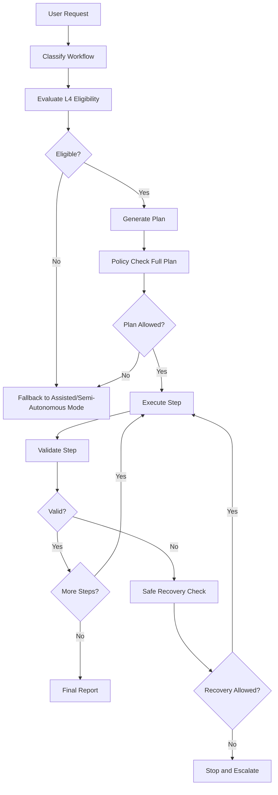

# Project Architecture Specification: BOS Genesis ESDA Chatbot Console

**Code-Verified Baseline:** 2026-07-12 (`v0.2.9`, commit `aad7ee6`)

## 1. Purpose

This document defines the project and architecture specification for the BOS Genesis ESDA Chatbot Console.

The application is a Python-based web project with:

- A pure Python backend.
- A browser frontend built with JavaScript, HTML, and CSS.
- Azure-deployed GPT-5 as the LLM.
- LangGraph and LangChain for agent orchestration and model/tool integration.
- PostgreSQL for current durable workflow, chat, memory, audit, and operational records.
- Optional LangMem, Qdrant, and Redis extension points; the current code does not use their extraction, semantic-retrieval, or coordination APIs.
- Conditional L4 autonomy within a tightly bounded operational domain.

This document should be treated as the controlling architecture specification. The LLD should remain aligned with it.

## 1.1 Implemented V1 Baseline (2026-07-12)

The current implementation is a multi-workflow local ESDA console. Release Notes is the reference artifact workflow; Bundle Generation, Bundle Execution, Activity, and Environment Chat are also implemented and integrated.

Implemented and verified:

- Local FastAPI web application with authenticated UI, matte glass JavaScript/HTML/CSS frontend, SSE progress, approvals, L4 audit, LLM chat, release-note workflow page, Bundle Generation page, Bundle Execution page, Activity timeline/chat page, model selector, profile menu, and hidden/pinnable workflow activity rail.
- PostgreSQL-backed users, runs, ordered events, tool calls, LLM review logs, approvals, policies, procedures, user transaction visibility, and artifact metadata.
- Azure OpenAI integration through LangChain using Azure CLI or default Azure credentials for local proofing. UI model labels are display-only: `SIGMA 5 PRO` maps to the GPT-5 Pro profile, `SIGMA 4.1` maps to GPT-4.1, `TRAINIUM BEHEMOTH` maps to Llama70B, `TRAINIUM GEMMA` maps to Gemma, and `CUSTOM` maps to the custom Azure profile.
- Release-note workflow classifier, planner, verifier, recovery recommender, report writer, structured schemas, prompt versioning, and prompt hash logging.
- MCP-first `bosgenesis-release-note-agent` integration using `github_release_scan_start`, `github_release_scan_status`, `github_release_generate_note`, and `github_release_get_artifact`.
- Release-note-agent output is treated as the first evidence source; ESDA GPT finalizes the Markdown draft only from collected evidence, scan summaries, and bounded recovery notes.
- Temporary repository clone, common vulnerability scan, LLM-assisted safe vulnerability summary, `pylint` or safe static code-quality scan, cleanup, and high-level security/quality matrices.
- Final Markdown and PDF artifacts include release-note content plus code-quality and vulnerability scan details.
- Successful runs publish `release-notes.md` and `release-notes.pdf` to `aveeshek/bosgenesis-artifacts` under `YYMMDD_HHMMSS_<job-name>` when Git publishing is enabled. Activity page uploads can later overwrite those exact files with reviewed local replacements, or create a stable GitHub folder for local-only historical runs.
- Live progress is scrollable/copyable. Ephemeral working notes stream only while the page is connected and are not persisted; persisted Safe Reasoning Summaries replace them after completion.
- Agent Activity Feed visualizes autonomy nodes from intake through publish/complete, remains hidden until a run starts, auto-hides after activity, and can be pinned by the user.
- Completed runs do not automatically reload after refresh; active runs restore automatically. Historical runs restore only when selected from the floating history drawer.
- The repository contains 170 automated tests across authentication, policy, logging, model profiles, Release Notes, Activity, Bundle Generation, Bundle Execution, Environment Chat, artifact publishing, and L4 controls.
- Bundle Generation is implemented as a read-only bundle workflow at `/mop-generation`; its backend workflow id remains `mop_generation`. It uses source namespace, target namespace placeholder, environment, intent, optional Helm release, analysis depth, GPT-backed classifier/planner/verifier/recovery chains, MCP adapters, professional MoP Creation Agent artifacts where available, local bundle assembly, bundle download, Git publishing, and Activity inclusion.
- MoP artifacts now center on `mop-bundle.zip` as the final Git-published artifact. The bundle includes root MoP Markdown/PDF, installation notes, `machine_execution_plan.yaml`, metadata, `deployment-artifacts/`, `deployment-artifacts.zip`, preserved agent payloads, and raw generated ConfigMaps under `deployment-artifacts/kubernetes-manifests/raw/` when present.
- Activity is multi-workflow and supports Release Note, Bundle Generation, and Bundle Execution timeline nodes, workflow filters, run details, artifact downloads, and artifact-grounded chat. Release Notes expose Markdown/PDF actions; Bundle Generation exposes complete MoP bundle actions.
- Bundle Execution is implemented as the governed execution workflow at `/mop-execution`; its backend workflow id remains `mop_execution`. It selects a generated `mop-bundle.zip`, performs ESDA-side preflight, registers and validates the bundle through `bosgenesis-mop-execution-agent`, creates dry-run jobs, handles decision-required states, gates mutation behind human approval, polls mutation/validation/report states, supports dedicated cleanup/revert actions, and stores redacted execution evidence in PostgreSQL.
- Environment Chat is implemented at `/env-agent`. It provides a prompt-first 40/60 Live Progress and chat layout, session restoration, PostgreSQL short/long-term session memory, a 13-node diagnostic LangGraph, namespace-scoped Kubernetes/Helm inspection, typed remediation proposals, explicit approval, MCP execution, and post-action verification.

Current V1 scope decision:

- Do not start every memory store and workflow family at once.
- Keep PostgreSQL as the mandatory store for runs, logs, LLM review records, transaction visibility, and artifact metadata.
- Keep Qdrant optional until semantic memory lookup is required by a workflow.
- Do not use ClickHouse or SQLite in the current V1 path.
- Do not deploy ESDA to the cluster yet; local ESDA uses ingress for existing BOS Genesis services, while future Helm deployment should use in-cluster service DNS names.
- Treat GitHub artifact publishing and Activity artifact replacement as narrow, configured artifact operations, not as general unrestricted write-back capability. Release Notes uses `release-notes.md`/`release-notes.pdf`; Bundle Generation publishes `mop-bundle.zip` under a distinct MoP folder prefix.

---
## 2. Goals

The system must provide:

1. Authenticated web access to a chatbot-style operational console.
2. A Python backend that owns all secrets, policies, tools, memory, and LLM calls.
3. A JavaScript/HTML/CSS frontend with Bootstrap 5.3 and optional jQuery, Chart.js, and Plotly.js.
4. Azure GPT-5 integration through LangChain-compatible model wrappers.
5. LangGraph-based workflow orchestration for release-note creation, Bundle Generation, Bundle Execution, Environment Chat, Helm management, and Kubernetes management.
6. PostgreSQL-backed workflow history, bounded chat context, episodic memory, and procedural records.
7. A memory abstraction that can adopt LangMem extraction/consolidation once those APIs are wired.
8. Optional Qdrant-backed semantic memory when a workflow requires similarity retrieval.
9. PostgreSQL-backed detailed logs, LLM explanations, tool events, and analytics.
10. Conditional L4 autonomy with strict operational-design-domain controls.

---

## 3. Recommended Direction

The best way forward is to keep the first implementation boring, explicit, and inspectable.

Recommended decisions:

| Area | Recommendation |
|---|---|
| Backend | Python FastAPI. |
| Frontend | Server-rendered HTML templates or static HTML plus plain JavaScript. |
| UI framework | Bootstrap 5.3. |
| JS helpers | jQuery only where it reduces DOM/event boilerplate. |
| Charts | Chart.js for simple metrics, Plotly.js for drill-down/interactive analysis. |
| Agent orchestration | LangGraph state machine per workflow family. |
| LLM integration | LangChain `ChatOpenAI` against Azure v1 endpoint if available; otherwise `AzureChatOpenAI` with Azure API version. |
| Memory control | Current: PostgreSQL run/chat records plus in-process LangGraph `MemorySaver` for Environment Chat. Target: PostgreSQL graph checkpoints and LangMem extraction/search/consolidation. |
| Episodic memory | PostgreSQL structured run, message, event, and `agent_memories` records. |
| Semantic memory | Optional future Qdrant collections; no current workflow calls Qdrant. |
| Procedural memory | PostgreSQL source of truth plus optional Qdrant semantic index. |
| Detailed logs | PostgreSQL. |
| Raw hidden reasoning | Do not attempt to store hidden chain-of-thought. Store available reasoning summaries, plans, decisions, explanations, observations, and policy rationales. |
| Autonomy | Conditional L4 only inside approved workflows, namespaces, environments, tools, and rollback constraints. |

Important correction:

LangMem is useful for memory extraction, search, profile/procedure maintenance, and summarization, but it still needs storage and does not replace LangGraph state/checkpointing. Use LangGraph for workflow state and thread checkpoints; use LangMem to manage what gets remembered, searched, summarized, and refined.

Accepted architecture decision:

| Decision | Status | Rationale |
|---|---|---|
| LangGraph checkpointing owns live thread and workflow state. | Target; partial | Environment Chat currently uses in-process `MemorySaver`; durable workflow recovery is implemented through PostgreSQL runs/events rather than a PostgreSQL LangGraph saver. |
| LangMem is the memory-management layer, not the state store. | Target; not wired | The package/feature flag is detected, but current code does not invoke LangMem extraction, search, or consolidation APIs. |
| MongoDB is excluded from V1. | Accepted | PostgreSQL and Qdrant cover transactional memory, semantic recall, and high-volume logs without adding another datastore early. |
| PostgreSQL owns workflow transactions and UI rehydration state. | Accepted | Runs must survive refresh/navigation and remain auditable after the user clears them from the visible sidebar. |
| Browser UX is a state-machine client, not the workflow owner. | Accepted | Agents, models, and tools continue in background workers while pages restore progress from persisted snapshots and events. |

### 3.1 Persisted Workflow UX and Execution Behavior

PostgreSQL is the browser-independent source of truth for persisted runs, events, artifacts, approvals, and chat sessions.

Code-verified behavior:

- Release Notes and Bundle Generation create PostgreSQL runs before model/tool work, execute through FastAPI background tasks, persist ordered events, and expose replayable SSE.
- Bundle Execution persists ESDA run state while the external MoP Execution Agent owns its dry-run/mutation job state machine; ESDA polls and records redacted observations.
- Environment Chat executes one LangGraph turn synchronously, persists the resulting snapshot/messages/memory records, and restores sessions from PostgreSQL. It does not currently stream graph tokens or run in a detached worker.
- The browser renders persisted state and never owns durable workflow truth.
- Active artifact workflows can reconnect to SSE; completed runs restore only when explicitly selected where that page contract applies.
- ChatGPT-style history drawers list user-visible transactions or chat sessions. Clear-all hides/removes user-visible history according to the route contract; governance records remain where required.
- A future separate worker and PostgreSQL LangGraph checkpointer may improve process-level recovery, but they are not present in the current repository.
---

## 4. Non-Goals

The system will not:

- Execute raw shell or arbitrary PowerShell generated by the LLM.
- Give GPT-5 direct Kubernetes, Helm, database, or filesystem access.
- Expose Azure OpenAI credentials in the browser.
- Store or display secrets in logs, memory, prompts, or final reports.
- Store hidden model chain-of-thought.
- Perform production mutation outside explicitly approved policy.
- Claim unconditional full autonomy.

---

## 5. Architecture Overview



---

## 6. Technology Stack

| Layer | Choice | Notes |
|---|---|---|
| Backend language | Python | Main implementation language. |
| Backend framework | FastAPI | REST APIs, SSE streaming, auth middleware, OpenAPI docs. |
| Frontend | HTML, CSS, JavaScript | No React requirement for initial build. |
| UI toolkit | Bootstrap 5.3 | Fast, stable, easy operational UI. |
| JS helpers | jQuery optional | Useful for DOM updates, AJAX, and simple event handling. |
| Charts | Chart.js, Plotly.js | Chart.js for dashboards; Plotly.js for interactive diagnostics. |
| LLM provider | Azure GPT-5 | Deployment details configured by environment variables. |
| LLM integration | LangChain | Azure GPT-5 wrapper, tool binding, structured outputs. |
| Workflow runtime | LangGraph | State machine, conditional edges, interrupts, checkpointing. |
| Memory framework | `MemoryService` facade; LangMem optional/not wired | Current code provides bounded context and PostgreSQL memory writes; LangMem APIs are a roadmap capability. |
| Short-term memory | PostgreSQL chat window plus in-process ephemeral turns | Environment Chat also uses LangGraph `MemorySaver` within the running process. |
| Episodic memory | PostgreSQL | Runs, messages, steps, events, memories, and tool evidence references. |
| Semantic memory | Qdrant optional/future | Configuration exists, but no current collection, upsert, or query code exists. |
| Procedural memory | PostgreSQL preferred; Qdrant semantic index optional | Workflow procedures, runbooks, guardrail recipes, reusable plans. |
| Logs and analytics | PostgreSQL | High-volume logs, LLM explanations, tool events, review analytics. |
| Background jobs | FastAPI background tasks for artifact workflows; synchronous Environment Chat; external polling for Bundle Execution | A dedicated worker can be added later. |
| Deployment | Docker Compose first, Kubernetes later | Keeps early iteration simple. |

---

## 7. Frontend Specification

### 7.1 Frontend Style

The frontend should be practical and operational, not marketing-oriented.

Recommended:

- Bootstrap 5.3 layout.
- Plain JavaScript modules under `backend/app/static/js/`.
- CSS under `backend/app/static/css/`.
- Server-rendered Jinja2 templates or static HTML served by FastAPI.
- SSE for live run updates.
- Replayable SSE using persisted event ids/sequences so progress survives refresh and page navigation.
- Fetch API for REST calls.
- jQuery allowed where it makes modal/table/event code simpler.
- Chart.js for run metrics and tool-call distribution.
- Plotly.js for time-series traces, latency drilldowns, and workflow analytics.

### 7.2 Pages

Implemented pages:

| Page | Route | Current purpose |
|---|---|---|
| Login | `/login` | Local username/password authentication and signed session cookie. |
| LLM Chat / Health Check | `/` | General model chat and bounded diagnostic entry point. |
| Release Notes | `/release-notes` | Generate, scan, render, download, and publish release-note Markdown/PDF artifacts. |
| Bundle Generation | `/mop-generation` | Generate and publish complete `mop-bundle.zip` artifacts. |
| Bundle Execution | `/mop-execution` | Preflight, validate, dry-run, approve, mutate, validate, report, and cleanup through the execution agent. |
| Environment Chat | `/env-agent` | Prompt-first Kubernetes/Helm diagnostics and approval-gated namespace remediation. |
| Activity | `/activity` | Multi-workflow timeline, run detail, artifact download/upload, and artifact-grounded chat. |
| Approvals | `/approvals` | Review and decide pending approval requests. |
| L4 Audit | `/l4-audit` | Conditional-L4 eligibility, stop checks, and audit export. |

Shared components:

- Global cosmetic model selector backed by stable model profile ids.
- Signed-in profile menu.
- Hidden transaction/session drawer on workflow pages.
- Matte-glass panels and shared Three.js sphere implementation.
- SSE run event streaming for workflows that execute in background tasks.
- Persisted run snapshots/events plus page-local ephemeral working notes.

Future administrative pages such as Memory Review, LLM Review, Logs Dashboard, and full Admin configuration are architecture roadmap items and do not currently have routes.

### 7.3 Frontend Components

| Component | Responsibility |
|---|---|
| `ChatComposer` | Submit user request, workflow type, environment, autonomy mode. |
| `ConversationPanel` | Render user/assistant/tool messages. |
| `RunTimeline` | Show current LangGraph node, step status, and progress from replayable run events. |
| `TransactionSidebar` | Floating hidden-by-default history drawer for prior workflow transactions. |
| `RunStateController` | Page-level state machine that hydrates snapshots, replays events, and reconnects SSE. |
| `PlanPanel` | Display plan and risk classification. |
| `ToolEvidencePanel` | Display tool inputs, outputs, redactions, and validation. |
| `ApprovalModal` | Approve/reject/modify gated actions. |
| `ArtifactPanel` | Render generated release notes, MoPs, and reports. |
| `ReleaseNoteForm` | Capture GitHub URL, source range, release name, audience, and format. |
| `MopGenerationForm` | Capture namespace, change intent, target environment, Helm release scope, analysis depth, and output format for Bundle Generation. |
| `LiveReasoningPanel` | Display model-provided reasoning summaries and action explanations without hidden chain-of-thought. |
| `MemoryPanel` | Show short-term, episodic, semantic, and procedural memory used. |
| `ReasonReviewPanel` | Show model-provided reasoning summaries and action explanations. |
| `MetricsCharts` | Chart.js/Plotly visualizations from PostgreSQL. |
| `EnvAgentChat` | Chatbot workspace for namespace/environment questions, tool-chained diagnostics, remediation proposals, and execution results. |
| `EnvAgentGlobe` | Shared sphere/globe visual that starts large while idle and shrinks into a working indicator after user submission. |


### 7.4 Bundle Generation Page Specification

The Bundle Generation page is implemented and must remain aligned with the final Release Notes/Activity visual baseline. Its backend workflow id remains `mop_generation`.

Required page behavior:

- Route: `/mop-generation`.
- Top navigation, model selector, profile menu, background, matte glass panels, sphere animation, progress tiles, activity rail, and artifact preview match the final Release Notes design.
- The left panel captures source namespace, target namespace placeholder, environment, optional Helm release, change intent, implementation window, and analysis depth.
- Source namespace options come from an allowlisted backend endpoint. Current V1 values include `bosgenesis`, `signoz`, and `agent-testing`.
- Target namespace is a generation placeholder for later Bundle Execution. Current V1 choices are `Generic` and `agent-testing`.
- Environment options are `Kubernetes with Helm`, `OpenShift`, `Kustomize`, and `Flux`; current evidence collection is read-only and optimized for Kubernetes with Helm.
- The main action button is `Generate MoP Bundle`.
- The central Live Progress panel shows `00 / CREATING PLAN`, ephemeral working stream, persisted safe summaries, copyable JSON event logs, and scrollable agent outputs.
- Live working stream and safe summaries share one Autonomy Notes pane. During an active page session, both remain visible after completion until the user refreshes; only safe summaries reload from PostgreSQL.
- Autonomy Notes includes an icon-only log copy button and a maximize icon. The maximize modal shows live reasoning stream and safe summaries on the left and formatted agent JSON logs on the right.
- The bottom Agent Activity Feed uses MoP-specific nodes: Intake, Classify, Plan, Scope, K8s, Helm, MoP Agent, Draft, Validate, Recover, Bundle, Export Github, Complete.
- The right artifact panel exposes `Download MoP Bundle` for the complete `mop-bundle.zip`.
- Successful runs publish the unextracted `mop-bundle.zip` to `aveeshek/bosgenesis-artifacts` under `YYMMDD_HHMMSS_mop_<job-name>` or equivalent configured prefix.
- Activity lists Bundle Generation runs together with Release Notes and Bundle Execution reports, using workflow badges and workflow filters.

Required safety behavior:

- Bundle Generation is read-only in V1. It may inspect namespace and Helm metadata through approved MCP tools, but it must not mutate Kubernetes, Helm, Git, or runtime resources except for configured artifact publishing.
- Kubernetes secrets must not be read. Secret references may be represented as redacted metadata.
- All model reasoning must be captured only as safe summaries, decisions, policy notes, and validation explanations. Hidden chain-of-thought must not be stored or displayed.
- The final MoP bundle must include explicit assumptions, missing evidence, rollback plan, validation plan, human approval notes, execution readiness status, machine plan, metadata, deployment artifacts, and zip archives.

### 7.5 Bundle Execution Page Specification

The Bundle Execution page is the governed runtime surface for generated MoP bundles and must reuse the final Release Notes/Bundle Generation visual baseline. Its backend workflow id remains `mop_execution`.

Required page behavior:

- Route: `/mop-execution`.
- Reuse top navigation, global model selector, profile menu, matte-glass panels, shared sphere animation, Autonomy Notes, copy/maximize controls, result panel, and bottom Agent Activity Feed.
- Bundle source selector supports Activity run, artifact repository folder, and uploaded bundle.
- Activity-run selection lists successful `mop_generation` runs with `mop-bundle.zip` and shows source namespace, generated time, publish folder, checksum when available, and bundle size.
- Target namespace is selected during execution and is not inherited blindly from Bundle Generation placeholders.
- Execution modes are `Dry-run only`, `Dry-run then approval`, and `Approved mutation (agent approval required)`. Cleanup/revert is a dedicated result-panel action, not an execution mode. Mutation controls are hidden or disabled until validation, dry-run, and approval gates pass.
- ESDA generates a correlation ID and idempotency keys for bundle validation, dry-run creation/start, instruction submission, approval submission, mutation creation/start, rollback, and cleanup.
- ESDA performs local preflight before agent calls: bundle presence, required files, source Secret exposure, cluster-scoped destructive actions, and namespace mismatch warnings.
- Autonomy Notes shows ephemeral live working stream and persisted safe summaries together while the page session remains open. Only safe summaries reload after refresh.
- Agent Activity Feed nodes are Intake, Preflight, Agent Health, Bundle Validate, Dry-run Job, Dry-run, Observations, Decision, Dry-run Report, Approval, Mutation Job, Mutation, Validation, Reports, Rollback/Cleanup, Complete.
- Result panel shows validation errors, dry-run observations, decision-required context, approval state, mutation state, validation matrix, report links, rollback-required state, cleanup/revert actions, and distinct cleanup completion status.

Required safety behavior:

- ESDA must not directly call Kubernetes or Helm mutation tools. All dry-run, mutation, validation, rollback, cleanup, and reports go through `bosgenesis-mop-execution-agent`.
- ESDA may use GPT-5 to summarize options and instructions, but it must not auto-submit repair instructions or approval rationales.
- Mutation requires accepted human approval tied to operator identity, target namespace, dry-run job ID, command fingerprints, scope, rationale, and expiry.
- Unknown mutation outcome, ambiguity, true validation failure, or rollback-required state must pause the workflow for operator review. `mutation_succeeded` plus `validation_status = needs_review` with healthy Helm/Kubernetes evidence is treated as `completed_with_review`, not failed; terminal states stop blinking and the approval gate is hidden or disabled.

### 7.6 Environment Chat Page Specification

Environment Chat is implemented as a prompt-first page rather than a form-driven workflow.

Current page behavior:

- Route: `/env-agent`.
- Navigation label: `Environment Chat`.
- Backend workflow id: `env_agent`.
- Desktop layout is 40% Live Progress and 60% Environment Chat; it collapses responsively on smaller viewports.
- No namespace, mode, or scope selectors are shown. The backend infers namespace from the prompt, then from the latest session memory; it infers diagnostic/proposal/remediation mode from prompt language.
- The shared sphere starts large while idle and shrinks into a working indicator after submit.
- Autonomy Notes includes live non-persisted working notes, persisted safe summaries, copy logs, and a maximize modal with reasoning summaries and formatted JSON logs.
- The hidden workflow drawer lists PostgreSQL chat sessions by session id/title and restores messages plus the latest run snapshot. Clear-all hides the user's Environment Chat transactions without deleting audit evidence.
- The response is formatted Markdown generated from structured graph state and real tool evidence.
- A typed remediation proposal renders an approval card. `Approve & Execute` first approves the stored approval request, then calls the remediation execution endpoint.

Current tool behavior:

| Adapter | Read operations | Approval-gated operations |
|---|---|---|
| Kubernetes inspector | Namespace summary, pods, events, pod logs, deployments, services, ingress, PVCs, ConfigMap metadata | Rollout restart, scale, patch, apply, namespace-scoped resource delete |
| Helm manager | Release list/status/history/values, repository list | Install, upgrade, uninstall, rollback, repository add/update |
| Data ingestion | Optional prior namespace snapshot/inventory | None |
| Observability | Optional traces, error spans, metrics query | None |

Execution rules:

- The 13-node Environment Chat graph performs classification, planning, read-only evidence collection, diagnosis, remediation proposal, verification planning, and reporting.
- The graph's `execute` node is intentionally non-mutating. Actual mutation is a separate endpoint driven by a persisted structured action and approval id.
- Policy and tool registry checks run before approval creation and again before execution.
- Helm install/upgrade performs dry-run first and supports bounded repository add/update and OCI fallback for public Bitnami charts.
- A successful mutation is followed by a read-only Kubernetes or Helm verification call.
- Cluster-wide actions, namespace deletion, Secret reads, raw shell, arbitrary PowerShell, CRDs, ClusterRoles, and ClusterRoleBindings are blocked.
- Downstream MCP HTTP errors are reported as failures; ESDA does not infer success from a plan alone.

## 8. Backend Specification

### 8.1 Backend Modules

The current backend is intentionally compact: FastAPI route composition remains in `main.py` while workflow logic is split into services, chains, graphs, tools, policy, persistence, and UI assets.

```text
backend/app/
  main.py                    # FastAPI app, routes, background orchestration
  config.py                  # Pydantic settings and redacted startup summary
  dependencies.py            # Auth/database dependency helpers
  activity.py                # Timeline, artifact actions, artifact chat context
  approvals.py               # Approval lifecycle service
  artifacts.py               # Local artifact storage and PDF rendering
  artifact_publisher.py      # Narrow Git artifact publisher
  env_agent.py               # Environment Chat contracts and risk catalogue
  memory.py                  # Environment Chat session memory facade
  mop_bundle.py              # Deterministic bundle builder
  mop_execution.py           # Bundle preflight, run store, state helpers
  repo_analysis.py           # Temporary clone, security and quality scans
  auth/security.py           # Password hashing and signed session cookie
  chains/
    release_notes.py
    mop_generation.py
    env_agent.py
    schemas.py
  graphs/
    diagnostic.py
    foundation.py
    release_notes.py
    mop_generation.py
    env_agent.py
    event_bus.py
    router.py
  llm/azure_gpt5.py          # Azure/Ollama profiles and structured calls
  tools/
    registry.py
    contracts.py
    mcp_client.py
    release_note_agent.py
    mop_agents.py
    mop_execution_agent.py
    env_agents.py
    rest_get.py
    powershell_get.py
  policy/evaluator.py
  logging/
    setup.py
    postgres_logger.py
    redaction.py
  db/
    database.py
    models.py
  templates/
  static/css/
  static/js/
```

There is no separate `frontend/` project, route package, migration package, Redis client, Qdrant repository, or PostgreSQL LangGraph saver in the current code.

### 8.2 Core API Endpoints

Implemented page and platform routes:

| Area | Implemented routes |
|---|---|
| System/model | `GET /health`, `GET /api/llm/model-profiles`, `POST /api/llm/chat`, `POST /api/llm/smoke-test` |
| Authentication | `GET/POST /login`, `GET /logout`, `POST /api/auth/login`, `POST /api/auth/logout`, `GET /api/auth/me` |
| Pages | `/`, `/release-notes`, `/mop-generation`, `/mop-execution`, `/env-agent`, `/activity`, `/approvals`, `/l4-audit` |
| Generic runs | `GET /api/runs/{run_id}`, `GET /snapshot`, `GET /events` SSE, `POST /stop`, `GET /artifacts`, `GET /bundle` |
| Transactions | `GET /api/transactions`, `POST /api/transactions/{run_id}/clear`, `POST /api/transactions/clear` |
| Artifacts | `GET /api/artifacts/{artifact_id}` |
| Release Notes | `POST /api/release-notes` |
| Bundle Generation | `GET /api/mop-generation/namespaces`, `POST /api/mop-generation` |
| Activity | Multi-workflow list/detail/artifact download/upload endpoints under `/api/activity` plus `POST /api/activity/chat` and chat-session retrieval |
| Policy/approval | `POST /api/policy/evaluate`; list/approve/reject/modify-and-recheck under `/api/approvals` |
| Conditional L4 | eligibility, stop check, audit list/export, and procedure list/create endpoints |
| Environment Chat | `GET /api/env-agent/contract`, session list/detail, `POST /api/env-agent/chat`, `POST /api/env-agent/remediation/execute` |
| Bundle Execution | bundle list, preflight/upload, validate/upload, dry-run, decision context, instruction, dry-run report, report download, approval, mutation, cleanup, and validation-report endpoints under `/api/mop-execution` |

Environment Chat does not use SSE for graph execution in the current implementation; the chat request awaits the graph and returns a run snapshot. The page still uses persisted sessions/runs/events for restoration. Release Notes, Bundle Generation, and Bundle Execution use run snapshots plus SSE event streams.

### 8.3 Release-Note Final Implementation Modules

The final release-note implementation uses the following concrete module boundaries:

| Module | Contract |
|---|---|
| `backend/app/graphs/release_notes.py` | Owns the release-note state machine: classify, plan, evidence, clone, security scan, quality scan, cleanup, draft, validate, recover, artifact save, publish, and final status. |
| `backend/app/chains/release_notes.py` | Owns prompt-versioned classifier/planner/verifier/recovery/report-writer chains and safe reasoning summary fields. |
| `backend/app/tools/release_note_agent.py` | Owns MCP/REST compatibility with `bosgenesis-release-note-agent` and artifact hydration. |
| `backend/app/repo_analysis.py` | Owns temporary local clone, source inventory, common vulnerability scan, LLM-safe security review, code quality scan, and cleanup. |
| `backend/app/artifacts.py` | Owns local artifact persistence, artifact metadata, MIME types, and download references. |
| `backend/app/artifact_publisher.py` | Owns clone/commit/push to the configured artifact Git repository. |
| `backend/app/static/js/release_notes.js` | Owns release-note page state machine, active-run rehydration, ephemeral working stream, safe summaries, activity rail, history drawer, and artifact download actions. |

### 8.4 Release-Note Artifact Publishing Contract

Artifact publishing is a finalization step for successful release-note runs.

| Setting | Required behavior |
|---|---|
| `ARTIFACT_GIT_PUBLISH_ENABLED` | When true, successful release-note runs publish the Markdown/PDF pair. |
| `ARTIFACT_GIT_REPO_URL` | Target Git repository; default is `https://github.com/aveeshek/bosgenesis-artifacts.git`. |
| `ARTIFACT_GIT_BRANCH` | Target branch; default is `main`. |
| `ARTIFACT_GIT_WORKSPACE_DIR` | Local working directory used for temporary publisher clones. |
| `ARTIFACT_GIT_USER_NAME` / `ARTIFACT_GIT_USER_EMAIL` | Commit identity. |
| `ARTIFACT_GIT_COMMAND_TIMEOUT_SECONDS` | Timeout for clone, commit, and push operations. |

Publish folder naming must be `YYMMDD_HHMMSS_<job-name>`. Each publish folder must contain `release-notes.md` and `release-notes.pdf`. A publish failure marks the run failed at the publish node, but local artifacts remain available through ESDA download endpoints.

---

### 8.5 MoP Bundle Implementation Modules

| Module | Contract |
|---|---|
| `backend/app/graphs/mop_generation.py` | Owns the MoP state machine: classify, plan, scope, k8s evidence, Helm evidence, MoP-agent call, draft/validation/recovery, bundle assembly, Git export, and final status. |
| `backend/app/chains/mop_generation.py` | Owns prompt-versioned classifier/planner/report-writer/verifier/recovery chains and safe reasoning summaries. |
| `backend/app/tools/mop_agents.py` | Owns MCP-compatible calls to k8s-inspector, helm-manager, and mop-creation-agent with timeout handling and redaction. |
| `backend/app/mop_bundle.py` | Owns deterministic bundle assembly, professional agent artifact preservation, `deployment-artifacts.zip`, `mop-bundle.zip`, raw ConfigMap promotion into `deployment-artifacts/kubernetes-manifests/raw/`, validation, and bundle file inventory. |
| `backend/app/artifact_publisher.py` | Publishes the unextracted `mop-bundle.zip` to the configured artifact Git repository. |
| `backend/app/static/js/mop_generation.js` | Owns MoP page state machine, SSE rehydration, shared sphere, Autonomy Notes, icon-only Copy Logs action, maximize modal, Agent Activity Feed, bundle download link, and transaction history. |

MoP publish folder naming must be `YYMMDD_HHMMSS_mop_<job-name>`. The Git-published file is `mop-bundle.zip`; local ESDA storage also retains individual Markdown/PDF/metadata files for preview and download where needed.

### 8.6 Bundle Execution Implementation Modules and Agent Contract

| Module | Contract |
|---|---|
| `backend/app/mop_execution.py` | Owns bundle-source metadata, Activity-run bundle discovery, execution run helpers, preflight checks, required-file validation, namespace policy checks, and normalized execution events. |
| `backend/app/tools/mop_execution_agent.py` | Typed REST client for `bosgenesis-mop-execution-agent`; maps health/readiness/capabilities, bundle registration, bundle validation, jobs, observations, events, approvals, instructions, reports, rollback, cleanup, and namespace revert. |
| `backend/app/main.py` Bundle Execution routes | Orchestrates page requests, preflight, bundle registration, validation, dry-run creation/start/polling, decision handling, approval, mutation, validation, cleanup/revert, report retrieval, and SSE events. |
| `backend/app/templates/mop_execution.html` | Renders the Bundle Execution page using the shared ESDA matte-glass/sphere design. |
| `backend/app/static/js/mop_execution.js` | Owns page state, bundle selection, live progress, Autonomy Notes, result panel rendering, approval controls, decision cards, polling, report links, and activity feed status. |

Execution-agent REST contract used by ESDA:

| Stage | Endpoint |
|---|---|
| Health | `GET /healthz` |
| Readiness | `GET /readyz` |
| Capabilities | `GET /v1/capabilities` |
| Effective config | `GET /v1/config/effective` |
| Register bundle | `POST /v1/artifact-bundles` |
| Validate bundle | `POST /v1/artifact-bundles/{bundle_id}/validate` |
| Create job | `POST /v1/jobs` |
| Start job | `POST /v1/jobs/{job_id}/start` |
| Get/list jobs | `GET /v1/jobs/{job_id}`, `GET /v1/jobs` |
| Observations/events/audit | `GET /v1/jobs/{job_id}/observations`, `GET /v1/jobs/{job_id}/events`, `GET /v1/jobs/{job_id}/audit-events` |
| Decision/instruction | `GET /v1/jobs/{job_id}/decision-required`, `POST /v1/jobs/{job_id}/instructions` |
| Approval | `POST /v1/jobs/{job_id}/approval` |
| Reports | `GET /v1/jobs/{job_id}/reports`, `GET /v1/reports/{report_id}`, `GET /v1/reports/{report_id}/download` |
| Report generation | `POST /v1/jobs/{job_id}/reports/execution-summary`, `/validation`, `/rollback`, `/change-summary`, `/release-notes` |
| Rollback/cleanup/revert | execution-agent rollback endpoints and `POST /v1/namespaces/{namespace}/revert` when namespace cleanup is requested |

Bundle-source contract:

- Uploaded bundles and local bundles may be passed as local file paths only when the execution agent can resolve that path.
- Published Activity bundles must be passed as `source.type = object_store` with a raw GitHub HTTPS URL for `mop-bundle.zip`.
- ESDA must register the bundle first and store the returned `bundle_id`; validation and jobs must reference that `bundle_id`.
- The execution agent must include an `object_store` resolver that can download HTTPS zip bundles, enforce size limits, safely extract the archive, and validate required files.
- If the deployed agent lacks the resolver, ESDA should surface the agent error `bundle_source_not_locally_resolvable:object_store` as a deployment/version mismatch requiring execution-agent redeploy.

### 8.7 Environment Chat Implementation Modules

| Module | Current contract |
|---|---|
| `backend/app/env_agent.py` | Public Environment Chat contract, allowed namespaces, risk catalogue, and remediation modes. |
| `backend/app/chains/env_agent.py` | Structured intent classifier, planner, diagnosis, remediation planner, verifier, recovery chain, prompt hashes, deterministic fallbacks, direct pod-log follow-up handling, pod inventory normalization, and Helm chart/release extraction. |
| `backend/app/graphs/env_agent.py` | 13-node LangGraph diagnostic pipeline. Read-only adapters run in `inspect`; `execute` remains intentionally non-mutating. |
| `backend/app/tools/env_agents.py` | Typed Kubernetes, Helm, data-ingestion, and observability HTTP/MCP-compatible adapters with redaction, timeouts, evidence normalization, and mutating Helm API-key propagation. |
| `backend/app/memory.py` | Bounded recent-message/ephemeral context and PostgreSQL `agent_memories` persistence. LangMem availability is detected but extraction APIs are not wired. |
| `backend/app/main.py` | Prompt inference, admin principal normalization, session/run persistence, remediation request construction, policy/approval lifecycle, dry-run/repository/OCI Helm operator logic, execution, verification, and result persistence. |
| `backend/app/templates/env_agent.html` | Two-pane matte-glass Live Progress and Environment Chat shell, shared sphere, Autonomy Notes modal, approval card, and composer. |
| `backend/app/static/js/env_agent.js` | Prompt submission, Markdown transcript, session restoration, clear-all, sphere animation, safe/live notes, JSON logs, approval execution, and responsive rendering. |

Persistence uses the generic `chat_sessions`, `chat_messages`, `agent_runs`, `run_events`, `tool_calls`, `approval_requests`, `agent_memories`, and review/audit tables. No Environment Chat-specific database table is required.

## 9. Azure GPT-5 Integration

### 9.1 Model Configuration

Azure GPT-5 must be configured from backend environment variables only.

```env
AZURE_OPENAI_ENDPOINT=https://replace-me.openai.azure.com/
AZURE_OPENAI_API_KEY=replace-me
AZURE_OPENAI_GPT5_DEPLOYMENT=replace-me
AZURE_OPENAI_API_VERSION=replace-me
AZURE_OPENAI_USE_V1_API=true
AZURE_OPENAI_REASONING_EFFORT=medium
AZURE_OPENAI_REASONING_SUMMARY=auto
```

### 9.2 LangChain Wrapper Strategy

Preferred:

- Use LangChain `ChatOpenAI` with Azure v1-compatible `base_url` when available.

Fallback:

- Use `AzureChatOpenAI` when the deployment requires a traditional Azure `api_version`.

### 9.3 Reasoning and Explanation Logging

All available LLM explanations must be captured for human review:

- User prompt.
- System prompt version.
- Workflow type.
- LangGraph node name.
- Generated plan.
- Tool selection explanation.
- Risk explanation.
- Policy decision explanation.
- Model-provided reasoning summary where available.
- Validation explanation.
- Recovery explanation.
- Final response.

Do not attempt to capture hidden raw chain-of-thought. The architecture should request model-supported reasoning summaries or structured explanations and store those summaries in PostgreSQL for review.

---

## 10. LangGraph Design

### 10.1 Graph Responsibilities

LangGraph is the workflow runtime. It manages:

- Workflow state.
- Durable run snapshots and checkpoint-backed resumability.
- Conditional routing.
- Tool execution nodes.
- Verification nodes.
- Approval interrupts.
- Retry and recovery loops.
- Final report generation.
- Checkpointing and resumability.

### 10.2 Conceptual Router Graph

This diagram is a target conceptual router. The current code uses workflow-specific routes/graphs and does not dispatch every request through one universal runtime graph.



### 10.3 Standard Workflow Nodes

Each workflow graph should use the same node pattern:

1. `load_scope`
2. `retrieve_memory`
3. `plan`
4. `policy_check`
5. `execute_tool`
6. `observe`
7. `validate`
8. `recover_or_continue`
9. `approval_interrupt`
10. `write_memory`
11. `write_logs`
12. `final_report`

---

### 10.4 Background Execution and Rehydration Flow



Implementation rules:

- Workers may be in-process background tasks for V1, but the state contract must allow a separate worker process later.
- Every workflow event must be persisted before broadcast.
- Snapshot APIs must be sufficient to redraw the page without depending on browser memory.
- In-progress runs remain visible in the transaction sidebar until completed, failed, cancelled, or user-cleared.

### 10.5 Release-Note Final State Machine

The release-note graph is the first complete ESDA autonomy demonstration and uses these states:

1. `intake`
2. `classify`
3. `plan`
4. `collect_evidence`
5. `clone_repo`
6. `security_scan`
7. `quality_scan`
8. `cleanup_repo`
9. `draft`
10. `validate`
11. `recover_or_continue`
12. `save_artifacts`
13. `publish_artifacts`
14. `complete`

Each state must persist an ordered event before streaming it to the browser. Ephemeral working notes may be streamed during active work, but only safe summaries and structured outcomes are persisted.

---
## 11. Memory Architecture

### 11.1 Code-Verified Memory Matrix

| Memory/state concern | Current implementation | Status |
|---|---|---|
| Durable run state | PostgreSQL `agent_runs` and ordered `run_events` | Implemented |
| User-visible history | PostgreSQL `user_run_views` and workflow transactions | Implemented |
| Environment Chat sessions | PostgreSQL `chat_sessions` and `chat_messages` | Implemented |
| Environment Chat short-term context | Last N persisted messages plus bounded in-process ephemeral turns | Implemented |
| Environment Chat long-term context | PostgreSQL `agent_memories` scoped to chat session | Implemented |
| Procedure/L4 records | PostgreSQL procedure, version, step, policy, and audit tables | Implemented |
| LangGraph checkpoint | In-process `MemorySaver` when `LANGGRAPH_CHECKPOINTER=memory` | Implemented, process-local |
| LangGraph PostgreSQL saver | No saver instantiated for `LANGGRAPH_CHECKPOINTER=postgres` | Not implemented |
| LangMem extraction/search | Package availability and feature flag are detected only | Partial facade |
| Qdrant semantic retrieval | URL/config/dependency only; no repository or workflow calls | Not implemented |
| Redis cache/coordination | URL/config/docker profile only; no runtime client | Not implemented |

### 11.2 Environment Chat Memory Flow

1. Resolve or create a PostgreSQL chat session.
2. Load the bounded recent message window and session-scoped `agent_memories`.
3. Infer namespace from the current prompt, then latest persisted session context.
4. Pass bounded memory metadata to the graph and record whether prior context was loaded.
5. Persist the user prompt, assistant response, run snapshot, safe summaries, and typed evidence.
6. Upsert `latest_environment_context` as long-term memory and `recent_turns` as short-term memory.
7. Keep live working notes in browser/in-process memory only.

### 11.3 Governance

- Hidden chain-of-thought and ephemeral working notes are never durable memory.
- Secret-like values are redacted before persistence or model context.
- PostgreSQL is authoritative for current V1 state and memory.
- Qdrant may later index authoritative PostgreSQL/artifact records; it must not become the sole source of truth.
- Redis may later provide locks, event buffering, or rate limiting; it must not own durable workflow state.
- A future PostgreSQL LangGraph saver must be added before claiming graph-level checkpoint survival across process restart.

## 12. PostgreSQL Logging and Review Architecture

Deployment transport rule:

- Local workstation runs should use `DATABASE_URL` pointing to the reachable PostgreSQL endpoint at `10.99.52.176:5432/esda`.
- Helm-based deployments should use `DATABASE_URL` pointing to the in-cluster PostgreSQL service DNS name.
- PostgreSQL is for high-volume logs and review analytics. PostgreSQL remains the authoritative run-state database.
- SQLite is not part of the V1 target deployment path.

### 12.1 Logging Principles

Every important event should be logged with enough structure for later review.

Logs must be:

- Redacted.
- Queryable.
- Correlatable by `run_id`, `session_id`, `user_id`, and `workflow_type`.
- Separated by event type.
- Suitable for dashboards and human review.

### 12.2 PostgreSQL Tables

#### `agent_event_logs`

```sql
CREATE TABLE agent_event_logs (
    event_id String,
    timestamp DateTime64(3),
    run_id String,
    session_id String,
    user_id String,
    workflow_type String,
    graph_node String,
    event_type String,
    severity String,
    message String,
    payload_json String,
    duration_ms UInt64
)
ENGINE = MergeTree
ORDER BY (timestamp, workflow_type, run_id, event_type);
```

#### `llm_reasoning_review_logs`

```sql
CREATE TABLE llm_reasoning_review_logs (
    review_id String,
    timestamp DateTime64(3),
    run_id String,
    session_id String,
    user_id String,
    workflow_type String,
    graph_node String,
    model_deployment String,
    prompt_version String,
    prompt_hash String,
    user_intent String,
    plan_json String,
    reasoning_summary String,
    tool_choice_json String,
    tool_choice_explanation String,
    risk_explanation String,
    validation_explanation String,
    recovery_explanation String,
    final_answer String,
    redaction_count UInt32,
    human_review_status String DEFAULT 'pending'
)
ENGINE = MergeTree
ORDER BY (timestamp, workflow_type, run_id, graph_node);
```

#### `tool_execution_logs`

```sql
CREATE TABLE tool_execution_logs (
    tool_log_id String,
    timestamp DateTime64(3),
    run_id String,
    step_id String,
    user_id String,
    tool_name String,
    tool_category String,
    risk_level String,
    policy_decision String,
    status String,
    request_json String,
    response_summary String,
    error_message String,
    duration_ms UInt64
)
ENGINE = MergeTree
ORDER BY (timestamp, tool_category, tool_name, run_id);
```

### 12.3 LLM Review UX

The `/llm-review` page should allow reviewers to:

- Filter by workflow, model deployment, status, date, and risk level.
- Inspect prompts and prompt versions.
- Inspect model-provided reasoning summaries.
- Compare plan vs executed tools.
- Mark entries as reviewed, accepted, problematic, or needs prompt fix.
- Export review samples for prompt evaluation.

---

## 13. Conditional L4 Autonomy

### 13.1 Definition

Conditional L4 autonomy means the system can execute complete operational workflows without step-by-step human intervention only when all operational design conditions are satisfied.

It is not full unrestricted autonomy.

### 13.2 Operational Design Domain

L4 autonomy is allowed only when:

- User is authenticated and authorized.
- Workflow type is approved for L4.
- Environment is approved for L4.
- Namespace/project scope is approved.
- Tool sequence matches an approved procedure or policy.
- Risk level remains low or pre-approved medium.
- Rollback or stop condition is defined.
- Validation checks are available.
- Observability and audit logging are healthy.
- Max retry count is not exceeded.
- No policy deny rule is matched.

### 13.3 L4 Autonomy State Machine



### 13.4 L4 Stop Conditions

The graph must stop and escalate when:

- A critical risk is detected.
- The requested action is outside approved scope.
- A high-risk action needs live approval.
- Validation fails twice.
- Tool output contradicts expected state.
- Secret-like data appears in output.
- Observability/logging write fails for critical actions.
- Rollback state cannot be determined.
- Model uncertainty is above threshold.

---

## 14. Policy and Tool Safety

GPT-5 may propose actions, but the backend decides whether they execute.

Tool execution requirements:

1. Tool exists in registry.
2. User role can invoke tool.
3. Workflow can invoke tool.
4. Environment allows tool.
5. Namespace/resource is allowed.
6. Input schema validates.
7. Policy returns `allow` or `approval_required`.
8. Approval is present if required.
9. Tool result is validated.
10. Event is logged to PostgreSQL.

Blocked by default:

- Raw shell.
- Raw PowerShell.
- Kubernetes secret reads.
- Namespace deletion.
- Helm uninstall.
- Production mutation without explicit policy.
- Credential extraction.
- Unbounded web browsing or downloads.

---

## 15. Database Summary

| Store | Use |
|---|---|
| PostgreSQL | Required current store for users, sessions/messages, runs/events, user visibility, memories, plans, tool/LLM logs, approvals, procedures, L4 audit, and artifact metadata. |
| Local filesystem | Current artifact bytes before download or optional Git publishing. |
| Git artifact repository | Optional configured publication target for generated/reviewed bundles and documents. |
| Qdrant | Optional future semantic index; configured but unused by current workflows. |
| Redis | Optional future cache/locks/event coordination; no current runtime client. |
| MongoDB | Excluded from V1. |

PostgreSQL is the only mandatory database in the current runtime. Qdrant and Redis remain extension points, and MongoDB is deliberately excluded.
---

## 16. Project Structure

The deployed source layout is a single Python package with colocated templates and static assets:

```text
bosgenesis-esda/
  backend/
    app/
      auth/
      chains/
      db/
      graphs/
      llm/
      logging/
      policy/
      static/
        css/
        js/
      templates/
      tools/
      activity.py
      approvals.py
      artifact_publisher.py
      artifacts.py
      config.py
      dependencies.py
      env_agent.py
      l4.py
      main.py
      memory.py
      mop_bundle.py
      mop_execution.py
      repo_analysis.py
    tests/
  data/
  knowledge-base/
    activity/
    env-agent/
    mop-execution/
    mop-generation/
    baseline_idea.md
    bosgenesis_esda_chatbot_lld.md
    hld.md
    policy_rules.yaml
    project_architecture_specification.md
  logs/
  skills/
  var/
  .env.example
  .env.ingress.example
  .env.helm.example
  docker-compose.yml
  pyproject.toml
  README.md
  start-esda.bat
  kill-esda.bat
```

The current application does not require a separate frontend build toolchain. Jinja2 templates and plain JavaScript are served directly by FastAPI.

## 17. Implementation Roadmap

### Phase 1: Foundation

- FastAPI backend.
- Bootstrap UI shell.
- Local auth.
- Azure GPT-5 connectivity through LangChain.
- LangGraph router graph.
- SSE run streaming.
- Replayable run event streaming and page rehydration from PostgreSQL.
- PostgreSQL event logging.

### Phase 2: Read-Only Agent

- Release-note draft graph, implemented first as the V1 hello-world workflow.
- MoP draft graph.
- Kubernetes read-only graph.
- Helm read-only graph.
- Tool registry, including the MCP-first `bosgenesis-release-note-agent` adapter.
- Persistent transaction sidebar and refresh-safe workflow restore for release-note generation.
- Policy guard.
- PostgreSQL run/event/tool/LLM-review/artifact records.
- Qdrant semantic memory.

### Phase 3: Reviewable Autonomy

- LangMem memory extraction/search/summarization.
- LLM review dashboard.
- Tool evidence dashboard.
- Approval workflow.
- Safe retry and recovery loop.
- Procedural memory store.

### Phase 4: Conditional L4

- L4 eligibility evaluator.
- Approved workflow procedures.
- Stop-condition engine.
- Automatic execution inside approved ODD.
- Post-action validation.
- Human-review analytics.

---

## 18. Implementation Governance Contracts

### 18.1 Provider Boundary Standard

All design and implementation documents should use this wording:

- LLM provider boundary: GPT-5-compatible model endpoint.
- V1 implementation: Azure OpenAI GPT-5 deployment.
- Integration: LangChain wrapper.
- Browser never calls the model endpoint directly.
- Azure endpoint, deployment name, authentication mode, and API version remain configurable.

### 18.2 Formal Operational Design Domain Contract

Conditional L4 autonomy must be constrained by an explicit Operational Design Domain (ODD). The implementation must load the ODD from `knowledge-base/policy_rules.yaml` initially, then from an admin-managed policy store later.

The ODD must define:

- Allowed workflows.
- Allowed environments.
- Allowed namespaces.
- Allowed MCP servers.
- Allowed tool categories.
- Allowed autonomy modes.
- Allowed mutation types.
- Rollback requirements.
- Stop conditions.
- Validation requirements.
- Production rules.

Required stop conditions:

- Critical risk detected.
- Out-of-scope action requested.
- High-risk action requires live approval.
- Validation fails twice.
- Tool output contradicts expected state.
- Secret-like data appears in output.
- Required logging or observability write fails.
- Rollback state is missing.
- Model uncertainty exceeds threshold.
- Retry or duration budget is exceeded.

### 18.3 MCP Server Contract

MCP server configuration must be explicit and policy-checkable.

```yaml
mcp_servers:
  bosgenesis-k8s-inspector-mcp:
    url: ${MCP_K8S_INSPECTOR_URL}
    enabled: true
    allowed_workflows:
      - k8s_management
      - mop_execution
    allowed_tools:
      - list_pods
      - list_services
      - get_logs
    timeout_seconds: 30
    max_response_bytes: 200000
    auth_mode: service_token
    risk_level: medium
```

Every MCP response must be normalized into this envelope:

```json
{
  "status": "success | failed | denied | timeout",
  "tool_name": "list_pods",
  "normalized_result": {},
  "evidence_refs": [],
  "error": {
    "code": "K8S_TIMEOUT",
    "message": "Timed out calling Kubernetes API",
    "retryable": true
  }
}
```

Before invoking MCP, the backend must validate:

- MCP server is registered and enabled.
- Tool is allowlisted for that server.
- User role can invoke the tool.
- Workflow can invoke the tool.
- Environment and namespace are allowed.
- Arguments validate against schema.
- Risk level is allowed by autonomy mode and policy.
- Response size limits are enforced.

### 18.4 Safe PowerShell Runner Contract

PowerShell execution must be isolated behind a separate runner service.

Rules:

- Runner accepts only `template_id` plus typed parameters.
- No raw command string parameter may exist.
- Every template has a risk level.
- Every template has allowed roles, workflows, and environments.
- Stdout and stderr are size-limited.
- Secrets are redacted before persistence.
- Commands run with a timeout.
- Commands run as a low-privilege Windows identity.
- `Invoke-Expression`, `iex`, script download execution, and arbitrary shell are blocked.
- Every execution writes request, result summary, policy decision, and validation result to PostgreSQL.

### 18.5 Code-First Tool Execution Contract

Tool execution must use one deterministic request/result contract.

```python
class ToolExecutionRequest(BaseModel):
    run_id: str
    step_id: str
    tool_name: str
    workflow_type: str
    environment: str
    namespace: str | None
    user_id: str
    arguments: dict
    autonomy_mode: str


class ToolExecutionResult(BaseModel):
    status: Literal["success", "failed", "blocked", "approval_required"]
    output: dict | None
    evidence_refs: list[str]
    validation_result: dict | None
    error: dict | None
```

Execution sequence:

1. Resolve tool from registry.
2. Validate role permission.
3. Validate workflow permission.
4. Validate environment permission.
5. Validate namespace/resource allowance.
6. Validate input schema.
7. Evaluate policy.
8. Request approval if required.
9. Execute tool only if allowed.
10. Validate result.
11. Redact output.
12. Write PostgreSQL logs.
13. Return normalized result.

### 18.6 Memory Governance

Memory writes must be governed because bad memory can create repeated bad automation.

Rules:

- Memory writes must be policy-checked.
- Secret-like content must be rejected.
- Every memory record must include `source_run_id`.
- Known fixes require confidence score.
- Low-confidence memories must be reviewable.
- Procedural memory requires approval and versioning.
- Semantic memory payloads must reference authoritative PostgreSQL records when possible.
- Memory retrieval must record why the memory was used.
- Memory used in a run must be visible in the run evidence panel.

### 18.7 Prompt and Version Governance

Prompt text and versions are currently defined in Python chain classes under `backend/app/chains/`, not in a separate `prompt_templates/` directory. Model-assisted chain results record the following fields when applicable:

- `run_id`
- ordered event sequence
- `prompt_version`
- `prompt_hash`
- selected model profile/deployment
- `workflow_type`
- tool choices and redacted evidence
- review-safe `reasoning_summary`
- policy and validation outcomes

The current schema does not store a dedicated `state_snapshot_version` field.
The system must store available reasoning summaries, plans, decisions, explanations, observations, and policy rationales instead of hidden chain-of-thought.

### 18.8 Persistent Workflow State Contract

All workflow pages must implement the same persistence contract:

1. Create a PostgreSQL run transaction before workflow execution begins.
2. Persist every state-machine transition as an ordered event.
3. Persist enough snapshot data to rebuild the active page after refresh.
4. Run model/tool work in backend background execution, not in browser-owned promises.
5. Support SSE resume by last event id or sequence.
6. Keep artifacts, tool calls, LLM review records, and audit events linked to the run id.
7. Expose a user transaction list for the floating sidebar.
8. Treat user clear as a `user_run_views.hidden_at` or equivalent soft-hide record, not data deletion.
9. Apply the same contract to every workflow page, starting with release notes.

### 18.9 Phase Acceptance Tests

V1 acceptance tests:


Current release-note hello-world acceptance checks:

- User logs in.
- User opens `/release-notes`.
- User submits a GitHub URL and release/source details.
- Agent classifies the workflow as `release_note_creation`.
- Agent creates a plan with prompt version/hash logging.
- Agent calls `bosgenesis-release-note-agent` through MCP-compatible tools.
- Agent hydrates the initial Markdown and PDF artifact references.
- Agent saves final Markdown and PDF artifacts.
- UI shows live progress, preview, and Markdown/PDF download links.
- PostgreSQL stores run, event, tool, artifact, and LLM review records.

Original broader V1 acceptance checks:

- User logs in.
- User submits a bounded task.
- Agent creates a plan.
- Agent calls one MCP tool.
- Agent calls one REST GET.
- Agent calls one safe PowerShell GET.
- Agent validates response.
- Agent writes run record.
- Agent writes PostgreSQL event.
- Agent returns final evidence-backed report.

V2 acceptance tests:

- Agent classifies an error.
- Agent retrieves a prior similar issue from Qdrant.
- Agent recommends a safe next step.
- No mutation occurs.

V3 acceptance tests:

- Agent proposes restart or patch.
- Approval is created.
- Unauthorized user cannot approve.
- Approved action executes.
- Post-fix validation runs.
- Memory write-back occurs.

V4 acceptance tests:

- L4 eligibility is evaluated.
- Workflow runs only inside approved ODD.
- Stop condition causes escalation.
- No production mutation occurs without policy.

---

## 19. Risks and Recommendations

| Risk | Recommendation |
|---|---|
| Too many databases too early | Start with PostgreSQL, Qdrant. Add Redis only for cache/locks/SSE pressure. Avoid MongoDB initially. |
| Misusing LangMem as a database | Treat LangMem as memory-management logic, backed by real stores. |
| Logging hidden chain-of-thought | Store model-provided summaries and structured explanations, not hidden raw reasoning. |
| L4 autonomy too broad | Define ODD first. Keep production mutation out of L4 until the system has proven audit, rollback, and validation. |
| Frontend complexity | Keep the UI plain Bootstrap and JavaScript until workflows stabilize. |
| Tool hallucination | Only execute registered backend tools; ignore unregistered tool names. |
| Unsafe memory writes | Memory writes should be policy-checked and reviewed for sensitive data. |
| PostgreSQL privacy exposure | Redact before write; use role-based access on review pages. |

---

## 20. References

- LangMem documentation: https://langchain-ai.github.io/langmem/
- LangGraph memory documentation: https://docs.langchain.com/oss/python/langgraph/add-memory
- LangChain AzureChatOpenAI integration: https://docs.langchain.com/oss/python/integrations/chat/azure_chat_openai

---

## 21. Summary

The implemented architecture is a Python FastAPI application with a Bootstrap/JavaScript frontend, workflow-specific LangGraph orchestration, LangChain model integration, PostgreSQL workflow/chat/memory/audit records, local and Git-published artifacts, and review-grade PostgreSQL logging. LangMem, Qdrant, Redis, a durable LangGraph saver, and a dedicated worker remain optional roadmap capabilities.

The most important implementation rule is:

```text
GPT-5 can reason and propose.
LangGraph controls workflow state.
The backend validates and executes tools.
PostgreSQL records every decision for review.
Conditional L4 autonomy runs only inside an approved operational design domain.
```
