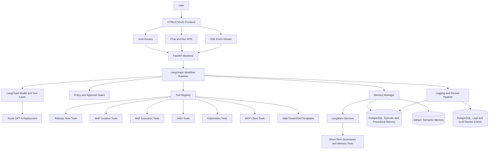
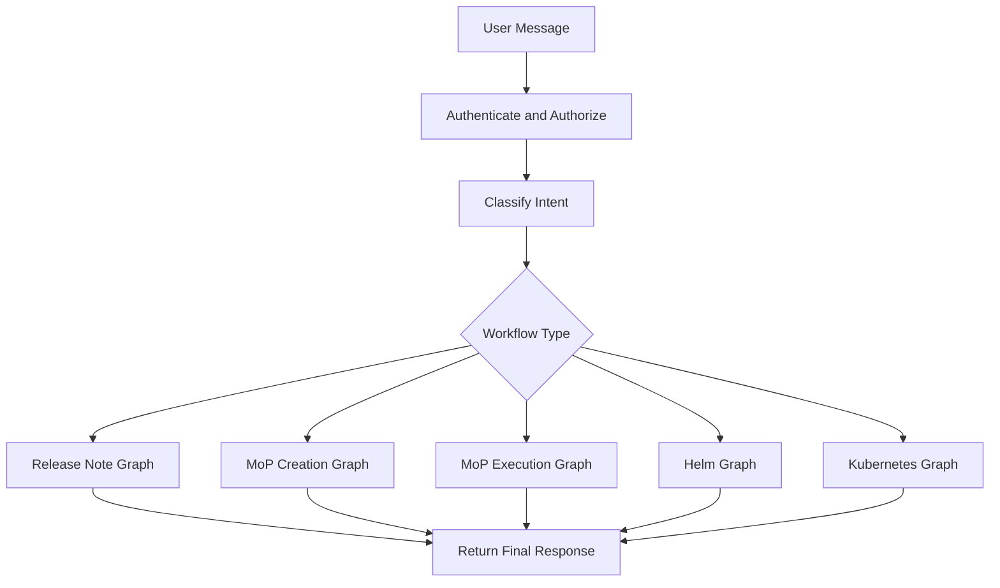
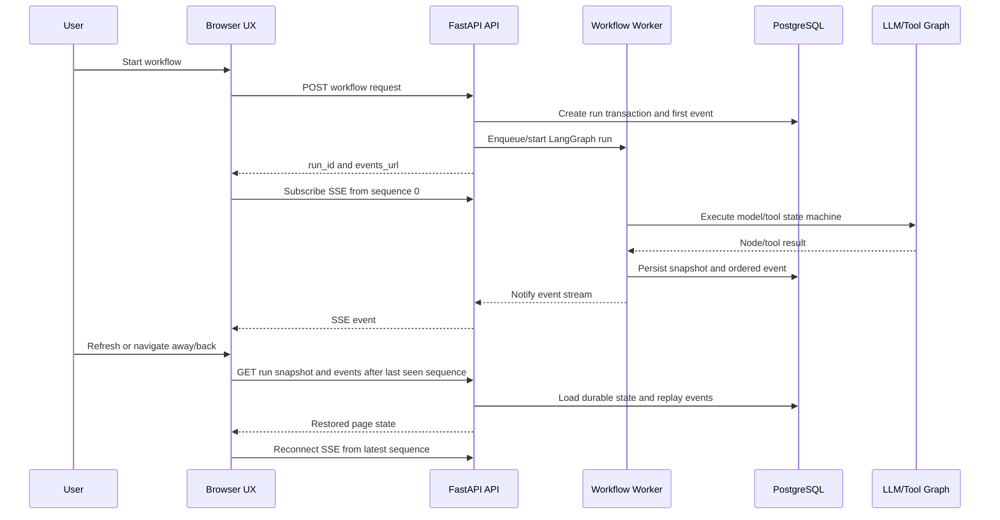
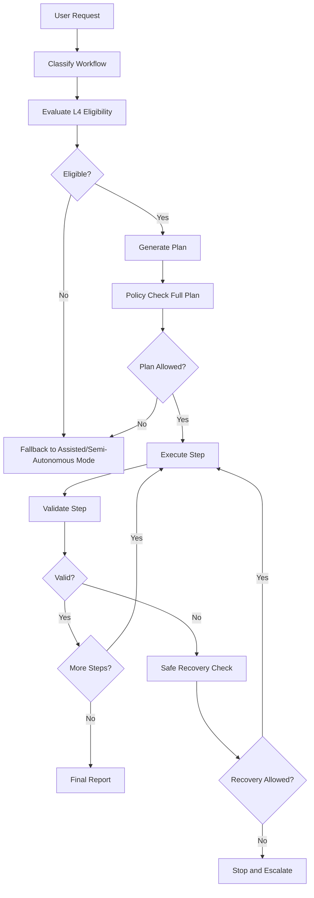

# Project Architecture Specification: BOS Genesis ESDA Chatbot Console

## 1. Purpose

This document defines the project and architecture specification for the BOS Genesis ESDA Chatbot Console.

The application is a Python-based web project with:

- A pure Python backend.
- A browser frontend built with JavaScript, HTML, and CSS.
- Azure-deployed GPT-5 as the LLM.
- LangGraph and LangChain for agent orchestration and model/tool integration.
- LangMem for memory management workflows.
- PostgreSQL and Qdrant for durable memory, semantic retrieval, and operational analysis.
- Conditional L4 autonomy within a tightly bounded operational domain.

This document should be treated as the controlling architecture specification. The LLD should remain aligned with it.

## 1.1 Implemented V1 Baseline (2026-06-29)

The current implementation has moved from architecture planning into a working local release-note vertical slice. This release-note flow is the final V1 reference design for demonstrating ESDA autonomy.

Implemented and verified:

- Local FastAPI web application with authenticated UI, matte glass JavaScript/HTML/CSS frontend, SSE progress, approvals, L4 audit, LLM chat, release-note workflow page, Activity timeline/chat page, model selector, profile menu, and hidden/pinnable release-note activity rail.
- PostgreSQL-backed users, runs, ordered events, tool calls, LLM review logs, approvals, policies, procedures, user transaction visibility, and artifact metadata.
- Azure OpenAI integration through LangChain using Azure CLI or default Azure credentials for local proofing, with GPT-5 as the target/default profile and additional selectable model profiles where configured.
- Release-note workflow classifier, planner, verifier, recovery recommender, report writer, structured schemas, prompt versioning, and prompt hash logging.
- MCP-first `bosgenesis-release-note-agent` integration using `github_release_scan_start`, `github_release_scan_status`, `github_release_generate_note`, and `github_release_get_artifact`.
- Release-note-agent output is treated as the first evidence source; ESDA GPT finalizes the Markdown draft only from collected evidence, scan summaries, and bounded recovery notes.
- Temporary repository clone, common vulnerability scan, LLM-assisted safe vulnerability summary, `pylint` or safe static code-quality scan, cleanup, and high-level security/quality matrices.
- Final Markdown and PDF artifacts include release-note content plus code-quality and vulnerability scan details.
- Successful runs publish `release-notes.md` and `release-notes.pdf` to `aveeshek/bosgenesis-artifacts` under `YYMMDD_HHMMSS_<job-name>` when Git publishing is enabled. Activity page uploads can later overwrite those exact files with reviewed local replacements, or create a stable GitHub folder for local-only historical runs.
- Live progress is scrollable/copyable. Ephemeral working notes stream only while the page is connected and are not persisted; persisted Safe Reasoning Summaries replace them after completion.
- Agent Activity Feed visualizes autonomy nodes from intake through publish/complete, remains hidden until a run starts, auto-hides after activity, and can be pinned by the user.
- Completed runs do not automatically reload after refresh; active runs restore automatically. Historical runs restore only when selected from the floating history drawer.
- Unit/integration tests cover release-note chains, adapter mapping, artifact handling, graph execution, repo analysis, artifact publishing, Activity upload/create-overwrite behavior, UI contracts, policy, logging, and core app behavior. Latest full release-note/Activity suite result: 84 tests passed.
- MoP Generation is implemented as a read-only bundle workflow at `/mop-generation`. It uses source namespace, target namespace placeholder, environment, intent, optional Helm release, analysis depth, GPT-backed classifier/planner/verifier/recovery chains, MCP adapters, professional MoP Creation Agent artifacts where available, local bundle assembly, bundle download, Git publishing, and Activity inclusion.
- MoP artifacts now center on `mop-bundle.zip` as the final Git-published artifact. The bundle includes root MoP Markdown/PDF, installation notes, `machine_execution_plan.yaml`, metadata, `deployment-artifacts/`, `deployment-artifacts.zip`, preserved agent payloads, and raw generated ConfigMaps under `deployment-artifacts/kubernetes-manifests/raw/` when present.
- Activity is multi-workflow and supports Release Note and MoP Generation timeline nodes, workflow filters, run details, artifact downloads, and artifact-grounded chat.

Current V1 scope decision:

- Do not start every memory store and workflow family at once.
- Keep PostgreSQL as the mandatory store for runs, logs, LLM review records, transaction visibility, and artifact metadata.
- Keep Qdrant optional until semantic memory lookup is required by a workflow.
- Do not use ClickHouse or SQLite in the current V1 path.
- Do not deploy ESDA to the cluster yet; local ESDA uses ingress for existing BOS Genesis services, while future Helm deployment should use in-cluster service DNS names.
- Treat GitHub artifact publishing and Activity artifact replacement as narrow, configured artifact operations, not as general unrestricted write-back capability. Release Notes uses `release-notes.md`/`release-notes.pdf`; MoP Generation publishes `mop-bundle.zip` under a distinct MoP folder prefix.

---
## 2. Goals

The system must provide:

1. Authenticated web access to a chatbot-style operational console.
2. A Python backend that owns all secrets, policies, tools, memory, and LLM calls.
3. A JavaScript/HTML/CSS frontend with Bootstrap 5.3 and optional jQuery, Chart.js, and Plotly.js.
4. Azure GPT-5 integration through LangChain-compatible model wrappers.
5. LangGraph-based workflow orchestration for release-note creation, MoP creation, MoP execution, Helm management, and Kubernetes management.
6. LangMem-assisted memory operations for extracting, searching, summarizing, and maintaining useful memory.
7. PostgreSQL-backed episodic memory and procedural records.
8. Qdrant-backed semantic memory.
9. PostgreSQL-backed detailed logs, LLM explanations, tool events, and analytics.
10. Conditional L4 autonomy with strict operational-design-domain controls.

---

## 3. Recommended Direction

The best way forward is to keep the first implementation boring, explicit, and inspectable.

Recommended decisions:

| Area | Recommendation |
|---|---|
| Backend | Python FastAPI. |
| Frontend | Server-rendered HTML templates or static HTML plus plain JavaScript. |
| UI framework | Bootstrap 5.3. |
| JS helpers | jQuery only where it reduces DOM/event boilerplate. |
| Charts | Chart.js for simple metrics, Plotly.js for drill-down/interactive analysis. |
| Agent orchestration | LangGraph state machine per workflow family. |
| LLM integration | LangChain `ChatOpenAI` against Azure v1 endpoint if available; otherwise `AzureChatOpenAI` with Azure API version. |
| Memory control | LangGraph checkpointing plus LangMem memory extraction/search/summarization tools. |
| Episodic memory | PostgreSQL structured episode tables. |
| Semantic memory | Qdrant collections. |
| Procedural memory | PostgreSQL source of truth plus optional Qdrant semantic index. |
| Detailed logs | PostgreSQL. |
| Raw hidden reasoning | Do not attempt to store hidden chain-of-thought. Store available reasoning summaries, plans, decisions, explanations, observations, and policy rationales. |
| Autonomy | Conditional L4 only inside approved workflows, namespaces, environments, tools, and rollback constraints. |

Important correction:

LangMem is useful for memory extraction, search, profile/procedure maintenance, and summarization, but it still needs storage and does not replace LangGraph state/checkpointing. Use LangGraph for workflow state and thread checkpoints; use LangMem to manage what gets remembered, searched, summarized, and refined.

Accepted architecture decision:

| Decision | Status | Rationale |
|---|---|---|
| LangGraph checkpointing owns live thread and workflow state. | Accepted | It is the correct runtime mechanism for resumable graph state, interruptions, retries, and active run context. |
| LangMem is the memory-management layer, not the state store. | Accepted | LangMem should extract, summarize, search, and maintain memories while relying on backing stores and LangGraph state. |
| MongoDB is excluded from V1. | Accepted | PostgreSQL and Qdrant cover transactional memory, semantic recall, and high-volume logs without adding another datastore early. |
| PostgreSQL owns workflow transactions and UI rehydration state. | Accepted | Runs must survive refresh/navigation and remain auditable after the user clears them from the visible sidebar. |
| Browser UX is a state-machine client, not the workflow owner. | Accepted | Agents, models, and tools continue in background workers while pages restore progress from persisted snapshots and events. |

### 3.1 Persisted Workflow UX and Background Execution Direction

The ESDA Console must make persistence the default behavior for every page and workflow.

Required behavior:

- When a user starts a workflow, the backend creates a PostgreSQL run transaction before invoking any LLM, MCP, REST, or PowerShell tool.
- The workflow runs in a backend worker or background task controlled by LangGraph state/checkpointing.
- The browser subscribes to progress, but the browser never owns the source of truth.
- All progress events are persisted with a per-run sequence before being streamed over SSE.
- On refresh or navigation back to a workflow page, the UI loads the latest run snapshot and event history, then reconnects to SSE from the last event sequence.
- In-flight work continues even if the user leaves the page.
- A ChatGPT-style floating left sidebar lists prior transactions and can restore any visible transaction into the current page.
- Clearing a transaction is a user-level hide/archive action; audit events, artifacts, tool calls, and LLM review logs remain stored for governance.
- This applies to release notes first and then becomes a shared UX/runtime contract for health-check diagnostics, MoP creation, MoP execution, Helm, Kubernetes, approvals, and L4 audit pages.

---

## 4. Non-Goals

The system will not:

- Execute raw shell or arbitrary PowerShell generated by the LLM.
- Give GPT-5 direct Kubernetes, Helm, database, or filesystem access.
- Expose Azure OpenAI credentials in the browser.
- Store or display secrets in logs, memory, prompts, or final reports.
- Store hidden model chain-of-thought.
- Perform production mutation outside explicitly approved policy.
- Claim unconditional full autonomy.

---

## 5. Architecture Overview



---

## 6. Technology Stack

| Layer | Choice | Notes |
|---|---|---|
| Backend language | Python | Main implementation language. |
| Backend framework | FastAPI | REST APIs, SSE streaming, auth middleware, OpenAPI docs. |
| Frontend | HTML, CSS, JavaScript | No React requirement for initial build. |
| UI toolkit | Bootstrap 5.3 | Fast, stable, easy operational UI. |
| JS helpers | jQuery optional | Useful for DOM updates, AJAX, and simple event handling. |
| Charts | Chart.js, Plotly.js | Chart.js for dashboards; Plotly.js for interactive diagnostics. |
| LLM provider | Azure GPT-5 | Deployment details configured by environment variables. |
| LLM integration | LangChain | Azure GPT-5 wrapper, tool binding, structured outputs. |
| Workflow runtime | LangGraph | State machine, conditional edges, interrupts, checkpointing. |
| Memory framework | LangMem | Memory extraction, search, summarization, profile/procedure management. |
| Short-term memory | LangMem plus LangGraph checkpointing | Thread state, summaries, current run context. |
| Episodic memory | PostgreSQL | Runs, steps, events, episodes, tool evidence references. |
| Semantic memory | Qdrant | Similar issues, fixes, prior artifacts, operational patterns. |
| Procedural memory | PostgreSQL preferred; Qdrant semantic index optional | Workflow procedures, runbooks, guardrail recipes, reusable plans. |
| Logs and analytics | PostgreSQL | High-volume logs, LLM explanations, tool events, review analytics. |
| Background jobs | Python worker process | Can later use Celery/RQ/Arq if needed. |
| Deployment | Docker Compose first, Kubernetes later | Keeps early iteration simple. |

---

## 7. Frontend Specification

### 7.1 Frontend Style

The frontend should be practical and operational, not marketing-oriented.

Recommended:

- Bootstrap 5.3 layout.
- Plain JavaScript modules under `frontend/static/js/`.
- CSS under `frontend/static/css/`.
- Server-rendered Jinja2 templates or static HTML served by FastAPI.
- SSE for live run updates.
- Replayable SSE using persisted event ids/sequences so progress survives refresh and page navigation.
- Fetch API for REST calls.
- jQuery allowed where it makes modal/table/event code simpler.
- Chart.js for run metrics and tool-call distribution.
- Plotly.js for time-series traces, latency drilldowns, and workflow analytics.

### 7.2 Pages

| Page | Route | Purpose |
|---|---|---|
| Login | `/login` | User authentication. |
| Chat Console | `/` | Main chatbot workspace. |
| Floating Transaction Sidebar | Shared component | Hidden-by-default left drawer listing previous transactions and restoring selected runs. |
| Release Notes | `/release-notes` | Generate draft release notes from GitHub URLs using GPT-5 and `release-note-agent`, with refresh-safe live progress and PostgreSQL audit logs. |
| MoP Generation | `/mop-generation` | Generate read-only MoP deployment bundles using GPT-5 plus k8s-inspector, helm-manager, and mop-creation MCP agents; exposes complete bundle download and publish status. |
| Activity | `/activity` | Browse Release Note and MoP Generation timeline history, inspect run stages/artifacts, ask artifact-grounded questions, download artifacts/bundles, and upload reviewed Release Note replacements to the configured artifact GitHub repo. |
| Run Detail | `/runs/{run_id}` | Plan, tool calls, approvals, evidence, final report restored from persisted run state. |
| Approval Queue | `/approvals` | Pending approvals and historical decisions. |
| Artifacts | `/artifacts` | Release notes, MoPs, execution reports. |
| Memory Review | `/memory` | Search memory, known fixes, procedures. |
| LLM Review | `/llm-review` | Human review of LLM plans, explanations, and decisions. |
| Logs Dashboard | `/logs` | PostgreSQL-backed operational logs and analytics. |
| Admin | `/admin` | Users, roles, tools, policies, environments. |

### 7.3 Frontend Components

| Component | Responsibility |
|---|---|
| `ChatComposer` | Submit user request, workflow type, environment, autonomy mode. |
| `ConversationPanel` | Render user/assistant/tool messages. |
| `RunTimeline` | Show current LangGraph node, step status, and progress from replayable run events. |
| `TransactionSidebar` | Floating hidden-by-default history drawer for prior workflow transactions. |
| `RunStateController` | Page-level state machine that hydrates snapshots, replays events, and reconnects SSE. |
| `PlanPanel` | Display plan and risk classification. |
| `ToolEvidencePanel` | Display tool inputs, outputs, redactions, and validation. |
| `ApprovalModal` | Approve/reject/modify gated actions. |
| `ArtifactPanel` | Render generated release notes, MoPs, and reports. |
| `ReleaseNoteForm` | Capture GitHub URL, source range, release name, audience, and format. |
| `MopGenerationForm` | Capture namespace, change intent, target environment, Helm release scope, analysis depth, and output format for MoP Generation. |
| `LiveReasoningPanel` | Display model-provided reasoning summaries and action explanations without hidden chain-of-thought. |
| `MemoryPanel` | Show short-term, episodic, semantic, and procedural memory used. |
| `ReasonReviewPanel` | Show model-provided reasoning summaries and action explanations. |
| `MetricsCharts` | Chart.js/Plotly visualizations from PostgreSQL. |


### 7.4 MoP Generation Page Specification

The MoP Generation page is implemented and must remain aligned with the final Release Notes/Activity visual baseline.

Required page behavior:

- Route: `/mop-generation`.
- Top navigation, model selector, profile menu, background, matte glass panels, sphere animation, progress tiles, activity rail, and artifact preview match the final Release Notes design.
- The left panel captures source namespace, target namespace placeholder, environment, optional Helm release, change intent, implementation window, and analysis depth.
- Source namespace options come from an allowlisted backend endpoint. Current V1 values include `bosgenesis`, `signoz`, and `agent-testing`.
- Target namespace is a generation placeholder for later MoP Execution. Current V1 choices are `generic-namespace` and `agent-testing`.
- Environment options are `Kubernetes with Helm`, `OpenShift`, `Kustomize`, and `Flux`; current evidence collection is read-only and optimized for Kubernetes with Helm.
- The main action button is `Generate MoP Bundle`.
- The central Live Progress panel shows `00 / CREATING PLAN`, ephemeral working stream, persisted safe summaries, copyable JSON event logs, and scrollable agent outputs.
- Live working stream and safe summaries share one Autonomy Notes pane. During an active page session, both remain visible after completion until the user refreshes; only safe summaries reload from PostgreSQL.
- Autonomy Notes includes an icon-only log copy button and a maximize icon. The maximize modal shows live reasoning stream and safe summaries on the left and formatted agent JSON logs on the right.
- The bottom Agent Activity Feed uses MoP-specific nodes: Intake, Classify, Plan, Scope, K8s, Helm, MoP Agent, Draft, Validate, Recover, Bundle, Export Github, Complete.
- The right artifact panel exposes `Download MoP Bundle` for the complete `mop-bundle.zip`.
- Successful runs publish the unextracted `mop-bundle.zip` to `aveeshek/bosgenesis-artifacts` under `YYMMDD_HHMMSS_mop_<job-name>` or equivalent configured prefix.
- Activity lists MoP Generation runs together with Release Notes, using workflow badges and workflow filters.

Required safety behavior:

- MoP Generation is read-only in V1. It may inspect namespace and Helm metadata through approved MCP tools, but it must not mutate Kubernetes, Helm, Git, or runtime resources except for configured artifact publishing.
- Kubernetes secrets must not be read. Secret references may be represented as redacted metadata.
- All model reasoning must be captured only as safe summaries, decisions, policy notes, and validation explanations. Hidden chain-of-thought must not be stored or displayed.
- The final MoP bundle must include explicit assumptions, missing evidence, rollback plan, validation plan, human approval notes, execution readiness status, machine plan, metadata, deployment artifacts, and zip archives.

---

## 8. Backend Specification

### 8.1 Backend Modules

```text
backend/
  app/
    main.py
    config.py
    dependencies.py
    api/
      routes_auth.py
      routes_chat.py
      routes_runs.py
      routes_events.py
      routes_approvals.py
      routes_artifacts.py
      routes_memory.py
      routes_llm_review.py
      routes_logs.py
      routes_admin.py
      routes_health.py
    auth/
      password.py
      sessions.py
      jwt.py
      rbac.py
    llm/
      azure_gpt5.py
      prompts.py
      structured_outputs.py
      reasoning_capture.py
    graphs/
      base_state.py
      router_graph.py
      release_note_graph.py
      mop_creation_graph.py
      mop_execution_graph.py
      helm_graph.py
      k8s_graph.py
    chains/
      intent_classifier.py
      planner.py
      verifier.py
      recovery.py
      report_writer.py
    memory/
      manager.py
      langmem_service.py
      short_term.py
      episodic_postgres.py
      semantic_qdrant.py
      procedural_store.py
    tools/
      registry.py
      base.py
      rest_tool.py
      mcp_tool.py
      powershell_tool.py
      helm_tool.py
      k8s_tool.py
      validation_tool.py
      artifact_tool.py
    policy/
      guard.py
      risk_classifier.py
      autonomy.py
      approvals.py
    logging/
      event_logger.py
      postgres_logger.py
      redaction.py
      llm_review_logger.py
    db/
      postgres.py
      postgres_logs.py
      qdrant.py
      models.py
      migrations/
    templates/
    static/
```

### 8.2 Core API Endpoints

| Method | Endpoint | Purpose |
|---|---|---|
| `POST` | `/api/auth/login` | Authenticate user. |
| `POST` | `/api/auth/logout` | Logout. |
| `GET` | `/api/auth/me` | Current user, roles, permissions. |
| `POST` | `/api/chat` | Submit chatbot request and create run. |
| `GET` | `/api/runs/{run_id}` | Run state and final report. |
| `GET` | `/api/runs/{run_id}/snapshot` | Latest persisted run snapshot for page rehydration. |
| `GET` | `/api/runs/{run_id}/events` | SSE stream for run events; supports resume after event id/sequence. |
| `GET` | `/api/transactions` | Sidebar list of current user's visible workflow transactions. |
| `POST` | `/api/transactions/{run_id}/clear` | Hide/archive a transaction for the current user without deleting audit data. |
| `POST` | `/api/runs/{run_id}/stop` | Stop run. |
| `POST` | `/api/approvals/{approval_id}/approve` | Approve gated action. |
| `POST` | `/api/approvals/{approval_id}/reject` | Reject gated action. |
| `GET` | `/api/artifacts` | List generated artifacts. |
| `GET` | `/api/memory/search` | Search memory. |
| `GET` | `/api/llm-review` | Review LLM plans, summaries, decisions. |
| `GET` | `/api/logs/query` | Query PostgreSQL logs. |
| `GET` | `/api/admin/tools` | List tool registry. |
| `GET` | `/api/admin/policies` | List policy rules. |

### 8.3 Release-Note Final Implementation Modules

The final release-note implementation uses the following concrete module boundaries:

| Module | Contract |
|---|---|
| `backend/app/graphs/release_notes.py` | Owns the release-note state machine: classify, plan, evidence, clone, security scan, quality scan, cleanup, draft, validate, recover, artifact save, publish, and final status. |
| `backend/app/chains/release_notes.py` | Owns prompt-versioned classifier/planner/verifier/recovery/report-writer chains and safe reasoning summary fields. |
| `backend/app/tools/release_note_agent.py` | Owns MCP/REST compatibility with `bosgenesis-release-note-agent` and artifact hydration. |
| `backend/app/repo_analysis.py` | Owns temporary local clone, source inventory, common vulnerability scan, LLM-safe security review, code quality scan, and cleanup. |
| `backend/app/artifacts.py` | Owns local artifact persistence, artifact metadata, MIME types, and download references. |
| `backend/app/artifact_publisher.py` | Owns clone/commit/push to the configured artifact Git repository. |
| `backend/app/static/js/release_notes.js` | Owns release-note page state machine, active-run rehydration, ephemeral working stream, safe summaries, activity rail, history drawer, and artifact download actions. |

### 8.4 Release-Note Artifact Publishing Contract

Artifact publishing is a finalization step for successful release-note runs.

| Setting | Required behavior |
|---|---|
| `ARTIFACT_GIT_PUBLISH_ENABLED` | When true, successful release-note runs publish the Markdown/PDF pair. |
| `ARTIFACT_GIT_REPO_URL` | Target Git repository; default is `https://github.com/aveeshek/bosgenesis-artifacts.git`. |
| `ARTIFACT_GIT_BRANCH` | Target branch; default is `main`. |
| `ARTIFACT_GIT_WORKSPACE_DIR` | Local working directory used for temporary publisher clones. |
| `ARTIFACT_GIT_USER_NAME` / `ARTIFACT_GIT_USER_EMAIL` | Commit identity. |
| `ARTIFACT_GIT_COMMAND_TIMEOUT_SECONDS` | Timeout for clone, commit, and push operations. |

Publish folder naming must be `YYMMDD_HHMMSS_<job-name>`. Each publish folder must contain `release-notes.md` and `release-notes.pdf`. A publish failure marks the run failed at the publish node, but local artifacts remain available through ESDA download endpoints.

---

### 8.5 MoP Bundle Implementation Modules

| Module | Contract |
|---|---|
| `backend/app/graphs/mop_generation.py` | Owns the MoP state machine: classify, plan, scope, k8s evidence, Helm evidence, MoP-agent call, draft/validation/recovery, bundle assembly, Git export, and final status. |
| `backend/app/chains/mop_generation.py` | Owns prompt-versioned classifier/planner/report-writer/verifier/recovery chains and safe reasoning summaries. |
| `backend/app/tools/mop_agents.py` | Owns MCP-compatible calls to k8s-inspector, helm-manager, and mop-creation-agent with timeout handling and redaction. |
| `backend/app/mop_bundle.py` | Owns deterministic bundle assembly, professional agent artifact preservation, `deployment-artifacts.zip`, `mop-bundle.zip`, raw ConfigMap promotion into `deployment-artifacts/kubernetes-manifests/raw/`, validation, and bundle file inventory. |
| `backend/app/artifact_publisher.py` | Publishes the unextracted `mop-bundle.zip` to the configured artifact Git repository. |
| `backend/app/static/js/mop_generation.js` | Owns MoP page state machine, SSE rehydration, shared sphere, Autonomy Notes, icon-only Copy Logs action, maximize modal, Agent Activity Feed, bundle download link, and transaction history. |

MoP publish folder naming must be `YYMMDD_HHMMSS_mop_<job-name>`. The Git-published file is `mop-bundle.zip`; local ESDA storage also retains individual Markdown/PDF/metadata files for preview and download where needed.

---
## 9. Azure GPT-5 Integration

### 9.1 Model Configuration

Azure GPT-5 must be configured from backend environment variables only.

```env
AZURE_OPENAI_ENDPOINT=https://replace-me.openai.azure.com/
AZURE_OPENAI_API_KEY=replace-me
AZURE_OPENAI_GPT5_DEPLOYMENT=replace-me
AZURE_OPENAI_API_VERSION=replace-me
AZURE_OPENAI_USE_V1_API=true
AZURE_OPENAI_REASONING_EFFORT=medium
AZURE_OPENAI_REASONING_SUMMARY=auto
```

### 9.2 LangChain Wrapper Strategy

Preferred:

- Use LangChain `ChatOpenAI` with Azure v1-compatible `base_url` when available.

Fallback:

- Use `AzureChatOpenAI` when the deployment requires a traditional Azure `api_version`.

### 9.3 Reasoning and Explanation Logging

All available LLM explanations must be captured for human review:

- User prompt.
- System prompt version.
- Workflow type.
- LangGraph node name.
- Generated plan.
- Tool selection explanation.
- Risk explanation.
- Policy decision explanation.
- Model-provided reasoning summary where available.
- Validation explanation.
- Recovery explanation.
- Final response.

Do not attempt to capture hidden raw chain-of-thought. The architecture should request model-supported reasoning summaries or structured explanations and store those summaries in PostgreSQL for review.

---

## 10. LangGraph Design

### 10.1 Graph Responsibilities

LangGraph is the workflow runtime. It manages:

- Workflow state.
- Durable run snapshots and checkpoint-backed resumability.
- Conditional routing.
- Tool execution nodes.
- Verification nodes.
- Approval interrupts.
- Retry and recovery loops.
- Final report generation.
- Checkpointing and resumability.

### 10.2 Router Graph



### 10.3 Standard Workflow Nodes

Each workflow graph should use the same node pattern:

1. `load_scope`
2. `retrieve_memory`
3. `plan`
4. `policy_check`
5. `execute_tool`
6. `observe`
7. `validate`
8. `recover_or_continue`
9. `approval_interrupt`
10. `write_memory`
11. `write_logs`
12. `final_report`

---

### 10.4 Background Execution and Rehydration Flow



Implementation rules:

- Workers may be in-process background tasks for V1, but the state contract must allow a separate worker process later.
- Every workflow event must be persisted before broadcast.
- Snapshot APIs must be sufficient to redraw the page without depending on browser memory.
- In-progress runs remain visible in the transaction sidebar until completed, failed, cancelled, or user-cleared.

### 10.5 Release-Note Final State Machine

The release-note graph is the first complete ESDA autonomy demonstration and uses these states:

1. `intake`
2. `classify`
3. `plan`
4. `collect_evidence`
5. `clone_repo`
6. `security_scan`
7. `quality_scan`
8. `cleanup_repo`
9. `draft`
10. `validate`
11. `recover_or_continue`
12. `save_artifacts`
13. `publish_artifacts`
14. `complete`

Each state must persist an ordered event before streaming it to the browser. Ephemeral working notes may be streamed during active work, but only safe summaries and structured outcomes are persisted.

---
## 11. Memory Architecture

### 11.1 Memory Types

| Memory Type | Selected Technology | Purpose |
|---|---|---|
| Short-term memory | LangMem plus LangGraph checkpointing | Current run context, conversation summary, working memory. |
| Episodic memory | PostgreSQL | Historical episodes: runs, steps, tool calls, observations, outcomes. |
| Semantic memory | Qdrant | Similar issue/fix retrieval, prior MoPs, release-note context, runbook search. |
| Procedural memory | PostgreSQL source of truth; optional Qdrant index | Reusable procedures, workflow templates, safe-remediation recipes, policy playbooks. |
| Log memory | PostgreSQL | High-volume event logs, LLM explanations, review analytics. |

### 11.2 Short-Term Memory

Short-term memory should be implemented as:

- LangGraph thread state and checkpointing.
- LangMem-assisted summarization and memory management.
- Conversation window trimming.
- Current plan, current step, current observations.
- Current approval state.

Recommended backing store:

- Redis for fast development/session state if needed.
- PostgreSQL if the team wants fewer moving parts.

### 11.3 Episodic Memory in PostgreSQL

Episodic memory should store structured history:

- Run.
- Episode.
- Step.
- Tool call.
- Observation.
- Validation.
- Error.
- Recovery action.
- Outcome.
- Artifact reference.

Do not store unlimited raw logs in PostgreSQL. Store bounded evidence and references to PostgreSQL/object storage when payloads are large.

### 11.4 Semantic Memory in Qdrant

Qdrant collections:

| Collection | Purpose |
|---|---|
| `issue_memory` | Similar operational failures and fixes. |
| `artifact_memory` | Prior MoPs, release notes, execution reports. |
| `procedure_memory` | Embedded procedures and safe remediation patterns. |
| `knowledge_memory` | Internal docs, runbooks, design snippets. |

### 11.5 Procedural Memory

Procedural memory should use PostgreSQL as the authoritative store.

Recommended tables:

- `procedures`
- `procedure_versions`
- `procedure_steps`
- `procedure_policies`
- `procedure_embeddings`
- `procedure_execution_stats`

Qdrant should index procedures semantically, but PostgreSQL should own versioning, approvals, lifecycle, and audit.

---

## 12. PostgreSQL Logging and Review Architecture

Deployment transport rule:

- Local workstation runs should use `DATABASE_URL` pointing to the reachable PostgreSQL endpoint at `10.99.52.176:5432/esda`.
- Helm-based deployments should use `DATABASE_URL` pointing to the in-cluster PostgreSQL service DNS name.
- PostgreSQL is for high-volume logs and review analytics. PostgreSQL remains the authoritative run-state database.
- SQLite is not part of the V1 target deployment path.

### 12.1 Logging Principles

Every important event should be logged with enough structure for later review.

Logs must be:

- Redacted.
- Queryable.
- Correlatable by `run_id`, `session_id`, `user_id`, and `workflow_type`.
- Separated by event type.
- Suitable for dashboards and human review.

### 12.2 PostgreSQL Tables

#### `agent_event_logs`

```sql
CREATE TABLE agent_event_logs (
    event_id String,
    timestamp DateTime64(3),
    run_id String,
    session_id String,
    user_id String,
    workflow_type String,
    graph_node String,
    event_type String,
    severity String,
    message String,
    payload_json String,
    duration_ms UInt64
)
ENGINE = MergeTree
ORDER BY (timestamp, workflow_type, run_id, event_type);
```

#### `llm_reasoning_review_logs`

```sql
CREATE TABLE llm_reasoning_review_logs (
    review_id String,
    timestamp DateTime64(3),
    run_id String,
    session_id String,
    user_id String,
    workflow_type String,
    graph_node String,
    model_deployment String,
    prompt_version String,
    prompt_hash String,
    user_intent String,
    plan_json String,
    reasoning_summary String,
    tool_choice_json String,
    tool_choice_explanation String,
    risk_explanation String,
    validation_explanation String,
    recovery_explanation String,
    final_answer String,
    redaction_count UInt32,
    human_review_status String DEFAULT 'pending'
)
ENGINE = MergeTree
ORDER BY (timestamp, workflow_type, run_id, graph_node);
```

#### `tool_execution_logs`

```sql
CREATE TABLE tool_execution_logs (
    tool_log_id String,
    timestamp DateTime64(3),
    run_id String,
    step_id String,
    user_id String,
    tool_name String,
    tool_category String,
    risk_level String,
    policy_decision String,
    status String,
    request_json String,
    response_summary String,
    error_message String,
    duration_ms UInt64
)
ENGINE = MergeTree
ORDER BY (timestamp, tool_category, tool_name, run_id);
```

### 12.3 LLM Review UX

The `/llm-review` page should allow reviewers to:

- Filter by workflow, model deployment, status, date, and risk level.
- Inspect prompts and prompt versions.
- Inspect model-provided reasoning summaries.
- Compare plan vs executed tools.
- Mark entries as reviewed, accepted, problematic, or needs prompt fix.
- Export review samples for prompt evaluation.

---

## 13. Conditional L4 Autonomy

### 13.1 Definition

Conditional L4 autonomy means the system can execute complete operational workflows without step-by-step human intervention only when all operational design conditions are satisfied.

It is not full unrestricted autonomy.

### 13.2 Operational Design Domain

L4 autonomy is allowed only when:

- User is authenticated and authorized.
- Workflow type is approved for L4.
- Environment is approved for L4.
- Namespace/project scope is approved.
- Tool sequence matches an approved procedure or policy.
- Risk level remains low or pre-approved medium.
- Rollback or stop condition is defined.
- Validation checks are available.
- Observability and audit logging are healthy.
- Max retry count is not exceeded.
- No policy deny rule is matched.

### 13.3 L4 Autonomy State Machine



### 13.4 L4 Stop Conditions

The graph must stop and escalate when:

- A critical risk is detected.
- The requested action is outside approved scope.
- A high-risk action needs live approval.
- Validation fails twice.
- Tool output contradicts expected state.
- Secret-like data appears in output.
- Observability/logging write fails for critical actions.
- Rollback state cannot be determined.
- Model uncertainty is above threshold.

---

## 14. Policy and Tool Safety

GPT-5 may propose actions, but the backend decides whether they execute.

Tool execution requirements:

1. Tool exists in registry.
2. User role can invoke tool.
3. Workflow can invoke tool.
4. Environment allows tool.
5. Namespace/resource is allowed.
6. Input schema validates.
7. Policy returns `allow` or `approval_required`.
8. Approval is present if required.
9. Tool result is validated.
10. Event is logged to PostgreSQL.

Blocked by default:

- Raw shell.
- Raw PowerShell.
- Kubernetes secret reads.
- Namespace deletion.
- Helm uninstall.
- Production mutation without explicit policy.
- Credential extraction.
- Unbounded web browsing or downloads.

---

## 15. Database Summary

| Store | Use |
|---|---|
| PostgreSQL | Users, sessions, runs, run events, run snapshots, user transaction visibility, episodic memory, procedural memory, approvals, artifact metadata. |
| Qdrant | Semantic memory and similarity search. |
| PostgreSQL | Logs, tool events, LLM explanations, review analytics. |
| Redis | Optional cache, locks, run event buffers, rate limiting. |
| MongoDB | Not recommended for initial build unless a document-native trace store is later required. |

Recommendation:

Avoid adding MongoDB in V1. PostgreSQL already covers structured memory and high-volume logging. Add MongoDB only if the team later needs flexible raw trace documents that are awkward in PostgreSQL/object storage.

---

## 16. Project Structure

```text
bosgenesis-esda/
  backend/
    app/
      main.py
      config.py
      api/
      auth/
      llm/
      graphs/
      chains/
      memory/
      tools/
      policy/
      logging/
      db/
      templates/
      static/
    tests/
    pyproject.toml
    Dockerfile
  frontend/
    static/
      css/
      js/
      vendor/
    templates/
  knowledge-base/
    hld.md
    baseline_idea.md
    bosgenesis_esda_chatbot_lld.md
    project_architecture_specification.md
  docker-compose.yml
  README.md
```

For the first version, frontend files may live under `backend/app/templates` and `backend/app/static` to keep deployment simple. A separate `frontend/` folder can be introduced later if the frontend grows.

---

## 17. Implementation Roadmap

### Phase 1: Foundation

- FastAPI backend.
- Bootstrap UI shell.
- Local auth.
- Azure GPT-5 connectivity through LangChain.
- LangGraph router graph.
- SSE run streaming.
- Replayable run event streaming and page rehydration from PostgreSQL.
- PostgreSQL event logging.

### Phase 2: Read-Only Agent

- Release-note draft graph, implemented first as the V1 hello-world workflow.
- MoP draft graph.
- Kubernetes read-only graph.
- Helm read-only graph.
- Tool registry, including the MCP-first `bosgenesis-release-note-agent` adapter.
- Persistent transaction sidebar and refresh-safe workflow restore for release-note generation.
- Policy guard.
- PostgreSQL run/event/tool/LLM-review/artifact records.
- Qdrant semantic memory.

### Phase 3: Reviewable Autonomy

- LangMem memory extraction/search/summarization.
- LLM review dashboard.
- Tool evidence dashboard.
- Approval workflow.
- Safe retry and recovery loop.
- Procedural memory store.

### Phase 4: Conditional L4

- L4 eligibility evaluator.
- Approved workflow procedures.
- Stop-condition engine.
- Automatic execution inside approved ODD.
- Post-action validation.
- Human-review analytics.

---

## 18. Implementation Governance Contracts

### 18.1 Provider Boundary Standard

All design and implementation documents should use this wording:

- LLM provider boundary: GPT-5-compatible model endpoint.
- V1 implementation: Azure OpenAI GPT-5 deployment.
- Integration: LangChain wrapper.
- Browser never calls the model endpoint directly.
- Azure endpoint, deployment name, authentication mode, and API version remain configurable.

### 18.2 Formal Operational Design Domain Contract

Conditional L4 autonomy must be constrained by an explicit Operational Design Domain (ODD). The implementation must load the ODD from `knowledge-base/policy_rules.yaml` initially, then from an admin-managed policy store later.

The ODD must define:

- Allowed workflows.
- Allowed environments.
- Allowed namespaces.
- Allowed MCP servers.
- Allowed tool categories.
- Allowed autonomy modes.
- Allowed mutation types.
- Rollback requirements.
- Stop conditions.
- Validation requirements.
- Production rules.

Required stop conditions:

- Critical risk detected.
- Out-of-scope action requested.
- High-risk action requires live approval.
- Validation fails twice.
- Tool output contradicts expected state.
- Secret-like data appears in output.
- Required logging or observability write fails.
- Rollback state is missing.
- Model uncertainty exceeds threshold.
- Retry or duration budget is exceeded.

### 18.3 MCP Server Contract

MCP server configuration must be explicit and policy-checkable.

```yaml
mcp_servers:
  bosgenesis-k8s-inspector-mcp:
    url: ${MCP_K8S_INSPECTOR_URL}
    enabled: true
    allowed_workflows:
      - k8s_management
      - mop_execution
    allowed_tools:
      - list_pods
      - list_services
      - get_logs
    timeout_seconds: 30
    max_response_bytes: 200000
    auth_mode: service_token
    risk_level: medium
```

Every MCP response must be normalized into this envelope:

```json
{
  "status": "success | failed | denied | timeout",
  "tool_name": "list_pods",
  "normalized_result": {},
  "evidence_refs": [],
  "error": {
    "code": "K8S_TIMEOUT",
    "message": "Timed out calling Kubernetes API",
    "retryable": true
  }
}
```

Before invoking MCP, the backend must validate:

- MCP server is registered and enabled.
- Tool is allowlisted for that server.
- User role can invoke the tool.
- Workflow can invoke the tool.
- Environment and namespace are allowed.
- Arguments validate against schema.
- Risk level is allowed by autonomy mode and policy.
- Response size limits are enforced.

### 18.4 Safe PowerShell Runner Contract

PowerShell execution must be isolated behind a separate runner service.

Rules:

- Runner accepts only `template_id` plus typed parameters.
- No raw command string parameter may exist.
- Every template has a risk level.
- Every template has allowed roles, workflows, and environments.
- Stdout and stderr are size-limited.
- Secrets are redacted before persistence.
- Commands run with a timeout.
- Commands run as a low-privilege Windows identity.
- `Invoke-Expression`, `iex`, script download execution, and arbitrary shell are blocked.
- Every execution writes request, result summary, policy decision, and validation result to PostgreSQL.

### 18.5 Code-First Tool Execution Contract

Tool execution must use one deterministic request/result contract.

```python
class ToolExecutionRequest(BaseModel):
    run_id: str
    step_id: str
    tool_name: str
    workflow_type: str
    environment: str
    namespace: str | None
    user_id: str
    arguments: dict
    autonomy_mode: str


class ToolExecutionResult(BaseModel):
    status: Literal["success", "failed", "blocked", "approval_required"]
    output: dict | None
    evidence_refs: list[str]
    validation_result: dict | None
    error: dict | None
```

Execution sequence:

1. Resolve tool from registry.
2. Validate role permission.
3. Validate workflow permission.
4. Validate environment permission.
5. Validate namespace/resource allowance.
6. Validate input schema.
7. Evaluate policy.
8. Request approval if required.
9. Execute tool only if allowed.
10. Validate result.
11. Redact output.
12. Write PostgreSQL logs.
13. Return normalized result.

### 18.6 Memory Governance

Memory writes must be governed because bad memory can create repeated bad automation.

Rules:

- Memory writes must be policy-checked.
- Secret-like content must be rejected.
- Every memory record must include `source_run_id`.
- Known fixes require confidence score.
- Low-confidence memories must be reviewable.
- Procedural memory requires approval and versioning.
- Semantic memory payloads must reference authoritative PostgreSQL records when possible.
- Memory retrieval must record why the memory was used.
- Memory used in a run must be visible in the run evidence panel.

### 18.7 Prompt and Version Governance

Prompt templates must be versioned files.

```text
prompt_templates/
  system_bounded_agent_v1.md
  planner_v1.md
  verifier_v1.md
  recovery_v1.md
  report_writer_v1.md
```

Every run must log:

- `run_id`
- `event_sequence`
- `state_snapshot_version`

- `prompt_version`
- `prompt_hash`
- `model_deployment`
- `workflow_type`
- `tool_choices`
- `reasoning_summary`
- `policy_decision`
- `validation_result`

The system must store available reasoning summaries, plans, decisions, explanations, observations, and policy rationales instead of hidden chain-of-thought.

### 18.8 Persistent Workflow State Contract

All workflow pages must implement the same persistence contract:

1. Create a PostgreSQL run transaction before workflow execution begins.
2. Persist every state-machine transition as an ordered event.
3. Persist enough snapshot data to rebuild the active page after refresh.
4. Run model/tool work in backend background execution, not in browser-owned promises.
5. Support SSE resume by last event id or sequence.
6. Keep artifacts, tool calls, LLM review records, and audit events linked to the run id.
7. Expose a user transaction list for the floating sidebar.
8. Treat user clear as a `user_run_views.hidden_at` or equivalent soft-hide record, not data deletion.
9. Apply the same contract to every workflow page, starting with release notes.

### 18.9 Phase Acceptance Tests

V1 acceptance tests:


Current release-note hello-world acceptance checks:

- User logs in.
- User opens `/release-notes`.
- User submits a GitHub URL and release/source details.
- Agent classifies the workflow as `release_note_creation`.
- Agent creates a plan with prompt version/hash logging.
- Agent calls `bosgenesis-release-note-agent` through MCP-compatible tools.
- Agent hydrates the initial Markdown and PDF artifact references.
- Agent saves final Markdown and PDF artifacts.
- UI shows live progress, preview, and Markdown/PDF download links.
- PostgreSQL stores run, event, tool, artifact, and LLM review records.

Original broader V1 acceptance checks:

- User logs in.
- User submits a bounded task.
- Agent creates a plan.
- Agent calls one MCP tool.
- Agent calls one REST GET.
- Agent calls one safe PowerShell GET.
- Agent validates response.
- Agent writes run record.
- Agent writes PostgreSQL event.
- Agent returns final evidence-backed report.

V2 acceptance tests:

- Agent classifies an error.
- Agent retrieves a prior similar issue from Qdrant.
- Agent recommends a safe next step.
- No mutation occurs.

V3 acceptance tests:

- Agent proposes restart or patch.
- Approval is created.
- Unauthorized user cannot approve.
- Approved action executes.
- Post-fix validation runs.
- Memory write-back occurs.

V4 acceptance tests:

- L4 eligibility is evaluated.
- Workflow runs only inside approved ODD.
- Stop condition causes escalation.
- No production mutation occurs without policy.

---

## 19. Risks and Recommendations

| Risk | Recommendation |
|---|---|
| Too many databases too early | Start with PostgreSQL, Qdrant. Add Redis only for cache/locks/SSE pressure. Avoid MongoDB initially. |
| Misusing LangMem as a database | Treat LangMem as memory-management logic, backed by real stores. |
| Logging hidden chain-of-thought | Store model-provided summaries and structured explanations, not hidden raw reasoning. |
| L4 autonomy too broad | Define ODD first. Keep production mutation out of L4 until the system has proven audit, rollback, and validation. |
| Frontend complexity | Keep the UI plain Bootstrap and JavaScript until workflows stabilize. |
| Tool hallucination | Only execute registered backend tools; ignore unregistered tool names. |
| Unsafe memory writes | Memory writes should be policy-checked and reviewed for sensitive data. |
| PostgreSQL privacy exposure | Redact before write; use role-based access on review pages. |

---

## 20. References

- LangMem documentation: https://langchain-ai.github.io/langmem/
- LangGraph memory documentation: https://docs.langchain.com/oss/python/langgraph/add-memory
- LangChain AzureChatOpenAI integration: https://docs.langchain.com/oss/python/integrations/chat/azure_chat_openai

---

## 21. Summary

The recommended architecture is a Python FastAPI application with a Bootstrap/JavaScript frontend, LangGraph workflow orchestration, LangChain Azure GPT-5 integration, LangMem-assisted memory management, PostgreSQL episodic/procedural memory, Qdrant semantic memory, and PostgreSQL review-grade logging.

The most important implementation rule is:

```text
GPT-5 can reason and propose.
LangGraph controls workflow state.
The backend validates and executes tools.
PostgreSQL records every decision for review.
Conditional L4 autonomy runs only inside an approved operational design domain.
```
